# Workflows Operacionais Determinísticos (R-050)

> **Fonte de verdade operacional:** [`CLAUDE.md`](../../CLAUDE.md) § R-050, R-041 e R-042.  
> **Grafo estrutural:** [`.github/agents/routing-graph.yaml`](routing-graph.yaml).  
> **Contratos e Handoff:** [`.github/skills/handoff-governance/SKILL.md`](../skills/handoff-governance/SKILL.md) e [`.github/skills/agent-contracts/SKILL.md`](../skills/agent-contracts/SKILL.md).

---

## 1. Visão Geral e Motivação

### 1.1 O Desafio Observado
Em sistemas multi-agent complexos, solicitações com intenções operacionais imediatas (ex.: relato de um bug em produção, erro 500, botão quebrado, falha de layout CSS) sofriam desvios e latência desnecessária quando interceptadas indiscriminadamente pelo `@prompt-structuring`. O modelo tentava reformatar ou realizar perguntas de clarificação sobre erros que já possuíam sintomas e stack traces explícitos, quebrando a fidelidade da cadeia de resolução.

### 1.2 A Solução de Mercado (Anthropic & LangGraph)
Conforme documentado no framework *Building Effective Agents* (Anthropic) e nas arquiteturas de estado finito do LangGraph:
- **Workflows (Pipelines Predefinidos)**: Sistemas onde modelos e ferramentas são orquestrados através de caminhos e transições previsíveis (State Machines). Indicados para tarefas operacionais de engenharia de software onde a ordem dos passos é bem definida e mandatária.
- **Agents (Sistemas Exploratórios)**: Sistemas onde o modelo decide dinamicamente a próxima ferramenta em loop aberto. Indicados para tarefas amplas de pesquisa ou problemas com espaço de busca desconhecido.
- **Fast-Path Determinístico**: Gatilhos explícitos de erro, refatoração estrutural ou diagnóstico técnico bypassam etapas genéricas de estruturação de prompt e ingressam imediatamente no workflow correspondente.

### 1.3 Convenção de Nomenclatura: Resolução de Papéis Genéricos (`specialist-<papel>`)

Para permanecer agnóstico de stack (R-038), este documento referencia os executores táticos através de **papéis genéricos** (`specialist-bug-fixer`, `specialist-ui-stylist`, `specialist-unit-test-writer`, `specialist-component-test-writer`, `specialist-integration-test-writer`, `specialist-test-fixer`, `specialist-feature-developer`, `specialist-arch-advisor`). **Nenhum desses nomes existe literalmente no catálogo** — são aliases resolvidos em tempo de roteamento pelo *domain router* ativo (`@angular-router`, `@spring-boot-router`, `@spring-reactive-router`, `@ejb-router`) para o agente concreto do seu sub-catálogo (`*-catalog.yaml`) que declara a tag `role:` correspondente.

| Papel Genérico | Tag `role:` | Angular | Spring Boot | Spring Reactive | EJB |
|---|---|---|---|---|---|
| `specialist-bug-fixer` | `fixer` | `angular-bug-fixer` | `spring-boot-bug-fixer` | `spring-reactive-bug-fixer` | `ejb-bug-fixer` |
| `specialist-ui-stylist` | `stylist` | `angular-ui-stylist` | _N/A (sem UI)_ | _N/A (sem UI)_ | _N/A (sem UI)_ |
| `specialist-unit-test-writer` | `tester` (sem DOM/contexto de framework) | `angular-unit-test-writer` | `spring-boot-unit-test-writer` | `spring-reactive-unit-test-writer` | `ejb-unit-test-writer` |
| `specialist-component-test-writer` | `tester` (com DOM/TestBed) | `angular-component-test-writer` | _N/A → usar `integration-test-writer`_ | _N/A → usar `integration-test-writer`_ | _N/A → usar `integration-test-writer`_ |
| `specialist-integration-test-writer` | `tester` (com contexto de framework: Spring context/R2DBC/Testcontainers) | _N/A → usar `component-test-writer`_ | `spring-boot-integration-test-writer` | `spring-reactive-integration-test-writer` | `ejb-integration-test-writer` |
| `specialist-test-fixer` | `fixer` (escopo teste) | `angular-test-fixer` | `spring-boot-test-fixer` | `spring-reactive-test-fixer` | `ejb-test-fixer` |
| `specialist-feature-developer` | `implementer` | `angular-feature-developer` | `spring-boot-feature-developer` | `spring-reactive-feature-developer` | `ejb-feature-developer` |
| `specialist-arch-advisor` | `advisory` | `angular-arch-advisor` | `spring-boot-arch-advisor` | `spring-reactive-arch-advisor` | `ejb-arch-advisor` |

**Regras de Resolução (obrigatórias):**
1. **Proibido invocar `run_subagent` com o nome genérico literal** — `specialist-bug-fixer` NÃO é um `agentName` válido; o domain router SEMPRE resolve para o `id` concreto do seu sub-catálogo antes de despachar.
2. **Match de `proximos_agentes_permitidos` em `politica_desvio: "strict"`**: quando a lista declarar um papel genérico, a validação de conformidade ocorre pela tag `role:` do agente concreto delegado (não pela string literal) — ex.: `angular-bug-fixer` satisfaz `specialist-bug-fixer` porque ambos compartilham `role: "fixer"` no domínio Angular ativo.
3. **Banco de dados é exceção nomeada**: sub-rotinas de schema/DDL nunca usam papel genérico — referenciam sempre `@database-specialist` (agente único, cross-stack) por nome literal.
4. **Stack não identificada**: se o `@bug-triage`/`@refactor-planner` não conseguir inferir a stack (nenhum domain router aplicável), o estado correspondente aciona `ask_questions` para confirmar a stack antes de resolver o papel genérico — nunca infere silenciosamente.

### 1.4 Padrão Gerador–Avaliador Cético (Generator-Evaluator Skeptical Pattern)

**Fundamentação de mercado**: Anthropic (*Harness design for long-running application development*, Mar/2026) demonstrou que agentes avaliando o próprio trabalho tendem à complacência ("self-grading leniency") — mesmo diante de resultados objetivamente medíocres. A separação estrutural entre quem **gera** o artefato e quem o **avalia** — com o avaliador operando sob rubrica cética e independente — eleva substancialmente a taxa de detecção de defeitos sem depender de troca de modelo.

**Aplicação nos Workflows Canônicos**: Este padrão já está estruturalmente presente em `WORKFLOW-BUG-FIX` (Estado 2 = Gerador do Red Test; Estado 5 = Avaliador Cético via Quality Gate) e `WORKFLOW-FEATURE-DEVELOPMENT` (Estado 2 = negociação do contrato de aceitação; Estado 5 = Gerador da implementação; Estado 6 = Avaliador Cético via Gates de Segurança/UI/Code Review). Para tornar essa separação explícita e auditável:

1. **Mini-Contrato de Aceitação Pré-Negociado (Sprint Contract)**: Antes de o Gerador produzir o artefato final, ele propõe por escrito os critérios objetivos de "concluído" (comportamento esperado, casos de borda cobertos, forma de verificação). O Avaliador revisa e aprova esse contrato **antes** da implementação — evitando que a definição de sucesso seja inventada retroativamente pelo próprio Gerador.
2. **Rubrica de Corte Objetiva do Avaliador**: O Avaliador Cético (`runtime-verifier`, `code-review`, `security-reviewer`, `angular-ui-stylist` conforme o gate) julga contra critérios explícitos com limiar de corte (`threshold`), não contra impressão subjetiva. Qualquer critério abaixo do limiar reprova o artefato inteiro, mesmo que os demais critérios estejam excelentes (nenhuma média compensatória).
3. **Independência de Avaliação**: O Avaliador nunca é a mesma invocação/contexto que gerou o artefato — mesmo quando o mesmo agent desempenha os dois papéis em momentos distintos do workflow (ex.: `specialist-feature-developer` gera; `@code-review` avalia), a avaliação ocorre em uma etapa e contexto discretos, com acesso às evidências de execução real (testes rodados, logs, diffs) e não apenas ao código-fonte estático.
4. **Registro no `workflow_state`**: Todo workflow que aplica este padrão declara os campos `sprint_contract` (critérios negociados) e `avaliacao_cetica` (rubrica aplicada, nota por critério, veredito) — ver Typed State Bags de `WORKFLOW-BUG-FIX` § 3.1 e `WORKFLOW-FEATURE-DEVELOPMENT` § 3.4.

### 1.5 Loop de Revisão de Qualidade (Quality Review Loop)

**Fundamentação de mercado**: Este padrão implementa formalmente o fluxo **Evaluator-Optimizer** (Anthropic, *Building Effective Agents*, 2024), complementado pelas evidências empíricas de **Self-Refine** (Madaan et al., 2023) e **Reflexion** (Shinn et al., 2023). Pesquisas demonstram que loops de refinamento com feedback externo atingem retornos decrescentes expressivos após aproximadamente 3 iterações — além desse ponto, o modelo tende a oscilar entre soluções sem ganho real de qualidade. Consistente com esse consenso, o próprio **GitHub Copilot coding agent** limita seu ciclo autônomo de auto-revisão a 2–3 rodadas antes de consolidar o Pull Request e documentar achados residuais para o desenvolvedor humano.

**Distinção entre os Mecanismos de Controle**:
Para evitar sobreposição e ambiguidade operacional, o ecossistema distingue rigidamente três mecanismos complementares:

| Mecanismo | Escopo / Problema Resolvido | Ator Responsável | Ação ao Atingir Limite |
| :--- | :--- | :--- | :--- |
| **§ 1.4 Gerador–Avaliador Cético** | **Quem avalia**: separação estrita de papéis para eliminar auto-complacência (*self-grading leniency*). | Avaliador Cético independente (`@code-review`, `@security-reviewer`, etc.). | Reprovação objetiva via rubrica com limiar de corte (*threshold*). |
| **§ 8 / R-050.2 Circuit Breaker** | **Falha funcional/teste**: quebra de build, testes vermelhos ou violação de regras invariantes. | `specialist-test-fixer` / Especialista de Stack. | Reversão do workspace (Rollback State) e escalonamento humano via `ask_questions`. |
| **§ 1.5 Loop de Revisão de Qualidade** | **Qualidade e estilo pós-avaliação**: refinamento de achados NÃO-bloqueantes (nomenclatura, edge cases, legibilidade, linting). | Gerador revisa; mesmo Avaliador Cético reavalia. | Parada no teto de 3 iterações e escalonamento via `ask_questions` com achados residuais. |

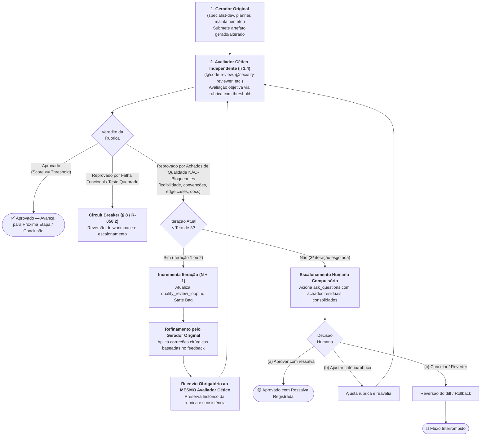

**Regras Normativas do Mecanismo**:

1. **Gatilho**: O Avaliador Cético (§ 1.4) reprova o artefato por achados de qualidade **não-bloqueantes** (ex.: legibilidade, convenções de estilo, cobertura de casos de borda adicionais, documentação interna ou modularização). Achados bloqueantes de segurança (OWASP Top 10, CVEs críticas) ou violações funcionais de regra de negócio NÃO entram neste loop — seguem imediatamente os fluxos de rollback (§ 8) ou interrupção.
2. **Ciclo de Refinamento com Mesmo Avaliador**: O Gerador original recebe o feedback estruturado do Avaliador Cético, aplica as correções cirúrgicas e submete o artefato revisado compulsoriamente para o **mesmo Avaliador** que emitiu o parecer (preservando o histórico da rubrica e evitando discrepâncias entre avaliadores distintos).
3. **Teto Rígido de 3 Iterações (R-055 / Anti-Silo Reuse)**: O loop é estritamente limitado ao teto de **3 iterações** (idêntico ao limiar do Circuit Breaker R-050.2, reaproveitado deliberadamente para coerência e integridade da governança). É vedado qualquer loop aberto ou indeterminado.
4. **Critério de Corte Objetivo**: A reavaliação utiliza a mesma rubrica com limiar de corte (`threshold`) pré-estabelecida no Estado de avaliação (§ 1.4) — qualquer critério abaixo do corte mantém a reprovação, sendo terminantemente proibida média compensatória.
5. **Escalonamento Humano Obrigatório ao Esgotar**: Se a 3ª iteração for concluída sem aprovação integral, o Avaliador Cético interrompe o ciclo e aciona compulsoriamente `ask_questions`, apresentando ao usuário o relatório consolidado de achados residuais com as 3 opções canônicas: *(a)* Aprovar com ressalva registrada; *(b)* Ajustar o critério da rubrica; ou *(c)* Cancelar a entrega e reverter o diff. Nunca aprova silenciosamente nem continua iterando.
6. **Rastreamento no `workflow_state`**: Todo workflow que executa este loop declara e atualiza o bloco estruturado no State Bag:
```yaml
quality_review_loop:
  iteracao_atual: 1  # 1 a 3
  max_iteracoes: 3
  achados_pendentes:
    - "achado de qualidade ou estilo"
  veredito: "em_andamento | aprovado | escalado_para_humano"
```
7. **Aplicabilidade Restrita**: Mecanismo opt-in por workflow, com aplicação formalizada nos seguintes Estados: `WORKFLOW-BUG-FIX` (Estado 5), `WORKFLOW-REFACTORING` (Estado 5), `WORKFLOW-FEATURE-DEVELOPMENT` (Estado 6), `WORKFLOW-GOVERNANCE-MAINTENANCE` (Estado 4), `WORKFLOW-DEPENDENCY-VULNERABILITY-REMEDIATION` (Estado 5) e `WORKFLOW-FRAMEWORK-MIGRATION` (Estado 6).

---


## 2. Matriz Geral de Roteamento de Workflows

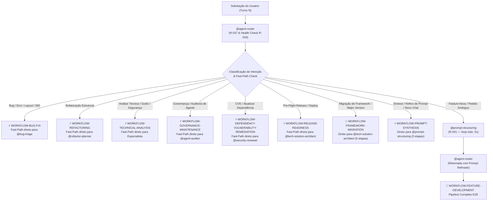

### 2.1 Resumo dos Pipelines Determinísticos & Quality Gates

| Workflow | Fast-Path | Pipeline Canônico & Quality Gate |
| :--- | :--- | :--- |
| `WORKFLOW-BUG-FIX` | `⚡ Sim` | `1. Triagem (RCA 2 fontes) -> 2. Red Test -> 3. Fix Cirúrgico -> 4. Green Test -> [5. Quality Gate & Quality Review Loop (§ 1.5)]` |
| `WORKFLOW-REFACTORING` | `⚡ Sim` | `1. Ground Truth -> 2. Blast Radius & Contratos -> 3. Plano Mikado -> 4. Execução em Lote -> [5. Validação & Quality Review Loop (§ 1.5)]` |
| `WORKFLOW-TECHNICAL-ANALYSIS` | `⚡ Sim` | `1. Despacho Especialista -> 2. Coleta Read-Only -> 3. Síntese Técnica & Propostas` |
| `WORKFLOW-FEATURE-DEVELOPMENT` | `❌ Não (R-041)` | `1. Prompt Structuring -> 2. Requisitos -> 3. Blueprint -> 4. Estratégia Testes -> 5. TDD -> [6. Duplo Gate & Quality Review Loop (§ 1.5)]` |
| `WORKFLOW-GOVERNANCE-MAINTENANCE` | `⚡ Sim` | `1. Diagnóstico/Pesquisa -> 2. Checkpoint Humano -> 3. Execução em Lote -> [4. Quality Gate & Quality Review Loop (§ 1.5)]` |
| `WORKFLOW-DEPENDENCY-VULNERABILITY-REMEDIATION` | `⚡ Sim` | `1. Triagem SCA -> 2. Blast Radius -> 3. Bump & Lockfile -> 4. Adaptação Breaking -> [5. Quality Gate SCA & Quality Review Loop (§ 1.5)]` |
| `WORKFLOW-FRAMEWORK-MIGRATION` | `⚡ Sim` | `1. 5D & Símbolos -> 2. Blueprint & De-Para -> 3. Codemod Lote -> 4. Paridade Dual -> 5. Baseline Gate -> [6. Redundancy Gate & Quality Review Loop (§ 1.5)]` |
| `WORKFLOW-RELEASE-READINESS` | `⚡ Sim` | `1. Contratos OpenAPI -> 2. Rollout DDL -> 3. Segredos & Higiene -> 4. Changelog & SemVer -> 5. Veredito Go/No-Go` |
| `WORKFLOW-PROMPT-SYNTHESIS` | `⚡ Sim` | `1. Elicitação -> 2. Context Grounding -> 3. Restrições -> 4. Síntese Estruturada -> 5. Quality Gate (.md)` |

---

## 3. Especificação dos Workflows Canônicos e de Ciclo de Vida (9 Workflows Determinísticos)

---

### 3.1 WORKFLOW 1: `WORKFLOW-BUG-FIX` (Resolução de Bugs, Falhas de Layout e Regressões)

- **Objetivo**: Identificar a causa raiz via RCA estruturado (5 Whys / Fishbone) sob a regra *evidence before hypothesis* (mínimo de 2 fontes independentes de evidência técnica observável), classificar determinísticamente o defeito (`flaky` vs `regressao_real`), reproduzir via teste automatizado isolado (Red Test) ou layout spec, quantificar blast radius estimado e plano de reversão, aplicar correção cirúrgica mínima (Green Test) com mini mutation-check proporcional ao risco (anti falso-verde), validar não-regressão e aplicar observação pós-fix/canary para defeitos críticos.
- **Gatilhos de Fast-Path**: `"bug"`, `"erro"`, `"falha"`, `"500"`, `"NPE"`, `"não funciona"`, `"quebrou"`, `"layout quebrado"`, `"desalinhado"`, `"CSS quebrado"`, `"NullPointerException"`, `"regressão"`.
- **Política R-041**: **Bypass Total** de `@prompt-structuring`. Não reformatar prompt; o relato técnico é despachado imediatamente.
- **⚠️ Invariante de RCA Estruturado e Dupla Fonte de Evidência (não-negociável)**: Proibido formular hipótese causal ou propor correção sem correlacionar no mínimo **2 fontes independentes de evidência técnica observável** (*evidence before hypothesis* — ex.: stack trace + log em runtime; ou payload de rede HTTP + teste isolado reprodutível; ou métrica de observabilidade APM + call graph determinístico). Hipóteses baseadas em intuição pura sem dupla evidência são proibidas.
- **⚠️ Invariante de Classificação Flaky vs Regressão Real (não-negociável)**: Toda falha deve ser categorizada no Estado 1/Pré-voo como `flaky` (instabilidade intermitente decorrente de race conditions, poluição de estado entre suítes, delays de concorrência ou timeouts de ambiente) ou `regressao_real` (quebra determinística de invariante de negócio ou contrato). Se classificado como `flaky`, o fluxo isola os fatores de concorrência/ambiente antes de qualquer modificação de código funcional.
- **⚠️ Invariante de Pré-Declaração de Blast Radius e Rollback Plan (não-negociável)**: É terminantemente vedado aplicar qualquer diff de correção no Estado 3 sem antes quantificar o `blast_radius_estimado` (callers diretos, módulos vizinhos afetados, dependências) e registrar o `rollback_plan` atômico no `workflow_state`.
- **⚠️ Invariante de Mini Mutation-Check e Observação Pós-Fix (não-negociável)**: No Estado 4, todo teste de regressão para bug de severidade média/alta deve passar por mini mutation-check pontual proporcional ao risco (1 a 3 mutantes sintéticos injetados) para comprovar a eliminação de falsos-verdes. No Estado 5, bugs de criticidade alta/crítica (P0/P1, segurança, integridade de dados, indisponibilidade ou memory leak) exigem plano formal de observação pós-fix/canary com telemetria definida.

```mermaid
flowchart TD
    Start(["⚡ Solicitação de Bug (Fast-Path)"]) --> Triage["<b>1. Triagem & RCA Estruturado</b><br/>Agente: @bug-triage<br/>Ação: RCA 5 Whys/Fishbone + 2 fontes independentes"]

    Triage --> CheckRepro{"Reprodução clara<br/>e determinística?"}
    CheckRepro -- "Não (Intermitente/Sem Logs)" --> ReproGate["<b>1b. Repro Gate & Probe</b><br/>Agente: @debugger / ask_questions<br/>Ação: Logpoint em runtime ou coleta de payload mínimo (tentativa N/2)"]
    ReproGate --> CheckReproCap{"Tentativas de<br/>reprodução < 2?"}
    CheckReproCap -- "Sim" --> Triage
    CheckReproCap -- "Não (teto esgotado)" --> NonRepro["<b>1c. Não Reproduzível — Escalonamento</b><br/>Agente: ask_questions<br/>Opções: prosseguir com hipótese | aguardar evidência | encerrar não-reproduzível"]
    NonRepro --> EndNonRepro(["🟡 Pausado — Aguardando Evidência/Decisão"])
    CheckRepro -- "Sim" --> CheckFlaky{"Classificação da Falha"}

    CheckFlaky -- "Flaky (Intermitência/Race Condition)" --> FlakyIsolate["<b>Isolamento de Concorrência/Ambiente</b><br/>Agente: @debugger / specialist-unit-test-writer<br/>Ação: Isola poluição de estado, timing e concorrência"]
    CheckFlaky -- "Regressão Real" --> CheckDiag{"Causa raiz<br/>multi-camada?"}
    FlakyIsolate --> CheckDiag

    CheckDiag -- "Sim" --> Diagnosis["<b>Diagnóstico Profundo</b><br/>Agente: @debugger / @code-knowledge-graph<br/>Ação: Inspeção de call graph e stack trace"]
    CheckDiag -- "Não" --> CheckKind{"Tipo de Defeito"}
    Diagnosis --> CheckKind

    CheckKind -- "Lógica / Runtime / Exception (sem contexto de framework)" --> BaselineLogic["<b>Pré-voo de Teste</b><br/>Agente: runtime-verifier<br/>Ação: Confirma suíte vizinha limpa"]
    BaselineLogic --> RedTest["<b>2. Red Test (TDD)</b><br/>Agente: specialist-unit-test-writer<br/>Ação: Teste automatizado que falha comprovando o bug"]

    CheckKind -- "Runtime só reproduz com contexto de framework (Spring/R2DBC/DOM)" --> BaselineCtx["<b>Pré-voo de Teste</b><br/>Agente: runtime-verifier<br/>Ação: Confirma suíte vizinha limpa"]
    BaselineCtx --> RedTestCtx["<b>2. Red Test com Contexto (TDD)</b><br/>Agente: specialist-component-test-writer (Angular) / specialist-integration-test-writer (backend/reactive/EJB)<br/>Ação: Teste com TestBed/@SpringBootTest/Testcontainers que falha comprovando o bug"]

    CheckKind -- "Layout / CSS / Visual" --> LayoutSpec["<b>2. Layout Spec & WCAG</b><br/>Agente: specialist-ui-stylist / component-test<br/>Ação: Spec de classes/DOM e checagem de tokens"]

    RedTest & RedTestCtx & LayoutSpec --> CheckDB{"Exige ajuste<br/>de Schema/DDL?"}
    CheckDB -- "Sim" --> DBMigration["<b>3a. Migração DDL Idempotente</b><br/>Agente: @database-specialist<br/>Ação: Script Flyway/DDL idempotente"]
    CheckDB -- "Não" --> CheckAuth{"Toca autenticação<br/>/credenciais/identidade?"}
    DBMigration --> CheckAuth

    CheckAuth -- "Sim" --> SecGate["<b>3c. Security Checkpoint (R-048.1)</b><br/>Agente: @tech-solution-architect + @security-reviewer<br/>Ação: Valida viabilidade e superfície de risco ANTES do diff"]
    CheckAuth -- "Não" --> BlastRollbackCheck["<b>Declaração de Blast Radius & Rollback Plan</b><br/>Agente: specialist-bug-fixer<br/>Ação: Quantifica callers/módulos e define estratégia de rollback"]
    SecGate --> BlastRollbackCheck

    BlastRollbackCheck --> Fix["<b>3. Correção Cirúrgica Mínima</b><br/>Agente: specialist-bug-fixer / ui-stylist<br/>Ação: Diff cirúrgico mínimo (R-002 e R-046)"]

    Fix --> GreenTest["<b>4. Green Test, Linter & Mini Mutation-Check</b><br/>Agente: runtime-verifier / test-fixer<br/>Ação: Suíte verde + mini mutation-check proporcional ao risco"]

    GreenTest --> CheckPass{"Testes passaram<br/>e mutantes eliminados (máx 3x)?"}
    CheckPass -- "Sim" --> QualityGate["<b>5. Quality Gate & Observação Pós-Fix</b><br/>Agente: @code-review / @pr-gatekeeper<br/>Ação: Validação de segurança/diff, autorreflexão e canary para bugs críticos"]
    CheckPass -- "Não (Falha Persistente)" --> CircuitBreaker["<b>4b. Circuit Breaker & Rollback</b><br/>Agente: runtime-verifier (DECLARA veredito, read-only)<br/>Ação: Aciona specialist-bug-fixer/test-fixer para reversão atômica via rollback_plan + Escalation (ask_questions)"]

    QualityGate --> EndBug(["✅ Concluído com Sucesso"])
    CircuitBreaker --> EndFail(["🛑 Interrompido com Reversão Segura"])
```

#### Cadeia Sequencial e Papéis:
1. **Estado 1 — Triagem, RCA Estruturado & Hipótese Causal (`@bug-triage`)**:
   - *Entrada*: Sintoma relatado, logs, stack trace ou print/descrição de layout.
   - *RCA Estruturado (5 Whys / Fishbone)*: O `@bug-triage` conduz formalmente Análise de Causa Raiz através da técnica dos **5 Porquês (5 Whys)** ou **Diagrama de Ishikawa (Fishbone)**, decompondo o defeito em camadas (código, dados, concorrência, contratos, configuração).
   - *Regra Obrigatória: Evidence Before Hypothesis*: É terminantemente vedado formular hipótese causal sem correlacionar no mínimo **2 fontes independentes de evidência técnica observável** (ex.: stack trace + log em runtime; ou payload de rede HTTP + teste isolado reprodutível; ou métrica de observabilidade APM + call graph determinístico). Hipóteses baseadas em intuição pura sem dupla evidência são proibidas.
   - *Classificação Determinística: `flaky` vs `regressao_real`*: O `@bug-triage` categoriza a falha em `flaky` (instabilidade intermitente decorrente de race conditions, poluição de estado entre suítes, delays de concorrência ou timeouts de ambiente) ou `regressao_real` (quebra determinística de invariante de negócio ou contrato). Se classificado como `flaky`, o fluxo isola os fatores de concorrência/ambiente antes de qualquer modificação de código funcional.
   - *Saída*: RCA formalizado com 2 fontes de evidência, hipótese causal validada, classificação (`flaky` ou `regressao_real`), componente afetado e passos de reprodução.
   - *Sub-rotina 1a (Diagnóstico Profundo)*: Se envolver call graph multi-camada complexo, invoca `@debugger` com `call_type: "subroutine"`.
   - *Sub-rotina 1b (Repro Gate)*: Se o bug for intermitente ou faltar evidência mínima, o `@bug-triage` NÃO avança cegamente para o Estado 2. Ele aciona o `@debugger` com logpoint/tracepoint (`logExpression` com `suspendPolicy=NONE`) ou dispara `ask_questions` (R-027) com 1 pergunta solicitando o payload/passos mínimos.
   - *Sub-rotina 1c (Circuit Breaker de Reprodução)*: O Repro Gate tem **teto de 2 tentativas**. Se após 2 rodadas a reprodução determinística ainda falhar, o `@bug-triage` PARA de repetir o ciclo e aciona `ask_questions` com 3 opções objetivas: **(A)** prosseguir para o Estado 2 com a hipótese de maior confiança disponível, registrando o risco assumido no `workflow_state`; **(B)** pausar o workflow aguardando evidência adicional (log/observabilidade) do solicitante; **(C)** encerrar a triagem classificando `status_reproducao: "nao_reproduzivel"` e registrar achados parciais para backlog. Este é um estado terminal distinto (🟡 Pausado), não um retorno silencioso ao loop.
2. **Estado 2 — Caracterização e Reprodução Automatizada (Papel: Gerador do Red Test — § 1.4)**:
   - *Sprint Contract*: Antes de escrever o teste, o especialista declara por escrito o comportamento esperado pós-fix e os casos de borda que o Red Test deve cobrir (`sprint_contract` no `workflow_state`) — este mini-contrato é o que o Avaliador Cético (Estado 5) usará como rubrica de corte, evitando que o critério de "concluído" seja inventado retroativamente.
   - *Cenário A (Lógica / Runtime / Regra, sem dependência de contexto de framework)*: `specialist-unit-test-writer` cria teste automatizado isolado que falha comprovando o defeito. Antes disso, um pré-voo de baseline confirma que o ambiente de teste executa limpo nos testes vizinhos para evitar falsos positivos de flaky tests pré-existentes.
   - *Cenário B (Runtime que só reproduz com contexto de framework)*: Quando o bug exige DOM real (`specialist-component-test-writer`, Angular) ou contexto de aplicação (`specialist-integration-test-writer` com `@SpringBootTest`/`@WebMvcTest`/`@DataJpaTest`/Testcontainers/R2DBC em backend, reactive ou EJB) para reproduzir — ex.: `LazyInitializationException`, rollback transacional incorreto, falha de filtro de segurança — o teste de regressão DEVE usar o contexto de framework em vez de um mock isolado que mascararia o sintoma real. Ver § 1.3 para a tabela completa de resolução por stack.
   - *Cenário C (Layout / CSS / Estilo / Responsividade / Smell 2.21)*: `specialist-ui-stylist` e `specialist-component-test-writer` mapeiam a falha visual através do ciclo VFL (`frontend-visual-feedback-loop`), identificando quebras de hierarquia em relação ao componente irmão canônico, ausência de classes utilitárias de diálogo (`.app-dialog-content`, `.form-grid`), textos literais de ícones vazando e cores hexadecimais arbitrárias. Geram teste de componente com asserção estrita de DOM/AOM ou especificação de layout multi-viewport (375px/768px/1440px).
3. **Estado 3 — Correção Cirúrgica Mínima (`specialist-bug-fixer` ou `specialist-ui-stylist`)**:
   - *Entrada*: Arquivo alvo e teste falhando ou layout spec.
   - *Pré-requisito Mandatório: Blast Radius Estimado & Rollback Plan*: Antes de emitir o primeiro diff cirúrgico, o especialista DEVE declarar no `workflow_state`: **(a)** `blast_radius_estimado` (contagem de callers diretos e módulos dependentes via consulta determinística ao grafo quando multi-camada) e **(b)** `rollback_plan` (estratégia de restauração atômica, pontos de restauração e lista de arquivos reversíveis em caso de escalonamento/circuit breaker).
   - *Roteamento Especializado por Tipo de Defeito*: Falhas de runtime/lógica/reatividade são corrigidas por `specialist-bug-fixer`; **defeitos de layout, SCSS, alinhamento de diálogos, ícones ou responsividade são atribuídos compulsoriamente a `specialist-ui-stylist`**, aplicando estritamente variáveis de tema (zero hex inline) e classes utilitárias canônicas.
   - *Sub-rotina 3a (Dependência de Banco/DDL)*: Se a falha envolver truncamento de dados, coluna ausente ou constraint de banco, o `@database-specialist` gera previamente o script de migração DDL idempotente antes de tocar no código de aplicação.
   - *Sub-rotina 3c (Security Checkpoint — R-048.1)*: Se a correção tocar autenticação, credenciais, provedores de identidade ou sessão/token, o Estado 3 aciona compulsoriamente o gate de segurança já declarado em `routing-graph.yaml` (`@tech-solution-architect` + `@security-reviewer`, quando disponível) **ANTES** de aplicar o diff — tratamento equivalente ao de mudanças sensíveis de persistência/banco. Proibido implementar o fix de autenticação sem declarar este checkpoint no handoff.
   - *Saída*: Diff cirúrgico mínimo (2 a 3 linhas de contexto), sem alterar código não relacionado (R-002 e R-046).
4. **Estado 4 — Verificação Green Test, Linter, VFL & Mini Mutation-Check (`runtime-verifier`)**:
   - *Entrada*: Código alterado e suíte de testes.
   - *Saída*: Confirmação de 100% dos testes passando e `get_errors` limpo em lote único (R-046).
   - *Mini Mutation-Check Proporcional ao Risco (Anti Falso-Verde)*: Para eliminar o risco crítico de falsos-verdes (onde o teste de regressão passa mesmo na presença do bug, por asserção frágil ou tautológica), o especialista executor aplica um **mini mutation-check cirúrgico** proporcional ao risco: injeta de 1 a 3 mutantes sintéticos pontuais na linha alterada (ex.: invertendo a condição de guarda booleana ou revertendo temporariamente a correção). O teste de regressão criado no Estado 2 DEVE obrigatoriamente falhar ao rodar contra o código mutado (100% de mutantes eliminados). Se o teste continuar verde diante do mutante, o teste é classificado como falso-positivo / frágil e a aprovação é bloqueada até o teste ser corrigido e robustecido.
   - *Verificação Estrita para Bugs de Layout*: Para defeitos visuais, a validação do Estado 4 exige aprovação dupla: testes de componente verdes E re-inspeção visual/AOM (`frontend-visual-feedback-loop`), confirmando eliminação de texto literal de ícones, preservação de dimensões elásticas e ausência de hex inline antes de liberar para o Quality Gate. Se quebrar, aciona `specialist-test-fixer` ou `specialist-ui-stylist` (máx. 3 iterações).
   - **Nota de precedência**: quando `specialist-test-fixer` esgota seu próprio teto interno, o escalonamento genérico do sub-catálogo ("retornar ao `@agent-router`") é **substituído**, dentro de um `WORKFLOW-BUG-FIX` ativo, pelo protocolo formal do Estado 4b abaixo — a regra de workflow tem precedência sobre o comportamento default do catálogo de domínio (R-050 > comportamento genérico).
   - *Estado 4b — Circuit Breaker & Rollback (contrato corrigido)*: Se após 3 tentativas os testes não passarem, o `runtime-verifier` — **estritamente read-only, nunca executa mutação** — apenas DECLARA o veredito de bloqueio (`PRONTO | BLOQUEADO` conforme seu próprio contrato) e aciona via `run_subagent` o `specialist-bug-fixer`/`specialist-test-fixer` ativo para executar a reversão atômica estritamente orientada ao `rollback_plan` previamente declarado (`git checkout -- <arquivos>` / `git restore`). **Jamais o `runtime-verifier` reverte diretamente** — isso violaria seu próprio contrato read-only (mesma classe de agent validada em `test_readonly_advisory_agents_do_not_contain_mutation_tools`). Após confirmação da reversão, o especialista escala para intervenção humana via `ask_questions`.
5. **Estado 5 — Quality Gate, Autorreflexão & Observação Pós-Fix / Canary (`@code-review` / `@pr-gatekeeper` — Papel: Avaliador Cético — § 1.4)**:
   - *Entrada*: Diff final e evidências de teste.
   - *Rubrica de Corte contra o Sprint Contract*: O `@code-review` avalia o diff estritamente contra o `sprint_contract` declarado no Estado 2 (não contra impressão subjetiva de qualidade). Cada critério do contrato recebe veredito objetivo (`atendido | nao_atendido`); qualquer critério `nao_atendido` reprova a entrega inteira, mesmo que os demais estejam excelentes (registrado em `avaliacao_cetica` no `workflow_state`).
   - *Loop de Revisão de Qualidade*: Se o Avaliador Cético reprovar por achados de qualidade não-bloqueantes, aplica-se o Loop de Revisão de Qualidade (§ 1.5), teto de 3 iterações.
   - *Observação Pós-Fix / Canary Gate (para Bugs Críticos)*: Se o defeito for de severidade crítica/alta (P0/P1, falha de autenticação/sessão, corrupção ou perda de dados, indisponibilidade ou memory leak), o Quality Gate exige compulsoriamente a declaração formal de critérios de **observação pós-fix / canary**: janela de monitoramento pós-deploy (ex.: 15m a 30m), verificação de ausência de novos erros 5xx/APM e estabilização de latência antes do encerramento definitivo do incidente.
   - *Autorreflexão Documental pós-Correção (R-033)*: O agente avalia autonomamente se a resolução do bug revelou regra de negócio oculta, contrato divergente ou padrão de layout (ex.: Smell 2.21). Se sim, atualiza a documentação viva de padrões (`docs/*padrao*`, `docs/componentes-shared.md` ou adapter local) para blindar o ecossistema contra reincidência, sem esperar ordem manual.
   - *Saída*: Resumo estruturado em 5 seções (R-028) ou preparação de PR via `@pr-gatekeeper`.

#### Typed State Bag (`workflow_state`):
```yaml
workflow_state:
  tipo_bug: "runtime_exception | layout_css | business_logic | database_constraint"
  classificacao_defeito: "regressao_real | flaky"  # categorização compulsória no Estado 1
  sintoma: "<descrição do sintoma observado>"
  rca_estruturado:
    metodologia: "5_whys | fishbone"
    fontes_evidencia:
      - "<fonte 1: ex.: stack_trace_apmlog>"
      - "<fonte 2: ex.: runtime_debug_payload_ou_teste_isolado>"
    evidencia_confirmada: true  # 'evidence before hypothesis' exige min. 2 fontes independentes
    causa_raiz_identificada: "<classe.metodo:linha e mecanismo causal primário>"
  causa_raiz: "<classe.metodo:linha e mecanismo da falha>"
  sprint_contract:  # negociado no Estado 2 (Gerador), avaliado no Estado 5 (Avaliador Cético — § 1.4)
    criterios_aceite:
      - "<comportamento esperado pós-fix ou caso de borda coberto>"
    forma_verificacao: "<comando de teste ou passo manual>"
  avaliacao_cetica:  # preenchido pelo Avaliador no Estado 5
    criterios_avaliados:
      - criterio: "<mesmo criterio do sprint_contract>"
        veredito: "atendido | nao_atendido"
    veredito_final: "aprovado | reprovado"
  blast_radius_estimado:
    callers_diretos: 2
    modulos_afetados:
      - "<modulo/camada>"
    nivel_risco: "baixo | medio | alto"
  rollback_plan:
    estrategia: "git_checkout_atomico | restore_snapshot"
    arquivos_reversao:
      - "<caminho/arquivo.ext>"
    blast_radius_revertido:
      - "<modulo_restaurado>"
  arquivos_alvo:
    - "<caminho/arquivo.ext>"
  teste_regressao:
    arquivo: "<caminho/arquivo.spec.ext>"
    nome_teste: "deve <comportamento> quando <cenário>"
    comando_execucao: "<comando de teste>"
    exige_contexto_framework: false  # true -> usar specialist-integration/component-test-writer
  status_red_test: "confirmado_falha | layout_spec_validado"
  status_reproducao: "confirmada | nao_reproduzivel | aguardando_evidencia"
  tentativas_reproducao: 1  # teto: 2 (Sub-rotina 1c)
  exige_migracao_ddl: false
  exige_security_checkpoint: false  # true -> aciona 3c (R-048.1) antes do diff
  mini_mutation_check:
    aplicavel: true  # proporcional ao risco do bug
    mutantes_testados: 2
    mutantes_eliminados: 2
    status: "pass | fail"  # pass = 100% mutantes eliminados pelo Red Test
  tentativas_correcao: 1  # teto: 3 (Estado 4b)
  circuit_breaker_acionado: false
  observacao_pos_fix:
    requer_canary: false  # true para bugs criticos (P0/P1/Auth/Perda de Dados)
    janela_observacao: "30m"
    metricas_telemetria:
      - "taxa_erro_5xx < 0.01%"
      - "ausencia_reincidencia_npe"
```

---

### 3.2 WORKFLOW 2: `WORKFLOW-REFACTORING` (Refatoração Estrutural e Modernização)

- **Objetivo**: Modificar a estrutura interna do código sem alterar seu comportamento observável, amparado por testes de caracterização (Golden Master), análise de blast radius via grafo, **Contract Testing (Pact-style / consumer-driven)** para contratos compartilhados, plano incremental Mikado com rollback atômico, **camada de redundância proporcional ao blast radius** (auditoria reversa de símbolos, mini mutation gate e differential replay leve quando aplicável) e validação estrita contra ground truth de regras de negócio com **registro formal de `blast_radius_revertido`** em caso de reversão.
- **Gatilhos de Fast-Path**: `"refatorar"`, `"refatoração"`, `"desacoplar"`, `"eliminar god class"`, `"clean architecture"`, `"modularizar"`, `"remover duplicação"`, `"extrair interface"`.
- **Política R-041**: **Bypass** se o alvo estiver claro. Se o pedido for genérico ("melhore a arquitetura"), aciona `@prompt-structuring`.
- **⚠️ Invariante de Contract Testing no Gate de Contratos (não-negociável)**: Sempre que a refatoração atingir APIs públicas, DTOs compartilhados, contratos RPC/REST ou interfaces consumidas por múltiplos microsserviços/módulos, o Estado 2/Sub-rotina 2a exige **Contract Testing formal (Pact-style consumer-driven contract tests ou OpenAPI / JSON Schema Diff)** comprovando que nenhum pacto de consumidor existente é quebrado.
- **⚠️ Invariante de Redundância Proporcional ao Blast Radius (não-negociável)**: Para refatorações com blast radius médio ou alto (múltiplos callers/callees, componentes core ou desacoplamento estrutural), a validação no Estado 5 exige compulsoriamente a tríade de redundância proporcional: *(a)* **Auditoria Reversa de Símbolos** (`reverse_symbol_audit` via grafo garantindo zero métodos/interfaces omitidos); *(b)* **Mini Mutation Gate** (`mini_mutation_gate` comprovando que a rede Golden Master elimina mutantes sintéticos sem falsos-verdes); e *(c)* **Differential Replay Leve** (`differential_replay_leve`, quando aplicável, comparando snapshots de entrada/saída pré e pós-refatoração para funções de cálculo/transformação).
- **⚠️ Invariante de Rollback com Blast Radius Revertido (não-negociável)**: Em caso de falha de validação ou violação de ground truth no Estado 5b, a governança de rollback obriga o registro quantitativo do `blast_radius_revertido` no `workflow_state` (inventário exato dos nós Mikado revertidos, callers e arquivos restaurados), mantendo rastreabilidade total da reversão atômica.

```mermaid
flowchart TD
    StartRefactor(["⚡ Solicitação de Refactor (Fast-Path)"]) --> GroundTruth["<b>1. Mapeamento de Regras Vigentes</b><br/>Agente: @business-rules-extractor<br/>Ação: Extrai regras vigentes em markdown (Ground Truth)"]

    GroundTruth --> BlastRadius["<b>2. Blast Radius & Dependências</b><br/>Agente: @code-knowledge-graph (R-045)<br/>Ação: Mapeia callers, callees, ciclos e acoplamento"]

    BlastRadius --> CheckContract{"Afeta APIs públicas<br/>ou Consumidores?"}
    CheckContract -- "Sim" --> ContractGate["<b>2a. Contract Testing (Pact-Style) & Deprecation Plan</b><br/>Agente: @tech-solution-architect<br/>Ação: Pact-style consumer-driven tests / Branch by Abstraction"]
    CheckContract -- "Não" --> CheckSafetyNet{"Cobertura de Testes<br/>suficiente por risco?"}
    ContractGate --> CheckSafetyNet

    CheckSafetyNet -- "Não (Código Legado Sem Teste)" --> GoldenMaster["<b>2b. Golden Master Safety Net</b><br/>Agente: specialist-unit-test-writer<br/>Ação: Cria testes de caracterização capturando comportamento atual"]
    CheckSafetyNet -- "Sim" --> SafetyNetPlan["<b>3. Plano Macro Mikado</b><br/>Agente: @refactor-planner + @test-strategy<br/>Ação: Árvore Mikado em micro-etapas + pontos de rollback"]
    GoldenMaster --> SafetyNetPlan

    SafetyNetPlan --> CheckDBSchema{"Exige refatoração<br/>de Schema/Banco?"}
    CheckDBSchema -- "Sim" --> ExpandContract["<b>3b. Expand and Contract</b><br/>Agente: @database-specialist<br/>Ação: Adição de novas colunas/tabelas paralelas"]
    CheckDBSchema -- "Não" --> CheckRiskGate{"Breaking change OU schema OU blast radius grande?"}
    ExpandContract --> CheckRiskGate

    CheckRiskGate -- "Sim" --> PlanGate["<b>3c. Checkpoint de Aprovação do Plano</b><br/>ask_questions: aprovar DAG Mikado antes de mutar"]
    CheckRiskGate -- "Não (escopo local claro)" --> Execution["<b>4. Execução Incremental em Lote</b><br/>Agente: Domain Router / Specialist Developer<br/>Ação: Execução em micro-lotes com diffs cirúrgicos (R-046)"]
    PlanGate --> Execution

    Execution --> Validation["<b>5. Validação de Ground Truth & Redundância Proporcional</b><br/>Agente: @business-rules-extractor (Validate) + @code-review<br/>Ação: Ground Truth 100% + Reverse Symbol Audit + Mini Mutation Gate + Differential Replay"]

    Validation --> CheckRefactor{"Regras, testes e<br/>redundância 100% aprovados?"}
    CheckRefactor -- "Sim" --> EndRefactor(["✅ Concluído com Sucesso"])
    CheckRefactor -- "Não (Violação de Regra)" --> RefactorRollback["<b>5b. Rollback Decidido pelo Planner & Blast Radius Revertido</b><br/>Agente: @refactor-planner (decide escopo) → domain router/specialist (executa)<br/>Ação: Reversão dos nós DAG afetados + registro de blast_radius_revertido"]
    RefactorRollback --> EndRefactorFail(["🛑 Refatoração Revertida com Segurança"])
```

#### Cadeia Sequencial e Papéis:
1. **Estado 1 — Mapeamento de Regras Vigentes (`@business-rules-extractor`)**: Extrai regras de negócio do código atual em arquivos `.md` estruturados (modo Extract), servindo como baseline de verdade inegociável.
2. **Estado 2 — Blast Radius & Análise de Contratos (`@code-knowledge-graph`)**: Executa análise estrita determinística (R-045) via `@optave/codegraph` para identificar dependências transitivas, acoplamento e pontos de quebra. Proibido varredura manual.
   - *Sub-rotina 2a (Contract & Deprecation Gate com Contract Testing Pact-Style / Consumer-Driven)*: Se a refatoração atingir métodos públicos, DTOs compartilhados ou interfaces consumidas por múltiplos módulos/microsserviços, o `@tech-solution-architect` e os especialistas de testes aplicam compulsoriamente **Contract Testing (Pact-style consumer-driven contract tests ou OpenAPI / JSON Schema Diff)** para comprovar matematicamente que nenhum consumidor existente será quebrado. Desenha também a transição suave (Branch by Abstraction / Deprecation prévia).
   - *Sub-rotina 2b (Golden Master / Safety Net Gate)*: Se a área a ser refatorada não possuir cobertura automatizada mínima, o `specialist-unit-test-writer` DEVE escrever testes de caracterização que congelem o comportamento existente antes de qualquer alteração estrutural. **Threshold por risco (não flat 80%)**: consultar a matriz de `test-coverage-governance/SKILL.md` § 1 — lógica crítica de negócio exige 90%+, integração API/BD 80%+, controllers/handlers 70%+; `@test-strategy` determina o threshold aplicável ao alvo antes desta decisão, e a medição real usa a ferramenta configurada no projeto (JaCoCo/Istanbul/coverage.py via adapter de stack).
3. **Estado 3 — Plano Macro Mikado & Estratégia de Rollback (`@refactor-planner` + `@test-strategy`)**:
   - Decompõe a meta usando a técnica **Mikado Method**: gera a árvore de pré-requisitos (folhas primeiro, raiz por último) em micro-passos independentes.
   - *Sub-rotina 3b (Database Expand and Contract)*: Se a refatoração envolver schema de banco, o `@database-specialist` orquestra a evolução em fases paralelas (Expand -> Migrate -> Contract), nunca DDL destrutivo direto.
   - *Sub-rotina 3c (Checkpoint de Aprovação do Plano)*: Se a refatoração envolver **breaking change de contrato**, **schema de banco** ou **blast radius grande** (muitos callers/callees no Estado 2), o `@refactor-planner` apresenta o DAG completo e aciona `ask_questions` para aprovação humana explícita **antes** de iniciar o Estado 4 — mesmo padrão de checkpoint usado em `WORKFLOW-FEATURE-DEVELOPMENT` (Estado 3b) e `WORKFLOW-GOVERNANCE-MAINTENANCE` (Estado 2b). Para refatorações de escopo local claro e baixo risco, a aprovação pode ser contextual/implícita (R-031).
   - *Limite de Escala do DAG*: cada nó já é limitado a 1-3 arquivos (contrato do `@refactor-planner`); se o DAG total ultrapassar **15 nós**, o plano DEVE ser fatiado em fases entregáveis independentes (múltiplas sessões/PRs), cada uma terminando em estado *always deployable* — nunca um plano monolítico de execução única inviável.
4. **Estado 4 — Execução Incremental em Lote (`domain router / specialists`)**: Aplica as alterações respeitando o protocolo R-046 (Single-Turn Batching / context-mode para 5+ arquivos) em micro-lotes. Cada nó do DAG tem seu próprio Gate Out (compilação limpa, testes 100% verdes, diff mínimo — conforme o template de saída do `@refactor-planner`), validando incrementalmente contra a suíte de caracterização a cada micro-lote, não apenas ao final.
5. **Estado 5 — Validação de Não-Regressão, Redundância Proporcional e Compliance (`@business-rules-extractor` + `@code-review`)**:
   - O `@business-rules-extractor` executa o modo Validate comparando o código final com as regras documentadas no Estado 1.
   - *Redundância Proporcional ao Blast Radius*: Quando o blast radius for médio ou alto (múltiplos callers, componentes estruturais ou extração de interfaces), a validação incorpora compulsoriamente a tríade de redundância:
     1. **Auditoria Reversa de Símbolos (`reverse_symbol_audit`)**: O `@code-knowledge-graph` compara o inventário de símbolos, métodos públicos e interfaces pré-refatoração contra o código final para assegurar que nenhum símbolo público ou contrato foi acidentalmente omitido, descontinuado ou tornado privado sem aprovação.
     2. **Mini Mutation Gate (`mini_mutation_gate`)**: Injeção controlada de mutantes sintéticos nas áreas refatoradas para comprovar que a suíte de caracterização / Golden Master é resiliente e acurada (eliminando falsos-verdes).
     3. **Differential Replay Leve (`differential_replay_leve`, quando aplicável)**: Para rotinas determinísticas de transformação de dados, parsers, cálculo ou regras de negócio, replay comparativo de fixtures de entrada e saída capturadas no Estado 1/2 antes da mutação, comprovando equivalência de comportamento com zero drift.
   - *Loop de Revisão de Qualidade*: Se o Avaliador Cético reprovar por achados de qualidade não-bloqueantes, aplica-se o Loop de Revisão de Qualidade (§ 1.5), teto de 3 iterações.
   - *Estado 5b — Rollback Decidido pelo Planner, Executado pelo Especialista com `blast_radius_revertido` (contrato corrigido)*: Se qualquer regra de negócio for violada, o gate de contratos falhar ou os testes de caracterização quebrarem, o `@refactor-planner` — **que não possui nenhuma ferramenta de edição ou terminal** — apenas DECIDE o escopo do rollback (quais nós do DAG revertem, com base na árvore de dependências do Estado 3; preferencialmente incremental, não o plano inteiro) e aciona via `run_subagent` o(s) domain router(s)/specialist(s) que executaram cada nó afetado para reverter fisicamente seus próprios arquivos. **Jamais o `@refactor-planner` executa a reversão diretamente** (ver § 5, invariante 6). A reversão calcula e registra quantitativamente o **`blast_radius_revertido`** (inventário de nós revertidos, arquivos restaurados e callers preservados) no `workflow_state` e escala para decisão humana via `ask_questions`.

#### Typed State Bag (`workflow_state`):
```yaml
workflow_state:
  alvo_refatoracao: "<classe, metodo ou modulo alvo>"
  padrao_estrategico: "mikado_method | branch_by_abstraction | strangler_fig"
  ground_truth_regras_doc: "docs/business-rules/regras-<alvo>.md"
  blast_radius_metricas:
    total_callers: 14
    total_callees: 6
    tem_ciclo: false
    tem_breaking_change: false
  contract_testing:
    exigido: true  # true se afetar APIs publicas ou contratos de consumidores
    tipo: "pact_consumer_driven | openapi_diff | schema_compatibility"
    consumidores_validados:
      - "app-mobile"
      - "web-portal"
    status: "pass | fail | dispensado"
  safety_net_cobertura:
    testes_caracterizacao_presentes: true
    threshold_aplicavel: "90 (critico) | 80 (integracao) | 70 (controller)"
    arquivos_testes_golden_master:
      - "<caminho/arquivo.spec.ext>"
  micro_etapas_planejadas:
    - etapa_idx: 1
      descricao: "<micro-passo mikado>"
      status: "pendente | concluido"
      executor: "<domain-router-ou-specialist>"
  dag_total_nos: 6  # se > 15, fatiar em fases entregáveis independentes
  requer_checkpoint_aprovacao: false  # true -> breaking change | schema | blast radius grande
  status_aprovacao_plano: "aprovado | pendente | contextual_implicita"
  redundancia_proporcional:
    nivel_blast_radius: "baixo | medio | alto"
    auditoria_reversa_simbolos: "pass | fail | dispensado"  # code-knowledge-graph
    mini_mutation_gate: "pass | fail | dispensado"          # test-strategy / tests
    differential_replay_leve: "pass | fail | dispensado"    # replay de fixtures
  status_validacao_regras: "100_preservadas | violacao_detectada"
  snapshot_reversao: "<tag_de_reversao_ou_stash>"
  rollback_execucao:
    nos_dag_revertidos: []
    arquivos_restaurados: []
    blast_radius_revertido:
      total_callers_restaurados: 0
      modulos_restaurados: []
```

---

### 3.3 WORKFLOW 3: `WORKFLOW-TECHNICAL-ANALYSIS` (Análise Técnica, Diagnóstico e Auditoria Especializada)

- **Objetivo**: Conduzir investigações conceituais, diagnósticos de segurança, performance, conformidade de domínio, arquitetura de telas/fluxos por stack técnica ou levantamento de arquitetura de forma estritamente analítica e não mutativa, concluindo com propostas acionáveis para Fast-Chaining.
- **Gatilhos de Fast-Path**: `"analisar"`, `"diagnosticar"`, `"como funciona"`, `"mapear arquitetura"`, `"verificar segurança"`, `"avaliar performance"`, `"conformidade adr"`, `"bounded context"`, `"analisar tela"`, `"analisar fluxo"`, `"identificar melhorias"`.
- **Política R-041**: **Bypass Total** de `@prompt-structuring`. Direcionamento imediato ao especialista analítico.

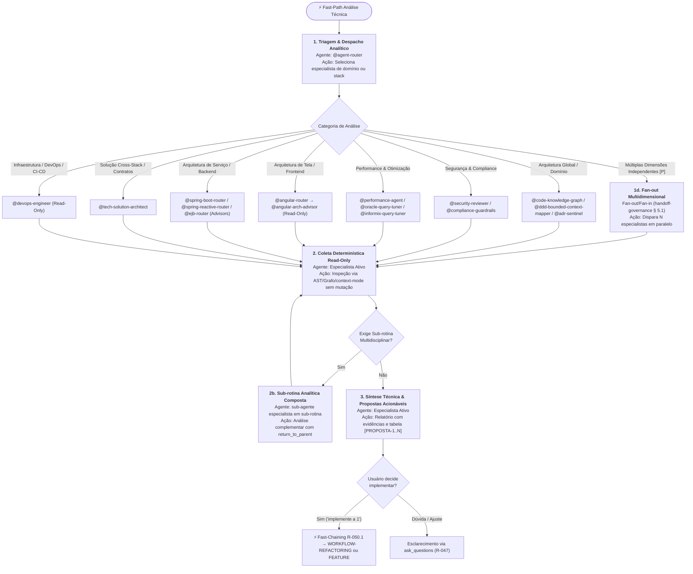

#### Cadeia Sequencial e Papéis:
1. **Estado 1 — Despacho para Especialista Analítico**: O router direciona sem desvios para o agente cujo domínio ou stack cobre a pergunta:
   - *Arquitetura Estrutural & Grafo*: `@code-knowledge-graph` (dependências/ciclos), `@ddd-bounded-context-mapper` (domínios/God Classes), `@adr-sentinel` (conformidade arquitetural).
   - *Segurança & Governança*: `@security-reviewer` (OWASP/CVE/secrets), `@compliance-guardrails` (LGPD/SOC 2).
   - *Engenharia de Performance*: `@performance-agent` (CWV/N+1/profiling), `@oracle-query-tuner` / `@informix-query-tuner` (planos de execução SQL).
   - *Arquitetura de Telas & Fluxos por Stack*: `@angular-arch-advisor` (reatividade de estado, memory leaks, detecção de mudança, SSR), `@spring-boot-arch-advisor` (concorrência, camada de persistência, clean architecture), `@spring-reactive-arch-advisor` (reatividade não-bloqueante, backpressure, event-loop), `@ejb-arch-advisor` (transações distribuídas, Stateless pools).
   - *Viabilidade Técnica & Contratos*: `@tech-solution-architect` (Technical Blueprint, OpenAPI, modelo de dados).
   - *Infraestrutura & DevOps*: `@devops-engineer` (Dockerfile, Kubernetes, pipelines CI/CD, Infrastructure-as-Code — read-only).
   - *Sub-rotina 1d (Fan-out Multidimensional)*: Se a solicitação abranger **2+ categorias independentes simultâneas** (ex.: "avalie segurança E performance deste módulo"), marcada `[P]` por R-018, o `@agent-router` aplica o padrão **Fan-out/Fan-in (Orchestrator-Workers)** já definido em `handoff-governance/SKILL.md` § 5.1: dispara os N especialistas em paralelo (cada um estritamente read-only, sem efeito colateral, portanto seguro paralelizar) e agrega os achados em UM relatório único no Estado 3 (fan-in obrigatório — nunca fragmentar em múltiplas respostas sem síntese).
2. **Estado 2 — Coleta & Diagnóstico Determinístico (Guardrail de Imutabilidade)**:
   - O agente opera estritamente em modo Read-Only / Advisory: **proibido o uso de ferramentas mutativas** (`create_file`, `replace_string_in_file`, `insert_edit_into_file`).
   - Todo achado DEVE citar `arquivo:linha` (R-044) e usar o `context-mode` MCP (`ctx_execute_file` / `ctx_search`) para evitar saturação da janela de contexto.
   - *Sub-rotina 2b (Análise Composta)*: Se a investigação exigir visão multidisciplinar (ex.: arquiteto consultando especialista de banco), aciona sub-rotina com `call_type: "subroutine"` e `return_to_parent: true`. Sujeita ao teto `MAX_DEPTH = 3` de `handoff-governance/SKILL.md` § 2.4 — acima disso, força retorno ao `parent_agent`/`@agent-router` com `motivo: "circuit_breaker_max_depth_exceeded"`.
3. **Estado 3 — Síntese e Propostas Acionáveis para Fast-Chaining (R-047 / R-050.1)**:
   - Emissão de relatório técnico estruturado (Abordagem · Diagnóstico · Evidências com `arquivo:linha` · Impacto · **Confiança** `<0.00–1.00>` conforme `confidence-fallback-policy`).
   - **Tabela Mandatória de Propostas Acionáveis (com Escape Hatch)**: O relatório DEVE concluir com a listagem formal numerada (`[PROPOSTA-1]`, `[PROPOSTA-2]`) indicando o tipo de esforço, arquivos-alvo e o workflow de destino recomendado (`WORKFLOW-REFACTORING`, `WORKFLOW-FEATURE-DEVELOPMENT` ou `WORKFLOW-BUG-FIX`). **Se a análise não revelar achado acionável relevante**, o especialista declara explicitamente `"Nenhuma proposta necessária — conformidade validada"` em vez de manufaturar sugestões de baixo valor apenas para preencher o formato.
   - Encerramento ativo com pergunta ao usuário via `ask_questions` (R-047), habilitando o **Fast-Chaining (R-050.1)** imediato no turno seguinte.

#### Typed State Bag (`workflow_state`):
```yaml
workflow_state:
  tipo_analise: "arquitetura_stack | seguranca_owasp | performance_cwv | grafo_blast_radius | ddd_bounded_context | conformidade_adr"
  escopo_alvo:
    modulo_ou_tela: "<nome-do-modulo-ou-tela>"
    arquivos_analisados:
      - "<caminho/arquivo.ext:linha>"
  diagnostico_sumario: "<resumo dos achados em 1-3 linhas>"
  confianca: 0.85
  analise_multidimensional:
    aplicavel: false
    especialistas_fan_out: []
  propostas_acionaveis:
    - id: "PROPOSTA-1"
      titulo: "<titulo-da-melhoria>"
      tipo: "refactoring | feature | bug_fix"
      arquivos_afetados:
        - "<caminho/arquivo.ext>"
      proximo_workflow: "WORKFLOW-REFACTORING"
```

---

### 3.4 WORKFLOW 4: `WORKFLOW-FEATURE-DEVELOPMENT` (Nova Feature e Evolução Funcional E2E)

- **Objetivo**: Elicitar requisitos, conceber arquitetura técnica, desenhar contratos de API (OpenAPI), definir matriz de testes por risco, aprovar blueprint com desenvolvedor e implementar sob workflow TDD estrito com validação de segurança OWASP.
- **Gatilhos**: `"criar feature"`, `"nova funcionalidade"`, `"implementar endpoint"`, `"adicionar tela"`, `"novo módulo"`, `"evoluir fluxo"`.
- **Política R-041**: **Ativação Obrigatória** de `@prompt-structuring` caso a solicitação seja de alto nível ou ambígua. Bypassa caso venha de Fast-Chaining pós-diagnóstico com proposta aprovada.

```mermaid
flowchart TD
    Start(["🚀 Solicitação de Feature Nova"]) --> CheckAmbiguity{"Pedido aberto<br/>ou ambíguo?"}

    CheckAmbiguity -- "Sim" --> Struct["<b>1. Prompt Structuring</b><br/>Agente: @prompt-structuring<br/>Ação: Refinamento canônico (loop máx 5x)"]
    CheckAmbiguity -- "Não (Já Estruturado/Fast-Chaining)" --> Req
    Struct --> Req["<b>2. Elicitação de Requisitos</b><br/>Agente: @requirements-analyst / @feature-planner<br/>Ação: Requisitos funcionais BDD/EARS e não-funcionais"]

    Req --> Arch["<b>3. Technical Blueprint & Contratos</b><br/>Agente: @tech-solution-architect<br/>Ação: OpenAPI v3, modelo de dados e divisão por stack"]

    Arch --> CheckScope{"Escopo da Feature"}
    CheckScope -- "Fullstack" --> SplitFull["Divisão [BACKEND_TASKS] e [FRONTEND_TASKS]"]
    CheckScope -- "Backend Only" --> SplitBack["Definição de Endpoints & Persistência"]
    CheckScope -- "Frontend Only" --> SplitFront["Definição de Telas & Mock API DTOs"]

    SplitFull & SplitBack & SplitFront --> BlueprintGate{"<b>3b. Checkpoint de Blueprint</b><br/>Aprovação humana via ask_questions"}

    BlueprintGate -- "Revisar" --> Arch
    BlueprintGate -- "Aprovado" --> TestStrat["<b>4. Estratégia de Testes por Risco</b><br/>Agente: @test-strategy<br/>Ação: Matriz de riscos, casos de borda e cobertura alvo"]

    TestStrat --> TDD["<b>5. Implementação Domain TDD & Paridade UI</b><br/>Agentes: Domain Routers & Specialists<br/>Ação: Contract-First (Red -> Green -> Refactor)<br/>Frontend: 5a Lógica/Store -> 5b Handoff UI Stylist"]

    Arch --> CheckDBFeature{"Exige novas<br/>tabelas/colunas?"}
    CheckDBFeature -- "Sim" --> DBFeature["<b>3c. Migração de Schema</b><br/>Agente: @database-specialist<br/>Ação: DDL idempotente + rollback documentado"]
    DBFeature --> CheckScope

    TDD --> SecReview["<b>6a. Gate 1: Security Review (OWASP) & Lógica</b><br/>Agente: @security-reviewer<br/>Ação: Verificação de testes, injeções, IDOR, auth"]

    SecReview --> CheckSec{"Aprovado em<br/>Gate 1?"}
    CheckSec -- "Vulnerabilidade (tentativa N/2)" --> CheckSecCap{"Tentativas<br/>remediação < 2?"}
    CheckSecCap -- "Sim" --> TDD
    CheckSecCap -- "Não (teto esgotado)" --> SecEscalate["<b>6b. Escalonamento de Segurança</b><br/>ask_questions: revisão manual pareada com dev"]
    CheckSec -- "Limpo" --> UIGate["<b>6c. Gate 2: Design System & Paridade UI</b><br/>Agentes: @angular-ui-stylist / @code-review<br/>Ação: Tokens, zero hex inline, classes diálogo/scroll"]
    UIGate --> Gate["<b>6d. PR Preparation & Quality Gate Final</b><br/>Agentes: @code-review → @pr-gatekeeper<br/>Ação: Revisão de diff e geração de PR semântico"]

    Gate --> EndFeat(["✅ Feature Concluída com Sucesso"])
```

#### Cadeia Sequencial e Papéis:
1. **Estado 1 — Estruturação de Prompt (`@prompt-structuring`)**: Transforma pedidos abertos no formato canônico `<task>/<context>/<constraints>/<output_format>`.
2. **Estado 2 — Elicitação de Requisitos (`@requirements-analyst` / `@feature-planner` — negociação do Sprint Contract — § 1.4)**: Detalha regras funcionais (BDD/EARS) e não-funcionais com critérios de aceitação objetivos, prevenindo *solution-jumping* e persistindo a especificação oficial em `docs/requirements/REQ-<modulo>.md` (perfil Híbrido Documental sob R-056). Os critérios de aceitação aqui definidos constituem o `sprint_contract` que o Avaliador Cético do Estado 6 usará como rubrica de corte objetiva — nenhum critério pode ser adicionado ou reinterpretado retroativamente pelo Gerador (Estado 5) sem nova negociação explícita.
3. **Estado 3 — Technical Blueprint & Contratos (`@tech-solution-architect`)**:
   - Modela contratos de integração (OpenAPI v3), esquema de banco de dados (relacional ou NoSQL/Firestore/BaaS), máquina de estados e mitigação de concorrência.
   - Particionamento de escopo: isola se a demanda é **Fullstack**, **Backend-Only**, **Frontend-Only** ou **Database-Only**.
   - *Estado 3b (Checkpoint de Blueprint)*: Apresenta o blueprint estruturado e aguarda autorização humana explícita via `ask_questions` antes de iniciar qualquer codificação.
   - *Sub-rotina 3c (Decomposição de Tarefas com `@feature-planner`)*: Após aprovação do Blueprint Técnico, se a funcionalidade contiver 3 ou mais frentes de trabalho interdependentes (ex.: modelo/store + telas/diálogos + infra/push + testes), o `@feature-planner` decompõe o plano em subtasks sequenciais `[S]` e paralelas `[P]` com Definition of Done granular, evitando que o implementador improvise a ordem de execução.
   - *⚠️ Invariante de Blueprint e Decomposição Obrigatórios (R-058 / Smell 2.27)*: É terminantemente proibido pular o Estado 3 e despachar diretamente para domain routers ou especialistas de código quando a feature envolver novo schema, máquina de estados (3+ transições), concorrência ou infraestrutura/push. É expressamente vedado ao router listar lacunas de arquitetura e deixá-las para o implementador resolver no improviso.
4. **Estado 4 — Estratégia de Testes por Risco (`@test-strategy`)**: Mapeia casos de borda, matriz de risco e cobertura recomendada (mínimo 80%) antes de codificar.
5. **Estado 5 — Implementação Domain TDD & Paridade UI (`domain routers & specialists`)**:
   - Padrão **Contract-First**: o contrato OpenAPI / DTO é a SSOT.
   - **Backend**: Execução estrita TDD (Red -> Green -> Refactor) com diffs cirúrgicos em lote (R-046).
   - **Frontend (Modelo Test-Last com Verification Gate)**: Para eliminar gargalos de runners repetitivos e mocks prematuros de DOM, a stack frontend adota **Implementation-First / Test-Last**:
     - *Estado 5a (Lógica, Store & Services)*: O `@angular-feature-developer` constrói componentes standalone, gerência de estado reativo (Signals/NgRx) e serviços primeiro, validando compilação limpa com `get_errors`. A criação dos testes unitários/componentes de regressão é executada ao final (`Test-Last`) pelo `@angular-unit-test-writer` ou `@angular-component-test-writer`.
     - *Estado 5b (Handoff Mandatório de Apresentação & Paridade de UI)*: Handoff obrigatório para o `@angular-ui-stylist` para validação do protocolo "Canonical Sibling First" (inspeção prévia de componente irmão canônico homologado), auditoria de design tokens (zero hex inline), classes utilitárias de layout/scroll para diálogos e verificação estrita dos inputs de componentes compartilhados em seus arquivos `.ts` (Smell 2.21). **Agentes e tarefas de UI pura/estilização são formalmente ISENTOS de criar ou rodar testes unitários de lógica** (validação é visual via Visual Feedback Loop e compilação limpa).
6. **Estado 6 — Duplo Quality Gate, Segurança & PR (`@security-reviewer`, `@angular-ui-stylist`, `@code-review` e `@pr-gatekeeper` — Papel: Avaliador Cético — § 1.4)**:
   - *Sub-rotina 6a — Gate 1: Security Review (OWASP), Lógica & Contratos*: O `@security-reviewer` audita novos endpoints contra OWASP Top 10 (SQL Injection, IDOR, Broken Authentication, sanitização); validação de testes verdes e compilação limpa (`get_errors`).
   - *Gate 2 (Design System & Paridade de UI)*: Auditoria visual estrita — proibição absoluta de cores hexadecimais inline em SCSS de feature, conferência de propriedades tipadas de componentes `shared/` contra o TypeScript real (prevenindo que atributos não mapeados passem silenciosamente), alinhamento estrutural de diálogos/seções e execução de linters/scripts de auditoria visual do projeto (ex.: `npm run material:auditar`).
   - *Rubrica de Corte contra o Sprint Contract*: O `@code-review` avalia a implementação estritamente contra os critérios de aceitação (`sprint_contract`) negociados no Estado 2, registrando veredito objetivo por critério em `avaliacao_cetica` no `workflow_state` — qualquer critério `nao_atendido` reprova a entrega, sem média compensatória com os demais critérios.
   - *Loop de Revisão de Qualidade*: Se o Avaliador Cético reprovar por achados de qualidade não-bloqueantes, aplica-se o Loop de Revisão de Qualidade (§ 1.5), teto de 3 iterações.
   - O `@code-review` realiza a revisão holística de conformidade, boas práticas e **conformidade documental viva** (verificando se o diff possui impacto em `docs/`, schemas ou READMEs).
   - **Autorreflexão Documental de DoD (R-033)**: Antes de finalizar a entrega, o pipeline avalia autonomamente se a nova funcionalidade introduziu rotas, modelos de dados, componentes compartilhados ou regras de negócio, atualizando de forma automática e atômica a documentação viva do projeto (`docs/`, `README.md`, catálogo de componentes ou ADRs) sem exigir lembrete do usuário.
   - O `@pr-gatekeeper` gera a mensagem de commit semântico, descrição estruturada de PR e atualiza o CHANGELOG.md (sem push autônomo — R-031).

#### Typed State Bag (`workflow_state`):
```yaml
workflow_state:
  feature_id: "<slug-da-feature>"
  escopo_stack: "frontend_only | backend_only | fullstack"
  requisitos_doc: "docs/requirements/REQ-<feature>.md"
  blueprint:
    contrato_openapi: "<caminho/openapi.yaml ou inline>"
    tabelas_banco: ["<tabela_a>", "<tabela_b>"]
    exige_migracao_ddl: false
    tasks_backend:
      - descricao: "Task 1"
        stack: "spring-boot | spring-reactive | ejb"
    tasks_frontend: ["Task 1", "Task 2"]
  matriz_riscos_testes:
    casos_borda: ["Payload vazio", "Timeout", "Duplicidade"]
    casos_borda_seguranca: ["SQL injection", "IDOR", "Auth bypass"]
    threshold_aplicavel: "90 (critico) | 80 (integracao) | 70 (controller)"
  tentativas_remediacao_seguranca: 0  # teto: 2 (Estado 6b)
  status_implementacao:
    backend_concluido: true
    frontend_concluido: true
  security_gate_status: "aprovado | vulnerabilidade_detectada"
  sprint_contract:  # negociado no Estado 2 (Gerador), avaliado no Estado 6 (Avaliador Cético — § 1.4)
    criterios_aceite:
      - "<criterio de aceitacao funcional ou nao-funcional>"
    forma_verificacao: "<teste automatizado, checklist visual ou script de auditoria>"
  avaliacao_cetica:  # preenchido pelo Avaliador (@code-review) no Estado 6
    criterios_avaliados:
      - criterio: "<mesmo criterio do sprint_contract>"
        veredito: "atendido | nao_atendido"
    veredito_final: "aprovado | reprovado"
```

---

### 3.5 WORKFLOW 5: `WORKFLOW-GOVERNANCE-MAINTENANCE` (Governança e Manutenção do Ecossistema)

- **Objetivo**: Auditar, padronizar, expandir e manter o catálogo de agents, skills, prompts e convenções do repositório de governança com pesquisa prévia compulsória, checkpoints humanos para mutações estruturais, execução atômica em lote (R-046) e validação final via suíte determinística de testes.
- **Gatilhos de Fast-Path**: `"auditar governança"`, `"novo agent"`, `"nova skill"`, `"novo prompt"`, `"nova stack"`, `"manutenção de catálogo"`, `"corrigir smell de agent"`, `"higiene de repositório"`.
- **Política R-041**: **Bypass Total** de `@prompt-structuring`. Direcionamento imediato para auditoria ou factory.

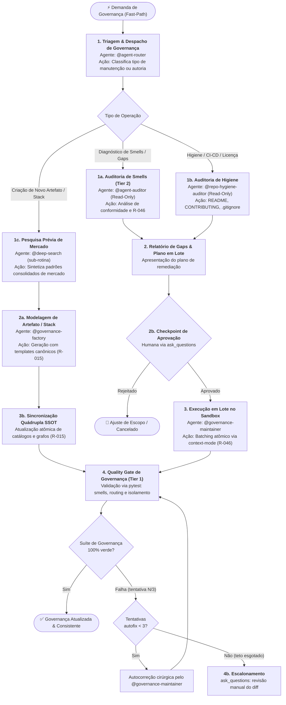

#### Cadeia Sequencial e Papéis:
- **Portão de Reúso e Generalização Sistêmica (R-055 — Prioritário & Mandatório)**: Toda demanda de manutenção, revisão, novo padrão ou correção técnica que envolva agents, prompts ou skills DEVE obrigatoriamente responder às 3 perguntas de generalização antes de codificar, eliminando o anti-padrão de correções em silo (*one-off fixes*):
  - **Q1 (Impacto Horizontal / Peers)**: *Esta melhoria ou correção se aplica a outros artefatos do mesmo perfil, camada ou família (ex.: outros routers, outros testers, outros advisors)?* Se sim, expandir compulsoriamente o escopo em lote único (*Single-Turn Batching*, R-046) para cobrir todos os artefatos análogos na mesma entrega.
  - **Q2 (Prevenção Futura / Templates)**: *O template canônico em `templates/` (`router-agent.md`, `operational-agent.md`, etc.) reflete essa nova exigência?* Se não, o template correspondente DEVE ser atualizado na mesma entrega para que futuros artefatos gerados pelo `@governance-factory` já nasçam em conformidade.
  - **Q3 (Blindagem por Teste / Quality Gate)**: *A suíte determinística em `tests/governance_audit/` já valida essa regra?* Se não, uma asserção ou teste específico no pytest DEVE ser criado ou expandido para garantir não-regressão contínua.
1. **Estado 1 — Diagnóstico Read-Only ou Pesquisa Prévia**:
   - *Diagnóstico de Smells & Reúso*: O `@agent-auditor` executa auditoria estática e comportamental contra os smells canônicos de governança e avalia compulsoriamente Q1, Q2 e Q3.
   - *Auditoria de Higiene*: O `@repo-hygiene-auditor` audita a saúde do repositório, licença e segurança de versionamento.
   - *Pesquisa Prévia Compulsória (Criação de Artefatos / Stack)*: O `@governance-factory` delega compulsoriamente ao `@deep-search` a investigação de mercado antes de escrever novos prompts, skills ou agents.
2. **Estado 2 — Modelagem e Checkpoint de Aprovação Humana**:
   - Apresentação objetiva dos achados ou especificações do novo artefato, incluindo a matriz de generalização sistêmica (artefatos alvo + peers + templates + testes).
   - *Estado 2b (Checkpoint Humano)*: Toda manutenção estrutural ou criação de stack exige autorização explícita via `ask_questions` antes de qualquer alteração física nos catálogos.
3. **Estado 3 — Execução e Sincronização em Lote por Tipo de Artefato (R-015 / R-046)**:
   - O `@governance-maintainer` aplica as alterações em lote único (*Single-Turn Batching*) utilizando o `context-mode` MCP no sandbox para zero desperdício de tokens.
   - **Sincronização Atômica por Tipo (R-015 — gap corrigido)**: o conjunto de arquivos sincronizados depende do tipo de artefato, nunca uma lista fixa de 4 arquivos:
     - **Novo Agent**: `catalog.yaml` + `routing-graph.yaml` (nós/arestas) + **novo caso em `.github/agents/evals/casos-roteamento.yaml`** (exigência formal de R-040, antes omitida desta lista) + `agent-router.agent.md` (Decision Tree derivada) + `.github/agents/README.md`.
     - **Nova Skill**: `.github/skills/.index.json` + `.github/skills/README.md` + `source_docs:` dos agents consumidores.
     - **Novo Prompt**: `.github/prompts/README.md`.
     - **Nova Stack**: todos os itens acima aplicados ao sub-catálogo de domínio (`*-catalog.yaml`) + domain router correspondente.
4. **Estado 4 — Quality Gate de Governança (Tier 1 Automático)**:
   - Execução determinística dos testes de governança:
     - `test_governance_smells.py` (conformidade com templates e 17 smells).
     - `test_local_project_isolation.py` (100% isolamento de projetos locais — R-038/R-043/R-044).
     - `test_routing_quality_gate.py` (integridade do grafo e alcançabilidade).
   - **Suíte de Evals Comportamental**: para nova rota/agent, valida adicionalmente contra os 60 casos de `.github/agents/evals/casos-roteamento.yaml` (`agent-evals-lab`) — regressão estrutural (pytest) não substitui regressão comportamental de roteamento.
   - **Circuit Breaker (Estado 4b)**: teto de **3 tentativas** de autocorreção. Havendo regressão, o `@governance-maintainer` executa autocorreção cirúrgica; se a 3ª tentativa ainda falhar, escala via `ask_questions` para revisão manual do diff — nunca autocorreção indefinida.
   - *Loop de Revisão de Qualidade*: Se o Avaliador Cético reprovar por achados de qualidade não-bloqueantes, aplica-se o Loop de Revisão de Qualidade (§ 1.5), teto de 3 iterações.

#### Typed State Bag (`workflow_state`):
```yaml
workflow_state:
  tipo_demanda: "auditoria_smells | higiene_repo | criacao_artefato | nova_stack | refatoracao_cascata"
  artefatos_alvo:
    - "<caminho/artefato.ext>"
  diagnostico_smells:
    total_achados: 3
    smells_detectados:
      - "smell-2.2-active-agent-banner"
      - "smell-2.6-absolute-path"
  pesquisa_previa_deep_search:
    realizada: true
    sintese_diretrizes: "<resumo dos padrões de mercado>"
  plano_manutencao_lote:
    - arquivo: ".github/agents/catalog.yaml"
      acao: "atualizar_versao_e_source_docs"
  sincronizacao_por_tipo:
    tipo_artefato: "agent | skill | prompt | stack"
    inclui_evals_casos_roteamento: true  # obrigatorio para novo agent/rota (R-040)
  status_aprovacao_humana: "aprovado"
  quality_gate_tier1: "100_passando"
  tentativas_autofix: 0  # teto: 3 (Estado 4b)
```

---

### 3.6 WORKFLOW 6: `WORKFLOW-DEPENDENCY-VULNERABILITY-REMEDIATION` (Remediação de Vulnerabilidades, CVEs e Atualização de Dependências)

- **Objetivo**: Detectar, isolar e sanar vulnerabilidades (CVE/SCA) em bibliotecas de terceiros ou executar atualização programada de dependências, mapeando o blast radius no código-fonte, aplicando bumps de versão em arquivos de manifesto (Maven `pom.xml`, NPM `package.json`, Python `pyproject.toml`) e resolvendo cirúrgicamente breaking changes de APIs atualizadas com suíte de testes 100% verde.
- **Gatilhos de Fast-Path**: `"atualizar dependência"`, `"atualizar dependencias"`, `"atualizar pacote"`, `"remediar cve"`, `"vulnerabilidade snyk"`, `"trivy alert"`, `"dependabot"`, `"npm audit fix"`, `"upgrade lib"`, `"cve remediation"`.
- **Política R-041**: **Bypass Total** de `@prompt-structuring`. O alerta técnico de SCA ou pedido de bump é despachado imediatamente.

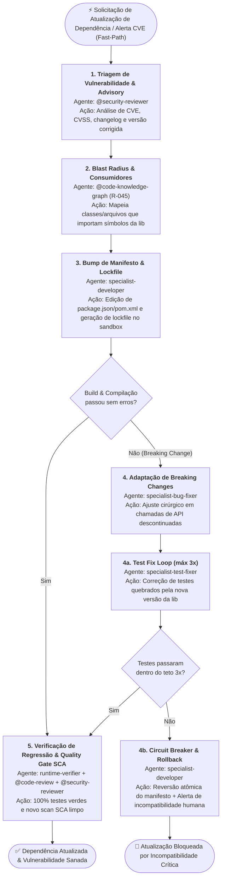

#### Cadeia Sequencial e Papéis:
1. **Estado 1 — Triagem de Vulnerabilidade & Advisory (`@security-reviewer`)**:
   - *Entrada*: Alerta SCA (Snyk/Trivy/Dependabot/NPM Audit), CVE ID ou pedido de upgrade de dependência.
   - *Saída*: Versão atual vs. versão mínima corrigida, severidade (CVSS), escopo do advisory e identificação de breaking changes conhecidas.
   - *Sub-rotina 1a*: Se o advisory exigir pesquisa profunda de changelogs ou repositórios externos, invoca `@deep-search` como sub-rotina.
2. **Estado 2 — Mapeamento de Blast Radius da Dependência (`@code-knowledge-graph`)**:
   - *Entrada*: Nome da biblioteca/pacote e símbolos afetados.
   - *Ação*: Consulta determinística via `@optave/codegraph` para mapear todos os arquivos da aplicação que importam ou instanciam classes da dependência. Proibido varredura manual (R-045).
   - *Saída*: Lista de classes/arquivos consumidores e callers diretos.
3. **Estado 3 — Bump de Manifesto & Sincronização de Lockfile (`specialist-developer`)**:
   - *Entrada*: Arquivo de manifesto (`package.json`, `pom.xml`, etc.) e nova versão.
   - *Ação*: Edição cirúrgica do manifesto e regeneração do lockfile via terminal não-interativo sob `terminal-governance` (`npm install --package-lock-only`, `mvn dependency:resolve`).
   - *Saída*: Manifesto e lockfile sincronizados.
4. **Estado 4 — Adaptação de Breaking Changes & Compilação (`specialist-bug-fixer`)**:
   - *Entrada*: Código da aplicação e eventuais erros de compilação ou incompatibilidade de assinatura de método da nova versão da lib.
   - *Ação*: Diffs cirúrgicos mínimos adaptando o código para a nova API da biblioteca.
   - *Sub-rotina 4a (Test Fix Loop)*: Até 3 tentativas com `specialist-test-fixer` se os testes quebrarem.
   - *Estado 4b (Circuit Breaker & Rollback)*: Se após 3 tentativas o build ou testes não passarem, o especialista reverte atomicamente as alterações no manifesto e escala para decisão humana via `ask_questions`.
5. **Estado 5 — Verificação de Regressão & Quality Gate SCA (`runtime-verifier` + `@code-review` + `@security-reviewer`)**:
   - *Entrada*: Build completo e suíte de testes.
   - *Saída*: Validação de que 100% dos testes passam, linter limpo, nova varredura SCA sem CVEs e preparação de PR via `@pr-gatekeeper`.
   - *Loop de Revisão de Qualidade*: Se o Avaliador Cético reprovar por achados de qualidade não-bloqueantes, aplica-se o Loop de Revisão de Qualidade (§ 1.5), teto de 3 iterações.

#### Typed State Bag (`workflow_state`):
```yaml
workflow_state:
  tipo_remediacao: "cve_vulnerability | scheduled_upgrade | transitive_conflict"
  cve_id: "CVE-2026-XXXX"
  severidade: "CRITICAL | HIGH | MEDIUM | LOW"
  pacote_alvo: "<nome-do-pacote>"
  versao_anterior: "1.2.0"
  versao_alvo: "1.4.2"
  arquivos_manifesto:
    - "package.json"
    - "package-lock.json"
  blast_radius_consumidores:
    - "<caminho/arquivo.ext:linha>"
  breaking_changes_detectadas: false
  status_scan_pos_fix: "vulnerabilidade_sanada | regressao_detectada"
```

---

### 3.7 WORKFLOW 7: `WORKFLOW-FRAMEWORK-MIGRATION` (Migração de Framework, Plataforma ou Major Version)

- **Objetivo**: Conduzir elevações estruturais de versão maior de framework ou plataforma (ex.: Angular standalone/signals, Spring Boot 2→3, Java 17→21/25, EJB→Spring, Struts→Spring Boot) em cenários *greenfield* (do zero) ou *brownfield in-flight* (migrações pré-existentes ou inacabadas) de forma determinística em **6 etapas canônicas**, particionada em fases entregáveis orientadas a risco, combinando decomposição exaustiva em 5 dimensões, exaustão mecânica de símbolos (Symbol Exhaustion Gate), matriz de rastreabilidade De-Para, codemods automatizados com validação anti-omissão de AST, testes de paridade funcional (Dual-Verification), checkpoints humanos obrigatórios e uma **camada redundante de pós-migração** (Reverse Orphan Audit, Mutation Parity Resilience e Differential Shadow Replay).
- **Gatilhos**: `"migrar framework"`, `"migração angular"`, `"migrar spring boot"`, `"upgrade major"`, `"modernizar stack"`, `"migrar para standalone"`, `"migrar para signals"`, `"migrar para virtual threads"`, `"migrar ejb"`, `"migrar struts"`, `"modernizar legado"`, `"continuar migração"`, `"gaps de migração"`, `"paridade de migração"`.
- **Política R-041**: **Bypass** caso a meta e a stack estejam claras; se o pedido for ambíguo ("modernize nosso sistema"), aciona `@prompt-structuring`.
- **⚠️ Invariante de Colaboração Dual-Stack (não-negociável)**: Sempre que a migração for **cross-stack** (stack de origem ≠ stack de destino — ex.: `ejb-router` → `spring-boot-router`, `struts-router` → `spring-boot-router`, `angular-router` versões AngularJS → Angular moderno), **AMBOS os domain routers participam ativamente de TODAS as etapas do pipeline (1 a 6)**, não apenas da Etapa 1. O router da stack de origem nunca é dispensado após o pre-flight — ele atua como **oráculo de comportamento legado** (via `@business-rules-extractor` e `@code-knowledge-graph`) durante a elaboração do De-Para (Etapa 2), execução do codemod (Etapa 3), validação de paridade (Etapa 4), baseline (Etapa 5) e na camada de auditoria reversa de órfãos pós-migração (Etapa 6). É **proibido** ao `@tech-solution-architect` produzir um blueprint ou bloco de "Pipeline de Execução do Workflow" citando apenas o router de destino — isso é o anti-padrão que motivou este invariante (ver § 5, invariante 8).
- **⚠️ Invariante de Exclusividade do Motor de Grafo (R-045, não-negociável)**: `@code-knowledge-graph` é **co-agente obrigatório** — não apenas sub-rotina opcional — nas Etapas 1, 3, 4, 5 e 6. Migração de framework é refatoração estrutural em larga escala: blast radius, dependências, ciclos, dead-code e auditoria reversa de símbolos NUNCA são mapeados manualmente por `@tech-solution-architect` ou pelos domain routers. Omitir `@code-knowledge-graph` de qualquer etapa é a mesma classe de violação tratada em `WORKFLOW-REFACTORING` (Invariante 3, § 5) e em `WORKFLOW-TECHNICAL-ANALYSIS`.
- **⚠️ Invariante da Matriz De-Para e Symbol Exhaustion Gate (não-negociável)**: Nenhuma migração de tecnologia é conduzida sem a **Matriz De-Para de Migração & Rastreabilidade de Gaps** (`docs/migrations/matriz-de-para-<alvo>.md` ou seção explícita no plano canônico). É terminantemente proibido avançar para codemods sem mapear 100% dos elementos do legado nas **5 Dimensões Críticas**. O faseamento de migração (Fases B1..BN) deve ser estritamente derivado dos IDs da Matriz De-Para (`GAP-xx`). **Symbol Exhaustion Gate**: a Matriz De-Para deve cobrir obrigatoriamente 100% dos símbolos, métodos (públicos e privados) e nós condicionais extraídos deterministamente pelo grafo na Etapa 1. Uma migração NUNCA atinge o Quality Gate ou o Pós-Migração se houver qualquer item com status `[⏳ PENDENTE]` ou `[⚠️ DIVERGENTE]`.
- **⚠️ Invariante de Protocolo Brownfield In-Flight (não-negociável)**: Caso o repositório de destino já possua código de migração pré-existente ou incompleto (cenário *brownfield in-flight*), o workflow PROÍBE planejar novas fases ou codificar antes de executar o **Estado 1b (Reconciliação Delta & Auditoria de Gaps Pré-Existentes)**. A comparação cruzada entre a árvore 5D do legado e o código moderno já escrito deve levantar e numerar todos os GAPs de imediato (`GAP-01..GAP-NN`), eliminando o anti-padrão de descoberta tardia e desordenada de gaps em fases avançadas.
- **⚠️ Invariante de Validação e Redundância Pós-Migração (não-negociável)**: É expressamente vedado considerar uma migração concluída apenas pelo sucesso de build e testes da Etapa 5. O workflow exige compulsoriamente a execução do **Estado 6 (Post-Migration Verification & Redundancy Gate)**, constituído pela tríplice camada independente: *(a)* **Reverse Orphan Audit** (varredura reversa do legado contra o moderno buscando métodos, queries e arquivos esquecidos); *(b)* **Mutation Parity Resilience** (injeção de mutantes sintéticos para comprovar que a suíte Golden Master detecta desvios e não possui falsos-verdes); e *(c)* **Differential Shadow Replay** (comparação determinística de payloads, estados de banco e eventos de saída entre legado e moderno).

```mermaid
flowchart TD
    Start(["🚀 Solicitação de Migração de Framework / Major Version"]) --> IdentifyStacks["<b>0. Identificação de Stacks & Detecção de Cenário</b><br/>Agente: @tech-solution-architect<br/>Classificação: Cross-Stack vs In-Stack | Greenfield vs Brownfield In-Flight"]

    IdentifyStacks --> PreFlight["<b>1. Pre-Flight Assessment, 5D & Symbol Exhaustion</b><br/>Agentes: @tech-solution-architect + @code-knowledge-graph (obrigatório, R-045)<br/>Co-agentes: domain-router-ORIGEM + @business-rules-extractor<br/>Ação: Decomposição 5D + inventário mecânico de 100% de símbolos e nós condicionais"]

    PreFlight --> CheckBrownfield{"Cenário é<br/>Brownfield In-Flight<br/>(migração parcial)?"}
    CheckBrownfield -- "Sim (In-Flight)" --> DeltaReconcile["<b>1b. Reconciliação Delta & Auditoria de Gaps</b><br/>Agentes: @tech-solution-architect + domain-router-DESTINO<br/>Ação: Cruza código moderno já escrito x árvore 5D do legado; gera matriz De-Para preliminar e cataloga GAP-01..GAP-NN"]
    CheckBrownfield -- "Não (Greenfield)" --> PlanPhasing

    DeltaReconcile --> PlanPhasing["<b>2. Migration Phasing & Blueprint com Matriz De-Para</b><br/>Agente: @tech-solution-architect<br/>Co-agentes: domain-router-ORIGEM + domain-router-DESTINO<br/>Ação: Matriz De-Para canônica completa + fases autônomas B1..BN ancoradas nos IDs De-Para"]

    PlanPhasing --> PhaseGate{"<b>2b. Checkpoint Humano de Fases</b><br/>Aprovação obrigatória via ask_questions<br/>Exibe Dashboard Executivo da Matriz De-Para"}
    PhaseGate -- "Revisar" --> PlanPhasing
    PhaseGate -- "Aprovado" --> BatchCodemod["<b>3. Codemod & Transformação em Lote com Anti-Omission</b><br/>Agente: domain-router-DESTINO (specialist-feature-developer)<br/>Co-agentes: domain-router-ORIGEM (oráculo consultivo) + @code-knowledge-graph<br/>Ação: Codemods e diffs cirúrgicos com validação de nós AST anti-omissão"]

    BatchCodemod --> ParityRefine["<b>4. Refinamento, Paridade Funcional & Resolução De-Para</b><br/>Agentes: domain-router-DESTINO + specialist-unit-test-writer<br/>Co-agentes: domain-router-ORIGEM + @business-rules-extractor + @code-knowledge-graph<br/>Ação: Dual-Verification Expandido (Golden Master 100% + De-Para 100% resolvido na fase + 0 ciclos)"]

    ParityRefine --> CheckPhaseItems{"Todos os IDs De-Para<br/>da fase estão [MIGRADO]<br/>ou [DESACOPLADO]?"}
    CheckPhaseItems -- "Não (Gaps Detectados)" --> BatchCodemod
    CheckPhaseItems -- "Sim" --> QualityGateMig["<b>5. Baseline & Quality Gate de Migração</b><br/>Agente: runtime-verifier + @code-review<br/>Sign-offs: domain-router-ORIGEM (100% De-Para coberto) + @code-knowledge-graph (0 ciclos/dead-code)<br/>Ação: Fechamento formal da Matriz De-Para, build/testes verdes e PR semântico preliminar"]

    QualityGateMig --> CheckMig{"Todas as fases<br/>concluídas?"}
    CheckMig -- "Não (Próxima Fase)" --> BatchCodemod
    CheckMig -- "Sim" --> PostMigRedundancy["<b>6. Post-Migration Verification & Redundancy Gate</b><br/>Agentes: @code-review + @test-strategy + @business-rules-extractor + @runtime-verifier<br/>Ação: Tríplice Redundância: Reverse Orphan Audit + Mutation Parity + Differential Shadow Replay"]

    PostMigRedundancy --> CheckRedundancy{"Discrepâncias,<br/>órfãos ou falhas<br/>de mutação?"}
    CheckRedundancy -- "Sim (Gaps Residuais)" --> RollbackGap["<b>Gera GAP Imediato & Retorna ao Codemod</b><br/>Catalogação do símbolo órfão/divergente na Matriz De-Para"]
    RollbackGap --> BatchCodemod
    CheckRedundancy -- "Zero Gaps (100% Paridade)" --> EndMigDone(["✅ Migração de Framework Concluída com Sucesso & Cutover Certificado (Zero Gaps)"])
```

#### A Estratégia de Prevenção de Gaps em 5 Dimensões Críticas:
A causa raiz de migrações incompletas com dezenas de gaps descobertos tardiamente é a inspeção superficial restrita ao "happy path" do ponto de entrada principal. O workflow exige a decomposição exaustiva do artefato legado em 5 dimensões ortogonais e agnósticas a tecnologia:
1. **Dimensão 1: Borda, Contratos de Entrada & Validações Fail-Fast**:
   - Mapeamento de 100% das interfaces de entrada (APIs síncronas, endpoints RPC/REST, listeners de mensageria/eventos, handlers de UI/CLI).
   - Levantamento de todas as validações pré-voo (ex.: pré-condições de estado, validação de payload/parâmetros, regras de bloqueio de entrada, validações de concorrência ou versão).
   - Mapeamento exaustivo de todos os códigos de erro, mensagens descritivas e exceções de domínio disparadas.
2. **Dimensão 2: Regras de Negócio e Ramificações Condicionais**:
   - Todas as decisões de fluxo e bifurcações condicionais (ex.: flags de tipo de cliente/canal, fluxos alternativos de exceção, regras de cálculo e desvios por perfil ou segmento).
   - Mapeamento reverso de regras em formato declarativo (EARS/INVEST) via `@business-rules-extractor`.
3. **Dimensão 3: Pegada de Persistência Relacional & Transações (Database/State Touches)**:
   - 100% dos repositórios, entidades e tabelas tocadas:
     - Entidades/tabelas principais ou agregados raiz (ex.: `ENTIDADE_PRINCIPAL_LEGADA`, `ENTIDADE_VERSAO_LEGADA`).
     - Entidades/tabelas filhas e itens em cascata (ex.: `ENTIDADE_ITEM_FILHO`, `ENTIDADE_DETALHE`).
     - Entidades/tabelas de rateio, agregação ou valores consolidados (ex.: `ENTIDADE_TOTAL_RATEIO`, `ENTIDADE_TOTAL_CONSOLIDADO`).
     - Entidades/tabelas de auditoria, histórico de movimentação e snapshots de estado (ex.: `ENTIDADE_HISTORICO_MOVIMENTO`, `ENTIDADE_SNAPSHOT_VALOR`).
     - Entidades/tabelas de anotações técnicas, comentários e regras de visibilidade (ex.: `ENTIDADE_NOTAS_AUDITORIA`, `ENTIDADE_VISIBILIDADE`).
     - Sequências de persistência, chaves primárias compostas, índices e triggers de banco.
   - Demarcações transacionais (escopos de transação autônoma, níveis de isolamento, garantias ACID/consistência eventual, condições de rollback).
4. **Dimensão 4: Efeitos Colaterais & Integrações Downstream**:
   - Clientes legados de integração remota (protocolos legados, chamadas RPC/SOAP, stubs de rede).
   - Clientes modernos de comunicação síncrona e reativa.
   - Publicação/consumo de mensagens e eventos (tópicos, filas, message brokers).
   - Motores de geração de relatórios, binários ou documentos (migração para engines e templates declarativos modernos).
   - Notificações de saída (e-mails, mensagens formatadas, assuntos dinâmicos e anexos).
   - Processos secundários de ingestão/upload de arquivos e documentos.
   - Webhooks de alerta e observabilidade ativa (canais de monitoramento e alertas de incidentes) em caso de falha.
5. **Dimensão 5: Contratos de Saída & DTOs de Resposta**:
   - Código de sucesso explícito e padronizado.
   - Payloads de retorno aos clientes da API/interface.
   - Headers, status codes e formatação padronizada de responses.

#### O Symbol Exhaustion Gate e Anti-Omission AST Validator:
Para erradicar a dependência de inferência humana ou de IA sobre o que foi esquecido, o workflow institui dois mecanismos determinísticos de engenharia de compiladores:
1. **Symbol Exhaustion Gate (Inventário Mecânico de Símbolos — Etapa 1/2)**:
   - O `@code-knowledge-graph` extrai a contagem exata e a listagem de 100% dos símbolos do módulo legado: `total_simbolos = {classes, metodos_publicos, metodos_privados, queries_sql, rotas_endpoints, campos_dto}`.
   - A Matriz De-Para gerada na Etapa 2 deve mapear obrigatoriamente $100\%$ desses símbolos. É proibido avançar com qualquer símbolo omitido sem status formal (`[MIGRADO]`, `[DESACOPLADO]` ou `[OBSOLETO]`).
2. **Anti-Omission AST Validator (Pós-Codemod — Etapa 3)**:
   - Após a geração do código pelo especialista de destino, um validador no sandbox (`ctx_execute`) analisa a AST do código moderno contra os nós mapeados na Representação Intermediária (IR).
   - Se o modelo sofrer de *truncation* ou *silent omission* (ex.: omitir branches de erro, persistência em tabelas secundárias de auditoria ou rateio), o validador emite a lista de nós faltantes (`Missing AST Nodes`) e força a autocorreção cirúrgica imediata antes dos testes.

#### A Matriz De-Para de Migração & Rastreabilidade de Gaps (Padrão Canônico):
Documentada em `docs/migrations/matriz-de-para-<alvo>.md` (ou incorporada ao blueprint canônico em `docs/`), constitui a **Single Source of Truth** visual e auditável da paridade:

| ID | Dimensão | Elemento Legado (Módulo.Método / Tabela) | Regra / Comportamento Observável | Elemento Destino (Módulo.Método / Tabela) | Status Paridade | Evidência de Paridade | Fase Alvo |
|:---:|---|---|---|---|:---:|---|:---:|
| `GAP-01` | Borda | `ServicoOrigemLegado.atualizarStatusProcesso` | Transição de status legado conforme condição A/B | `StatusEnumDestino` + `PersistirStatusDestinoFunction` | `[✅ MIGRADO]` | `PersistirStatusDestinoFunctionTest` | Fase B2 |
| `GAP-02` | Saída | `ServicoOrigemLegado.processarOperacao` (sucesso) | Retorno de código de sucesso e mensagem canônica | `ContextChainDestino.andFinallyExecute` | `[✅ MIGRADO]` | `OperacaoParityTest` | Fase B1 |
| `GAP-03` | Persistência | `DominioOrigemBusiness.salvarNotasAuditoria` | Gravação sequencial de notas em `ENTIDADE_NOTAS_AUDITORIA` | `NotaAuditoriaRepository` + `PersistirDadosDestinoFunction` | `[✅ MIGRADO]` | `PersistirDadosDestinoFunctionTest` | Fase B2 |
| `GAP-04` | Downstream | `GeradorRelatorioLegado.gerarDocumento` | Relatório corporativo gerado via template moderno | `GerarRelatorioDestinoServiceImpl` | `[✅ MIGRADO]` | `GerarRelatorioDestinoServiceImplTest` | Fase B4 |
| `GAP-05` | Persistência | `DominioOrigemBusiness.calcularRateioDivisao` | Rateio de valores totais em `ENTIDADE_TOTAL_RATEIO` | `DivisaoTotalRepository` + `PersistirDadosDestinoFunction` | `[✅ MIGRADO]` | `PersistirDadosDestinoFunctionTest` | Fase B2 |
| `GAP-06` | Downstream | `ServicoAssincronoLegado.dispararScoreRisco` | Predição assíncrona desacoplada em serviço externo | Microsserviço de Analytics / IA | `[ℹ️ DESACOPLADO]` | Desacoplado no pipeline assíncrono correspondente | Arquitetura |

##### Taxonomia Estrita de Status da Matriz:
- `[✅ MIGRADO]`: Portado com paridade comprovada por teste automatizado verde.
- `[⏳ PENDENTE]`: Inventariado no escopo da migração, aguardando execução na fase alvo.
- `[⚠️ DIVERGENTE]`: Portado parcialmente (ex.: stub com retorno fixo, tratamento incompleto de status ou divergência contratual).
- `[ℹ️ DESACOPLADO]`: Intencionalmente extraído para outro serviço/módulo moderno na arquitetura, com justificativa técnica documentada.
- `[🚫 OBSOLETO]`: Código morto ou descontinuado no legado, com aprovação explícita de descarte.

#### Cadeia Sequencial e Papéis:
1. **Estado 0 — Identificação de Stacks & Detecção de Cenário (`@tech-solution-architect`)**:
   - *Ação*: O arquiteto classifica a migração em duas dimensões determinísticas:
     1. **Classificação Tecnológica**: **cross-stack** (stack de origem e de destino distintas — legado→moderno) ou **in-stack** (mesma stack, apenas major version). Determina a obrigatoriedade da colaboração dual-stack.
     2. **Classificação de Cenário**: **greenfield** (projeto do zero, sem código moderno prévio) ou **brownfield_in_flight** (migração já iniciada ou incompleta no repositório moderno).
2. **Estado 1 — Pre-Flight Compatibility Assessment, 5D & Symbol Exhaustion (`@tech-solution-architect` + `@code-knowledge-graph` + `domain-router-ORIGEM` + `@business-rules-extractor`)**:
   - *Ação*: `@code-knowledge-graph` (co-agente **obrigatório**, R-045) extrai a árvore completa de chamadas (`callees`/`callers`), referências, ciclos e o inventário completo de símbolos do legado (Symbol Exhaustion Gate). `@tech-solution-architect` lidera a decomposição exaustiva nas **5 Dimensões Críticas** (Borda, Regras, Persistência Relacional, Downstream, Saída), garantindo que tabelas secundárias e efeitos colaterais não passem despercebidos.
   - *Sub-rotina 1a (obrigatória se cross-stack)*: `domain-router-ORIGEM` (ex.: `@ejb-router`, `@struts-router`) atua como oráculo legado, validando a semântica da stack legada (gestão transacional, contratos remotos, componentes de sessão/estado, convenções de framework) e extraindo regras de negócio via `@business-rules-extractor`.
3. **Estado 1b — Reconciliação Delta & Auditoria de Gaps Pré-Existentes (Obrigatório em Cenários `brownfield in-flight`)**:
   - *Ação*: Quando a migração já estiver em andamento (cenário *brownfield in-flight* com código parcial ou inacabado no destino), o arquiteto cruza o inventário 5D do legado contra o código moderno já implementado no repositório de destino.
   - *Saída*: Produz a **Matriz De-Para Preliminar**, catalogando e numerando de imediato todos os gaps encontrados (`GAP-01..GAP-NN`) com status `[⚠️ DIVERGENTE]` (stubs, implementações parciais) ou `[⏳ PENDENTE]` (itens não implementados). Elimina completamente o risco de descobrir dezenas de gaps tardiamente.
4. **Estado 2 — Migration Phasing & Blueprint com Matriz De-Para (`@tech-solution-architect` + `domain-router-ORIGEM` + `domain-router-DESTINO`)**:
   - *Ação*: Elaboração do Technical Blueprint canônico e consolidação da **Matriz De-Para de Migração**, garantindo correspondência para 100% dos símbolos extraídos no Symbol Exhaustion Gate.
   - *Phased Architecture Ancorada*: A decomposição em fases autônomas entregáveis (Fases B1..BN — ex.: Fase B1: Validações Pré-Voo, Fase B2: Persistência Relacional Core, Fase B3: Integrações Downstream, Fase B4: Efeitos Colaterais & Relatórios, Fase B5: Paridade & Cutover) vincula expressamente a lista de IDs da Matriz De-Para atribuídos a cada fase.
   - *Checkpoint Humano (Estado 2b)*: Apresentação da estratégia e aprovação obrigatória do plano via `ask_questions`, exibindo o **Dashboard Executivo da Matriz De-Para**:
     ```
     📊 Dashboard Executivo da Matriz De-Para:
     - Total de Itens: <N> | ✅ Migrados: <N> (<%>)| ⏳ Pendentes: <N> (<%>) | ⚠️ Divergentes: <N> (<%>) | ℹ️ Desacoplados: <N> (<%>)
     ```
   - **Gate Anti-Continuação-Genérica (Invariante 11, § 5)**: Se o Dashboard listar qualquer item `⏳ PENDENTE` ou `⚠️ DIVERGENTE` (stubs, implementações parciais, itens não implementados), o Estado 2b NÃO é considerado satisfeito por uma resposta de continuação genérica do usuário (ex.: clique em sugestão "prossiga para implementar"). O `@tech-solution-architect` DEVE reapresentar cada item pendente com opções explícitas (`ask_questions`: "implementar nesta fase" | "reclassificar [DESACOPLADO] com justificativa" | "adiar para fase futura") e só then avançar para o Estado 3 com a decisão registrada em `de_para_status` por item. Ao retomar a execução, o domain-router-DESTINO que assumir a implementação (Estados 3/4) DEVE reemitir o banner `Agente Ativo: <domain-router-DESTINO>` antes da primeira mutação de arquivo (Invariante 12).
5. **Estado 3 — Codemod & Transformação em Lote com Anti-Omission AST Validator (`domain-router-DESTINO` + `specialist-feature-developer`)**:
   - *Ação*: Execução dos codemods oficiais (`ng update`, OpenRewrite recipes) ou transformações cirúrgicas via sandbox `context-mode` (R-046) estritamente restritas aos IDs De-Para da fase ativa.
   - *Validação Anti-Omission*: Um validador no sandbox (`ctx_execute`) inspeciona o código transformado garantindo que nenhuma branch, exception handler ou persistência secundária mapeada na IR foi omitida. Em caso de omissão (*silent dropping*), o especialista é forçado a corrigir o micro-lote antes dos testes.
   - *Colaboração Contínua*: `domain-router-ORIGEM` permanece ativo como oráculo consultivo validando paridade regra a regra; `@code-knowledge-graph` recalcula blast radius antes de cada micro-lote.
6. **Estado 4 — Refinamento, Paridade Funcional & Resolução De-Para (`domain-router-DESTINO` + `specialist-unit-test-writer`)**:
   - *Ação*: Ajuste idiomático da nova versão e execução de testes comprovando comportamento idêntico ao baseline.
   - *Gate de Dual-Verification Expandido*: exige **(1)** testes de caracterização (Golden Master) 100% verdes, **(2)** resolução de 100% dos IDs De-Para da fase corrente (zero `PENDENTE` ou `DIVERGENTE`), **(3)** confirmação do `domain-router-ORIGEM` + `@business-rules-extractor` (modo validate) de que nenhuma regra ou efeito colateral da fase foi perdido, e **(4)** `@code-knowledge-graph` confirmando zero ciclos ou dead-code novos.
   - Se aprovado, transiciona os itens da fase para `[✅ MIGRADO]` e avança para a próxima fase (loop até a última fase).
7. **Estado 5 — Baseline & Quality Gate de Migração (`runtime-verifier` + `@code-review`)**:
   - *Ação*: Build limpo, execução de 100% da suíte de testes de ponta a ponta e preparação de PR semântico preliminar pelo `@pr-gatekeeper`.
   - *Auditoria de Fechamento da Matriz De-Para*: Confirmação de que 100% dos itens inventariados no módulo estão em `[✅ MIGRADO]` ou `[ℹ️ DESACOPLADO]` (com link de rastreabilidade). Zero gaps órfãos ou pendentes.
   - *Sign-off Final Conjunto*: `domain-router-ORIGEM` (paridade funcional e ausência de perdas confirmadas) + `@code-knowledge-graph` (zero ciclos novos e zero dead-code) + `domain-router-DESTINO` (conformidade com padrões da stack moderna).
8. **Estado 6 — Post-Migration Verification & Redundancy Gate (`@code-review` + `@test-strategy` + `@business-rules-extractor` + `@runtime-verifier`)**:
   - *Ação*: Camada autônoma de redundância e certificação pós-migração para garantir totalidade absoluta e zero código esquecido antes do cutover final para produção:
     - **Sub-rotina 6a: Reverse Orphan Audit (Auditoria Reversa de Órfãos)**: O `@code-review` em conjunto com o `@code-knowledge-graph` varre todo o código-fonte legado contra o código moderno e a Matriz De-Para. Se existir qualquer método legado, endpoint, query nativa, arquivo de configuração XML/properties ou entidade que não possua mapeamento ativo (`[✅ MIGRADO]` ou `[ℹ️ DESACOPLADO]` / `[🚫 OBSOLETO]`), o gate gera um `GAP-REVERSO` imediato e força o retorno à Etapa 3.
     - **Sub-rotina 6b: Mutation Parity Resilience (Testes de Mutação de Paridade)**: O `@test-strategy` orienta a injeção de mutantes sintéticos controlados no código moderno (inversão de operadores booleanos, omissão proposital de escrita em tabelas secundárias de auditoria/histórico, alteração de status codes). A suíte de testes Golden Master DEVE obrigatoriamente quebrar com 100% dos mutantes eliminados. Se qualquer teste continuar verde na presença de uma mutação de regra de negócio, o teste é classificado como falso-positivo / frágil e a aprovação é bloqueada até o reforço das asserções.
     - **Sub-rotina 6c: Differential Shadow Replay & Invariant Comparator**: Execução em paralelo das fixtures canônicas Golden Master nas duas aplicações (legada e moderna), comparando semanticamente via comparador normalizado: *(1)* payload e status de resposta; *(2)* estado final do banco de dados (todas as tabelas filhas, registros de rateio e histórico); *(3)* mensagens disparadas para mensageria. Qualquer discrepância de negócio emite relatório de discrepância de paridade.
   - *Loop de Revisão de Qualidade*: Se o Avaliador Cético reprovar por achados de qualidade não-bloqueantes, aplica-se o Loop de Revisão de Qualidade (§ 1.5), teto de 3 iterações.
   - *Certificado de Paridade Total & Cutover Autorizado*: Emissão do artefato formal de encerramento em `docs/migrations/certificado-paridade-<alvo>.md`, com atesto unânime e autorização definitiva de deploy/cutover.

#### Typed State Bag (`workflow_state`):
```yaml
workflow_state:
  stack_migracao: "angular | spring_boot | java_jdk | ejb_to_spring | struts_to_spring"
  cross_stack: true  # true -> aciona colaboracao_dual_stack obrigatoria (routing-graph.yaml)
  cenario_migracao: "greenfield | brownfield_in_flight"
  stack_origem_router: "ejb-router"       # null se in-stack (mesma stack, apenas major version)
  stack_destino_router: "spring-boot-router"
  versao_origem: "17"
  versao_destino: "20"
  fase_atual: 1
  total_fases: 3
  blueprint_migracao: "docs/migrations/plano-migracao-<alvo>.md"
  matriz_de_para_ref: "docs/migrations/matriz-de-para-<alvo>.md"
  symbol_exhaustion_audit:
    total_simbolos_legado: 0
    total_simbolos_mapeados: 0
    cobertura_simbolos_percentual: 100.0  # obrigatorio 100% para avancar
    auditoria_executada_por: "code-knowledge-graph"
  anti_omission_ast_check:
    nos_ast_verificados: 0
    nos_ast_omitidos: []
    status: "pass | fail"
  de_para_status:
    total_itens: 0
    itens_migrados: 0
    itens_pendentes: 0
    itens_desacoplados: 0
    itens_divergentes: 0
  gaps_criticos_detectados: []
  codemods_executados:
    - "control-flow"
    - "standalone-components"
  regras_negocio_extraidas_origem: "docs/business-rules/regras-legado-<alvo>.md"  # obrigatorio se cross_stack
  grafo_blast_radius_legado:
    total_callers_afetados: 0
    ciclos_detectados_pre_migracao: 0
    consultado_via: "code-knowledge-graph"  # obrigatorio (R-045), nunca varredura manual
  paridade_funcional_validada: true
  dual_verification_gate: "golden_master_ok + matriz_de_para_100_resolvida + regras_negocio_100_cobertas + zero_ciclos_dead_code_novos"
  sign_off_domain_router_origem: "confirmado | pendente"  # obrigatorio se cross_stack
  sign_off_code_knowledge_graph: "confirmado | pendente"  # obrigatorio (R-045) — zero ciclos/dead-code novos
  post_migration_verification:
    reverse_orphan_audit: "confirmado_zero_orfaos | orfaos_detectados"
    mutation_parity_resilience: "confirmado_100_mutantes_eliminados | testes_frageis_detectados"
    differential_shadow_replay: "confirmado_zero_discrepancias | discrepancias_detectadas"
    certificado_paridade_emitido: "docs/migrations/certificado-paridade-<alvo>.md"
    cutover_autorizado: true  # bloqueado se houver qualquer divergencia
  checkpoint_aprovacao_humana: "aprovado | pendente"
```

#### 3.7.1 Sub-Padrão Canônico: Motor Agnóstico de Migração de Tecnologias Legadas (IR-Based, Matriz De-Para & Dual-Verification)
- **Princípio de Zero Acoplamento**: Workflows e processos de migração operam estritamente sobre contratos neutros e a **Representação Intermediária Semântica (Semantic IR)** definida em `docs/schemas/migration-ir.schema.json`. O núcleo do workflow é 100% agnóstico e desconhece sintaxes ou bibliotecas concretas de frameworks.
- **Validação Compulsória de Stacks Envolvidas (Fase 0)**: O motor de migração valida e exige que ambas as stacks (origem legada e destino moderno) possuam governança formal de domínio registrada em `.github/agents/<camada>/<stack>/` contendo supervisor hierárquico (`*-router`), sub-catálogo (`*-catalog.yaml`) e especialistas canônicos antes de permitir qualquer avanço (REQ-002 / RNF-003). Uma vez confirmada a governança de ambas as stacks, o motor DEVE manter o domain router de origem como participante ativo (co-agente) em todas as fases subsequentes (1 a 6 de § 3.7), nunca apenas na fase de pré-voo (ver Invariante 8 em § 5 e `colaboracao_dual_stack` em `routing-graph.yaml`).
- **Reconciliação Delta em Migrações Parciais (Fase 1b):** Em cenários brownfield in-flight, a comparação cruzada entre a árvore 5D do legado e os artefatos existentes no destino é pré-requisito mandatório antes de qualquer geração de plano ou emissão de código, produzindo a Matriz De-Para com os GAPs identificados desde o D0.
- **Bootstrapping Interativo de Novo Projeto com Human-in-the-Loop (Fase 3a):** Caso o destino da migração seja um projeto novo (green-field) ou novo módulo autônomo, o especialista da stack alvo é compulsoriamente instruído a consultar o desenvolvedor via `ask_questions` para escolha de ferramentas de build (ex.: Maven vs Gradle), versão de runtime/LTS e formato de empacotamento antes de gerar o esqueleto base oficial (REQ-007 / RNF-005).
- **Dual-Verification Gate com Resolução Integral de De-Para (Fase 4):** A aprovação da migração exige quadruplo critério determinístico: (1) 100% de sucesso em testes de caracterização automatizados (*Golden Master*) executados contra o baseline legado; (2) 100% de resolução dos itens da Matriz De-Para no escopo da fase (`[✅ MIGRADO]` ou `[ℹ️ DESACOPLADO]`); (3) comprovação de cobertura integral da matriz de regras de negócio extraídas via `@business-rules-extractor`, com o domain router de **origem** atestando explicitamente que nenhuma regra ou efeito colateral do inventário 5D foi omitido (REQ-005 / REQ-006); e (4) atesto estrutural do `@code-knowledge-graph` comprovando zero ciclos e zero código morto novo introduzido.
- **Camada Redundante Pós-Migração (Fase 6):** Nenhuma migração é liberada para cutover em produção sem a execução da Tríplice Auditoria Pós-Migração (Reverse Orphan Audit, Mutation Parity Resilience e Differential Shadow Replay), garantindo que nada do legado foi silenciosamente esquecido ou truncado pelo processo de migração (REQ-008 / REQ-009).
- **Referência Técnica e Contratos:** Especificação de requisitos em [`docs/requirements/REQ-migration-engine.md`](../../docs/requirements/REQ-migration-engine.md) e Technical Blueprint em [`docs/plan/plano-motor-migracao-agnostica.md`](../../docs/plan/plano-motor-migracao-agnostica.md).

### 3.8 WORKFLOW 8: `WORKFLOW-RELEASE-READINESS` (Prontidão de Release, Breaking Changes & Deploy Pre-Flight)

- **Objetivo**: Executar a auditoria consolidada de pré-lançamento e prontidão operacional de uma release ou entrega principal, validando compatibilidade de contratos de API (OpenAPI/gRPC), idempotência e reversibilidade de migrações de banco DDL, ausência de segredos vazados (`.env`, credenciais), conformidade de licenças, integridade do changelog semântico e veredito formal de Go/No-Go para deploy.
- **Gatilhos de Fast-Path**: `"preparar release"`, `"release readiness"`, `"pre-flight deploy"`, `"auditar release"`, `"prontidão de entrega"`, `"validar versão"`, `"tagging de release"`.
- **Política R-041**: **Bypass Total** de `@prompt-structuring`.

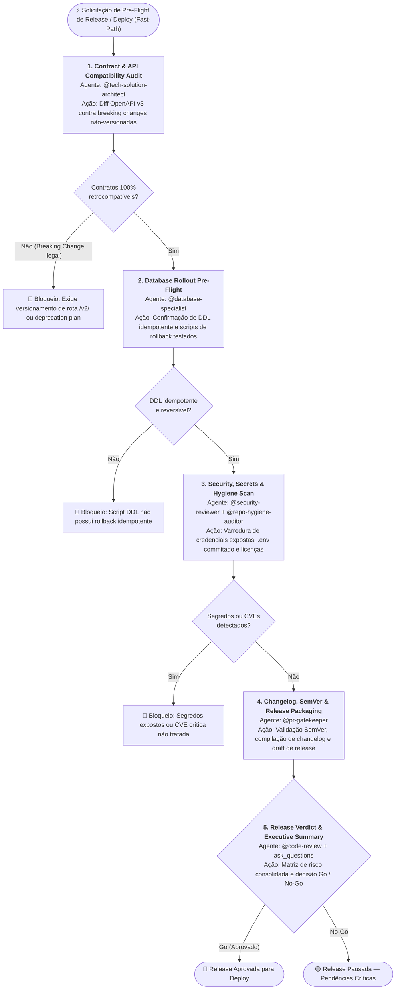

#### Cadeia Sequencial e Papéis:
1. **Estado 1 — Contract & API Compatibility Audit (`@tech-solution-architect`)**:
   - *Ação*: Validação de diffs de especificação OpenAPI v3 / contratos de integração entre a versão atual e a release pretendida. Verificação estrita de *breaking changes* não versionadas contra clientes consumidores.
2. **Estado 2 — Database Rollout Pre-Flight & Rollback Check (`@database-specialist`)**:
   - *Ação*: Auditoria de scripts Flyway/DDL pendentes: confirmação de idempotência, ausência de `DROP` destrutivo sem fase de deprecação e existência de scripts de reversão (rollback) testados.
3. **Estado 3 — Security, Secrets & Repository Hygiene Scan (`@security-reviewer` + `@repo-hygiene-auditor`)**:
   - *Ação*: Varredura de diffs contra credenciais vazadas, variáveis `.env` expostas, pacotes de licença incompatível e conformidade de arquivos essenciais (`README`, `CHANGELOG`, `.gitignore`).
4. **Estado 4 — Changelog, SemVer & Release Packaging (`@pr-gatekeeper`)**:
   - *Ação*: Compilação das alterações agrupadas por convenção Conventional Commits (`feat`, `fix`, `refactor`, `perf`), validação do bump SemVer (`major`, `minor`, `patch`) e atualização formal do `CHANGELOG.md`.
5. **Estado 5 — Release Verdict & Executive Summary (`@code-review` + `ask_questions`)**:
   - *Ação*: Emissão da Matriz de Risco Executiva de Release e checkpoint formal de decisão humana (Go / No-Go / Contingência) via `ask_questions`.

#### Typed State Bag (`workflow_state`):
```yaml
workflow_state:
  release_versao: "v2.8.0"
  semver_tipo: "major | minor | patch"
  contract_compatibility_status: "compativel | breaking_changes_versionadas"
  database_preflight_status: "aprovado_com_rollback | pendencia_ddl"
  security_secrets_scan: "limpo | segredos_detectados"
  repo_hygiene_status: "conforme | inconforme"
  changelog_atualizado: true
  veredito_final: "GO | NO_GO | PENDENCIA"
```

---

### 3.9 WORKFLOW 9: `WORKFLOW-PROMPT-SYNTHESIS` (Síntese e Refino de Prompts para Sessões Limpas)

> **Objetivo**: Conduzir o refinamento estrutural de prompt, enriquecer com mineração determinística de contexto no codebase e sintetizar o prompt perfeito com tags XML em bloco de código Markdown pronto para inicializar uma nova sessão limpa.
> **Gatilho de Entrada**: Invocação via `/craft-prompt`, intenção explícita do usuário de sintetizar ou refinar prompt para um novo chat, ou comando de preparação de contexto pré-execução.
> **Fast-Path**: Sim (dispensa Fast-Chaining prévio; ingressa diretamente no Estado 1).

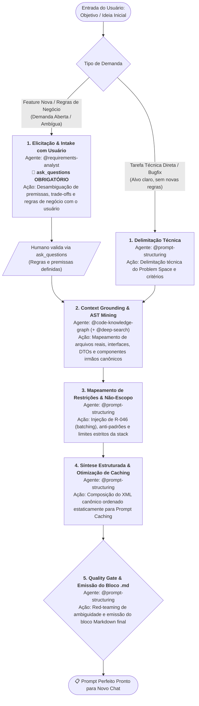

#### Cadeia Sequencial e Papéis:
1. **Estado 1 — Elicitação & Intake com Usuário (`@requirements-analyst` para Negócio / `@prompt-structuring` para Técnico)**:
   - *Via Funcional (Feature / Negócio / Demanda Aberta)*: O `@requirements-analyst` é o agente condutor desta etapa. Aplica *Five Whys* se houver *solution-jumping* precoce e aciona compulsoriamente `ask_questions` (1 a 3 perguntas estruturadas com opções + campo livre) para desambiguar regras de negócio, fluxos de aprovação, permissões e critérios com o usuário (R-027 / Invariante 19). É terminantemente proibido deduzir premissas ou alucinar requisitos de negócio sem confirmação humana.
   - *Via Técnica (Refactor / Bugfix / Tarefa Direta)*: Se a tarefa já possuir alvo e escopo técnicos claros sem novas regras de domínio, o `@prompt-structuring` atua diretamente na delimitação do Problem Space técnico, critérios e não-escopo preliminares.
2. **Estado 2 — Context Grounding & AST Mining (`@code-knowledge-graph` + `@deep-search`)**:
   - *Ação*: O `@code-knowledge-graph` é o agente executor OBRIGATÓRIO desta etapa (R-045 / Invariante 18). Ele DEVE ser invocado formalmente via `run_subagent(agentName: 'code-knowledge-graph', ...)` para extrair deterministamente os caminhos reais de arquivos (`<grounded_files>`), interfaces compartilhadas, contratos de DTOs e identificação de componentes irmãos canônicos homologados (protocolo *Canonical Sibling First*). É terminantemente proibido substituir a invocação do subagente por scripts manuais de varredura `fs` no sandbox via `ctx_execute` (Smell 2.26). Se houver novas dependências de biblioteca externa, o `@deep-search` é acionado via `run_subagent` para obter documentação oficial, versões e contratos reais.
3. **Estado 3 — Mapeamento de Restrições & Não-Escopo (`@prompt-structuring`)**:
   - *Ação*: Definição do Não-Escopo explícito (o que o agente executor NÃO deve alterar, bibliotecas proibidas, garantias de compatibilidade reversa). Injeção compulsória de governança de lote (*Single-Turn Batching* / R-046) e regras inegociáveis da stack do projeto alvo (ex.: convenções de modernização, injeções padronizadas, reatividade estrita, zero estilos inline arbitrários).
4. **Estado 4 — Síntese Estruturada & Otimização de Caching (`@prompt-structuring`)**:
   - *Ação*: Montagem do prompt canônico final utilizando tags XML semânticas (`<role>`, `<project_context>`, `<grounded_files>`, `<task>`, `<acceptance_criteria>`, `<constraints>`, `<execution_protocol>`, `<output_format>`). Otimização de ordem dos tokens para alinhamento com Prompt Caching (conteúdo estático e de convenções no topo; especificidades variáveis da task na cauda).
5. **Estado 5 — Quality Gate & Emissão do Bloco .md (`@prompt-structuring`)**:
   - *Ação*: Avaliação crítica de fechamento (Red-Teaming analítico): verificação de contradições, remoção de instruções de sobre-verificação que degradam modelos de raciocínio frontier e validação do template. Emissão do prompt final encapsulado em bloco de código Markdown (`.md`), pronto para ser colado em um novo chat.

#### Typed State Bag (`workflow_state`):
```yaml
workflow_state:
  workflow_id: "WORKFLOW-PROMPT-SYNTHESIS"
  etapa_atual: 1  # 1..5
  prompt_alvo:
    intencao_original: "<descricao-ou-objetivo-inicial-da-tarefa>"
    stack_detectada: "<stack-alvo-detectada | ex: angular | spring-boot | python>"
    arquivos_grounded:
      - "<caminho/relativo/arquivo-alvo-1.ext>"
      - "<caminho/relativo/modelo-ou-contrato.ext>"
    irmao_canonico_referencia: "<caminho/relativo/componente-irmao-canonico.ext>"
    criterios_aceite:
      - "<criterio-de-aceite-funcional-invest-1>"
      - "<criterio-de-aceite-qualidade-ou-teste-2>"
    restricoes_nao_escopo:
      - "<restricao-negativa-ou-nao-escopo-1>"
      - "<convencao-obrigatoria-ou-anti-padrao-2>"
    formato_saida: "markdown_code_block"
    bloco_md_gerado: true
```

#### Invariante de Visibilidade Progressiva e Painel de Evidências (Anti-Blackbox Execution):
É expressamente vedado ao agente sintetizador (`@prompt-structuring` / `/craft-prompt`) emitir o prompt final sem antes apresentar o Painel de Evidências detalhado com os resultados individuais de cada uma das 5 etapas no chat (Elicitação no Problem Space, Mineração de Contexto & Grounding no Codebase, Mapeamento de Restrições/Não-Escopo, Síntese Estruturada para Caching e Checklist do Quality Gate). A execução silenciosa ("blackbox") que oculta os achados intermediários e exibe apenas o bloco final solto constitui violação de visibilidade operacional.

- *Sub-rotina 1b (Checkpoint Humano Obrigatório em Ambiguidade — Gate Pattern R-041 / Invariante 19)*: Em qualquer demanda funcional com ambiguidade de domínio ou múltiplos caminhos de negócio viáveis, o workflow DEVE compulsoriamente suspender a execução na Etapa 1 e apresentar as dúvidas e opções de regras de negócio para validação humana explícita via `ask_questions`. É expressamente vedado avançar para a Etapa 2 sem a resposta do solicitante.

---

## 4. Integração com o Protocolo de Handoff (`workflow_tracking`)

Para garantir que a cadeia sequencial seja seguida à risca e nenhum agente desvie do fluxo, todo handoff entre agentes em um workflow ativo transporta o bloco `workflow_tracking` dentro do `handoff_payload`:

```yaml
handoff_payload:
  versao: "1.2"
  para: "specialist-unit-test-writer"
  motivo: "Hipótese de bug confirmada — criar teste de regressão que falhe"
  emissor:
    nome: "bug-triage"
    versao: "1.1.0"
    modelo_llm: "Claude Sonnet 5"
    timestamp: "2026-09-10T12:00:00Z"
  workflow_tracking:
    workflow_id: "WORKFLOW-BUG-FIX"
    etapa_atual: 2
    total_etapas: 5
    nome_etapa: "red_test_reproduction"
    proximos_agentes_permitidos:
      - "specialist-bug-fixer"
    politica_desvio: "strict"  # proíbe delegar fora da lista sem evento R-042
  contexto:
    solicitacao_original: "Botão de login quebra com erro 500 ao clicar"
    trabalho_realizado: "Isolado NullPointerException no AuthService linha 45"
    descobertas_chave:
      - "Token JWT nulo ao submeter formulário sem provedor federado"
    artefatos:
      - "src/app/core/services/auth.service.ts"
  proximos_passos_sugeridos:
    - "Escrever spec isolado simulando payload sem provider"
```

---

## 5. Regras de Não-Desvio (Invariantes de Execução)

1. **Invariante de Fast-Path**: Se a mensagem de entrada descreve um bug, erro, crash ou falha visual de layout, o `@agent-router` NUNCA deve invocar `@prompt-structuring`. O ingresso no `WORKFLOW-BUG-FIX` via `@bug-triage` é mandatório.
2. **Invariante de Teste Prévio (TDD)**: No `WORKFLOW-BUG-FIX`, é terminantemente proibido invocar o `bug-fixer` sem antes ter o teste automatizado que reproduza a falha (Estado 2 obrigatório antes do Estado 3).
3. **Invariante de Grafo em Refatoração**: No `WORKFLOW-REFACTORING`, o `@refactor-planner` NUNCA deve realizar varredura manual de pastas; deve invocar compulsoriamente o `@code-knowledge-graph` para cálculo do blast radius (R-045).
4. **Invariante Anti Beco Sem Saída (R-047)**: Ao concluir seu estado, o agente ativo DEVE despachar via `run_subagent` para a próxima etapa do workflow OU invocar `ask_questions` caso dependa de decisão humana.
5. **Invariante de Deriva e Reset de Workflow (R-042 / R-052)**: Caso o usuário mude o escopo no meio do workflow (ex.: durante um bugfix, peça uma nova funcionalidade), ou **ao concluir qualquer workflow com sucesso**, o agente ativo encerra seu ciclo e DEVE acionar retorno imediato ao `@agent-router` com `motivo: "deriva_de_intencao"` ou `"conclusao_de_workflow_anterior"`. É expressamente proibido ao último agente ativo reter a sessão para a próxima solicitação (Anti Sticky-Agent).
6. **Invariante de Separação Declarador/Executor em Circuit Breaker**: Nenhum agente estritamente read-only/advisory (`runtime-verifier`, `@code-review`, `@refactor-planner`, `@agent-auditor`, etc. — mesma classe validada em `test_readonly_advisory_agents_do_not_contain_mutation_tools`) pode executar a mutação de reversão (`git checkout`/`git restore`) de um Circuit Breaker. Esse agente apenas DETECTA e DECLARA o veredito; a execução física é sempre delegada, via `run_subagent`, ao especialista com ferramentas de edição/terminal que originou o diff (`specialist-bug-fixer`/`specialist-test-fixer` em Workflow 1; domain router/specialist por nó do DAG em Workflow 2). Violação desta invariante é tratada com a mesma severidade de uma violação de contrato de agent (ver § 8.1, item 2).
7. **Invariante de Resolução de Papel Genérico**: Nenhum agente invoca `run_subagent` com um nome `specialist-<papel>` literal — todo despacho tático passa primeiro pela resolução do domain router para o `id` concreto do catálogo (§ 1.3).
8. **Invariante de Colaboração Dual-Stack em Migração (WORKFLOW-FRAMEWORK-MIGRATION)**: Em toda migração **cross-stack** (stack de origem legada ≠ stack de destino moderno — ex.: `ejb-router`→`spring-boot-router`, `struts-router`→`spring-boot-router`), o `@tech-solution-architect` NUNCA elabora blueprint ou renderiza o bloco `### 🗺️ Pipeline de Execução do Workflow` citando apenas o domain router de destino. Ambos os routers (origem e destino) DEVEM constar explicitamente como agentes participantes em TODAS as etapas do pipeline (1 a 6), com o router de origem atuando como oráculo de comportamento legado até o sign-off da auditoria reversa de órfãos pós-migração (Estado 6). Omitir o router de origem é tratado como a mesma classe de violação que pular um estado do workflow (ver § 3.7, item "Invariante de Colaboração Dual-Stack").
9. **Invariante de Exclusividade do Motor de Grafo em Migração (R-045)**: `@code-knowledge-graph` é co-agente OBRIGATÓRIO (nunca sub-rotina meramente permitida) nas Etapas 1, 3, 4, 5 e 6 do `WORKFLOW-FRAMEWORK-MIGRATION`. `@tech-solution-architect` e os domain routers NUNCA mapeiam blast radius, dependências, ciclos ou auditoria reversa de símbolos manualmente durante uma migração — toda essa análise estrutural é delegada via `run_subagent` ao `@code-knowledge-graph`, com o mesmo rigor já aplicado em `WORKFLOW-REFACTORING` (Invariante 3). O `sign_off_code_knowledge_graph` (zero ciclos/dead-code novos e zero órfãos detectados) é pré-requisito do veredito final na Etapa 6, junto ao sign-off do domain router de origem.
10. **Invariante de Fallback Proibido do Motor de Grafo (Falha de Tool Call)**: Se a chamada de tool do `@code-knowledge-graph` (ex.: `module_map`, `query`, `impact_analysis`) **falhar ou retornar erro/timeout**, é terminantemente proibido a qualquer agente (incluindo `@tech-solution-architect` e domain routers) recorrer a varredura manual substituta (`list_dir`, `grep`/`grep_search` em massa no repositório inteiro, leitura sequencial de dezenas de arquivos) como compensação silenciosa. A única ação permitida é: **(a)** retry da mesma consulta ao `@code-knowledge-graph` (build incremental se o índice estiver desatualizado) ou **(b)** declarar explicitamente ao usuário via relatório de 3 linhas (Causa/Local/Ação sugerida) que a análise estrutural determinística falhou e aguardar decisão (`ask_questions`) antes de prosseguir com qualquer heurística manual. Tratar a falha do tool como "gap silencioso" e prosseguir com grep manual é a mesma classe de violação de R-045 (ver `regr-023` e `regr-028`).
11. **Invariante de Checkpoint Humano Não-Satisfeito por Continuação Genérica**: Em qualquer Etapa marcada como *Checkpoint Humano Obrigatório* (ex.: Estado 2b de `WORKFLOW-FRAMEWORK-MIGRATION`, Estado 3b de `WORKFLOW-FEATURE-DEVELOPMENT`, Estado 2b de `WORKFLOW-GOVERNANCE-MAINTENANCE`), se o Dashboard/relatório apresentado contiver **qualquer item marcado `⚠️`, `[⏳ PENDENTE]` ou `[⚠️ DIVERGENTE]`** exigindo decisão de negócio ou arquitetura, uma resposta genérica do usuário ("prossiga", "continue", clique em sugestão automática de continuação) **NUNCA** é interpretada como aprovação explícita das decisões pendentes específicas. O agente ativo DEVE, antes de avançar para a próxima etapa mutativa: **(a)** re-listar objetivamente cada item pendente com opções concretas (ex.: manter `[PENDENTE]` para implementação nesta fase vs. reclassificar `[DESACOPLADO]` com justificativa) via `ask_questions`; **(b)** só então prosseguir com a decisão explicitamente escolhida. É proibido o agente decidir unilateralmente a reclassificação de itens `⚠️`/`[⏳ PENDENTE]` da Matriz De-Para com base apenas em um "prossiga" genérico.
12. **Invariante de Re-Banner em Transição de Fase (Extensão de R-048)**: Toda transição de um agente estritamente Advisory/Analítico (ex.: `@tech-solution-architect` na Etapa 1/2) para um agente ou papel que passa a **mutar arquivos** (codemod, implementação, criação de entidade/repositório) DEVE emitir um novo banner `Agente Ativo: <domain-router-DESTINO ou specialist-feature-developer>` **antes** da primeira tool call mutativa daquela etapa — mesmo dentro do mesmo workflow e da mesma sessão. É proibido a mesma resposta encadear dezenas de tool calls de implementação sob a identidade do agente analítico anterior sem declarar explicitamente o handoff de execução (mesma classe de violação de `regr-024`).
13. **Invariante de Exaustão de Símbolos e Tríplice Redundância Pós-Migração (WORKFLOW-FRAMEWORK-MIGRATION)**: É terminantemente proibido:
    **(a) Avançar para codemod sem Symbol Exhaustion de 100%**: A Matriz De-Para (Etapa 2) deve ter correspondência auditada mecanicamente via `@code-knowledge-graph` para 100% dos métodos públicos/privados, queries e nós condicionais do legado. Proibido inventário parcial por mera amostragem de happy path.
    **(b) Aceitar código com omissão silenciosa de AST**: A Etapa 3 exige o Anti-Omission AST Validator no sandbox para comprovar que branches de exceção e tabelas de persistência secundária foram portadas.
    **(c) Considerar migração concluída sem a Etapa 6**: Nenhuma migração pode ser dada como concluída ou aprovada para cutover sem passar pela Tríplice Camada de Redundância no Estado 6 (Reverse Orphan Audit, Mutation Parity Resilience e Differential Shadow Replay), com emissão formal do Certificado de Paridade Total em `docs/migrations/certificado-paridade-<alvo>.md`.
14. **Invariante de RCA Estruturado, Dupla Evidência e Mini Mutation em Bugfix (WORKFLOW-BUG-FIX)**: É terminantemente proibido:
    **(a) Formular hipótese causal sem dupla evidência**: Toda RCA exige formalização (5 Whys / Fishbone) e correlação obrigatória de no mínimo **2 fontes independentes de evidência técnica observável** (*evidence before hypothesis* — ex.: stack trace + log em runtime; ou payload de rede HTTP + teste isolado reprodutível; ou métrica de observabilidade APM + call graph determinístico).
    **(b) Omitir a classificação de falha**: Toda ocorrência deve ser classificada explicitamente como `flaky` (instabilidade intermitente/race condition) vs `regressao_real`.
    **(c) Aplicar fix sem declarar blast radius e rollback**: O Estado 3 exige compulsoriamente a declaração prévia de `blast_radius_estimado` e `rollback_plan` no `workflow_state` antes de emitir qualquer diff cirúrgico.
    **(d) Aceitar falso-verde no teste de regressão**: O Estado 4 exige mini mutation-check proporcional ao risco (1 a 3 mutantes sintéticos injetados) para comprovar que o Red Test elimina os mutantes. Para defeitos críticos, o Estado 5 exige observação pós-fix/canary com critérios de telemetria definidos.
15. **Invariante de Contract Testing, Redundância Proporcional e Rollback com Blast Radius Revertido em Refatoração (WORKFLOW-REFACTORING)**: É terminantemente proibido:
    **(a) Refatorar contratos compartilhados sem Contract Testing**: Alterações em APIs públicas ou limites de bounded context exigem compulsoriamente testes de contrato no Estado 2a (Pact-style consumer-driven ou OpenAPI / JSON Schema Diff).
    **(b) Dispensar redundância em blast radius médio/alto**: Se o blast radius for moderado ou alto, o Estado 5 exige compulsoriamente a camada de redundância proporcional (auditoria reversa de símbolos via `@code-knowledge-graph`, mini mutation gate e differential replay leve em rotinas determinísticas).
    **(c) Reversão sem métrica de restauração**: Em caso de ativação do Circuit Breaker / Rollback (Estado 5b), é mandatório calcular e registrar formalmente o `blast_radius_revertido` no `workflow_state` e no handoff de escalonamento.

---

16. **Invariante de Proibição Estrita de Terceirização ao Usuário em Etapas Analíticas e Diagnósticas (R-057 / Smell 2.25)**: É expressamente vedado a qualquer agente participante de etapas analíticas, diagnósticas, de auditoria ou triagem (ex.: Etapa 1 de `WORKFLOW-BUG-FIX` com `@bug-triage`, Etapa 1 de `WORKFLOW-GOVERNANCE-MAINTENANCE` com `@agent-auditor`, Etapa 1 de `WORKFLOW-TECHNICAL-ANALYSIS`, etc.), ao constatar falta de ferramentas de escrita ou identificar a necessidade de alterações de código ou governança, encerrar seu turno emitindo instruções para que o usuário execute edições manuais. O agente analítico DEVE compulsoriamente avançar para o checkpoint de aprovação ou transferir deterministamente o controle para o agente executor competente (ex.: `@governance-maintainer`, `@bug-fixer`, `@feature-developer`).

17. **Invariante de Visibilidade Progressiva e Painel de Evidências em Síntese de Prompt (WORKFLOW-PROMPT-SYNTHESIS)**: É terminantemente proibido:
    **(a) Execução Blackbox**: Emitir o prompt final diretamente ou apenas a listagem de checkboxes [✅] sem apresentar o Painel de Evidências por Etapa com o detalhamento de cada uma das 5 etapas (Elicitação no Problem Space, Grounding de Arquivos Reais, Mapeamento de Não-Escopo, Síntese de Caching e Quality Gate).
    **(b) Alucinação de caminhos**: Listar arquivos em `<grounded_files>` sem verificação determinística de existência real no workspace via `@code-knowledge-graph` ou inspeção de contexto.
    **(c) Invasão de Solution Space**: Ditar classes internas, algoritmos ou implementações técnicas detalhadas dentro do Problem Space, retirando a autonomia técnica do agente especialista que atuará no novo chat.

---

18. **Invariante de Invocação Compulsória do Motor de Grafo em Síntese de Prompt (WORKFLOW-PROMPT-SYNTHESIS / R-045)**: É terminantemente proibido:
    **(a) Bypass de subagente com scripts manuais no sandbox**: Na Etapa 2 (Context Grounding & AST Mining), o `@code-knowledge-graph` é o agente executor OBRIGATÓRIO e DEVE ser acionado via `run_subagent(agentName: 'code-knowledge-graph', ...)`. É expressamente vedado ao prompt `/craft-prompt` ou ao `@prompt-structuring` executar scripts manuais de varredura no sandbox (`ctx_execute` com `fs.readdirSync`/`fs.readFileSync` ou `walk(dir)`) para contornar a chamada do subagente (violação direta de R-045 / RNF-004 e Smell 2.26).
    **(b) MCP Tool Chaining no chat**: Encadear dezenas de chamadas unitárias sequenciais de `ctx_execute` no chat para explorar diretórios; toda análise estrutural e descoberta de dependências pertence com exclusividade ao motor determinístico de grafo.
    **(c) Falsa declaração de execução de subagente**: Declarar `• [✅] Etapa 2: Context Grounding & AST Mining → @code-knowledge-graph` no chat sem que o subagente tenha sido de fato invocado e executado via `run_subagent`.

---

19. **Invariante de Interrupção Compulsória por Ambiguidade e Proibição de Alucinação de Requisitos (WORKFLOW-PROMPT-SYNTHESIS / R-027)**: É terminantemente proibido:
    **(a) Inferência e Alucinação de Regras de Negócio**: Em solicitações que envolvam novas funcionalidades, telas ou regras de negócio abertas, o agente participante não pode deduzir, supor ou alucinar fluxos funcionais, critérios de aceitação, regras de aprovação ou entidades sem validação explícita do usuário.
    **(b) Bypass do Checkpoint Humano em Ambiguidade**: A interação com o usuário na Etapa 1 via `ask_questions` é OBRIGATÓRIA e BLOQUEANTE quando a demanda possuir ambiguidade de domínio ou múltiplos caminhos de negócio viáveis (R-027). A palavra "Opcional" é expressamente proibida para este checkpoint. O workflow não pode avançar para a Etapa 2 sem as respostas do solicitante.
    **(c) Invasão de Papel**: A elicitação, desambiguação e estruturação de requisitos de negócio e critérios de aceitação em demandas funcionais cabe com exclusividade ao `@requirements-analyst`, cabendo ao `@prompt-structuring` atuar na Etapa 1 apenas para tarefas estritamente técnicas ou após a elicitação de negócio, conduzindo as Etapas 3 a 5 (mapeamento de não-escopo, Prompt Caching, injeção de governança e emissão do bloco `.md`).

---

20. **Invariante de Blueprint Técnico e Decomposição Obrigatórios em Features Complexas (WORKFLOW-FEATURE-DEVELOPMENT / R-058 / Smell 2.27)**: É terminantemente proibido:
    **(a) Bypass Prematuro para Implementadores de Código**: Despachar solicitações de novas funcionalidades que envolvam novo schema de persistência (mesmo Firestore/BaaS), máquina de estados finita com 3+ transições, concorrência/transações atômicas ou integração de infraestrutura (plugins nativos, push notifications) diretamente para domain routers (`@angular-router`, `@spring-boot-router`, etc.) ou executores de código sem a passagem compulsória pelo Estado 3 (`@tech-solution-architect`) para elaboração de Technical Blueprint e aprovação no Checkpoint 3b (`ask_questions`).
    **(b) Despejo de Lacunas Arquiteturais (Anti-Gap Dumping)**: O `@agent-router` identificar lacunas arquiteturais conceituais (ex.: matriz de papéis/permissões, formato de payload/coleções de banco, escopo de tokens de push notification) e despejá-las no bloco de "Lacunas para handoff" para que o especialista de implementação resolva no improviso durante a codificação.
    **(c) Omissão do `@feature-planner` em Demandas Multi-Task**: Omitir a decomposição formal de subtasks atômicas `[S]` e `[P]` quando a feature contiver 3 ou mais frentes de trabalho ou tarefas interdependentes, deixando a ordem de implementação a critério arbitrário do executor tático.


## 6. Padrão de Visibilidade no Chat (Roadmap Visual de Execução — Anti-Cegueira)

Para que o usuário nunca fique no escuro quanto ao fluxo em andamento, o `@agent-router` (ao despachar o workflow) e cada agente participante (ao reportar sua etapa) **DEVEM obrigatoriamente** renderizar o bloco visual `### 🗺️ Pipeline de Execução do Workflow` no início de sua mensagem.

### 6.1 Marcadores de Status Padronizados
- `[✅]` **Concluído**: Etapa finalizada com sucesso e evidência registrada.
- `[▶]` **Em Andamento (Atual)**: Etapa sob execução do agente ativo no turno.
- `[⏳]` **Pendente**: Etapa futura a ser executada na sequência.

---

### 6.2 Templates Visuais por Workflow

#### WORKFLOW 1: `WORKFLOW-BUG-FIX` (5 etapas)
```markdown
### 🗺️ Pipeline de Execução: WORKFLOW-BUG-FIX (5 etapas)
- [▶] **Etapa 1: Triagem & RCA Estruturado (2 Fontes)** → `@bug-triage` *(Em Andamento: 5 Whys/Fishbone, evidência dupla e classificação flaky vs regressão real)*
- [⏳] **Etapa 2: Red Test de Caracterização & Baseline** → `specialist-unit-test-writer` *(Pendente: teste automatizado que falha comprovando o bug)*
- [⏳] **Etapa 3: Correção Cirúrgica Mínima** → `specialist-bug-fixer` *(Pendente: blast radius estimado & rollback plan declarados, diff cirúrgico R-002/R-046)*
- [⏳] **Etapa 4: Validação Green Test & Mini Mutation-Check** → `runtime-verifier` *(Pendente: 100% testes passando, linter limpo e mini mutation anti falso-verde)*
- [⏳] **Etapa 5: Quality Gate, Observação Pós-Fix / Canary & Quality Review Loop (§ 1.5)** → `@code-review` / `@pr-gatekeeper` *(Pendente: revisão final, autorreflexão R-033, loop de qualidade até 3x se achados não-bloqueantes e canary para bugs críticos)*
```

#### WORKFLOW 2: `WORKFLOW-REFACTORING` (5 etapas)
```markdown
### 🗺️ Pipeline de Execução: WORKFLOW-REFACTORING (5 etapas)
- [▶] **Etapa 1: Mapeamento de Regras Vigentes** → `@business-rules-extractor` *(Em Andamento: extração de ground truth em .md)*
- [⏳] **Etapa 2: Blast Radius & Contract Testing** → `@code-knowledge-graph` + `@tech-solution-architect` *(Pendente: grafo determinístico via @optave/codegraph e Contract Testing Pact-style)*
- [⏳] **Etapa 3: Plano Macro Mikado & Safety Net** → `@refactor-planner` + `@test-strategy` *(Pendente: árvore Mikado, threshold de caracterização e rollback planejado)*
- [⏳] **Etapa 4: Execução Incremental em Lote** → `Domain Router / Specialists` *(Pendente: micro-lotes com Gate Out por nó R-046)*
- [⏳] **Etapa 5: Validação de Regras, Redundância Proporcional & Quality Review Loop (§ 1.5)** → `@business-rules-extractor` + `@code-review` *(Pendente: ground truth 100% + auditoria reversa de símbolos + mini mutation gate + loop de qualidade até 3x + blast radius revertido se falha)*
```

#### WORKFLOW 3: `WORKFLOW-TECHNICAL-ANALYSIS` (3 etapas)
```markdown
### 🗺️ Pipeline de Execução: WORKFLOW-TECHNICAL-ANALYSIS (3 etapas)
- [▶] **Etapa 1: Despacho para Especialista Analítico** → `@<especialista>` *(Em Andamento: direcionamento direto)*
- [⏳] **Etapa 2: Coleta Determinística Read-Only** → `@<especialista>` *(Pendente: modo Advisory sem mutação de código)*
- [⏳] **Etapa 3: Síntese Técnica & Próximo Passo** → `@<especialista>` *(Pendente: relatório estruturado e handoff R-047)*
```

#### WORKFLOW 4: `WORKFLOW-FEATURE-DEVELOPMENT` (6 etapas)
```markdown
### 🗺️ Pipeline de Execução: WORKFLOW-FEATURE-DEVELOPMENT (6 etapas)
- [▶] **Etapa 1: Prompt Structuring** → `@prompt-structuring` *(Em Andamento: refinamento <task>/<context>/<constraints>)*
- [⏳] **Etapa 2: Elicitação de Requisitos** → `@requirements-analyst` / `@feature-planner` *(Pendente: critérios de aceitação BDD/EARS)*
- [⏳] **Etapa 3: Technical Blueprint & Contratos** → `@tech-solution-architect` *(Pendente: OpenAPI, modelo de dados e divisão por stack)*
- [⏳] **Etapa 4: Estratégia de Testes (TDD)** → `@test-strategy` *(Pendente: matriz de riscos e casos de borda)*
- [⏳] **Etapa 5: Implementação Domain TDD & Paridade UI** → `Domain Routers & Specialists` *(Pendente: Red-Green-Refactor + Handoff UI 5a->5b)*
- [⏳] **Etapa 6: Duplo Quality Gate, Quality Review Loop (§ 1.5) & PR Preparation** → `Gate 1 (Lógica/Sec) + Gate 2 (UI Parity) → @pr-gatekeeper` *(Pendente: validação dupla, loop de qualidade até 3x se achados não-bloqueantes e PR)*
```

#### WORKFLOW 5: `WORKFLOW-GOVERNANCE-MAINTENANCE` (4 etapas)
```markdown
### 🗺️ Pipeline de Execução: WORKFLOW-GOVERNANCE-MAINTENANCE (4 etapas)
- [▶] **Etapa 1: Diagnóstico Read-Only ou Pesquisa Prévia** → `@agent-auditor` / `@repo-hygiene-auditor` / `@deep-search` *(Em Andamento: auditoria estrutural e pesquisa prévia)*
- [⏳] **Etapa 2: Checkpoint de Aprovação Humana** → `ask_questions` *(Pendente: aprovação explícita do plano)*
- [⏳] **Etapa 3: Execução Governada em Lote** → `@governance-maintainer` / `@governance-factory` *(Pendente: sincronização atômica SSOT R-015/R-046)*
- [⏳] **Etapa 4: Quality Gate de Governança & Quality Review Loop (§ 1.5)** → `pytest (Tier 1)` / `@agent-auditor` *(Pendente: validação determinística de smells, routing, isolamento e loop de qualidade até 3x)*
```

#### WORKFLOW 6: `WORKFLOW-DEPENDENCY-VULNERABILITY-REMEDIATION` (5 etapas)
```markdown
### 🗺️ Pipeline de Execução: WORKFLOW-DEPENDENCY-VULNERABILITY-REMEDIATION (5 etapas)
- [▶] **Etapa 1: Triagem de Vulnerabilidade & Advisory** → `@security-reviewer` *(Em Andamento: análise de CVE, CVSS e changelog)*
- [⏳] **Etapa 2: Mapeamento de Blast Radius da Dependência** → `@code-knowledge-graph` *(Pendente: mapa de impacto e consumidores R-045)*
- [⏳] **Etapa 3: Bump de Manifesto & Sincronização de Lockfile** → `specialist-developer` *(Pendente: atualização de dependências e lockfile)*
- [⏳] **Etapa 4: Adaptação de Breaking Changes & Compilação** → `specialist-bug-fixer` / `specialist-test-fixer` *(Pendente: compatibilização de APIs e compilação limpa)*
- [⏳] **Etapa 5: Verificação de Regressão, SCA & Quality Review Loop (§ 1.5)** → `runtime-verifier` + `@code-review` + `@security-reviewer` *(Pendente: 100% testes verdes, scan SCA limpo e loop de qualidade até 3x)*
```

#### WORKFLOW 7: `WORKFLOW-FRAMEWORK-MIGRATION` (6 etapas — Cross-Stack exige Router Origem + Destino + Grafo)
```markdown
### 🗺️ Pipeline de Execução: WORKFLOW-FRAMEWORK-MIGRATION (6 etapas)
- [▶] **Etapa 1: Pre-Flight Assessment, 5D & Symbol Exhaustion** → `@tech-solution-architect` + `@code-knowledge-graph` (obrigatório) + `@domain-router-ORIGEM` (ex.: `@ejb-router`) + `@business-rules-extractor` *(Em Andamento: inventário 100% de símbolos/AST + blast radius/ciclos do legado + extração 5D)*
- [⏳] **Etapa 2: Migration Phasing & Blueprint com Matriz De-Para** → `@tech-solution-architect` + `@domain-router-ORIGEM` + `@domain-router-DESTINO` (ex.: `@spring-boot-router`) *(Pendente: mapeamento de 100% dos símbolos na matriz + fases B1..BN + checkpoint humano)*
- [⏳] **Etapa 3: Codemod & Transformação em Lote com Anti-Omission** → `@domain-router-DESTINO` (executor) + `@domain-router-ORIGEM` (oráculo consultivo contínuo) + `@code-knowledge-graph` (obrigatório, blast radius por lote) *(Pendente: codemods no sandbox R-046 + validação anti-omissão AST)*
- [⏳] **Etapa 4: Refinamento & Paridade Funcional (Dual-Verification Expandido)** → `@domain-router-DESTINO` + `@domain-router-ORIGEM` + `@business-rules-extractor` + `@code-knowledge-graph` (obrigatório, find_cycles/dead-code) *(Pendente: Golden Master + 100% regras de negócio cobertas + zero ciclos/dead-code novos)*
- [⏳] **Etapa 5: Baseline & Quality Gate de Migração** → `runtime-verifier` + `@code-review` + sign-off de `@domain-router-ORIGEM` + sign-off de `@code-knowledge-graph` *(Pendente: build limpo, testes verdes e PR preliminar)*
- [⏳] **Etapa 6: Post-Migration Verification, Redundancy Gate & Quality Review Loop (§ 1.5)** → `@code-review` + `@test-strategy` + `@business-rules-extractor` + `@runtime-verifier` *(Pendente: tríplice auditoria: reverse orphan audit + mutation parity resilience + differential shadow replay e loop de qualidade até 3x)*
```

#### WORKFLOW 8: `WORKFLOW-RELEASE-READINESS` (5 etapas)
```markdown
### 🗺️ Pipeline de Execução: WORKFLOW-RELEASE-READINESS (5 etapas)
- [▶] **Etapa 1: Contract & API Compatibility Audit** → `@tech-solution-architect` *(Em Andamento: diff OpenAPI v3 contra breaking changes)*
- [⏳] **Etapa 2: Database Rollout Pre-Flight** → `@database-specialist` *(Pendente: DDL idempotente e scripts de rollback testados)*
- [⏳] **Etapa 3: Security, Secrets & Repository Hygiene Scan** → `@security-reviewer` + `@repo-hygiene-auditor` *(Pendente: varredura de credenciais, .env e licenças)*
- [⏳] **Etapa 4: Changelog, SemVer & Release Packaging** → `@pr-gatekeeper` *(Pendente: validação SemVer, compilação de changelog e draft de release)*
- [⏳] **Etapa 5: Release Verdict & Executive Summary** → `@code-review` + `ask_questions` *(Pendente: matriz de risco consolidada e decisão Go/No-Go)*
```
**Nota obrigatória (Invariantes 8 e 9, § 5)**: se a migração for cross-stack, `@domain-router-ORIGEM` NUNCA é omitido do bloco acima após a Etapa 1 — ele permanece listado até a Etapa 5. `@code-knowledge-graph` é co-agente obrigatório (R-045) nas Etapas 1, 3, 4 e 5 — nunca apenas sub-rotina opcional.

#### WORKFLOW 9: `WORKFLOW-PROMPT-SYNTHESIS` (5 etapas)
```markdown
### 🗺️ Pipeline de Execução: WORKFLOW-PROMPT-SYNTHESIS (5 etapas)
- [✅] **Etapa 1: Elicitação & Problem Space** → `@requirements-analyst` (Negócio / `ask_questions`) ou `@prompt-structuring` (Técnico)
- [✅] **Etapa 2: Context Grounding & AST Mining** → `@code-knowledge-graph`
- [✅] **Etapa 3: Mapeamento de Restrições & Não-Escopo** → `@prompt-structuring`
- [✅] **Etapa 4: Síntese Estruturada & Otimização de Caching** → `@prompt-structuring`
- [✅] **Etapa 5: Quality Gate & Emissão do Bloco .md** → `@prompt-structuring`

---

### 📋 Painel de Evidências por Etapa (Rastreabilidade Operacional)

#### 🔍 Etapa 1: Elicitação & Problem Space
- **Problema de Negócio**: <descrição clara da dor sem código>
- **Atores & Papéis**: <usuários e sistemas afetados>
- **Critérios de Aceitação Preliminares (DoD)**: <itens de verificação obrigatórios>

#### 🗺️ Etapa 2: Context Grounding & AST Mining
- **Arquivos-Alvo Identificados no Repositório**:
  - `<caminho_real_1>`: <motivação de inclusão>
- **Componente Irmão Canônico Homologado**: `<caminho_irmao_canonico>`
- **Modelos/DTOs Existentes no Escopo**: `<caminho_models>`

#### 🛑 Etapa 3: Mapeamento de Restrições e Não-Escopo
- **Não-Escopo Negativo**: <o que NÃO deve ser alterado>
- **Convenções Obrigatórias Injetadas**: <R-046, regras de stack>

#### ⚡ Etapa 4: Síntese Estruturada & Caching
- **Segmentação XML**: Tags semânticas canônicas.
- **Prompt Caching Alignment**: Regras no topo; dados variáveis da task na cauda.

#### 🛡️ Etapa 5: Quality Gate & Validação Final
- [x] Zero alucinações de caminhos de arquivos (100% verificados).
- [x] Zero ambiguidades nos critérios de aceite.
- [x] Zero over-prompting prejudicial a reasoning models.
- [x] Bloco Markdown completo e autocontido.

---

### 📦 Prompt Sintetizado para Novo Chat
```

---

## 7. Protocolo de Encadeamento de Workflows (Workflow Chaining & State Carry-Over — R-050.1)

### 7.1 O Problema da Perda de Contexto Pós-Diagnóstico
Quando um workflow analítico (`WORKFLOW-TECHNICAL-ANALYSIS`) conclui seu relatório (ex.: *"Identificadas 3 oportunidades de melhoria no módulo de agendamento do projeto [PROJETO-ALVO]"*), o usuário naturalmente responde no turno seguinte com uma ordem direta:
> *"Pode implementar a sugestão 1 e 2"* ou *"Aprovado, aplique a refatoração proposta"*.

Sem um protocolo explícito de encadeamento:
- O `@agent-router` (ao reavaliar no turno N+1 sob R-042) recebe uma frase curta fora de contexto ("implemente a 1").
- O roteador poderia classificar a frase como "ambígua" e desviá-la erroneamente para o `@prompt-structuring`.
- Mesmo se roteasse para um desenvolvedor, o agente downstream começaria do zero sem saber quais arquivos e linhas o especialista acabou de diagnosticar.

### 7.2 Regra de Fast-Chaining (Transição com Herança de Estado)
1. **Estruturação da Saída no Estado 3 (Análise)**: O especialista analítico SEMPRE rotula suas recomendações com identificadores formais (`[PROPOSTA-1]`, `[PROPOSTA-2]`) e indica o workflow de destino recomendado (`proximo_workflow: "WORKFLOW-REFACTORING"` ou `"WORKFLOW-FEATURE-DEVELOPMENT"`).
2. **Reconhecimento pelo `@agent-router` (Passo 0.4 - Fast-Chaining)**: Quando a mensagem do usuário for uma aprovação, seleção ou comando de execução baseado na análise do turno anterior (ex.: *"implemente a 1"*, *"aplique a melhoria"*, *"siga com o plano"*), o roteador:
   - **Bypassa 100% o `@prompt-structuring`**.
   - Identifica o workflow executivo correspondente (`WORKFLOW-REFACTORING` para melhorias de código existente, `WORKFLOW-FEATURE-DEVELOPMENT` para novas features, `WORKFLOW-BUG-FIX` se foi diagnóstico de erro).
   - Injeta o `carry_over_state` no `workflow_tracking.chaining` do handoff, transferindo os artefatos, classes e regras já mapeadas diretamente para a Etapa 1 do novo workflow.

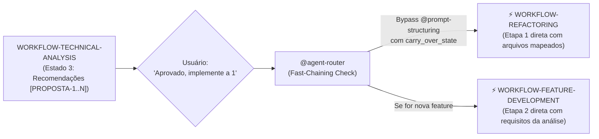

---

## 8. Circuit Breaker, Tolerância a Falhas e Estados de Rollback (R-050.2)

### 8.1 Prevenção de Loops e Corrupção de Workspace
Nenhum workflow mutativo pode deixar o repositório em estado quebrado, sujo ou entrar em loops infinitos de autocorreção.

1. **Orçamento Rígido de Autocorreção (Circuit Breaker)**:
   - Em `WORKFLOW-BUG-FIX` (Etapa 4), o `specialist-test-fixer` possui um teto absoluto de **3 tentativas** para corrigir testes quebrados (mesmo `max_iteracoes: 3` declarado no sub-catálogo de domínio — precedência de workflow, ver § 3.1 Estado 4).
   - Se os testes não passarem na 3ª tentativa, o fluxo **NÃO** prossegue para o Quality Gate nem continua tentando cegamente.
2. **Ativação Compulsória do Estado de Rollback (Estado 4b) — Separação Declarador/Executor**:
   - **2a. `WORKFLOW-BUG-FIX` (contrato corrigido)**: o `runtime-verifier` (agente estritamente read-only, sem ferramentas de mutação) apenas DETECTA o esgotamento do teto e DECLARA o veredito de bloqueio. A reversão física dos diffs (`git checkout -- <arquivos>`) é sempre EXECUTADA pelo `specialist-bug-fixer`/`specialist-test-fixer` ativo (que possuem `run_in_terminal` + `insert_edit_into_file`) via `run_subagent` acionado pelo `runtime-verifier`, estritamente amparado pelo `rollback_plan` previamente declarado no Estado 3. **Um agente read-only nunca executa a mutação de rollback diretamente** — essa separação declarador/executor é invariante de arquitetura (ver Seção 5, item 6).
   - **2b. `WORKFLOW-REFACTORING` (Estado 5b — contrato corrigido)**: o `@refactor-planner` não possui **nenhuma** ferramenta de edição ou terminal em seu frontmatter (nem `run_in_terminal`) — é ainda mais estritamente read-only que o `runtime-verifier`. Ele DETECTA a violação (via relatório `@business-rules-extractor` modo Validate) e DECIDE o escopo do rollback (quais nós do DAG Mikado precisam reverter, com base na árvore de dependências que ele mesmo desenhou no Estado 3 — pode ser rollback parcial dos últimos micro-lotes, não necessariamente do plano inteiro). A EXECUÇÃO física da reversão é sempre delegada, nó a nó, ao domain router/specialist que aplicou aquele nó especificamente (`@angular-router`, `@spring-boot-router`, `@spring-reactive-router`, `@database-router` — cada um reverte apenas os arquivos que executou), registrando compulsoriamente o `blast_radius_revertido` no `workflow_state`.
   - Em ambos os casos, o agente responsável gera um relatório compacto de falha (3 linhas: Causa, Local, Ação sugerida) e aciona `ask_questions` para decisão humana:
     - *Opção A: Ajustar a estratégia de teste manualmente.*
     - *Opção B: Revisar hipótese de causa raiz.*
     - *Opção C: Cancelar a tarefa mantendo o workspace limpo.*
3. **Rollback em Refatoração (Estado 5b) — Granularidade, Acionamento & Blast Radius Revertido**:
   - Se o `@business-rules-extractor` detectar no Estado 5 que qualquer regra de negócio do ground truth (Estado 1) foi alterada ou violada, se o gate de contratos falhar, OU se um Gate Out de qualquer nó do DAG (Estado 4) falhar de forma persistente, o `@refactor-planner` aciona o plano de rollback desenhado no Estado 3 **antes** de qualquer aprovação humana adicional — mas a reversão física é sempre executada pelo(s) specialist(s) de stack que tocaram os nós afetados (nunca pelo `@refactor-planner` diretamente, ver item 2b).
   - Rollback é preferencialmente **incremental** (reverte apenas os nós do DAG posteriores ao ponto de violação identificado), não obrigatoriamente o plano inteiro — o Gate Out por nó (compilação limpa + testes verdes) já valida cada micro-lote durante o Estado 4, reduzindo o blast radius de uma violação tardia. O relatório final de rollback registra expressamente o `blast_radius_revertido` (nós revertidos, callers e arquivos restaurados) no `workflow_state`.
4. **Circuit Breaker Complementar de Delegação (`handoff-governance/SKILL.md` § 2.4)**: o teto de 3 tentativas acima trata de *retry de teste*; um mecanismo **distinto e complementar** protege contra loop infinito de *handoff entre agentes* (`call_stack_depth >= 3` ou ciclo A→B→A) — ambos podem estar ativos simultaneamente sem conflito, pois medem falhas de naturezas diferentes.

---

## 9. Rastreamento Multi-Projeto no `workflow_tracking` (`projeto_alvo` — R-050.3)

### 9.1 O Desafio de Repositórios Externos Conectados
Em ecossistemas multi-projeto onde este repositório (`deep-agents-copilot`) atua como base de governança central e outros projetos (ex.: `[PROJETO-ALVO]`) são repositórios de produto conectados:
- O agente downstream precisa saber a raiz exata do projeto (`project_root`).
- O agente deve carregar as instruções específicas do projeto (`.github/instructions/local/<projeto>.instructions.md` — R-043).
- É terminantemente proibido criar arquivos de código da aplicação dentro do repositório de governança (R-034/R-043).

### 9.2 Schema de `projeto_alvo` no Handoff (v1.3)
Todo handoff executivo transporta o contexto do projeto resolvido no `workflow_tracking`:

```yaml
workflow_tracking:
  workflow_id: "WORKFLOW-TECHNICAL-ANALYSIS"
  etapa_atual: 1
  total_etapas: 3
  nome_etapa: "advisory_dispatch"
  projeto_alvo:
    id: "[PROJETO-ALVO]"
    root_path: "<workspace>/[PROJETO-ALVO]"
    adapter_ref: ".github/instructions/local/[PROJETO-ALVO].instructions.md"
  chaining:
    origem_workflow_id: null       # ou "WORKFLOW-TECHNICAL-ANALYSIS" se veio de chaining
    proposta_referenciada: null    # ex.: "PROPOSTA-1"
    carry_over_state:
      arquivos_afetados:
        - "src/app/features/exemplo/exemplo-list.component.ts"
      diagnostico_previo: "3 memory leaks detectados em subscriptions manuais sem takeUntil"
```
Com esse bloco, qualquer especialista na cadeia sequencial sabe exatamente onde ler, onde testar e quais convenções de stack aplicar, sem ambiguidades.
