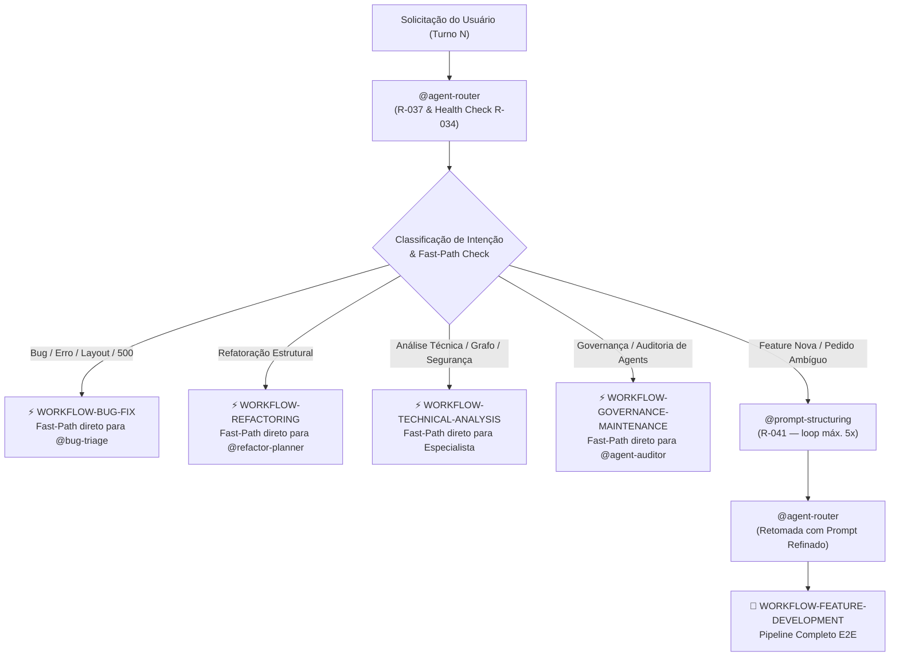
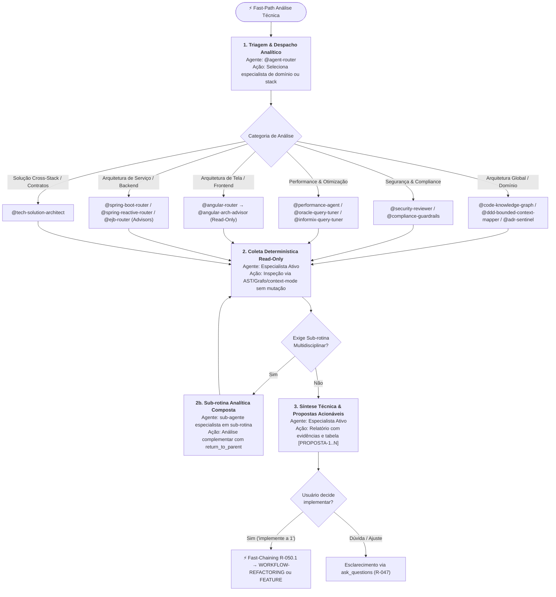
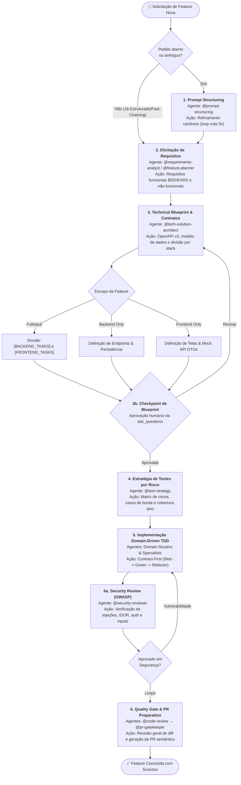
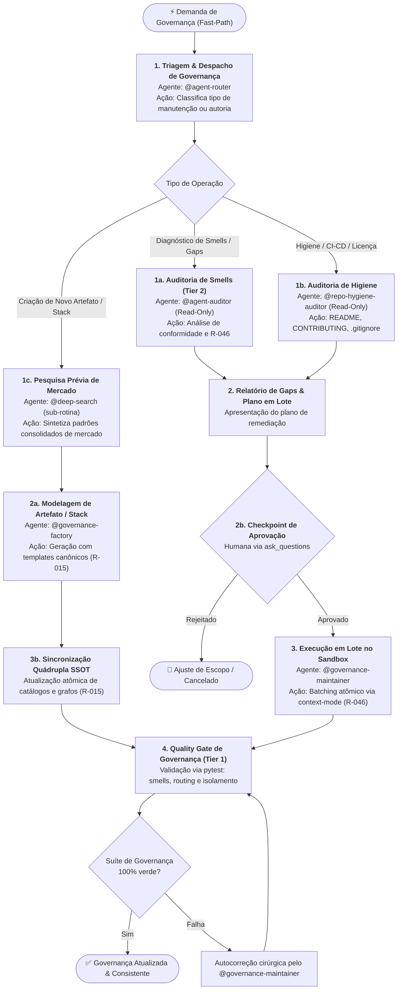
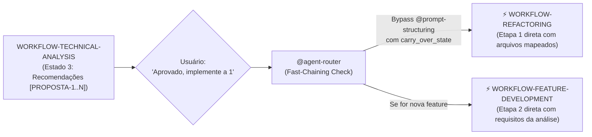

# Workflows Operacionais Determinísticos (R-050)

> **Fonte de verdade operacional:** [`CLAUDE.md`](../../CLAUDE.md) § R-050, R-041 e R-042.  
> **Grafo estrutural:** [`.github/agents/routing-graph.yaml`](routing-graph.yaml).  
> **Contratos e Handoff:** [`.github/skills/handoff-governance/SKILL.md`](../skills/handoff-governance/SKILL.md) e [`.github/skills/agent-contracts/SKILL.md`](../skills/agent-contracts/SKILL.md).

---

## 1. Visão Geral e Motivação

### 1.1 O Desafio Observado
Em sistemas multi-agent complexos, solicitações com intenções operacionais imediatas (ex.: relato de um bug em produção, erro 500, botão quebrado, falha de layout CSS) sofriam desvios e latência desnecessária quando interceptadas indiscriminadamente pelo `@prompt-structuring`. O modelo tentava reformatar ou realizar perguntas de clarificação sobre erros que já possuíam sintomas e stack traces explícitos, quebrando a fidelidade da cadeia de resolução.

### 1.2 A Solução de Mercado (Anthropic & LangGraph)
Conforme documentado no framework *Building Effective Agents* (Anthropic) e nas arquiteturas de estado finito do LangGraph:
- **Workflows (Pipelines Predefinidos)**: Sistemas onde modelos e ferramentas são orquestrados através de caminhos e transições previsíveis (State Machines). Indicados para tarefas operacionais de engenharia de software onde a ordem dos passos é bem definida e mandatária.
- **Agents (Sistemas Exploratórios)**: Sistemas onde o modelo decide dinamicamente a próxima ferramenta em loop aberto. Indicados para tarefas amplas de pesquisa ou problemas com espaço de busca desconhecido.
- **Fast-Path Determinístico**: Gatilhos explícitos de erro, refatoração estrutural ou diagnóstico técnico bypassam etapas genéricas de estruturação de prompt e ingressam imediatamente no workflow correspondente.

---

## 2. Matriz Geral de Roteamento de Workflows



---

## 3. Especificação dos 5 Workflows Canônicos

---

### 3.1 WORKFLOW 1: `WORKFLOW-BUG-FIX` (Resolução de Bugs, Falhas de Layout e Regressões)

- **Objetivo**: Identificar a causa raiz, reproduzir via teste automatizado isolado (Red Test) ou layout spec, aplicar correção cirúrgica mínima (Green Test) e validar não-regressão.
- **Gatilhos de Fast-Path**: `"bug"`, `"erro"`, `"falha"`, `"500"`, `"NPE"`, `"não funciona"`, `"quebrou"`, `"layout quebrado"`, `"desalinhado"`, `"CSS quebrado"`, `"NullPointerException"`, `"regressão"`.
- **Política R-041**: **Bypass Total** de `@prompt-structuring`. Não reformatar prompt; o relato técnico é despachado imediatamente.

```mermaid
flowchart TD
    Start(["⚡ Solicitação de Bug (Fast-Path)"]) --> Triage["<b>1. Triagem & Isolamento</b><br/>Agente: @bug-triage<br/>Ação: Análise de sintomas, logs e reprodução"]

    Triage --> CheckRepro{"Reprodução clara<br/>e determinística?"}
    CheckRepro -- "Não (Intermitente/Sem Logs)" --> ReproGate["<b>1b. Repro Gate & Probe</b><br/>Agente: @debugger / ask_questions<br/>Ação: Logpoint em runtime ou coleta de payload mínimo"]
    ReproGate --> Triage
    CheckRepro -- "Sim" --> CheckDiag{"Causa raiz<br/>multi-camada?"}

    CheckDiag -- "Sim" --> Diagnosis["<b>Diagnóstico Profundo</b><br/>Agente: @debugger / @code-knowledge-graph<br/>Ação: Inspeção de call graph e stack trace"]
    CheckDiag -- "Não" --> CheckKind{"Tipo de Defeito"}
    Diagnosis --> CheckKind

    CheckKind -- "Lógica / Runtime / Exception" --> BaselineLogic["<b>Pré-voo de Teste</b><br/>Agente: runtime-verifier<br/>Ação: Confirma suíte vizinha limpa"]
    BaselineLogic --> RedTest["<b>2. Red Test (TDD)</b><br/>Agente: specialist-unit-test / component-test<br/>Ação: Teste automatizado que falha comprovando o bug"]

    CheckKind -- "Layout / CSS / Visual" --> LayoutSpec["<b>2. Layout Spec & WCAG</b><br/>Agente: specialist-ui-stylist / component-test<br/>Ação: Spec de classes/DOM e checagem de tokens"]

    RedTest & LayoutSpec --> CheckDB{"Exige ajuste<br/>de Schema/DDL?"}
    CheckDB -- "Sim" --> DBMigration["<b>3a. Migração DDL Idempotente</b><br/>Agente: @database-specialist<br/>Ação: Script Flyway/DDL idempotente"]
    CheckDB -- "Não" --> Fix["<b>3. Correção Cirúrgica Mínima</b><br/>Agente: specialist-bug-fixer / ui-stylist<br/>Ação: Diff cirúrgico mínimo (R-002 e R-046)"]
    DBMigration --> Fix

    Fix --> GreenTest["<b>4. Green Test & Linter</b><br/>Agente: runtime-verifier / test-fixer<br/>Ação: Suíte verde e linter limpo (máx 3x)"]

    GreenTest --> CheckPass{"Testes passaram<br/>dentro do teto 3x?"}
    CheckPass -- "Sim" --> QualityGate["<b>5. Quality Gate & Resumo</b><br/>Agente: @code-review / @pr-gatekeeper<br/>Ação: Validação de segurança/diff e preparação de PR"]
    CheckPass -- "Não (Falha Persistente)" --> CircuitBreaker["<b>4b. Circuit Breaker & Rollback</b><br/>Agente: runtime-verifier<br/>Ação: Reversão atômica de diff + Escalation humana (ask_questions)"]

    QualityGate --> EndBug(["✅ Concluído com Sucesso"])
    CircuitBreaker --> EndFail(["🛑 Interrompido com Reversão Segura"])
```



#### Cadeia Sequencial e Papéis:
1. **Estado 1 — Triagem & Hipótese (`@bug-triage`)**:
   - *Entrada*: Sintoma relatado, logs, stack trace ou print/descrição de layout.
   - *Saída*: Hipótese de causa raiz, componente afetado e passos de reprodução.
   - *Sub-rotina 1a (Diagnóstico Profundo)*: Se envolver call graph multi-camada complexo, invoca `@debugger` com `call_type: "subroutine"`.
   - *Sub-rotina 1b (Repro Gate)*: Se o bug for intermitente ou faltar evidência mínima, o `@bug-triage` NÃO avança cegamente para o Estado 2. Ele aciona o `@debugger` com logpoint/tracepoint (`logExpression` com `suspendPolicy=NONE`) ou dispara `ask_questions` (R-027) com 1 pergunta solicitando o payload/passos mínimos.
2. **Estado 2 — Caracterização e Reprodução Automatizada**:
   - *Cenário A (Lógica / Runtime / Regra)*: `specialist-unit-test-writer` ou `component-test-writer` cria teste automatizado que falha comprovando o defeito. Antes disso, um pré-voo de baseline confirma que o ambiente de teste executa limpo nos testes vizinhos para evitar falsos positivos de flaky tests pré-existentes.
   - *Cenário B (Layout / CSS / Estilo / Responsividade)*: `specialist-ui-stylist` e `component-test-writer` mapeiam seletores CSS, variáveis de design tokens, regras responsivas e classes condicionais (`@if`), gerando teste de componente com asserção de estado visual/DOM ou inspeção estrita de conformidade WCAG 2.2 AA.
3. **Estado 3 — Correção Cirúrgica Mínima (`specialist-bug-fixer` ou `specialist-ui-stylist`)**:
   - *Entrada*: Arquivo alvo e teste falhando ou layout spec.
   - *Sub-rotina 3a (Dependência de Banco/DDL)*: Se a falha envolver truncamento de dados, coluna ausente ou constraint de banco, o `@database-specialist` gera previamente o script de migração DDL idempotente antes de tocar no código de aplicação.
   - *Saída*: Diff cirúrgico mínimo (2 a 3 linhas de contexto), sem alterar código não relacionado (R-002 e R-046).
4. **Estado 4 — Verificação Green Test & Linter (`runtime-verifier`)**:
   - *Entrada*: Código alterado e suíte de testes.
   - *Saída*: Confirmação de 100% dos testes passando e `get_errors` limpo em lote único (R-046). Se quebrar, aciona `@test-fixer` (máx. 3 iterações).
   - *Estado 4b — Circuit Breaker & Rollback*: Se após 3 tentativas os testes não passarem, o `runtime-verifier` reverte compulsoriamente os diffs alterados (workspace clean) e escala para intervenção humana via `ask_questions`.
5. **Estado 5 — Quality Gate & Resumo (`@code-review` / `@pr-gatekeeper`)**:
   - *Entrada*: Diff final e evidências de teste.
   - *Saída*: Resumo estruturado em 5 seções (R-028) ou preparação de PR via `@pr-gatekeeper`.

#### Typed State Bag (`workflow_state`):
```yaml
workflow_state:
  tipo_bug: "runtime_exception | layout_css | business_logic | database_constraint"
  sintoma: "<descrição do sintoma observado>"
  causa_raiz: "<classe.metodo:linha e mecanismo da falha>"
  arquivos_alvo:
    - "<caminho/arquivo.ext>"
  teste_regressao:
    arquivo: "<caminho/arquivo.spec.ext>"
    nome_teste: "deve <comportamento> quando <cenário>"
    comando_execucao: "<comando de teste>"
  status_red_test: "confirmado_falha | layout_spec_validado"
  exige_migracao_ddl: false
  tentativas_correcao: 1
```

---

### 3.2 WORKFLOW 2: `WORKFLOW-REFACTORING` (Refatoração Estrutural e Modernização)

- **Objetivo**: Modificar a estrutura interna do código sem alterar seu comportamento observável, amparado por testes de caracterização (Golden Master), análise de blast radius via grafo, plano incremental Mikado com rollback atômico e validação estrita contra ground truth de regras de negócio.
- **Gatilhos de Fast-Path**: `"refatorar"`, `"refatoração"`, `"desacoplar"`, `"eliminar god class"`, `"clean architecture"`, `"modularizar"`, `"remover duplicação"`, `"extrair interface"`.
- **Política R-041**: **Bypass** se o alvo estiver claro. Se o pedido for genérico ("melhore a arquitetura"), aciona `@prompt-structuring`.

```mermaid
flowchart TD
    StartRefactor(["⚡ Solicitação de Refactor (Fast-Path)"]) --> GroundTruth["<b>1. Mapeamento de Regras Vigentes</b><br/>Agente: @business-rules-extractor<br/>Ação: Extrai regras vigentes em markdown (Ground Truth)"]

    GroundTruth --> BlastRadius["<b>2. Blast Radius & Dependências</b><br/>Agente: @code-knowledge-graph (R-045)<br/>Ação: Mapeia callers, callees, ciclos e acoplamento"]

    BlastRadius --> CheckContract{"Afeta APIs públicas<br/>ou Consumidores?"}
    CheckContract -- "Sim" --> ContractGate["<b>2a. Contract & Deprecation Plan</b><br/>Agente: @tech-solution-architect<br/>Ação: Branch by Abstraction / Parallel Run"]
    CheckContract -- "Não" --> CheckSafetyNet{"Cobertura de Testes<br/>suficiente (>=80%)?"}
    ContractGate --> CheckSafetyNet

    CheckSafetyNet -- "Não (Código Legado Sem Teste)" --> GoldenMaster["<b>2b. Golden Master Safety Net</b><br/>Agente: specialist-unit-test-writer<br/>Ação: Cria testes de caracterização capturando comportamento atual"]
    CheckSafetyNet -- "Sim" --> SafetyNetPlan["<b>3. Plano Macro Mikado</b><br/>Agente: @refactor-planner + @test-strategy<br/>Ação: Árvore Mikado em micro-etapas + pontos de rollback"]
    GoldenMaster --> SafetyNetPlan

    SafetyNetPlan --> CheckDBSchema{"Exige refatoração<br/>de Schema/Banco?"}
    CheckDBSchema -- "Sim" --> ExpandContract["<b>3b. Expand and Contract</b><br/>Agente: @database-specialist<br/>Ação: Adição de novas colunas/tabelas paralelas"]
    CheckDBSchema -- "Não" --> Execution["<b>4. Execução Incremental em Lote</b><br/>Agente: Domain Router / Specialist Developer<br/>Ação: Execução em micro-lotes com diffs cirúrgicos (R-046)"]
    ExpandContract --> Execution

    Execution --> Validation["<b>5. Validação de Ground Truth & Não-Regressão</b><br/>Agente: @business-rules-extractor (Validate) + @code-review<br/>Ação: Validação contra regras do Estado 1 e quality gate"]

    Validation --> CheckRefactor{"Regras e testes<br/>100% preservados?"}
    CheckRefactor -- "Sim" --> EndRefactor(["✅ Concluído com Sucesso"])
    CheckRefactor -- "Não (Violação de Regra)" --> RefactorRollback["<b>5b. Rollback Automático do Plano</b><br/>Agente: @refactor-planner<br/>Ação: Reversão atômica ao snapshot pré-execução + Relatório 3-linhas"]
    RefactorRollback --> EndRefactorFail(["🛑 Refatoração Revertida com Segurança"])
```



#### Cadeia Sequencial e Papéis:
1. **Estado 1 — Mapeamento de Regras Vigentes (`@business-rules-extractor`)**: Extrai regras de negócio do código atual em arquivos `.md` estruturados (modo Extract), servindo como baseline de verdade inegociável.
2. **Estado 2 — Blast Radius & Análise de Contratos (`@code-knowledge-graph`)**: Executa análise estrita determinística (R-045) via `@optave/codegraph` para identificar dependências transitivas, acoplamento e pontos de quebra. Proibido varredura manual.
   - *Sub-rotina 2a (Contract & Deprecation Gate)*: Se a refatoração atingir métodos públicos ou contratos consumidos por múltiplos módulos, o `@tech-solution-architect` desenha a transição suave (Branch by Abstraction / Deprecation prévia).
   - *Sub-rotina 2b (Golden Master / Safety Net Gate)*: Se a área a ser refatorada não possuir cobertura automatizada mínima (>= 80%), o `specialist-unit-test-writer` DEVE escrever testes de caracterização que congelem o comportamento existente antes de qualquer alteração estrutural.
3. **Estado 3 — Plano Macro Mikado & Estratégia de Rollback (`@refactor-planner` + `@test-strategy`)**:
   - Decompõe a meta usando a técnica **Mikado Method**: gera a árvore de pré-requisitos (folhas primeiro, raiz por último) em micro-passos independentes.
   - *Sub-rotina 3b (Database Expand and Contract)*: Se a refatoração envolver schema de banco, o `@database-specialist` orquestra a evolução em fases paralelas (Expand -> Migrate -> Contract), nunca DDL destrutivo direto.
4. **Estado 4 — Execução Incremental em Lote (`domain router / specialists`)**: Aplica as alterações respeitando o protocolo R-046 (Single-Turn Batching / context-mode para 5+ arquivos) em micro-lotes validados pela suíte de caracterização.
5. **Estado 5 — Validação de Não-Regressão e Compliance (`@business-rules-extractor` + `@code-review`)**:
   - O `@business-rules-extractor` executa o modo Validate comparando o código final com as regras documentadas no Estado 1.
   - *Estado 5b — Rollback Automático do Plano*: Se qualquer regra de negócio for violada ou os testes de caracterização falharem, o `@refactor-planner` aciona imediatamente a reversão ao snapshot limpo pré-execução, gerando relatório de divergência e escalando para decisão humana via `ask_questions`.

#### Typed State Bag (`workflow_state`):
```yaml
workflow_state:
  alvo_refatoracao: "<classe, metodo ou modulo alvo>"
  padrao_estrategico: "mikado_method | branch_by_abstraction | strangler_fig"
  ground_truth_regras_doc: "docs/business-rules/regras-<alvo>.md"
  blast_radius_metricas:
    total_callers: 14
    total_callees: 6
    tem_ciclo: false
    tem_breaking_change: false
  safety_net_cobertura:
    testes_caracterizacao_presentes: true
    arquivos_testes_golden_master:
      - "<caminho/arquivo.spec.ext>"
  micro_etapas_planejadas:
    - etapa_idx: 1
      descricao: "<micro-passo mikado>"
      status: "pendente | concluido"
  status_validacao_regras: "100_preservadas | violacao_detectada"
  snapshot_reversao: "<tag_de_reversao_ou_stash>"
```

---

### 3.3 WORKFLOW 3: `WORKFLOW-TECHNICAL-ANALYSIS` (Análise Técnica, Diagnóstico e Auditoria Especializada)

- **Objetivo**: Conduzir investigações conceituais, diagnósticos de segurança, performance, conformidade de domínio, arquitetura de telas/fluxos por stack técnica ou levantamento de arquitetura de forma estritamente analítica e não mutativa, concluindo com propostas acionáveis para Fast-Chaining.
- **Gatilhos de Fast-Path**: `"analisar"`, `"diagnosticar"`, `"como funciona"`, `"mapear arquitetura"`, `"verificar segurança"`, `"avaliar performance"`, `"conformidade adr"`, `"bounded context"`, `"analisar tela"`, `"analisar fluxo"`, `"identificar melhorias"`.
- **Política R-041**: **Bypass Total** de `@prompt-structuring`. Direcionamento imediato ao especialista analítico.



#### Cadeia Sequencial e Papéis:
1. **Estado 1 — Despacho para Especialista Analítico**: O router direciona sem desvios para o agente cujo domínio ou stack cobre a pergunta:
   - *Arquitetura Estrutural & Grafo*: `@code-knowledge-graph` (dependências/ciclos), `@ddd-bounded-context-mapper` (domínios/God Classes), `@adr-sentinel` (conformidade arquitetural).
   - *Segurança & Governança*: `@security-reviewer` (OWASP/CVE/secrets), `@compliance-guardrails` (LGPD/SOC 2).
   - *Engenharia de Performance*: `@performance-agent` (CWV/N+1/profiling), `@oracle-query-tuner` / `@informix-query-tuner` (planos de execução SQL).
   - *Arquitetura de Telas & Fluxos por Stack*: `@angular-arch-advisor` (reatividade Signals, memory leaks, OnPush, SSR), `@spring-boot-arch-advisor` (Virtual Threads, JPA/Hibernate, clean architecture), `@spring-reactive-arch-advisor` (WebFlux, backpressure, event-loop non-blocking), `@ejb-arch-advisor` (transações JTA, Stateless pools).
   - *Viabilidade Técnica & Contratos*: `@tech-solution-architect` (Technical Blueprint, OpenAPI, modelo de dados).
2. **Estado 2 — Coleta & Diagnóstico Determinístico (Guardrail de Imutabilidade)**:
   - O agente opera estritamente em modo Read-Only / Advisory: **proibido o uso de ferramentas mutativas** (`create_file`, `replace_string_in_file`, `insert_edit_into_file`).
   - Todo achado DEVE citar `arquivo:linha` (R-044) e usar o `context-mode` MCP (`ctx_execute_file` / `ctx_search`) para evitar saturação da janela de contexto.
   - *Sub-rotina 2b (Análise Composta)*: Se a investigação exigir visão multidisciplinar (ex.: arquiteto consultando especialista de banco), aciona sub-rotina com `call_type: "subroutine"` e `return_to_parent: true`.
3. **Estado 3 — Síntese e Propostas Acionáveis para Fast-Chaining (R-047 / R-050.1)**:
   - Emissão de relatório técnico estruturado (Abordagem · Diagnóstico · Evidências com `arquivo:linha` · Impacto).
   - **Tabela Mandatória de Propostas Acionáveis**: O relatório DEVE concluir com a listagem formal numerada (`[PROPOSTA-1]`, `[PROPOSTA-2]`) indicando o tipo de esforço, arquivos-alvo e o workflow de destino recomendado (`WORKFLOW-REFACTORING`, `WORKFLOW-FEATURE-DEVELOPMENT` ou `WORKFLOW-BUG-FIX`).
   - Encerramento ativo com pergunta ao usuário via `ask_questions` (R-047), habilitando o **Fast-Chaining (R-050.1)** imediato no turno seguinte.

#### Typed State Bag (`workflow_state`):
```yaml
workflow_state:
  tipo_analise: "arquitetura_stack | seguranca_owasp | performance_cwv | grafo_blast_radius | ddd_bounded_context | conformidade_adr"
  escopo_alvo:
    modulo_ou_tela: "<nome-do-modulo-ou-tela>"
    arquivos_analisados:
      - "<caminho/arquivo.ext:linha>"
  diagnostico_sumario: "<resumo dos achados em 1-3 linhas>"
  propostas_acionaveis:
    - id: "PROPOSTA-1"
      titulo: "<titulo-da-melhoria>"
      tipo: "refactoring | feature | bug_fix"
      arquivos_afetados:
        - "<caminho/arquivo.ext>"
      proximo_workflow: "WORKFLOW-REFACTORING"
```

---

### 3.4 WORKFLOW 4: `WORKFLOW-FEATURE-DEVELOPMENT` (Nova Feature e Evolução Funcional E2E)

- **Objetivo**: Elicitar requisitos, conceber arquitetura técnica, desenhar contratos de API (OpenAPI), definir matriz de testes por risco, aprovar blueprint com desenvolvedor e implementar sob workflow TDD estrito com validação de segurança OWASP.
- **Gatilhos**: `"criar feature"`, `"nova funcionalidade"`, `"implementar endpoint"`, `"adicionar tela"`, `"novo módulo"`, `"evoluir fluxo"`.
- **Política R-041**: **Ativação Obrigatória** de `@prompt-structuring` caso a solicitação seja de alto nível ou ambígua. Bypassa caso venha de Fast-Chaining pós-diagnóstico com proposta aprovada.



#### Cadeia Sequencial e Papéis:
1. **Estado 1 — Estruturação de Prompt (`@prompt-structuring`)**: Transforma pedidos abertos no formato canônico `<task>/<context>/<constraints>/<output_format>`.
2. **Estado 2 — Elicitação de Requisitos (`@requirements-analyst` / `@feature-planner`)**: Detalha regras funcionais (BDD/EARS) e não-funcionais com critérios de aceitação objetivos, prevenindo *solution-jumping*.
3. **Estado 3 — Technical Blueprint & Contratos (`@tech-solution-architect`)**:
   - Modela contratos de integração (OpenAPI v3), esquema de banco de dados e divisão de tarefas por stack.
   - Particionamento de escopo: isola se a demanda é **Fullstack**, **Backend-Only** ou **Frontend-Only**.
   - *Estado 3b (Checkpoint de Blueprint)*: Apresenta o blueprint estruturado e aguarda autorização humana explícita via `ask_questions` antes de iniciar qualquer codificação.
4. **Estado 4 — Estratégia de Testes por Risco (`@test-strategy`)**: Mapeia casos de borda, matriz de risco e cobertura recomendada (mínimo 80%) antes de codificar.
5. **Estado 5 — Implementação Domain TDD (`domain routers & specialists`)**:
   - Padrão **Contract-First**: o contrato OpenAPI / DTO é a SSOT.
   - Execução estrita TDD: primeiro o teste automatizado (Red), depois a implementação (Green), seguida da refatoração limpa com diffs cirúrgicos em lote (R-046).
6. **Estado 6 — Quality Gate, Segurança & PR (`@security-reviewer`, `@code-review` e `@pr-gatekeeper`)**:
   - *Sub-rotina 6a (Security Gate)*: O `@security-reviewer` audita novos endpoints contra OWASP Top 10 (SQL Injection, IDOR, Broken Authentication, sanitização).
   - O `@code-review` realiza a revisão de conformidade e boas práticas.
   - O `@pr-gatekeeper` gera a mensagem de commit semântico, descrição estruturada de PR e atualiza o CHANGELOG.md (sem push autônomo — R-031).

#### Typed State Bag (`workflow_state`):
```yaml
workflow_state:
  feature_id: "<slug-da-feature>"
  escopo_stack: "frontend_only | backend_only | fullstack"
  requisitos_doc: "docs/requirements/REQ-<feature>.md"
  blueprint:
    contrato_openapi: "<caminho/openapi.yaml ou inline>"
    tabelas_banco: ["<tabela_a>", "<tabela_b>"]
    tasks_backend: ["Task 1", "Task 2"]
    tasks_frontend: ["Task 1", "Task 2"]
  matriz_riscos_testes:
    casos_borda: ["Payload vazio", "Timeout", "Duplicidade"]
    cobertura_alvo: 80
  status_implementacao:
    backend_concluido: true
    frontend_concluido: true
  security_gate_status: "aprovado | vulnerabilidade_detectada"
```

---

### 3.5 WORKFLOW 5: `WORKFLOW-GOVERNANCE-MAINTENANCE` (Governança e Manutenção do Ecossistema)

- **Objetivo**: Auditar, padronizar, expandir e manter o catálogo de agents, skills, prompts e convenções do repositório de governança com pesquisa prévia compulsória, checkpoints humanos para mutações estruturais, execução atômica em lote (R-046) e validação final via suíte determinística de testes.
- **Gatilhos de Fast-Path**: `"auditar governança"`, `"novo agent"`, `"nova skill"`, `"novo prompt"`, `"nova stack"`, `"manutenção de catálogo"`, `"corrigir smell de agent"`, `"higiene de repositório"`.
- **Política R-041**: **Bypass Total** de `@prompt-structuring`. Direcionamento imediato para auditoria ou factory.



#### Cadeia Sequencial e Papéis:
1. **Estado 1 — Diagnóstico Read-Only ou Pesquisa Prévia**:
   - *Diagnóstico de Smells*: O `@agent-auditor` executa auditoria estática e comportamental contra os 14 smells canônicos de governança.
   - *Auditoria de Higiene*: O `@repo-hygiene-auditor` audita a saúde do repositório, licença e segurança de versionamento.
   - *Pesquisa Prévia Compulsória (Criação de Artefatos / Stack)*: O `@governance-factory` delega compulsoriamente ao `@deep-search` a investigação de mercado antes de escrever novos prompts, skills ou agents.
2. **Estado 2 — Modelagem e Checkpoint de Aprovação Humana**:
   - Apresentação objetiva dos achados ou especificações do novo artefato.
   - *Estado 2b (Checkpoint Humano)*: Toda manutenção estrutural ou criação de stack exige autorização explícita via `ask_questions` antes de qualquer alteração física nos catálogos.
3. **Estado 3 — Execução e Sincronização Quádrupla em Lote (R-015 / R-046)**:
   - O `@governance-maintainer` aplica as alterações em lote único (*Single-Turn Batching*) utilizando o `context-mode` MCP no sandbox para zero desperdício de tokens.
   - Na criação de novos agents ou stacks, aplica compulsoriamente a **Sincronização Quádrupla Atômica (R-015)**: atualiza `catalog.yaml`, `routing-graph.yaml`, `agent-router.agent.md` e `README.md` na mesma entrega.
4. **Estado 4 — Quality Gate de Governança (Tier 1 Automático)**:
   - Execução determinística dos testes de governança:
     - `test_governance_smells.py` (conformidade com templates e 14 smells).
     - `test_local_project_isolation.py` (100% isolamento de projetos locais — R-038/R-043/R-044).
     - `test_routing_quality_gate.py` (integridade do grafo e alcançabilidade).
   - Havendo qualquer regressão, o `@governance-maintainer` autocorrige a inconsistência antes de entregar o relatório final ao usuário.

#### Typed State Bag (`workflow_state`):
```yaml
workflow_state:
  tipo_demanda: "auditoria_smells | higiene_repo | criacao_artefato | nova_stack | refatoracao_cascata"
  artefatos_alvo:
    - "<caminho/artefato.ext>"
  diagnostico_smells:
    total_achados: 3
    smells_detectados:
      - "smell-2.2-active-agent-banner"
      - "smell-2.6-absolute-path"
  pesquisa_previa_deep_search:
    realizada: true
    sintese_diretrizes: "<resumo dos padrões de mercado>"
  plano_manutencao_lote:
    - arquivo: ".github/agents/catalog.yaml"
      acao: "atualizar_versao_e_source_docs"
  status_aprovacao_humana: "aprovado"
  quality_gate_tier1: "100_passando"
```

---

## 4. Integração com o Protocolo de Handoff (`workflow_tracking`)

Para garantir que a cadeia sequencial seja seguida à risca e nenhum agente desvie do fluxo, todo handoff entre agentes em um workflow ativo transporta o bloco `workflow_tracking` dentro do `handoff_payload`:

```yaml
handoff_payload:
  versao: "1.2"
  para: "specialist-unit-test-writer"
  motivo: "Hipótese de bug confirmada — criar teste de regressão que falhe"
  emissor:
    nome: "bug-triage"
    versao: "1.1.0"
    modelo_llm: "Claude Sonnet 5"
    timestamp: "2026-09-10T12:00:00Z"
  workflow_tracking:
    workflow_id: "WORKFLOW-BUG-FIX"
    etapa_atual: 2
    total_etapas: 5
    nome_etapa: "red_test_reproduction"
    proximos_agentes_permitidos:
      - "specialist-bug-fixer"
    politica_desvio: "strict"  # proíbe delegar fora da lista sem evento R-042
  contexto:
    solicitacao_original: "Botão de login quebra com erro 500 ao clicar"
    trabalho_realizado: "Isolado NullPointerException no AuthService linha 45"
    descobertas_chave:
      - "Token JWT nulo ao submeter formulário sem provedor federado"
    artefatos:
      - "src/app/core/services/auth.service.ts"
  proximos_passos_sugeridos:
    - "Escrever spec isolado simulando payload sem provider"
```

---

## 5. Regras de Não-Desvio (Invariantes de Execução)

1. **Invariante de Fast-Path**: Se a mensagem de entrada descreve um bug, erro, crash ou falha visual de layout, o `@agent-router` NUNCA deve invocar `@prompt-structuring`. O ingresso no `WORKFLOW-BUG-FIX` via `@bug-triage` é mandatório.
2. **Invariante de Teste Prévio (TDD)**: No `WORKFLOW-BUG-FIX`, é terminantemente proibido invocar o `bug-fixer` sem antes ter o teste automatizado que reproduza a falha (Estado 2 obrigatório antes do Estado 3).
3. **Invariante de Grafo em Refatoração**: No `WORKFLOW-REFACTORING`, o `@refactor-planner` NUNCA deve realizar varredura manual de pastas; deve invocar compulsoriamente o `@code-knowledge-graph` para cálculo do blast radius (R-045).
4. **Invariante Anti Beco Sem Saída (R-047)**: Ao concluir seu estado, o agente ativo DEVE despachar via `run_subagent` para a próxima etapa do workflow OU invocar `ask_questions` caso dependa de decisão humana.
5. **Invariante de Deriva (R-042)**: Caso o usuário mude o escopo no meio do workflow (ex.: durante um bugfix, peça uma nova funcionalidade), o agente ativo aciona retorno imediato ao `@agent-router` com `motivo: "deriva_de_intencao"`.

---

## 6. Padrão de Visibilidade no Chat (Roadmap Visual de Execução — Anti-Cegueira)

Para que o usuário nunca fique no escuro quanto ao fluxo em andamento, o `@agent-router` (ao despachar o workflow) e cada agente participante (ao reportar sua etapa) **DEVEM obrigatoriamente** renderizar o bloco visual `### 🗺️ Pipeline de Execução do Workflow` no início de sua mensagem.

### 6.1 Marcadores de Status Padronizados
- `[✅]` **Concluído**: Etapa finalizada com sucesso e evidência registrada.
- `[▶]` **Em Andamento (Atual)**: Etapa sob execução do agente ativo no turno.
- `[⏳]` **Pendente**: Etapa futura a ser executada na sequência.

---

### 6.2 Templates Visuais por Workflow

#### WORKFLOW 1: `WORKFLOW-BUG-FIX` (5 etapas)
```markdown
### 🗺️ Pipeline de Execução: WORKFLOW-BUG-FIX (5 etapas)
- [▶] **Etapa 1: Triagem & Causa Raiz** → `@bug-triage` *(Em Andamento: reprodução mínima e isolamento)*
- [⏳] **Etapa 2: Red Test de Caracterização** → `specialist-unit-test-writer` *(Pendente: teste automatizado que falha comprovando o bug)*
- [⏳] **Etapa 3: Correção Cirúrgica Mínima** → `specialist-bug-fixer` *(Pendente: diff cirúrgico R-002/R-046)*
- [⏳] **Etapa 4: Validação Green Test & Linter** → `runtime-verifier` *(Pendente: 100% testes passando e linter limpo)*
- [⏳] **Etapa 5: Quality Gate & Resumo** → `@code-review` / `@pr-gatekeeper` *(Pendente: revisão final e PR)*
```

#### WORKFLOW 2: `WORKFLOW-REFACTORING` (5 etapas)
```markdown
### 🗺️ Pipeline de Execução: WORKFLOW-REFACTORING (5 etapas)
- [▶] **Etapa 1: Mapeamento de Regras Vigentes** → `@business-rules-extractor` *(Em Andamento: extração de ground truth em .md)*
- [⏳] **Etapa 2: Blast Radius & Dependências** → `@code-knowledge-graph` *(Pendente: análise determinística via @optave/codegraph)*
- [⏳] **Etapa 3: Plano Macro & Safety Net** → `@refactor-planner` + `@test-strategy` *(Pendente: Mikado/Strangler e testes de caracterização)*
- [⏳] **Etapa 4: Execução Incremental em Lote** → `Domain Router / Specialists` *(Pendente: batch execution R-046)*
- [⏳] **Etapa 5: Validação de Regras & Não-Regressão** → `@business-rules-extractor` + `@code-review` *(Pendente: checagem contra regras do Estado 1)*
```

#### WORKFLOW 3: `WORKFLOW-TECHNICAL-ANALYSIS` (3 etapas)
```markdown
### 🗺️ Pipeline de Execução: WORKFLOW-TECHNICAL-ANALYSIS (3 etapas)
- [▶] **Etapa 1: Despacho para Especialista Analítico** → `@<especialista>` *(Em Andamento: direcionamento direto)*
- [⏳] **Etapa 2: Coleta Determinística Read-Only** → `@<especialista>` *(Pendente: modo Advisory sem mutação de código)*
- [⏳] **Etapa 3: Síntese Técnica & Próximo Passo** → `@<especialista>` *(Pendente: relatório estruturado e handoff R-047)*
```

#### WORKFLOW 4: `WORKFLOW-FEATURE-DEVELOPMENT` (6 etapas)
```markdown
### 🗺️ Pipeline de Execução: WORKFLOW-FEATURE-DEVELOPMENT (6 etapas)
- [▶] **Etapa 1: Prompt Structuring** → `@prompt-structuring` *(Em Andamento: refinamento <task>/<context>/<constraints>)*
- [⏳] **Etapa 2: Elicitação de Requisitos** → `@requirements-analyst` / `@feature-planner` *(Pendente: critérios de aceitação BDD/EARS)*
- [⏳] **Etapa 3: Technical Blueprint & Contratos** → `@tech-solution-architect` *(Pendente: OpenAPI, modelo de dados e divisão por stack)*
- [⏳] **Etapa 4: Estratégia de Testes (TDD)** → `@test-strategy` *(Pendente: matriz de riscos e casos de borda)*
- [⏳] **Etapa 5: Implementação Domain TDD** → `Domain Routers & Specialists` *(Pendente: ciclo Red-Green-Refactor)*
- [⏳] **Etapa 6: Quality Gate & PR Preparation** → `@code-review` -> `@pr-gatekeeper` *(Pendente: revisão final e PR)*
```

#### WORKFLOW 5: `WORKFLOW-GOVERNANCE-MAINTENANCE` (3 etapas)
```markdown
### 🗺️ Pipeline de Execução: WORKFLOW-GOVERNANCE-MAINTENANCE (3 etapas)
- [▶] **Etapa 1: Diagnóstico Read-Only** → `@agent-auditor` / `@repo-hygiene-auditor` *(Em Andamento: auditoria estrutural)*
- [⏳] **Etapa 2: Checkpoint de Aprovação Humana** → `ask_questions` *(Pendente: aprovação explícita do plano)*
- [⏳] **Etapa 3: Execução Governada em Lote** → `@governance-maintainer` / `@governance-factory` *(Pendente: sincronização em lote R-046)*
```

---

## 7. Protocolo de Encadeamento de Workflows (Workflow Chaining & State Carry-Over — R-050.1)

### 7.1 O Problema da Perda de Contexto Pós-Diagnóstico
Quando um workflow analítico (`WORKFLOW-TECHNICAL-ANALYSIS`) conclui seu relatório (ex.: *"Identificadas 3 oportunidades de melhoria no módulo de agendamento do projeto [PROJETO-ALVO]"*), o usuário naturalmente responde no turno seguinte com uma ordem direta:
> *"Pode implementar a sugestão 1 e 2"* ou *"Aprovado, aplique a refatoração proposta"*.

Sem um protocolo explícito de encadeamento:
- O `@agent-router` (ao reavaliar no turno N+1 sob R-042) recebe uma frase curta fora de contexto ("implemente a 1").
- O roteador poderia classificar a frase como "ambígua" e desviá-la erroneamente para o `@prompt-structuring`.
- Mesmo se roteasse para um desenvolvedor, o agente downstream começaria do zero sem saber quais arquivos e linhas o especialista acabou de diagnosticar.

### 7.2 Regra de Fast-Chaining (Transição com Herança de Estado)
1. **Estruturação da Saída no Estado 3 (Análise)**: O especialista analítico SEMPRE rotula suas recomendações com identificadores formais (`[PROPOSTA-1]`, `[PROPOSTA-2]`) e indica o workflow de destino recomendado (`proximo_workflow: "WORKFLOW-REFACTORING"` ou `"WORKFLOW-FEATURE-DEVELOPMENT"`).
2. **Reconhecimento pelo `@agent-router` (Passo 0.4 - Fast-Chaining)**: Quando a mensagem do usuário for uma aprovação, seleção ou comando de execução baseado na análise do turno anterior (ex.: *"implemente a 1"*, *"aplique a melhoria"*, *"siga com o plano"*), o roteador:
   - **Bypassa 100% o `@prompt-structuring`**.
   - Identifica o workflow executivo correspondente (`WORKFLOW-REFACTORING` para melhorias de código existente, `WORKFLOW-FEATURE-DEVELOPMENT` para novas features, `WORKFLOW-BUG-FIX` se foi diagnóstico de erro).
   - Injeta o `carry_over_state` no `workflow_tracking.chaining` do handoff, transferindo os artefatos, classes e regras já mapeadas diretamente para a Etapa 1 do novo workflow.



---

## 8. Circuit Breaker, Tolerância a Falhas e Estados de Rollback (R-050.2)

### 8.1 Prevenção de Loops e Corrupção de Workspace
Nenhum workflow mutativo pode deixar o repositório em estado quebrado, sujo ou entrar em loops infinitos de autocorreção.

1. **Orçamento Rígido de Autocorreção (Circuit Breaker)**:
   - Em `WORKFLOW-BUG-FIX` (Etapa 4), o `@test-fixer` possui um teto absoluto de **3 tentativas** para corrigir testes quebrados.
   - Se os testes não passarem na 3ª tentativa, o fluxo **NÃO** prossegue para o Quality Gate nem continua tentando cegamente.
2. **Ativação Compulsória do Estado de Rollback (Estado 4b / 5b)**:
   - O agente (`runtime-verifier` ou `@refactor-planner`) executa imediatamente a reversão dos diffs modificados nesta sessão (restauração do workspace ao estado limpo pré-execução).
   - O agente gera um relatório compacto de falha (3 linhas: Causa, Local, Ação sugerida) e aciona `ask_questions` para decisão humana:
     - *Opção A: Ajustar a estratégia de teste manualmente.*
     - *Opção B: Revisar hipótese de causa raiz.*
     - *Opção C: Cancelar a tarefa mantendo o workspace limpo.*
3. **Rollback em Refatoração (Estado 5b)**:
   - Se o `@business-rules-extractor` detectar no Estado 5 que qualquer regra de negócio do ground truth (Estado 1) foi alterada ou violada, o plano de rollback desenhado no Estado 3 é acionado automaticamente antes de qualquer aprovação humana.

---

## 9. Rastreamento Multi-Projeto no `workflow_tracking` (`projeto_alvo` — R-050.3)

### 9.1 O Desafio de Repositórios Externos Conectados
Em ecossistemas multi-projeto onde este repositório (`deep-agents-copilot`) atua como base de governança central e outros projetos (ex.: `[PROJETO-ALVO]`) são repositórios de produto conectados:
- O agente downstream precisa saber a raiz exata do projeto (`project_root`).
- O agente deve carregar as instruções específicas do projeto (`.github/instructions/local/<projeto>.instructions.md` — R-043).
- É terminantemente proibido criar arquivos de código da aplicação dentro do repositório de governança (R-034/R-043).

### 9.2 Schema de `projeto_alvo` no Handoff (v1.3)
Todo handoff executivo transporta o contexto do projeto resolvido no `workflow_tracking`:

```yaml
workflow_tracking:
  workflow_id: "WORKFLOW-TECHNICAL-ANALYSIS"
  etapa_atual: 1
  total_etapas: 3
  nome_etapa: "advisory_dispatch"
  projeto_alvo:
    id: "[PROJETO-ALVO]"
    root_path: "<workspace>/[PROJETO-ALVO]"
    adapter_ref: ".github/instructions/local/[PROJETO-ALVO].instructions.md"
  chaining:
    origem_workflow_id: null       # ou "WORKFLOW-TECHNICAL-ANALYSIS" se veio de chaining
    proposta_referenciada: null    # ex.: "PROPOSTA-1"
    carry_over_state:
      arquivos_afetados:
        - "src/app/features/exemplo/exemplo-list.component.ts"
      diagnostico_previo: "3 memory leaks detectados em subscriptions manuais sem takeUntil"
```
Com esse bloco, qualquer especialista na cadeia sequencial sabe exatamente onde ler, onde testar e quais convenções de stack aplicar, sem ambiguidades.


