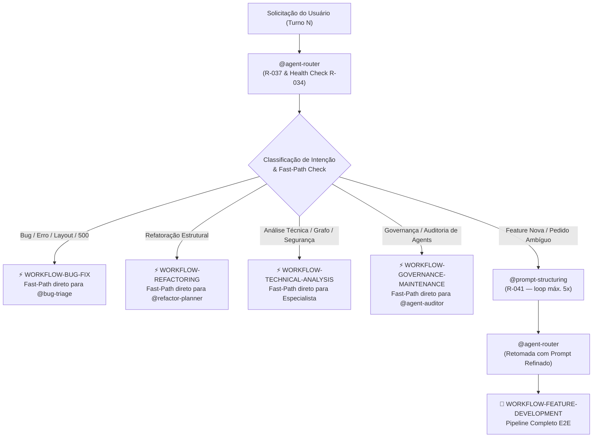
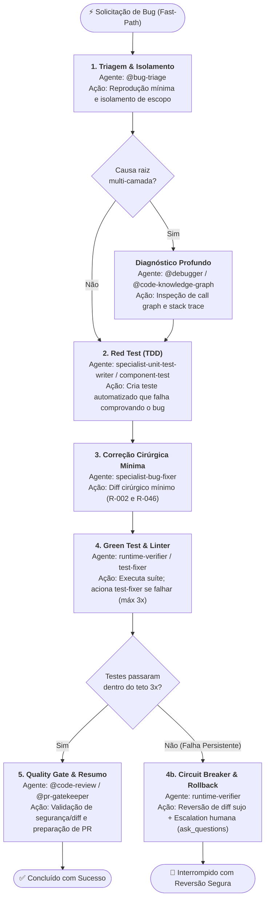
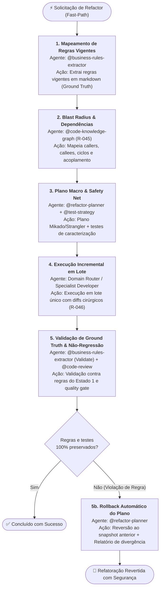
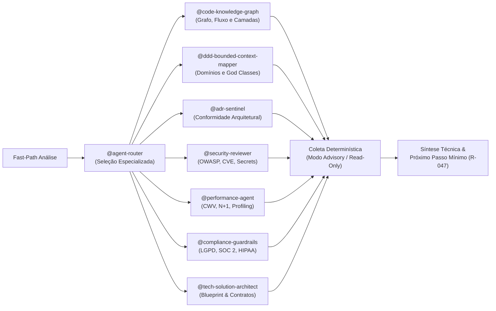
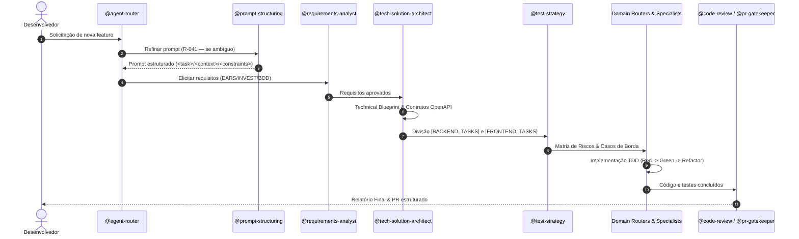
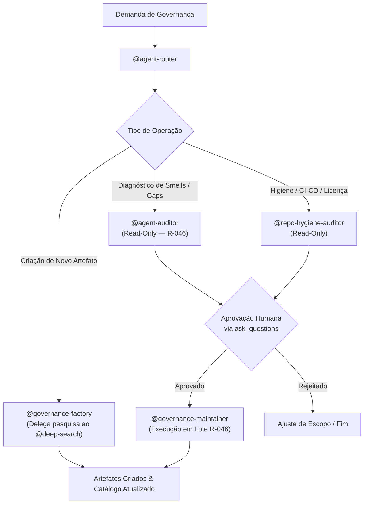
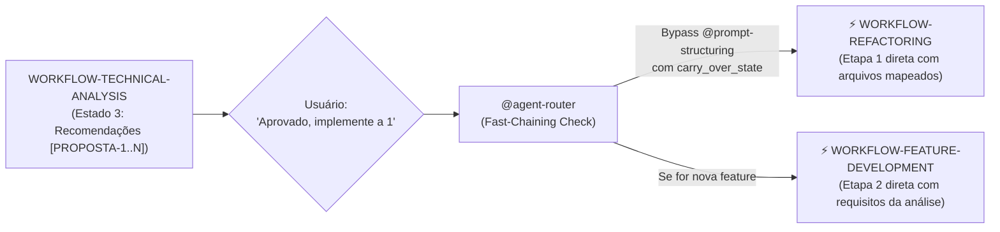

# Workflows Operacionais Determinísticos (R-050)

> **Fonte de verdade operacional:** [`CLAUDE.md`](../../CLAUDE.md) § R-050, R-041 e R-042.  
> **Grafo estrutural:** [`.github/agents/routing-graph.yaml`](routing-graph.yaml).  
> **Contratos e Handoff:** [`.github/skills/handoff-governance/SKILL.md`](../skills/handoff-governance/SKILL.md) e [`.github/skills/agent-contracts/SKILL.md`](../skills/agent-contracts/SKILL.md).

---

## 1. Visão Geral e Motivação

### 1.1 O Desafio Observado
Em sistemas multi-agent complexos, solicitações com intenções operacionais imediatas (ex.: relato de um bug em produção, erro 500, botão quebrado, falha de layout CSS) sofriam desvios e latência desnecessária quando interceptadas indiscriminadamente pelo `@prompt-structuring`. O modelo tentava reformatar ou realizar perguntas de clarificação sobre erros que já possuíam sintomas e stack traces explícitos, quebrando a fidelidade da cadeia de resolução.

### 1.2 A Solução de Mercado (Anthropic & LangGraph)
Conforme documentado no framework *Building Effective Agents* (Anthropic) e nas arquiteturas de estado finito do LangGraph:
- **Workflows (Pipelines Predefinidos)**: Sistemas onde modelos e ferramentas são orquestrados através de caminhos e transições previsíveis (State Machines). Indicados para tarefas operacionais de engenharia de software onde a ordem dos passos é bem definida e mandatária.
- **Agents (Sistemas Exploratórios)**: Sistemas onde o modelo decide dinamicamente a próxima ferramenta em loop aberto. Indicados para tarefas amplas de pesquisa ou problemas com espaço de busca desconhecido.
- **Fast-Path Determinístico**: Gatilhos explícitos de erro, refatoração estrutural ou diagnóstico técnico bypassam etapas genéricas de estruturação de prompt e ingressam imediatamente no workflow correspondente.

---

## 2. Matriz Geral de Roteamento de Workflows



---

## 3. Especificação dos 5 Workflows Canônicos

---

### 3.1 WORKFLOW 1: `WORKFLOW-BUG-FIX` (Resolução de Bugs, Falhas de Layout e Regressões)

- **Objetivo**: Identificar a causa raiz, reproduzir via teste automatizado isolado (Red Test), aplicar correção cirúrgica mínima (Green Test) e validar não-regressão.
- **Gatilhos de Fast-Path**: `"bug"`, `"erro"`, `"falha"`, `"500"`, `"NPE"`, `"não funciona"`, `"quebrou"`, `"layout quebrado"`, `"desalinhado"`, `"CSS quebrado"`, `"NullPointerException"`, `"regressão"`.
- **Política R-041**: **Bypass Total** de `@prompt-structuring`. Não reformatar prompt; o relato técnico é despachado imediatamente.



#### Cadeia Sequencial e Papéis:
1. **Estado 1 — Triagem & Hipótese (`@bug-triage`)**:
   - *Entrada*: Sintoma relatado, logs, stack trace ou print/descrição de layout.
   - *Saída*: Hipótese de causa raiz, componente afetado e passos de reprodução.
   - *Sub-rotina*: Se envolver call graph multi-camada complexo, invoca `@debugger` com `call_type: "subroutine"`.
2. **Estado 2 — Teste de Caracterização / Regressão (`specialist-unit-test-writer` / `component-test`)**:
   - *Entrada*: Hipótese de causa raiz e componente alvo.
   - *Saída*: Novo caso de teste unitário ou de componente no formato "deve [comportamento correto] quando [cenário de bug]" que falhe comprovando o defeito.
3. **Estado 3 — Correção Cirúrgica Mínima (`specialist-bug-fixer`)**:
   - *Entrada*: Arquivo alvo e teste falhando.
   - *Saída*: Diff cirúrgico mínimo (2 a 3 linhas de contexto), sem alterar código não relacionado.
4. **Estado 4 — Verificação Green Test & Linter (`runtime-verifier`)**:
   - *Entrada*: Código alterado e suíte de testes.
   - *Saída*: Confirmação de 100% dos testes passando e `get_errors` limpo em lote único (R-046). Se quebrar, aciona `@test-fixer` (máx. 3 iterações).
   - *Estado 4b — Circuit Breaker & Rollback*: Se após 3 tentativas os testes não passarem, o `runtime-verifier` reverte compulsoriamente os diffs alterados (workspace clean) e escala para intervenção humana via `ask_questions`.
5. **Estado 5 — Quality Gate & Resumo (`@code-review` / `@pr-gatekeeper`)**:
   - *Entrada*: Diff final e evidências de teste.
   - *Saída*: Resumo estruturado em 5 seções (R-028) ou preparação de PR via `@pr-gatekeeper`.

---

### 3.2 WORKFLOW 2: `WORKFLOW-REFACTORING` (Refatoração Estrutural e Modernização)

- **Objetivo**: Modificar a estrutura interna do código sem alterar seu comportamento observável, amparado por testes de caracterização (Golden Master), análise de blast radius via grafo e plano incremental com rollback.
- **Gatilhos de Fast-Path**: `"refatorar"`, `"refatoração"`, `"desacoplar"`, `"eliminar god class"`, `"clean architecture"`, `"modularizar"`, `"remover duplicação"`.
- **Política R-041**: **Bypass** se o alvo estiver claro. Se o pedido for genérico ("melhore a arquitetura"), aciona `@prompt-structuring`.


```

#### Cadeia Sequencial e Papéis:
1. **Estado 1 — Mapeamento de Regras Vigentes (`@business-rules-extractor`)**: Extrai regras de negócio do código atual em arquivos `.md` estruturados (modo Extract), servindo como baseline de verdade.
2. **Estado 2 — Blast Radius & Dependências (`@code-knowledge-graph`)**: Executa análise estrita determinística (R-045) via `@optave/codegraph` para identificar dependências transitivas, acoplamento e pontos de quebra. Proibido varredura manual.
3. **Estado 3 — Plano Macro & Safety Net (`@refactor-planner` + `@test-strategy`)**: Elabora plano estruturado (Mikado Method / Branch by Abstraction / Strangler Fig) com pontos de rollback e garante que testes de caracterização protejam o comportamento existente.
4. **Estado 4 — Execução Incremental em Lote (`domain router / specialists`)**: Aplica as alterações respeitando o protocolo R-046 (Single-Turn Batching / context-mode para 5+ arquivos).
5. **Estado 5 — Validação de Não-Regressão (`@business-rules-extractor` + `@code-review`)**: Executa modo Validate contra as regras documentadas no Estado 1 e emite parecer de revisão.

---

### 3.3 WORKFLOW 3: `WORKFLOW-TECHNICAL-ANALYSIS` (Análise Técnica, Diagnóstico e Auditoria)

- **Objetivo**: Conduzir investigações conceituais, diagnósticos de segurança, performance, conformidade de domínio ou levantamento de arquitetura de forma estritamente analítica e não mutativa.
- **Gatilhos de Fast-Path**: `"analisar"`, `"diagnosticar"`, `"como funciona"`, `"mapear arquitetura"`, `"verificar segurança"`, `"avaliar performance"`, `"conformidade adr"`, `"bounded context"`.
- **Política R-041**: **Bypass Total**. Direcionamento imediato ao especialista analítico.



#### Cadeia Sequencial e Papéis:
1. **Estado 1 — Despacho para Especialista Analítico**: O router direciona sem desvios para o agente cujo domínio cobre a pergunta.
2. **Estado 2 — Coleta & Diagnóstico Determinístico**: O agente opera estritamente em modo Read-Only / Advisory, utilizando ferramentas analíticas (AST, grafo, inspections, search) sem aplicar mutações de código.
3. **Estado 3 — Síntese e Próximo Passo Acionável (R-047)**: Emissão de relatório técnico estruturado com evidências de arquivo/linha, encerrando com sugestão de handoff para planejamento ou pergunta humana objetiva via `ask_questions`.

---

### 3.4 WORKFLOW 4: `WORKFLOW-FEATURE-DEVELOPMENT` (Nova Feature / Evolução Funcional E2E)

- **Objetivo**: Elicitar requisitos, conceber arquitetura técnica, desenhar contratos de API, definir matriz de testes por risco e implementar sob workflow TDD estrito.
- **Gatilhos**: `"criar feature"`, `"nova funcionalidade"`, `"implementar endpoint"`, `"adicionar tela"`, `"novo módulo"`.
- **Política R-041**: **Ativação Obrigatória** de `@prompt-structuring` caso a solicitação seja de alto nível ou ambígua.



#### Cadeia Sequencial e Papéis:
1. **Estado 1 — Estruturação de Prompt (`@prompt-structuring`)**: Transforma pedidos abertos no formato canônico `<task>/<context>/<constraints>/<output_format>`.
2. **Estado 2 — Elicitação de Requisitos (`@requirements-analyst` / `@feature-planner`)**: Detalha regras funcionais e não-funcionais com critérios de aceitação objetivos.
3. **Estado 3 — Technical Blueprint (`@tech-solution-architect`)**: Modela contratos de integração (OpenAPI), esquema de banco de dados e divisão de tarefas por stack.
4. **Estado 4 — Estratégia de Testes (`@test-strategy`)**: Mapeia casos de borda e cobertura recomendada por nível de risco antes de codificar.
5. **Estado 5 — Implementação Domain TDD (`domain routers & specialists`)**: Construção de código orientada por testes (primeiro o teste unitário/componente, depois a implementação).
6. **Estado 6 — Quality Gate & PR (`@code-review` -> `@pr-gatekeeper`)**: Revisão final de conformidade, convenções e emissão de diff semântico.

---

### 3.5 WORKFLOW 5: `WORKFLOW-GOVERNANCE-MAINTENANCE` (Governança e Manutenção do Ecossistema)

- **Objetivo**: Auditar, padronizar, expandir e manter o catálogo de agents, skills, prompts e convenções do repositório de governança.
- **Gatilhos de Fast-Path**: `"auditar governança"`, `"novo agent"`, `"nova skill"`, `"manutenção de catálogo"`, `"corrigir smell de agent"`, `"higiene de repositório"`.
- **Política R-041**: **Bypass** direto para diagnóstico ou factory.



#### Cadeia Sequencial e Papéis:
1. **Estado 1 — Diagnóstico Read-Only (`@agent-auditor` / `@repo-hygiene-auditor`)**: Avalia conformidade com templates canônicos, R-046, R-049 e detecta inconsistências sem alterar arquivos.
2. **Estado 2 — Checkpoint de Aprovação Humana (`ask_questions`)**: Apresenta as inconsistências e aguarda autorização explícita do plano de correção.
3. **Estado 3 — Execução Governada em Lote (`@governance-maintainer` / `@governance-factory`)**: Aplica as alterações estruturais em lote único no sandbox ou gera novos artefatos sincronizando os catálogos na mesma entrega (R-015).

---

## 4. Integração com o Protocolo de Handoff (`workflow_tracking`)

Para garantir que a cadeia sequencial seja seguida à risca e nenhum agente desvie do fluxo, todo handoff entre agentes em um workflow ativo transporta o bloco `workflow_tracking` dentro do `handoff_payload`:

```yaml
handoff_payload:
  versao: "1.2"
  para: "specialist-unit-test-writer"
  motivo: "Hipótese de bug confirmada — criar teste de regressão que falhe"
  emissor:
    nome: "bug-triage"
    versao: "1.1.0"
    modelo_llm: "Claude Sonnet 5"
    timestamp: "2026-09-10T12:00:00Z"
  workflow_tracking:
    workflow_id: "WORKFLOW-BUG-FIX"
    etapa_atual: 2
    total_etapas: 5
    nome_etapa: "red_test_reproduction"
    proximos_agentes_permitidos:
      - "specialist-bug-fixer"
    politica_desvio: "strict"  # proíbe delegar fora da lista sem evento R-042
  contexto:
    solicitacao_original: "Botão de login quebra com erro 500 ao clicar"
    trabalho_realizado: "Isolado NullPointerException no AuthService linha 45"
    descobertas_chave:
      - "Token JWT nulo ao submeter formulário sem provedor federado"
    artefatos:
      - "src/app/core/services/auth.service.ts"
  proximos_passos_sugeridos:
    - "Escrever spec isolado simulando payload sem provider"
```

---

## 5. Regras de Não-Desvio (Invariantes de Execução)

1. **Invariante de Fast-Path**: Se a mensagem de entrada descreve um bug, erro, crash ou falha visual de layout, o `@agent-router` NUNCA deve invocar `@prompt-structuring`. O ingresso no `WORKFLOW-BUG-FIX` via `@bug-triage` é mandatório.
2. **Invariante de Teste Prévio (TDD)**: No `WORKFLOW-BUG-FIX`, é terminantemente proibido invocar o `bug-fixer` sem antes ter o teste automatizado que reproduza a falha (Estado 2 obrigatório antes do Estado 3).
3. **Invariante de Grafo em Refatoração**: No `WORKFLOW-REFACTORING`, o `@refactor-planner` NUNCA deve realizar varredura manual de pastas; deve invocar compulsoriamente o `@code-knowledge-graph` para cálculo do blast radius (R-045).
4. **Invariante Anti Beco Sem Saída (R-047)**: Ao concluir seu estado, o agente ativo DEVE despachar via `run_subagent` para a próxima etapa do workflow OU invocar `ask_questions` caso dependa de decisão humana.
5. **Invariante de Deriva (R-042)**: Caso o usuário mude o escopo no meio do workflow (ex.: durante um bugfix, peça uma nova funcionalidade), o agente ativo aciona retorno imediato ao `@agent-router` com `motivo: "deriva_de_intencao"`.

---

## 6. Padrão de Visibilidade no Chat (Roadmap Visual de Execução — Anti-Cegueira)

Para que o usuário nunca fique no escuro quanto ao fluxo em andamento, o `@agent-router` (ao despachar o workflow) e cada agente participante (ao reportar sua etapa) **DEVEM obrigatoriamente** renderizar o bloco visual `### 🗺️ Pipeline de Execução do Workflow` no início de sua mensagem.

### 6.1 Marcadores de Status Padronizados
- `[✅]` **Concluído**: Etapa finalizada com sucesso e evidência registrada.
- `[▶]` **Em Andamento (Atual)**: Etapa sob execução do agente ativo no turno.
- `[⏳]` **Pendente**: Etapa futura a ser executada na sequência.

---

### 6.2 Templates Visuais por Workflow

#### WORKFLOW 1: `WORKFLOW-BUG-FIX` (5 etapas)
```markdown
### 🗺️ Pipeline de Execução: WORKFLOW-BUG-FIX (5 etapas)
- [▶] **Etapa 1: Triagem & Causa Raiz** → `@bug-triage` *(Em Andamento: reprodução mínima e isolamento)*
- [⏳] **Etapa 2: Red Test de Caracterização** → `specialist-unit-test-writer` *(Pendente: teste automatizado que falha comprovando o bug)*
- [⏳] **Etapa 3: Correção Cirúrgica Mínima** → `specialist-bug-fixer` *(Pendente: diff cirúrgico R-002/R-046)*
- [⏳] **Etapa 4: Validação Green Test & Linter** → `runtime-verifier` *(Pendente: 100% testes passando e linter limpo)*
- [⏳] **Etapa 5: Quality Gate & Resumo** → `@code-review` / `@pr-gatekeeper` *(Pendente: revisão final e PR)*
```

#### WORKFLOW 2: `WORKFLOW-REFACTORING` (5 etapas)
```markdown
### 🗺️ Pipeline de Execução: WORKFLOW-REFACTORING (5 etapas)
- [▶] **Etapa 1: Mapeamento de Regras Vigentes** → `@business-rules-extractor` *(Em Andamento: extração de ground truth em .md)*
- [⏳] **Etapa 2: Blast Radius & Dependências** → `@code-knowledge-graph` *(Pendente: análise determinística via @optave/codegraph)*
- [⏳] **Etapa 3: Plano Macro & Safety Net** → `@refactor-planner` + `@test-strategy` *(Pendente: Mikado/Strangler e testes de caracterização)*
- [⏳] **Etapa 4: Execução Incremental em Lote** → `Domain Router / Specialists` *(Pendente: batch execution R-046)*
- [⏳] **Etapa 5: Validação de Regras & Não-Regressão** → `@business-rules-extractor` + `@code-review` *(Pendente: checagem contra regras do Estado 1)*
```

#### WORKFLOW 3: `WORKFLOW-TECHNICAL-ANALYSIS` (3 etapas)
```markdown
### 🗺️ Pipeline de Execução: WORKFLOW-TECHNICAL-ANALYSIS (3 etapas)
- [▶] **Etapa 1: Despacho para Especialista Analítico** → `@<especialista>` *(Em Andamento: direcionamento direto)*
- [⏳] **Etapa 2: Coleta Determinística Read-Only** → `@<especialista>` *(Pendente: modo Advisory sem mutação de código)*
- [⏳] **Etapa 3: Síntese Técnica & Próximo Passo** → `@<especialista>` *(Pendente: relatório estruturado e handoff R-047)*
```

#### WORKFLOW 4: `WORKFLOW-FEATURE-DEVELOPMENT` (6 etapas)
```markdown
### 🗺️ Pipeline de Execução: WORKFLOW-FEATURE-DEVELOPMENT (6 etapas)
- [▶] **Etapa 1: Prompt Structuring** → `@prompt-structuring` *(Em Andamento: refinamento <task>/<context>/<constraints>)*
- [⏳] **Etapa 2: Elicitação de Requisitos** → `@requirements-analyst` / `@feature-planner` *(Pendente: critérios de aceitação BDD/EARS)*
- [⏳] **Etapa 3: Technical Blueprint & Contratos** → `@tech-solution-architect` *(Pendente: OpenAPI, modelo de dados e divisão por stack)*
- [⏳] **Etapa 4: Estratégia de Testes (TDD)** → `@test-strategy` *(Pendente: matriz de riscos e casos de borda)*
- [⏳] **Etapa 5: Implementação Domain TDD** → `Domain Routers & Specialists` *(Pendente: ciclo Red-Green-Refactor)*
- [⏳] **Etapa 6: Quality Gate & PR Preparation** → `@code-review` -> `@pr-gatekeeper` *(Pendente: revisão final e PR)*
```

#### WORKFLOW 5: `WORKFLOW-GOVERNANCE-MAINTENANCE` (3 etapas)
```markdown
### 🗺️ Pipeline de Execução: WORKFLOW-GOVERNANCE-MAINTENANCE (3 etapas)
- [▶] **Etapa 1: Diagnóstico Read-Only** → `@agent-auditor` / `@repo-hygiene-auditor` *(Em Andamento: auditoria estrutural)*
- [⏳] **Etapa 2: Checkpoint de Aprovação Humana** → `ask_questions` *(Pendente: aprovação explícita do plano)*
- [⏳] **Etapa 3: Execução Governada em Lote** → `@governance-maintainer` / `@governance-factory` *(Pendente: sincronização em lote R-046)*
```

---

## 7. Protocolo de Encadeamento de Workflows (Workflow Chaining & State Carry-Over — R-050.1)

### 7.1 O Problema da Perda de Contexto Pós-Diagnóstico
Quando um workflow analítico (`WORKFLOW-TECHNICAL-ANALYSIS`) conclui seu relatório (ex.: *"Identificadas 3 oportunidades de melhoria no módulo de agendamento do projeto [PROJETO-ALVO]"*), o usuário naturalmente responde no turno seguinte com uma ordem direta:
> *"Pode implementar a sugestão 1 e 2"* ou *"Aprovado, aplique a refatoração proposta"*.

Sem um protocolo explícito de encadeamento:
- O `@agent-router` (ao reavaliar no turno N+1 sob R-042) recebe uma frase curta fora de contexto ("implemente a 1").
- O roteador poderia classificar a frase como "ambígua" e desviá-la erroneamente para o `@prompt-structuring`.
- Mesmo se roteasse para um desenvolvedor, o agente downstream começaria do zero sem saber quais arquivos e linhas o especialista acabou de diagnosticar.

### 7.2 Regra de Fast-Chaining (Transição com Herança de Estado)
1. **Estruturação da Saída no Estado 3 (Análise)**: O especialista analítico SEMPRE rotula suas recomendações com identificadores formais (`[PROPOSTA-1]`, `[PROPOSTA-2]`) e indica o workflow de destino recomendado (`proximo_workflow: "WORKFLOW-REFACTORING"` ou `"WORKFLOW-FEATURE-DEVELOPMENT"`).
2. **Reconhecimento pelo `@agent-router` (Passo 0.4 - Fast-Chaining)**: Quando a mensagem do usuário for uma aprovação, seleção ou comando de execução baseado na análise do turno anterior (ex.: *"implemente a 1"*, *"aplique a melhoria"*, *"siga com o plano"*), o roteador:
   - **Bypassa 100% o `@prompt-structuring`**.
   - Identifica o workflow executivo correspondente (`WORKFLOW-REFACTORING` para melhorias de código existente, `WORKFLOW-FEATURE-DEVELOPMENT` para novas features, `WORKFLOW-BUG-FIX` se foi diagnóstico de erro).
   - Injeta o `carry_over_state` no `workflow_tracking.chaining` do handoff, transferindo os artefatos, classes e regras já mapeadas diretamente para a Etapa 1 do novo workflow.



---

## 8. Circuit Breaker, Tolerância a Falhas e Estados de Rollback (R-050.2)

### 8.1 Prevenção de Loops e Corrupção de Workspace
Nenhum workflow mutativo pode deixar o repositório em estado quebrado, sujo ou entrar em loops infinitos de autocorreção.

1. **Orçamento Rígido de Autocorreção (Circuit Breaker)**:
   - Em `WORKFLOW-BUG-FIX` (Etapa 4), o `@test-fixer` possui um teto absoluto de **3 tentativas** para corrigir testes quebrados.
   - Se os testes não passarem na 3ª tentativa, o fluxo **NÃO** prossegue para o Quality Gate nem continua tentando cegamente.
2. **Ativação Compulsória do Estado de Rollback (Estado 4b / 5b)**:
   - O agente (`runtime-verifier` ou `@refactor-planner`) executa imediatamente a reversão dos diffs modificados nesta sessão (restauração do workspace ao estado limpo pré-execução).
   - O agente gera um relatório compacto de falha (3 linhas: Causa, Local, Ação sugerida) e aciona `ask_questions` para decisão humana:
     - *Opção A: Ajustar a estratégia de teste manualmente.*
     - *Opção B: Revisar hipótese de causa raiz.*
     - *Opção C: Cancelar a tarefa mantendo o workspace limpo.*
3. **Rollback em Refatoração (Estado 5b)**:
   - Se o `@business-rules-extractor` detectar no Estado 5 que qualquer regra de negócio do ground truth (Estado 1) foi alterada ou violada, o plano de rollback desenhado no Estado 3 é acionado automaticamente antes de qualquer aprovação humana.

---

## 9. Rastreamento Multi-Projeto no `workflow_tracking` (`projeto_alvo` — R-050.3)

### 9.1 O Desafio de Repositórios Externos Conectados
Em ecossistemas multi-projeto onde este repositório (`deep-agents-copilot`) atua como base de governança central e outros projetos (ex.: `[PROJETO-ALVO]`) são repositórios de produto conectados:
- O agente downstream precisa saber a raiz exata do projeto (`project_root`).
- O agente deve carregar as instruções específicas do projeto (`.github/instructions/local/<projeto>.instructions.md` — R-043).
- É terminantemente proibido criar arquivos de código da aplicação dentro do repositório de governança (R-034/R-043).

### 9.2 Schema de `projeto_alvo` no Handoff (v1.3)
Todo handoff executivo transporta o contexto do projeto resolvido no `workflow_tracking`:

```yaml
workflow_tracking:
  workflow_id: "WORKFLOW-TECHNICAL-ANALYSIS"
  etapa_atual: 1
  total_etapas: 3
  nome_etapa: "advisory_dispatch"
  projeto_alvo:
    id: "[PROJETO-ALVO]"
    root_path: "<workspace>/[PROJETO-ALVO]"
    adapter_ref: ".github/instructions/local/[PROJETO-ALVO].instructions.md"
  chaining:
    origem_workflow_id: null       # ou "WORKFLOW-TECHNICAL-ANALYSIS" se veio de chaining
    proposta_referenciada: null    # ex.: "PROPOSTA-1"
    carry_over_state:
      arquivos_afetados:
        - "src/app/features/exemplo/exemplo-list.component.ts"
      diagnostico_previo: "3 memory leaks detectados em subscriptions manuais sem takeUntil"
```
Com esse bloco, qualquer especialista na cadeia sequencial sabe exatamente onde ler, onde testar e quais convenções de stack aplicar, sem ambiguidades.


