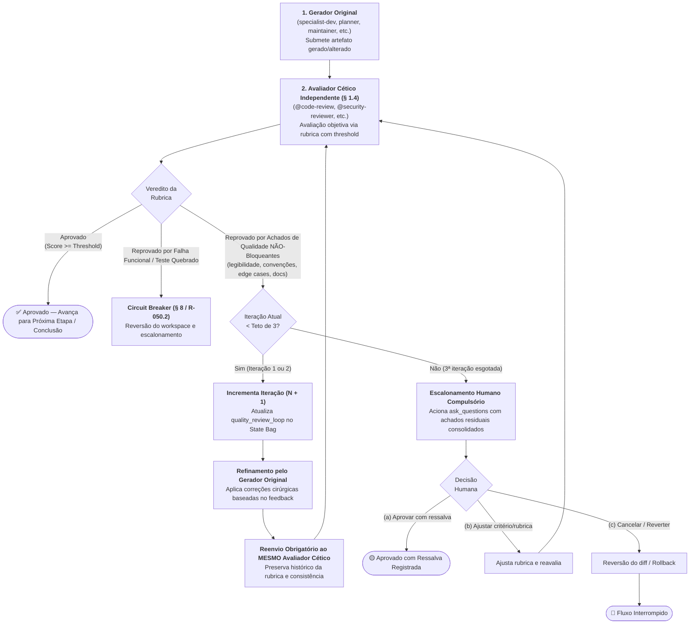
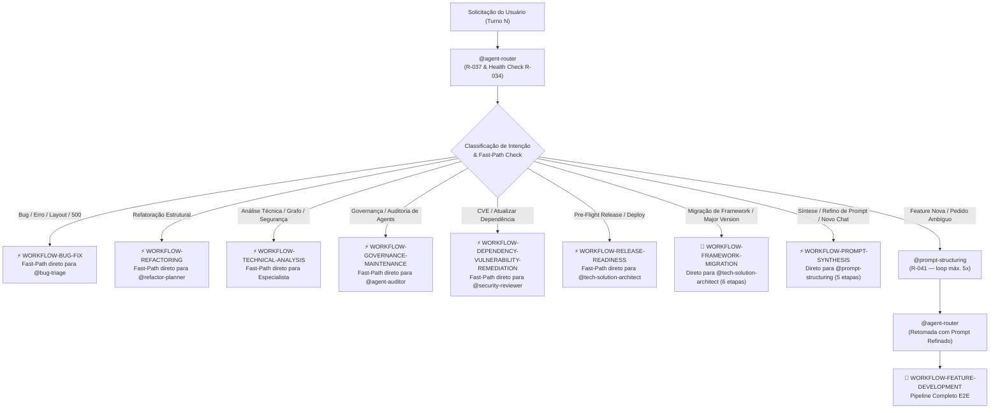

# Workflows Operacionais Determinísticos (R-050)

> **Fonte de verdade operacional:** [`CLAUDE.md`](../../CLAUDE.md) § R-050, R-041 e R-042.  
> **Grafo estrutural:** [`.github/agents/routing-graph.yaml`](routing-graph.yaml).  
> **Contratos e Handoff:** [`.github/skills/handoff-governance/SKILL.md`](../skills/handoff-governance/SKILL.md) e [`.github/skills/agent-contracts/SKILL.md`](../skills/agent-contracts/SKILL.md).

---

## 1. Visão Geral e Motivação

### 1.1 O Desafio Observado
Em sistemas multi-agent complexos, solicitações com intenções operacionais imediatas (ex.: relato de um bug em produção, erro 500, botão quebrado, falha de layout CSS) sofriam desvios e latência desnecessária quando interceptadas indiscriminadamente pelo `@prompt-structuring`. O modelo tentava reformatar ou realizar perguntas de clarificação sobre erros que já possuíam sintomas e stack traces explícitos, quebrando a fidelidade da cadeia de resolução.

### 1.2 A Solução de Mercado (Anthropic & LangGraph)
Conforme documentado no framework *Building Effective Agents* (Anthropic) e nas arquiteturas de estado finito do LangGraph:
- **Workflows (Pipelines Predefinidos)**: Sistemas onde modelos e ferramentas são orquestrados através de caminhos e transições previsíveis (State Machines). Indicados para tarefas operacionais de engenharia de software onde a ordem dos passos é bem definida e mandatária.
- **Agents (Sistemas Exploratórios)**: Sistemas onde o modelo decide dinamicamente a próxima ferramenta em loop aberto. Indicados para tarefas amplas de pesquisa ou problemas com espaço de busca desconhecido.
- **Fast-Path Determinístico**: Gatilhos explícitos de erro, refatoração estrutural ou diagnóstico técnico bypassam etapas genéricas de estruturação de prompt e ingressam imediatamente no workflow correspondente.

### 1.3 Convenção de Nomenclatura: Resolução de Papéis Genéricos (`specialist-<papel>`)

Para permanecer agnóstico de stack (R-038), este documento referencia os executores táticos através de **papéis genéricos** (`specialist-bug-fixer`, `specialist-ui-stylist`, `specialist-unit-test-writer`, `specialist-component-test-writer`, `specialist-integration-test-writer`, `specialist-test-fixer`, `specialist-feature-developer`, `specialist-arch-advisor`). **Nenhum desses nomes existe literalmente no catálogo** — são aliases resolvidos em tempo de roteamento pelo *domain router* ativo (`@angular-router`, `@react-router`, `@spring-boot-router`, `@spring-reactive-router`, `@ejb-router`, `@struts-router`, `@database-router`, `@python-router`) para o agente concreto do seu sub-catálogo (`*-catalog.yaml`) que declara a tag `role:` correspondente.

| Papel Genérico | Tag `role:` | Angular | Spring Boot | Spring Reactive | EJB | Struts |
|---|---|---|---|---|---|---|
| `specialist-bug-fixer` | `fixer` | `angular-developer` | `spring-boot-developer` | `spring-reactive-developer` | `ejb-developer` | `struts-developer` |
| `specialist-ui-stylist` | `stylist` | `angular-developer` | _N/A (sem UI)_ | _N/A (sem UI)_ | _N/A (sem UI)_ | _N/A (sem UI)_ |
| `specialist-unit-test-writer` | `tester` (sem DOM/contexto de framework) | `angular-test-engineer` | `spring-boot-test-engineer` | `spring-reactive-test-engineer` | `ejb-test-engineer` | `struts-test-engineer` |
| `specialist-component-test-writer` | `tester` (com DOM/TestBed) | `angular-test-engineer` | _N/A → usar `test-engineer`_ | _N/A → usar `test-engineer`_ | _N/A → usar `test-engineer`_ | _N/A → usar `test-engineer`_ |
| `specialist-integration-test-writer` | `tester` (com contexto de framework) | _N/A → usar `test-engineer`_ | `spring-boot-test-engineer` | `spring-reactive-test-engineer` | `ejb-test-engineer` | `struts-test-engineer` |
| `specialist-test-fixer` | `fixer` (escopo teste) | `angular-test-engineer` | `spring-boot-test-engineer` | `spring-reactive-test-engineer` | `ejb-test-engineer` | `struts-test-engineer` |
| `specialist-feature-developer` | `implementer` | `angular-developer` | `spring-boot-developer` | `spring-reactive-developer` | `ejb-developer` | `struts-developer` |
| `specialist-arch-advisor` | `advisory` | `angular-arch-advisor` | `spring-boot-arch-advisor` | `spring-reactive-arch-advisor` | `ejb-arch-advisor` | `struts-arch-advisor` |

**Regras de Resolução (obrigatórias):**
1. **Proibido invocar `run_subagent` com o nome genérico literal** — `specialist-bug-fixer` NÃO é um `agentName` válido; o domain router SEMPRE resolve para o `id` concreto do seu sub-catálogo antes de despachar.
2. **Match de `proximos_agentes_permitidos` em `politica_desvio: "strict"`**: quando a lista declarar um papel genérico, a validação de conformidade ocorre pela tag `role:` do agente concreto delegado (não pela string literal) — ex.: `angular-developer` satisfaz `specialist-bug-fixer` porque ambos compartilham `role: "fixer"` no domínio Angular ativo.
3. **Banco de dados é exceção nomeada**: sub-rotinas de schema/DDL nunca usam papel genérico — referenciam sempre `@database-specialist` (agente único, cross-stack) por nome literal.
4. **Stack não identificada**: se o `@bug-triage`/`@refactor-planner` não conseguir inferir a stack (nenhum domain router aplicável), o estado correspondente aciona `ask_questions` para confirmar a stack antes de resolver o papel genérico — nunca infere silenciosamente.

### 1.4 Padrão Gerador–Avaliador Cético (Generator-Evaluator Skeptical Pattern)

**Fundamentação de mercado**: Anthropic (*Harness design for long-running application development*, Mar/2026) demonstrou que agentes avaliando o próprio trabalho tendem à complacência ("self-grading leniency") — mesmo diante de resultados objetivamente medíocres. A separação estrutural entre quem **gera** o artefato e quem o **avalia** — com o avaliador operando sob rubrica cética e independente — eleva substancialmente a taxa de detecção de defeitos sem depender de troca de modelo.

**Aplicação nos Workflows Canônicos**: Este padrão já está estruturalmente presente em `WORKFLOW-BUG-FIX` (Estado 2 = Gerador do Red Test; Estado 5 = Avaliador Cético via Quality Gate) e `WORKFLOW-FEATURE-DEVELOPMENT` (Estado 2 = negociação do contrato de aceitação; Estado 5 = Gerador da implementação; Estado 6 = Avaliador Cético via Gates de Segurança/UI/Code Review). Para tornar essa separação explícita e auditável:

1. **Mini-Contrato de Aceitação Pré-Negociado (Sprint Contract)**: Antes de o Gerador produzir o artefato final, ele propõe por escrito os critérios objetivos de "concluído" (comportamento esperado, casos de borda cobertos, forma de verificação). O Avaliador revisa e aprova esse contrato **antes** da implementação — evitando que a definição de sucesso seja inventada retroativamente pelo próprio Gerador.
2. **Rubrica de Corte Objetiva do Avaliador**: O Avaliador Cético (`runtime-verifier`, `code-review`, `security-reviewer`, `angular-developer` conforme o gate) julga contra critérios explícitos com limiar de corte (`threshold`), não contra impressão subjetiva. Qualquer critério abaixo do limiar reprova o artefato inteiro, mesmo que os demais critérios estejam excelentes (nenhuma média compensatória).
3. **Independência de Avaliação**: O Avaliador nunca é a mesma invocação/contexto que gerou o artefato — mesmo quando o mesmo agent desempenha os dois papéis em momentos distintos do workflow (ex.: `specialist-feature-developer` gera; `@code-review` avalia), a avaliação ocorre em uma etapa e contexto discretos, com acesso às evidências de execução real (testes rodados, logs, diffs) e não apenas ao código-fonte estático.
4. **Registro no `workflow_state`**: Todo workflow que aplica este padrão declara os campos `sprint_contract` (critérios negociados) e `avaliacao_cetica` (rubrica aplicada, nota por critério, veredito) — ver Typed State Bags de `WORKFLOW-BUG-FIX` § 3.1 e `WORKFLOW-FEATURE-DEVELOPMENT` § 3.4.

### 1.5 Loop de Revisão de Qualidade (Quality Review Loop)

**Fundamentação de mercado**: Este padrão implementa formalmente o fluxo **Evaluator-Optimizer** (Anthropic, *Building Effective Agents*, 2024), complementado pelas evidências empíricas de **Self-Refine** (Madaan et al., 2023) e **Reflexion** (Shinn et al., 2023). Pesquisas demonstram que loops de refinamento com feedback externo atingem retornos decrescentes expressivos após aproximadamente 3 iterações — além desse ponto, o modelo tende a oscilar entre soluções sem ganho real de qualidade. Consistente com esse consenso, o próprio **GitHub Copilot coding agent** limita seu ciclo autônomo de auto-revisão a 2–3 rodadas antes de consolidar o Pull Request e documentar achados residuais para o desenvolvedor humano.

**Distinção entre os Mecanismos de Controle**:
Para evitar sobreposição e ambiguidade operacional, o ecossistema distingue rigidamente três mecanismos complementares:

| Mecanismo | Escopo / Problema Resolvido | Ator Responsável | Ação ao Atingir Limite |
| :--- | :--- | :--- | :--- |
| **§ 1.4 Gerador–Avaliador Cético** | **Quem avalia**: separação estrita de papéis para eliminar auto-complacência (*self-grading leniency*). | Avaliador Cético independente (`@code-review`, `@security-reviewer`, etc.). | Reprovação objetiva via rubrica com limiar de corte (*threshold*). |
| **§ 8 / R-050.2 Circuit Breaker** | **Falha funcional/teste**: quebra de build, testes vermelhos ou violação de regras invariantes. | `specialist-test-fixer` / Especialista de Stack. | Reversão do workspace (Rollback State) e escalonamento humano via `ask_questions`. |
| **§ 1.5 Loop de Revisão de Qualidade** | **Qualidade e estilo pós-avaliação**: refinamento de achados NÃO-bloqueantes (nomenclatura, edge cases, legibilidade, linting). | Gerador revisa; mesmo Avaliador Cético reavalia. | Parada no teto de 3 iterações e escalonamento via `ask_questions` com achados residuais. |


```mermaid
flowchart TD
    Gen["<b>1. Gerador Original</b><br/>(specialist-dev, planner, maintainer, etc.)<br/>Submete artefato gerado/alterado"] --> Eval["<b>2. Avaliador Cético Independente (§ 1.4)</b><br/>(@code-review, @security-reviewer, etc.)<br/>Avaliação objetiva via rubrica com threshold"]

    Eval --> CheckVerdict{"Veredito da<br/>Rubrica"}

    CheckVerdict -- "Aprovado<br/>(Score >= Threshold)" --> Approved(["✅ Aprovado — Avança para Próxima Etapa / Conclusão"])

    CheckVerdict -- "Reprovado por Falha Funcional / Teste Quebrado" --> CircuitBreaker["<b>Circuit Breaker (§ 8 / R-050.2)</b><br/>Reversão do workspace e escalonamento"]

    CheckVerdict -- "Reprovado por Achados de Qualidade NÃO-Bloqueantes<br/>(legibilidade, convenções, edge cases, docs)" --> CheckIter{"Iteração Atual<br/>&lt; Teto de 3?"}

    CheckIter -- "Sim (Iteração 1 ou 2)" --> IncIter["<b>Incrementa Iteração (N + 1)</b><br/>Atualiza quality_review_loop no State Bag"]
    IncIter --> Refine["<b>Refinamento pelo Gerador Original</b><br/>Aplica correções cirúrgicas baseadas no feedback"]
    Refine --> Resubmit["<b>Reenvio Obrigatório ao MESMO Avaliador Cético</b><br/>Preserva histórico da rubrica e consistência"]
    Resubmit --> Eval

    CheckIter -- "Não (3ª iteração esgotada)" --> Escalate["<b>Escalonamento Humano Compulsório</b><br/>Aciona ask_questions com achados residuais consolidados"]
    Escalate --> HumanDecision{"Decisão<br/>Humana"}
    HumanDecision -- "(a) Aprovar com ressalva" --> ApprovedCaveat(["🟡 Aprovado com Ressalva Registrada"])
    HumanDecision -- "(b) Ajustar critério/rubrica" --> AdjustRubric["Ajusta rubrica e reavalia"] --> Eval
    HumanDecision -- "(c) Cancelar / Reverter" --> Rollback["Reversão do diff / Rollback"] --> EndCancel(["🛑 Fluxo Interrompido"])
```

**Regras Normativas do Mecanismo**:

1. **Gatilho**: O Avaliador Cético (§ 1.4) reprova o artefato por achados de qualidade **não-bloqueantes** (ex.: legibilidade, convenções de estilo, cobertura de casos de borda adicionais, documentação interna ou modularização). **R-065 (Guard de Severidade Arquitetural no Loop de Qualidade)**: Achados bloqueantes de segurança (OWASP Top 10, CVEs críticas), violações funcionais de regra de negócio, violação de Contract Testing/API pública (WORKFLOW-REFACTORING), violação de blueprint/Sprint Contract do `tech-solution-architect` ou `<stack>-arch-advisor` (WORKFLOW-FEATURE-DEVELOPMENT) e quebra de Matriz De-Para/Symbol Exhaustion Gate (WORKFLOW-FRAMEWORK-MIGRATION) NÃO entram neste loop — seguem imediatamente os fluxos de rollback (§ 8) ou retornam ao `<stack>-arch-advisor`/`tech-solution-architect` via domain-router, nunca diretamente a especialista de implementação nominal (ex.: `<stack>-bug-fixer`, `<stack>-feature-developer`).
2. **Ciclo de Refinamento com Mesmo Avaliador**: O Gerador original recebe o feedback estruturado do Avaliador Cético, aplica as correções cirúrgicas e submete o artefato revisado compulsoriamente para o **mesmo Avaliador** que emitiu o parecer (preservando o histórico da rubrica e evitando discrepâncias entre avaliadores distintos).
3. **Teto Rígido de 3 Iterações (R-055 / Anti-Silo Reuse)**: O loop é estritamente limitado ao teto de **3 iterações** (idêntico ao limiar do Circuit Breaker R-050.2, reaproveitado deliberadamente para coerência e integridade da governança). É vedado qualquer loop aberto ou indeterminado.
4. **Critério de Corte Objetivo**: A reavaliação utiliza a mesma rubrica com limiar de corte (`threshold`) pré-estabelecida no Estado de avaliação (§ 1.4) — qualquer critério abaixo do corte mantém a reprovação, sendo terminantemente proibida média compensatória.
5. **Escalonamento Humano Obrigatório ao Esgotar**: Se a 3ª iteração for concluída sem aprovação integral, o Avaliador Cético interrompe o ciclo e aciona compulsoriamente `ask_questions`, apresentando ao usuário o relatório consolidado de achados residuais com as 3 opções canônicas: *(a)* Aprovar com ressalva registrada; *(b)* Ajustar o critério da rubrica; ou *(c)* Cancelar a entrega e reverter o diff. Nunca aprova silenciosamente nem continua iterando.
6. **Rastreamento no `workflow_state`**: Todo workflow que executa este loop declara e atualiza o bloco estruturado no State Bag:
```yaml
quality_review_loop:
  iteracao_atual: 1  # 1 a 3
  max_iteracoes: 3
  achados_pendentes:
    - "achado de qualidade ou estilo"
  veredito: "em_andamento | aprovado | escalado_para_humano"
```
7. **Aplicabilidade Restrita**: Mecanismo opt-in por workflow, com aplicação formalizada nos seguintes Estados: `WORKFLOW-BUG-FIX` (Estado 5), `WORKFLOW-REFACTORING` (Estado 5), `WORKFLOW-FEATURE-DEVELOPMENT` (Estado 6), `WORKFLOW-GOVERNANCE-MAINTENANCE` (Estado 4), `WORKFLOW-DEPENDENCY-VULNERABILITY-REMEDIATION` (Estado 5) e `WORKFLOW-FRAMEWORK-MIGRATION` (Estado 6).

---


## 2. Matriz Geral de Roteamento de Workflows


```mermaid
flowchart TD
    UserReq["Solicitação do Usuário (Turno N)"] --> Router["@agent-router\n(R-037 & Health Check R-034)"]
    Router --> IntentEval{"Classificação de Intenção\n& Fast-Path Check"}

    IntentEval -- "Bug / Erro / Layout / 500" --> WF1["⚡ WORKFLOW-BUG-FIX\nFast-Path direto para @bug-triage"]
    IntentEval -- "Refatoração Estrutural" --> WF2["⚡ WORKFLOW-REFACTORING\nFast-Path direto para @refactor-planner"]
    IntentEval -- "Análise Técnica / Grafo / Segurança" --> WF3["⚡ WORKFLOW-TECHNICAL-ANALYSIS\nFast-Path direto para Especialista"]
    IntentEval -- "Governança / Auditoria de Agents" --> WF5["⚡ WORKFLOW-GOVERNANCE-MAINTENANCE\nFast-Path direto para @agent-auditor"]
    IntentEval -- "CVE / Atualizar Dependência" --> WF6["⚡ WORKFLOW-DEPENDENCY-VULNERABILITY-REMEDIATION\nFast-Path direto para @security-reviewer"]
    IntentEval -- "Pre-Flight Release / Deploy" --> WF8["⚡ WORKFLOW-RELEASE-READINESS\nFast-Path direto para @tech-solution-architect"]
    IntentEval -- "Migração de Framework / Major Version" --> WF7["🚀 WORKFLOW-FRAMEWORK-MIGRATION\nDireto para @tech-solution-architect (6 etapas)"]
    IntentEval -- "Síntese / Refino de Prompt / Novo Chat" --> WF9["⚡ WORKFLOW-PROMPT-SYNTHESIS\nDireto para @prompt-structuring (5 etapas)"]
    IntentEval -- "Feature Nova / Pedido Ambíguo" --> Structuring["@prompt-structuring\n(R-041 — loop máx. 5x)"]

    Structuring --> RouterRet["@agent-router\n(Retomada com Prompt Refinado)"]
    RouterRet --> WF4["🚀 WORKFLOW-FEATURE-DEVELOPMENT\nPipeline Completo E2E"]
```

### 2.1 Resumo dos Pipelines Determinísticos & Quality Gates

| Workflow | Fast-Path | Pipeline Canônico & Quality Gate |
| :--- | :--- | :--- |
| `WORKFLOW-BUG-FIX` | `⚡ Sim` | `1. Triagem (RCA 2 fontes) -> 2. Red Test -> [Plano de Implementação R-064] -> 3. Fix Cirúrgico -> 4. Green Test -> [5. Quality Gate & Quality Review Loop (§ 1.5)]` |
| `WORKFLOW-REFACTORING` | `⚡ Sim` | `1. Ground Truth -> 2. Blast Radius & Contratos -> 3. Plano Mikado -> [Plano de Implementação R-064] -> 4. Execução em Lote -> [5. Validação & Quality Review Loop (§ 1.5)]` |
| `WORKFLOW-TECHNICAL-ANALYSIS` | `⚡ Sim` | `1. Despacho Especialista -> 2. Coleta Read-Only -> 3. Síntese Técnica & Propostas` |
| `WORKFLOW-FEATURE-DEVELOPMENT` | `❌ Não (R-041)` | `1. Prompt Structuring -> 2. Requisitos -> 3. Blueprint -> 4. Estratégia Testes -> [Plano de Implementação R-064] -> 5. TDD -> [6. Duplo Gate & Quality Review Loop (§ 1.5)]` |
| `WORKFLOW-GOVERNANCE-MAINTENANCE` | `⚡ Sim` | `1. Diagnóstico/Pesquisa -> 2. Checkpoint Humano -> [Plano de Governança R-064] -> 3. Execução em Lote -> [4. Quality Gate & Quality Review Loop (§ 1.5)]` |
| `WORKFLOW-DEPENDENCY-VULNERABILITY-REMEDIATION` | `⚡ Sim` | `1. Triagem SCA -> 2. Blast Radius -> [Plano de Implementação R-064] -> 3. Bump & Lockfile -> 4. Adaptação Breaking -> [5. Quality Gate SCA & Quality Review Loop (§ 1.5)]` |
| `WORKFLOW-FRAMEWORK-MIGRATION` | `⚡ Sim` | `1. 5D & Símbolos -> 2. Blueprint & De-Para -> 3. Plano de Implementação R-064 -> 4. Codemod Lote -> 5. Paridade Dual -> 6. Baseline Gate -> [7. Redundancy Gate & Quality Review Loop (§ 1.5)]` |
| `WORKFLOW-RELEASE-READINESS` | `⚡ Sim` | `1. Contratos OpenAPI -> 2. Rollout DDL -> 3. Segredos & Higiene -> 4. Changelog & SemVer -> 5. Veredito Go/No-Go` |
| `WORKFLOW-PROMPT-SYNTHESIS` | `⚡ Sim` | `1. Elicitação -> 2. Context Grounding -> 3. Restrições -> 4. Síntese Estruturada -> 5. Quality Gate (.md)` |

---

## 3. Especificação dos Workflows Canônicos e de Ciclo de Vida (9 Workflows Determinísticos)

> **Nota de Exceção Explícita de Governança — Agentes de Bootstrap e Onboarding (R-050)**:
> Os agentes `@binding-initializer` e `@adapter-generator` são categorizados formalmente como agentes de bootstrap técnico e verificação estrutural (`tipo: health_check` / onboarding de tooling local). Por sua natureza de ciclo de vida prévio (execução isolada sob demanda para inicialização de bindings e geração de adapters), eles operam intencionalmente fora dos 9 workflows operacionais canônicos aqui especificados, estando catalogados em `catalog.yaml` para suporte operacional e diagnóstico de ambiente.

---


### 3.1 [`WORKFLOW-BUG-FIX`](workflows/workflow-bug-fix.md)
Resolução de Bugs, Falhas de Layout e Regressões.

### 3.2 [`WORKFLOW-REFACTORING`](workflows/workflow-refactoring.md)
Refatoração Estrutural e Modernização.

### 3.3 [`WORKFLOW-TECHNICAL-ANALYSIS`](workflows/workflow-technical-analysis.md)
Análise Técnica, Diagnóstico e Auditoria Especializada.

### 3.4 [`WORKFLOW-FEATURE-DEVELOPMENT`](workflows/workflow-feature-development.md)
Nova Feature e Evolução Funcional E2E.

### 3.5 [`WORKFLOW-GOVERNANCE-MAINTENANCE`](workflows/workflow-governance-maintenance.md)
Governança e Manutenção do Ecossistema.

### 3.6 [`WORKFLOW-DEPENDENCY-VULNERABILITY-REMEDIATION`](workflows/workflow-dependency-vulnerability-remediation.md)
Remediação de Vulnerabilidades, CVEs e Atualização de Dependências.

### 3.7 [`WORKFLOW-FRAMEWORK-MIGRATION`](workflows/workflow-framework-migration.md)
Migração de Framework, Plataforma ou Major Version.

### 3.8 [`WORKFLOW-RELEASE-READINESS`](workflows/workflow-release-readiness.md)
Prontidão de Release, Breaking Changes & Deploy Pre-Flight.

### 3.9 [`WORKFLOW-PROMPT-SYNTHESIS`](workflows/workflow-prompt-synthesis.md)
Síntese e Refino de Prompts para Sessões Limpas.

### 3.A [`WORKFLOW-UI-LAYOUT`](workflows/workflow-ui-layout.md) (auxiliar — não numerado)
Validação de Layout/UI autenticada (VFL via Playwright MCP) vinculada aos fluxos de feature/bug frontend; **não altera** a lista de workflows canônicos 1-9.

---

## 4-10. Protocolos Transversais, Invariantes e Gates

Conteúdo movido para [`workflows/invariantes-e-protocolos.md`](workflows/invariantes-e-protocolos.md), cobrindo:
- § 4. Integração com o Protocolo de Handoff (`workflow_tracking`)
- § 5. Regras de Não-Desvio (Invariantes de Execução)
- § 6. Padrão de Visibilidade no Chat (Roadmap Visual de Execução)
- § 7. Protocolo de Encadeamento de Workflows (Fast-Chaining — R-050.1)
- § 8. Circuit Breaker, Tolerância a Falhas e Estados de Rollback (R-050.2)
- § 9. Rastreamento Multi-Projeto no `workflow_tracking` (R-050.3)
- § 10. R-064 — Duplo Gate Documental de Planejamento e Implementação

> **Nota de Progressive Disclosure (R-066)**: este arquivo (`workflows.md`) é o índice
> leve e permanece em `source_docs:` (full-load seguro, <300 linhas). Os 10 arquivos
> referenciados acima residem em `source_docs_lazy:` e são consultados exclusivamente
> via `context-mode/ctx_search` sob demanda pelo workflow ativo — nunca via `read_file`
> integral de todos os workflows de uma vez.
