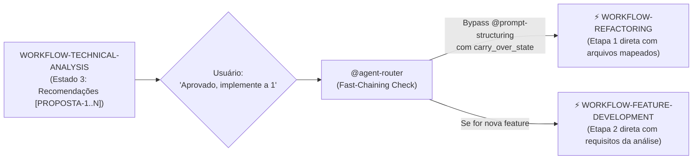

> **Fonte de verdade operacional:** [`CLAUDE.md`](../../../CLAUDE.md) § R-050, R-041 e R-042.  
> **Índice completo:** [`.github/agents/workflows.md`](../workflows.md).

---

## 4. Integração com o Protocolo de Handoff (`workflow_tracking`)

Para garantir que a cadeia sequencial seja seguida à risca e nenhum agente desvie do fluxo, todo handoff entre agentes em um workflow ativo transporta o bloco `workflow_tracking` dentro do `handoff_payload`:

```yaml
handoff_payload:
  versao: "1.2"
  para: "specialist-unit-test-writer"
  motivo: "Hipótese de bug confirmada — criar teste de regressão que falhe"
  emissor:
    nome: "bug-triage"
    versao: "1.1.0"
    modelo_llm: "Claude Sonnet 5"
    timestamp: "2026-09-10T12:00:00Z"
  workflow_tracking:
    workflow_id: "WORKFLOW-BUG-FIX"
    etapa_atual: 2
    total_etapas: 5
    nome_etapa: "red_test_reproduction"
    proximos_agentes_permitidos:
      - "specialist-bug-fixer"
    politica_desvio: "strict"  # proíbe delegar fora da lista sem evento R-042
  contexto:
    solicitacao_original: "Botão de login quebra com erro 500 ao clicar"
    trabalho_realizado: "Isolado NullPointerException no AuthService linha 45"
    descobertas_chave:
      - "Token JWT nulo ao submeter formulário sem provedor federado"
    artefatos:
      - "src/app/core/services/auth.service.ts"
  proximos_passos_sugeridos:
    - "Escrever spec isolado simulando payload sem provider"
```

---

## 5. Regras de Não-Desvio (Invariantes de Execução)

1. **Invariante de Fast-Path**: Se a mensagem de entrada descreve um bug, erro, crash ou falha visual de layout, o `@agent-router` NUNCA deve invocar `@prompt-structuring`. O ingresso no `WORKFLOW-BUG-FIX` via `@bug-triage` é mandatório.
2. **Invariante de Teste Prévio (TDD)**: No `WORKFLOW-BUG-FIX`, é terminantemente proibido invocar o `bug-fixer` sem antes ter o teste automatizado que reproduza a falha (Estado 2 obrigatório antes do Estado 3).
3. **Invariante de Grafo em Refatoração**: No `WORKFLOW-REFACTORING`, o `@refactor-planner` NUNCA deve realizar varredura manual de pastas; deve invocar compulsoriamente o `@codegraph-engine` para cálculo do blast radius (R-045).
4. **Invariante Anti Beco Sem Saída (R-047)**: Ao concluir seu estado, o agente ativo DEVE despachar via `run_subagent` para a próxima etapa do workflow OU invocar `ask_questions` caso dependa de decisão humana.
5. **Invariante de Deriva e Reset de Workflow (R-042 / R-052)**: Caso o usuário mude o escopo no meio do workflow (ex.: durante um bugfix, peça uma nova funcionalidade), ou **ao concluir qualquer workflow com sucesso**, o agente ativo encerra seu ciclo e DEVE acionar retorno imediato ao `@agent-router` com `motivo: "deriva_de_intencao"` ou `"conclusao_de_workflow_anterior"`. É expressamente proibido ao último agente ativo reter a sessão para a próxima solicitação (Anti Sticky-Agent).
6. **Invariante de Separação Declarador/Executor em Circuit Breaker**: Nenhum agente estritamente read-only/advisory (`runtime-verifier`, `@code-review`, `@refactor-planner`, `@agent-auditor`, etc. — mesma classe validada em `test_readonly_advisory_agents_do_not_contain_mutation_tools`) pode executar a mutação de reversão (`git checkout`/`git restore`) de um Circuit Breaker. Esse agente apenas DETECTA e DECLARA o veredito; a execução física é sempre delegada, via `run_subagent`, ao especialista com ferramentas de edição/terminal que originou o diff (`specialist-bug-fixer`/`specialist-test-fixer` em Workflow 1; domain router/specialist por nó do DAG em Workflow 2). Violação desta invariante é tratada com a mesma severidade de uma violação de contrato de agent (ver § 8.1, item 2).
7. **Invariante de Resolução de Papel Genérico**: Nenhum agente invoca `run_subagent` com um nome `specialist-<papel>` literal — todo despacho tático passa primeiro pela resolução do domain router para o `id` concreto do catálogo (§ 1.3).
8. **Invariante de Colaboração Dual-Stack em Migração (WORKFLOW-FRAMEWORK-MIGRATION)**: Em toda migração **cross-stack** (stack de origem legada ≠ stack de destino moderno — ex.: `ejb-router`→`spring-boot-router`, `struts-router`→`spring-boot-router`), o `@tech-solution-architect` NUNCA elabora blueprint ou renderiza o bloco `### 🗺️ Pipeline de Execução do Workflow` citando apenas o domain router de destino. Ambos os routers (origem e destino) DEVEM constar explicitamente como agentes participantes em TODAS as etapas do pipeline (1 a 6), com o router de origem atuando como oráculo de comportamento legado até o sign-off da auditoria reversa de órfãos pós-migração (Estado 6). Omitir o router de origem é tratado como a mesma classe de violação que pular um estado do workflow (ver § 3.7, item "Invariante de Colaboração Dual-Stack").
9. **Invariante de Exclusividade do Motor de Grafo em Migração (R-045)**: `@codegraph-engine` é co-agente OBRIGATÓRIO (nunca sub-rotina meramente permitida) nas Etapas 1, 3, 4, 5 e 6 do `WORKFLOW-FRAMEWORK-MIGRATION`. `@tech-solution-architect` e os domain routers NUNCA mapeiam blast radius, dependências, ciclos ou auditoria reversa de símbolos manualmente durante uma migração — toda essa análise estrutural é delegada via `run_subagent` ao `@codegraph-engine`, com o mesmo rigor já aplicado em `WORKFLOW-REFACTORING` (Invariante 3). O `sign_off_codegraph_engine` (zero ciclos/dead-code novos e zero órfãos detectados) é pré-requisito do veredito final na Etapa 6, junto ao sign-off do domain router de origem.
10. **Invariante de Fallback Proibido do Motor de Grafo (Falha de Tool Call)**: Se a chamada de tool do `@codegraph-engine` (ex.: `module_map`, `query`, `impact_analysis`) **falhar ou retornar erro/timeout**, é terminantemente proibido a qualquer agente (incluindo `@tech-solution-architect` e domain routers) recorrer a varredura manual substituta (`list_dir`, `grep`/`grep_search` em massa no repositório inteiro, leitura sequencial de dezenas de arquivos) como compensação silenciosa. A única ação permitida é: **(a)** retry da mesma consulta ao `@codegraph-engine` (build incremental se o índice estiver desatualizado) ou **(b)** declarar explicitamente ao usuário via relatório de 3 linhas (Causa/Local/Ação sugerida) que a análise estrutural determinística falhou e aguardar decisão (`ask_questions`) antes de prosseguir com qualquer heurística manual. Tratar a falha do tool como "gap silencioso" e prosseguir com grep manual é a mesma classe de violação de R-045 (ver `regr-023` e `regr-028`).
11. **Invariante de Checkpoint Humano Não-Satisfeito por Continuação Genérica**: Em qualquer Etapa marcada como *Checkpoint Humano Obrigatório* (ex.: Estado 2b de `WORKFLOW-FRAMEWORK-MIGRATION`, Estado 3b de `WORKFLOW-FEATURE-DEVELOPMENT`, Estado 2b de `WORKFLOW-GOVERNANCE-MAINTENANCE`), se o Dashboard/relatório apresentado contiver **qualquer item marcado `⚠️`, `[⏳ PENDENTE]` ou `[⚠️ DIVERGENTE]`** exigindo decisão de negócio ou arquitetura, uma resposta genérica do usuário ("prossiga", "continue", clique em sugestão automática de continuação) **NUNCA** é interpretada como aprovação explícita das decisões pendentes específicas. O agente ativo DEVE, antes de avançar para a próxima etapa mutativa: **(a)** re-listar objetivamente cada item pendente com opções concretas (ex.: manter `[PENDENTE]` para implementação nesta fase vs. reclassificar `[DESACOPLADO]` com justificativa) via `ask_questions`; **(b)** só então prosseguir com a decisão explicitamente escolhida. É proibido o agente decidir unilateralmente a reclassificação de itens `⚠️`/`[⏳ PENDENTE]` da Matriz De-Para com base apenas em um "prossiga" genérico.
12. **Invariante de Re-Banner em Transição de Fase (Extensão de R-048)**: Toda transição de um agente estritamente Advisory/Analítico (ex.: `@tech-solution-architect` na Etapa 1/2) para um agente ou papel que passa a **mutar arquivos** (codemod, implementação, criação de entidade/repositório) DEVE emitir um novo banner `Agente Ativo: <domain-router-DESTINO ou specialist-feature-developer>` **antes** da primeira tool call mutativa daquela etapa — mesmo dentro do mesmo workflow e da mesma sessão. É proibido a mesma resposta encadear dezenas de tool calls de implementação sob a identidade do agente analítico anterior sem declarar explicitamente o handoff de execução (mesma classe de violação de `regr-024`).
13. **Invariante de Exaustão de Símbolos e Tríplice Redundância Pós-Migração (WORKFLOW-FRAMEWORK-MIGRATION)**: É terminantemente proibido:
    **(a) Avançar para codemod sem Symbol Exhaustion de 100%**: A Matriz De-Para (Etapa 2) deve ter correspondência auditada mecanicamente via `@codegraph-engine` para 100% dos métodos públicos/privados, queries e nós condicionais do legado. Proibido inventário parcial por mera amostragem de happy path.
    **(b) Aceitar código com omissão silenciosa de AST**: A Etapa 3 exige o Anti-Omission AST Validator no sandbox para comprovar que branches de exceção e tabelas de persistência secundária foram portadas.
    **(c) Considerar migração concluída sem a Etapa 6**: Nenhuma migração pode ser dada como concluída ou aprovada para cutover sem passar pela Tríplice Camada de Redundância no Estado 6 (Reverse Orphan Audit, Mutation Parity Resilience e Differential Shadow Replay), com emissão formal do Certificado de Paridade Total em `docs/migrations/certificado-paridade-<alvo>.md`.
14. **Invariante de RCA Estruturado, Dupla Evidência e Mini Mutation em Bugfix (WORKFLOW-BUG-FIX)**: É terminantemente proibido:
    **(a) Formular hipótese causal sem dupla evidência**: Toda RCA exige formalização (5 Whys / Fishbone) e correlação obrigatória de no mínimo **2 fontes independentes de evidência técnica observável** (*evidence before hypothesis* — ex.: stack trace + log em runtime; ou payload de rede HTTP + teste isolado reprodutível; ou métrica de observabilidade APM + call graph determinístico).
    **(b) Omitir a classificação de falha**: Toda ocorrência deve ser classificada explicitamente como `flaky` (instabilidade intermitente/race condition) vs `regressao_real`.
    **(c) Aplicar fix sem declarar blast radius e rollback**: O Estado 3 exige compulsoriamente a declaração prévia de `blast_radius_estimado` e `rollback_plan` no `workflow_state` antes de emitir qualquer diff cirúrgico.
    **(d) Aceitar falso-verde no teste de regressão**: O Estado 4 exige mini mutation-check proporcional ao risco (1 a 3 mutantes sintéticos injetados) para comprovar que o Red Test elimina os mutantes. Para defeitos críticos, o Estado 5 exige observação pós-fix/canary com critérios de telemetria definidos.
15. **Invariante de Contract Testing, Redundância Proporcional e Rollback com Blast Radius Revertido em Refatoração (WORKFLOW-REFACTORING)**: É terminantemente proibido:
    **(a) Refatorar contratos compartilhados sem Contract Testing**: Alterações em APIs públicas ou limites de bounded context exigem compulsoriamente testes de contrato no Estado 2a (Pact-style consumer-driven ou OpenAPI / JSON Schema Diff).
    **(b) Dispensar redundância em blast radius médio/alto**: Se o blast radius for moderado ou alto, o Estado 5 exige compulsoriamente a camada de redundância proporcional (auditoria reversa de símbolos via `@codegraph-engine`, mini mutation gate e differential replay leve em rotinas determinísticas).
    **(c) Reversão sem métrica de restauração**: Em caso de ativação do Circuit Breaker / Rollback (Estado 5b), é mandatório calcular e registrar formalmente o `blast_radius_revertido` no `workflow_state` e no handoff de escalonamento.

---

16. **Invariante de Proibição Estrita de Terceirização ao Usuário em Etapas Analíticas e Diagnósticas (R-057 / Smell 2.25)**: É expressamente vedado a qualquer agente participante de etapas analíticas, diagnósticas, de auditoria ou triagem (ex.: Etapa 1 de `WORKFLOW-BUG-FIX` com `@bug-triage`, Etapa 1 de `WORKFLOW-GOVERNANCE-MAINTENANCE` com `@agent-auditor`, Etapa 1 de `WORKFLOW-TECHNICAL-ANALYSIS`, etc.), ao constatar falta de ferramentas de escrita ou identificar a necessidade de alterações de código ou governança, encerrar seu turno emitindo instruções para que o usuário execute edições manuais. O agente analítico DEVE compulsoriamente avançar para o checkpoint de aprovação ou transferir deterministamente o controle para o agente executor competente (ex.: `@governance-maintainer`, `@bug-fixer`, `@feature-developer`).

17. **Invariante de Visibilidade Progressiva, Red-Teaming de Solution Space e Painel de Evidências em Síntese de Prompt (WORKFLOW-PROMPT-SYNTHESIS)**: É terminantemente proibido:
    **(a) Execução Blackbox**: Emitir o prompt final diretamente ou apenas a listagem de checkboxes [✅] sem apresentar o Painel de Evidências por Etapa com o detalhamento de cada uma das 5 etapas (Elicitação no Problem Space, Grounding de Arquivos Reais, Mapeamento de Não-Escopo, Síntese de Caching e Quality Gate).
    **(b) Alucinação de caminhos**: Listar arquivos em referências grounded sem verificação determinística de existência real no workspace via `@codegraph-engine` ou inspeção de contexto.
    **(c) Invasão de Solution Space (Red-Teaming Ativo Compulsório)**: Emitir prompt que viole qualquer um dos 4 critérios excludentes do checklist de corte de Solution Space: (1) classes ou métodos internos não solicitados; (2) bibliotecas, frameworks ou algoritmos não pedidos expressamente; (3) arquitetura interna ou design patterns prescritos no lugar de preservar a autonomia do especialista executor; (4) tecnologias não mencionadas na demanda original. Qualquer violação constitui bloqueio impeditivo no Estado 5, exigindo re-síntese cirúrgica no Estado 4.
    **(d) Desvirtuamento de Consumo (Não-Entrega Direta ao Usuário)**: Apresentar o prompt sintetizado como se fosse o código implementado ou a solução final de negócio para o usuário. O prompt gerado possui a finalidade declarada e restrita de consumo exclusivo downstream por outros agents e workflows canônicos na inicialização de uma nova sessão limpa.

---

18. **Invariante de Invocação Compulsória do Motor de Grafo em Síntese de Prompt (WORKFLOW-PROMPT-SYNTHESIS / R-045)**: É terminantemente proibido:
    **(a) Bypass de subagente com scripts manuais no sandbox**: Na Etapa 2 (Context Grounding & AST Mining), o `@codegraph-engine` é o agente executor OBRIGATÓRIO e DEVE ser acionado via `run_subagent(agentName: 'codegraph-engine', ...)`. É expressamente vedado ao prompt `/craft-prompt` ou ao `@prompt-structuring` executar scripts manuais de varredura no sandbox (`ctx_execute` com `fs.readdirSync`/`fs.readFileSync` ou `walk(dir)`) para contornar a chamada do subagente (violação direta de R-045 / RNF-004 e Smell 2.26).
    **(b) MCP Tool Chaining no chat**: Encadear dezenas de chamadas unitárias sequenciais de `ctx_execute` no chat para explorar diretórios; toda análise estrutural e descoberta de dependências pertence com exclusividade ao motor determinístico de grafo.
    **(c) Falsa declaração de execução de subagente**: Declarar `• [✅] Etapa 2: Context Grounding & AST Mining → @codegraph-engine` no chat sem que o subagente tenha sido de fato invocado e executado via `run_subagent`.

---

19. **Invariante de Interrupção Compulsória por Ambiguidade, Elicitação Aprofundada e Proibição de Alucinação de Requisitos (WORKFLOW-PROMPT-SYNTHESIS / R-027)**: É terminantemente proibido:
    **(a) Inferência e Alucinação de Regras de Negócio**: Em solicitações que envolvam novas funcionalidades, telas ou regras de negócio abertas, o agente participante não pode deduzir, supor ou alucinar fluxos funcionais, critérios de aceitação, regras de aprovação ou entidades sem validação explícita do usuário.
    **(b) Bypass do Checkpoint Humano em Ambiguidade & Elicitação em 5 a 10 Rodadas**: A interação com o usuário na Etapa 1 via `ask_questions` é OBRIGATÓRIA e BLOQUEANTE quando a demanda possuir ambiguidade de domínio ou múltiplos caminhos de negócio viáveis (R-027). A palavra "Opcional" é expressamente proibida para este checkpoint. Em demandas funcionais do `WORKFLOW-PROMPT-SYNTHESIS`, a elicitação deve conduzir um processo iterativo aprofundado de no mínimo 5 e no máximo 10 rodadas estruturadas de `ask_questions` (sem checklist fixo, adaptativo ao domínio do usuário). Cláusula de Teto: caso o diálogo atinja a 10ª rodada e ainda restem indefinições residuais, o agente DEVE compulsoriamente interromper as perguntas, declarar as lacunas em aberto formalmente na seção `## Restrições e Não-Escopo` do prompt e prosseguir para a Etapa 2, impedindo loops infinitos.
    **(c) Invasão de Papel**: A elicitação, desambiguação e estruturação de requisitos de negócio e critérios de aceitação em demandas funcionais cabe com exclusividade ao `@requirements-analyst`, cabendo ao `@prompt-structuring` atuar na Etapa 1 apenas para tarefas estritamente técnicas ou após a elicitação de negócio, conduzindo as Etapas 3 a 5 (mapeamento de não-escopo, Prompt Caching, injeção de governança e emissão do bloco `.md`).

---

20. **Invariante de Blueprint Técnico e Decomposição Obrigatórios em Features Complexas (WORKFLOW-FEATURE-DEVELOPMENT / R-058 / Smell 2.27)**: É terminantemente proibido:
    **(a) Bypass Prematuro para Implementadores de Código**: Despachar solicitações de novas funcionalidades que envolvam novo schema de persistência (mesmo Firestore/BaaS), máquina de estados finita com 3+ transições, concorrência/transações atômicas ou integração de infraestrutura (plugins nativos, push notifications) diretamente para domain routers (`@angular-router`, `@spring-boot-router`, `@python-router`, etc.) ou executores de código sem a passagem compulsória pelo Estado 3 (`@tech-solution-architect`) para elaboração de Technical Blueprint e aprovação no Checkpoint 3b (`ask_questions`).
    **(b) Despejo de Lacunas Arquiteturais (Anti-Gap Dumping)**: O `@agent-router` identificar lacunas arquiteturais conceituais (ex.: matriz de papéis/permissões, formato de payload/coleções de banco, escopo de tokens de push notification) e despejá-las no bloco de "Lacunas para handoff" para que o especialista de implementação resolva no improviso durante a codificação.
    **(c) Omissão do `@feature-planner` em Demandas Multi-Task**: Omitir a decomposição formal de subtasks atômicas `[S]` e `[P]` quando a feature contiver 3 ou mais frentes de trabalho ou tarefas interdependentes, deixando a ordem de implementação a critério arbitrário do executor tático.


## 6. Padrão de Visibilidade no Chat (Roadmap Visual de Execução — Anti-Cegueira)

Para que o usuário nunca fique no escuro quanto ao fluxo em andamento, o `@agent-router` (ao despachar o workflow) e cada agente participante (ao reportar sua etapa) **DEVEM obrigatoriamente** renderizar o bloco visual `### 🗺️ Pipeline de Execução do Workflow` no início de sua mensagem.

### 6.1 Marcadores de Status Padronizados
- `[✅]` **Concluído**: Etapa finalizada com sucesso e evidência registrada.
- `[▶]` **Em Andamento (Atual)**: Etapa sob execução do agente ativo no turno.
- `[⏳]` **Pendente**: Etapa futura a ser executada na sequência.

---

### 6.2 Templates Visuais por Workflow

#### WORKFLOW 1: `WORKFLOW-BUG-FIX` (5 etapas)
```markdown
### 🗺️ Pipeline de Execução: WORKFLOW-BUG-FIX (5 etapas)
- [▶] **Etapa 1: Triagem & RCA Estruturado (2 Fontes)** → `@bug-triage` *(Em Andamento: 5 Whys/Fishbone, evidência dupla e classificação flaky vs regressão real)*
- [⏳] **Etapa 2: Red Test de Caracterização & Baseline** → `specialist-unit-test-writer` *(Pendente: teste automatizado que falha comprovando o bug)*
- [⏳] **Etapa 3: Correção Cirúrgica Mínima** → `specialist-bug-fixer` *(Pendente: blast radius estimado & rollback plan declarados, diff cirúrgico R-002/R-046)*
- [⏳] **Etapa 4: Validação Green Test & Mini Mutation-Check** → `runtime-verifier` *(Pendente: 100% testes passando, linter limpo e mini mutation anti falso-verde)*
- [⏳] **Etapa 5: Quality Gate, Observação Pós-Fix / Canary & Quality Review Loop (§ 1.5)** → `@code-review` / `@pr-gatekeeper` *(Pendente: revisão final, autorreflexão R-033, loop de qualidade até 3x se achados não-bloqueantes e canary para bugs críticos)*
```

#### WORKFLOW 2: `WORKFLOW-REFACTORING` (5 etapas)
```markdown
### 🗺️ Pipeline de Execução: WORKFLOW-REFACTORING (5 etapas)
- [▶] **Etapa 1: Mapeamento de Regras Vigentes** → `@business-rules-extractor` *(Em Andamento: extração de ground truth em .md)*
- [⏳] **Etapa 2: Blast Radius & Contract Testing** → `@codegraph-engine` + `@tech-solution-architect` *(Pendente: grafo determinístico via @optave/codegraph e Contract Testing Pact-style)*
- [⏳] **Etapa 3: Plano Macro Mikado & Safety Net** → `@refactor-planner` + `@test-strategy` *(Pendente: árvore Mikado, threshold de caracterização e rollback planejado)*
- [⏳] **Etapa 4: Execução Incremental em Lote** → `Domain Router / Specialists` *(Pendente: micro-lotes com Gate Out por nó R-046)*
- [⏳] **Etapa 5: Validação de Regras, Redundância Proporcional & Quality Review Loop (§ 1.5)** → `@business-rules-extractor` + `@code-review` *(Pendente: ground truth 100% + auditoria reversa de símbolos + mini mutation gate + loop de qualidade até 3x + blast radius revertido se falha)*
```

#### WORKFLOW 3: `WORKFLOW-TECHNICAL-ANALYSIS` (3 etapas)
```markdown
### 🗺️ Pipeline de Execução: WORKFLOW-TECHNICAL-ANALYSIS (3 etapas)
- [▶] **Etapa 1: Despacho para Especialista Analítico** → `@<especialista>` *(Em Andamento: direcionamento direto)*
- [⏳] **Etapa 2: Coleta Determinística Read-Only** → `@<especialista>` *(Pendente: modo Advisory sem mutação de código)*
- [⏳] **Etapa 3: Síntese Técnica & Próximo Passo** → `@<especialista>` *(Pendente: relatório estruturado e handoff R-047)*
```

#### WORKFLOW 4: `WORKFLOW-FEATURE-DEVELOPMENT` (6 etapas)
```markdown
### 🗺️ Pipeline de Execução: WORKFLOW-FEATURE-DEVELOPMENT (6 etapas)
- [▶] **Etapa 1: Prompt Structuring** → `@prompt-structuring` *(Em Andamento: refinamento Markdown Tarefa/Contexto/Restrições/Formato)*
- [⏳] **Etapa 2: Elicitação de Requisitos** → `@requirements-analyst` / `@feature-planner` *(Pendente: critérios de aceitação BDD/EARS)*
- [⏳] **Etapa 3: Technical Blueprint & Contratos** → `@tech-solution-architect` *(Pendente: OpenAPI, modelo de dados e divisão por stack)*
- [⏳] **Etapa 4: Estratégia de Testes (TDD)** → `@test-strategy` *(Pendente: matriz de riscos e casos de borda)*
- [⏳] **Etapa 5: Implementação Domain TDD & Paridade UI** → `Domain Routers & Specialists` *(Pendente: Red-Green-Refactor + Handoff UI 5a->5b)*
- [⏳] **Etapa 6: Duplo Quality Gate, Quality Review Loop (§ 1.5) & PR Preparation** → `Gate 1 (Lógica/Sec) + Gate 2 (UI Parity) → @pr-gatekeeper` *(Pendente: validação dupla, loop de qualidade até 3x se achados não-bloqueantes e PR)*
```

#### WORKFLOW 5: `WORKFLOW-GOVERNANCE-MAINTENANCE` (4 etapas)
```markdown
### 🗺️ Pipeline de Execução: WORKFLOW-GOVERNANCE-MAINTENANCE (4 etapas)
- [▶] **Etapa 1: Diagnóstico Read-Only ou Pesquisa Prévia** → `@agent-auditor` / `@repo-hygiene-auditor` / `@docs-engineer` / `@deep-search` *(Em Andamento: auditoria estrutural, documental e pesquisa prévia)*
- [⏳] **Etapa 2: Checkpoint de Aprovação Humana** → `ask_questions` *(Pendente: aprovação explícita do plano)*
- [⏳] **Etapa 3: Execução Governada em Lote** → `@governance-maintainer` / `@governance-factory` / `@docs-engineer` *(Pendente: sincronização atômica SSOT R-015/R-046 e documentação técnica)*
- [⏳] **Etapa 4: Quality Gate de Governança & Quality Review Loop (§ 1.5)** → `pytest (Tier 1)` / `@agent-auditor` *(Pendente: validação determinística de smells, routing, isolamento e loop de qualidade até 3x)*
```

#### WORKFLOW 6: `WORKFLOW-DEPENDENCY-VULNERABILITY-REMEDIATION` (5 etapas)
```markdown
### 🗺️ Pipeline de Execução: WORKFLOW-DEPENDENCY-VULNERABILITY-REMEDIATION (5 etapas)
- [▶] **Etapa 1: Triagem de Vulnerabilidade & Advisory** → `@security-reviewer` *(Em Andamento: análise de CVE, CVSS e changelog)*
- [⏳] **Etapa 2: Mapeamento de Blast Radius da Dependência** → `@codegraph-engine` *(Pendente: mapa de impacto e consumidores R-045)*
- [⏳] **Etapa 3: Bump de Manifesto & Sincronização de Lockfile** → `specialist-developer` *(Pendente: atualização de dependências e lockfile)*
- [⏳] **Etapa 4: Adaptação de Breaking Changes & Compilação** → `specialist-bug-fixer` / `specialist-test-fixer` *(Pendente: compatibilização de APIs e compilação limpa)*
- [⏳] **Etapa 5: Verificação de Regressão, SCA & Quality Review Loop (§ 1.5)** → `runtime-verifier` + `@code-review` + `@security-reviewer` *(Pendente: 100% testes verdes, scan SCA limpo e loop de qualidade até 3x)*
```

#### WORKFLOW 7: `WORKFLOW-FRAMEWORK-MIGRATION` (6 etapas — Cross-Stack exige Router Origem + Destino + Grafo)
```markdown
### 🗺️ Pipeline de Execução: WORKFLOW-FRAMEWORK-MIGRATION (6 etapas)
- [▶] **Etapa 1: Pre-Flight Assessment, 5D & Symbol Exhaustion** → `@tech-solution-architect` + `@codegraph-engine` (obrigatório) + `@domain-router-ORIGEM` (ex.: `@ejb-router`) + `@business-rules-extractor` *(Em Andamento: inventário 100% de símbolos/AST + blast radius/ciclos do legado + extração 5D)*
- [⏳] **Etapa 2: Migration Phasing & Blueprint com Matriz De-Para** → `@tech-solution-architect` + `@domain-router-ORIGEM` + `@domain-router-DESTINO` (ex.: `@spring-boot-router`) *(Pendente: mapeamento de 100% dos símbolos na matriz + fases B1..BN + checkpoint humano)*
- [⏳] **Etapa 3: Codemod & Transformação em Lote com Anti-Omission** → `@domain-router-DESTINO` (executor) + `@domain-router-ORIGEM` (oráculo consultivo contínuo) + `@codegraph-engine` (obrigatório, blast radius por lote) *(Pendente: codemods no sandbox R-046 + validação anti-omissão AST)*
- [⏳] **Etapa 4: Refinamento & Paridade Funcional (Dual-Verification Expandido)** → `@domain-router-DESTINO` + `@domain-router-ORIGEM` + `@business-rules-extractor` + `@codegraph-engine` (obrigatório, find_cycles/dead-code) *(Pendente: Golden Master + 100% regras de negócio cobertas + zero ciclos/dead-code novos)*
- [⏳] **Etapa 5: Baseline & Quality Gate de Migração** → `runtime-verifier` + `@code-review` + sign-off de `@domain-router-ORIGEM` + sign-off de `@codegraph-engine` *(Pendente: build limpo, testes verdes e PR preliminar)*
- [⏳] **Etapa 6: Post-Migration Verification, Redundancy Gate & Quality Review Loop (§ 1.5)** → `@code-review` + `@test-strategy` + `@business-rules-extractor` + `@runtime-verifier` *(Pendente: tríplice auditoria: reverse orphan audit + mutation parity resilience + differential shadow replay e loop de qualidade até 3x)*
```

#### WORKFLOW 8: `WORKFLOW-RELEASE-READINESS` (5 etapas)
```markdown
### 🗺️ Pipeline de Execução: WORKFLOW-RELEASE-READINESS (5 etapas)
- [▶] **Etapa 1: Contract & API Compatibility Audit** → `@tech-solution-architect` *(Em Andamento: diff OpenAPI v3 contra breaking changes)*
- [⏳] **Etapa 2: Database Rollout Pre-Flight** → `@database-specialist` *(Pendente: DDL idempotente e scripts de rollback testados)*
- [⏳] **Etapa 3: Security, Secrets & Repository Hygiene Scan** → `@security-reviewer` + `@repo-hygiene-auditor` + `@code-style-enforcer` *(Pendente: varredura de credenciais, .env, conformidade de estilo e licenças)*
- [⏳] **Etapa 4: Changelog, SemVer, Docs & Release Packaging** → `@pr-gatekeeper` + `@docs-engineer` *(Pendente: validação SemVer, documentação, compilação de changelog e draft de release)*
- [⏳] **Etapa 5: Release Verdict & Executive Summary** → `@code-review` + `@code-style-enforcer` + `ask_questions` *(Pendente: matriz de risco consolidada e decisão Go/No-Go)*
```
**Nota obrigatória (Invariantes 8 e 9, § 5)**: se a migração for cross-stack, `@domain-router-ORIGEM` NUNCA é omitido do bloco acima após a Etapa 1 — ele permanece listado até a Etapa 5. `@codegraph-engine` é co-agente obrigatório (R-045) nas Etapas 1, 3, 4 e 5 — nunca apenas sub-rotina opcional.

#### WORKFLOW 9: `WORKFLOW-PROMPT-SYNTHESIS` (5 etapas)
```markdown
### 🗺️ Pipeline de Execução: WORKFLOW-PROMPT-SYNTHESIS (5 etapas)
- [✅] **Etapa 1: Elicitação & Problem Space** → `@requirements-analyst` (Negócio / `ask_questions`) ou `@prompt-structuring` (Técnico)
- [✅] **Etapa 2: Context Grounding & AST Mining** → `@codegraph-engine`
- [✅] **Etapa 3: Mapeamento de Restrições & Não-Escopo** → `@prompt-structuring`
- [✅] **Etapa 4: Síntese Estruturada & Otimização de Caching** → `@prompt-structuring`
- [✅] **Etapa 5: Quality Gate & Emissão do Bloco .md** → `@prompt-structuring`

---

### 📋 Painel de Evidências por Etapa (Rastreabilidade Operacional)

#### 🔍 Etapa 1: Elicitação & Problem Space
- **Problema de Negócio**: <descrição clara da dor sem código>
- **Atores & Papéis**: <usuários e sistemas afetados>
- **Critérios de Aceitação Preliminares (DoD)**: <itens de verificação obrigatórios>

#### 🗺️ Etapa 2: Context Grounding & AST Mining
- **Arquivos-Alvo Identificados no Repositório**:
  - `<caminho_real_1>`: <motivação de inclusão>
- **Componente Irmão Canônico Homologado**: `<caminho_irmao_canonico>`
- **Modelos/DTOs Existentes no Escopo**: `<caminho_models>`

#### 🛑 Etapa 3: Mapeamento de Restrições e Não-Escopo
- **Não-Escopo Negativo**: <o que NÃO deve ser alterado>
- **Convenções Obrigatórias Injetadas**: <R-046, regras de stack>

#### ⚡ Etapa 4: Síntese Estruturada & Caching
- **Segmentação Markdown**: Seções canônicas estruturadas.
- **Prompt Caching Alignment**: Regras no topo; dados variáveis da task na cauda.

#### 🛡️ Etapa 5: Quality Gate & Validação Final
- [x] Zero invasão de Solution Space (red-teaming contra 4 critérios aprovado).
- [x] Zero alucinações de caminhos de arquivos (100% verificados).
- [x] Zero ambiguidades nos critérios de aceite.
- [x] Zero over-prompting prejudicial a reasoning models.
- [x] Consumo exclusivo downstream assegurado.
- [x] Bloco Markdown completo e autocontido.

---

### 📦 Prompt Sintetizado para Novo Chat
```

---

## 7. Protocolo de Encadeamento de Workflows (Workflow Chaining & State Carry-Over — R-050.1)

### 7.1 O Problema da Perda de Contexto Pós-Diagnóstico
Quando um workflow analítico (`WORKFLOW-TECHNICAL-ANALYSIS`) conclui seu relatório (ex.: *"Identificadas 3 oportunidades de melhoria no módulo de agendamento do projeto [PROJETO-ALVO]"*), o usuário naturalmente responde no turno seguinte com uma ordem direta:
> *"Pode implementar a sugestão 1 e 2"* ou *"Aprovado, aplique a refatoração proposta"*.

Sem um protocolo explícito de encadeamento:
- O `@agent-router` (ao reavaliar no turno N+1 sob R-042) recebe uma frase curta fora de contexto ("implemente a 1").
- O roteador poderia classificar a frase como "ambígua" e desviá-la erroneamente para o `@prompt-structuring`.
- Mesmo se roteasse para um desenvolvedor, o agente downstream começaria do zero sem saber quais arquivos e linhas o especialista acabou de diagnosticar.

### 7.2 Regra de Fast-Chaining (Transição com Herança de Estado)
1. **Estruturação da Saída no Estado 3 (Análise)**: O especialista analítico SEMPRE rotula suas recomendações com identificadores formais (`[PROPOSTA-1]`, `[PROPOSTA-2]`) e indica o workflow de destino recomendado (`proximo_workflow: "WORKFLOW-REFACTORING"` ou `"WORKFLOW-FEATURE-DEVELOPMENT"`).
2. **Reconhecimento pelo `@agent-router` (Passo 0.4 - Fast-Chaining)**: Quando a mensagem do usuário for uma aprovação, seleção ou comando de execução baseado na análise do turno anterior (ex.: *"implemente a 1"*, *"aplique a melhoria"*, *"siga com o plano"*), o roteador:
   - **Bypassa 100% o `@prompt-structuring`**.
   - Identifica o workflow executivo correspondente (`WORKFLOW-REFACTORING` para melhorias de código existente, `WORKFLOW-FEATURE-DEVELOPMENT` para novas features, `WORKFLOW-BUG-FIX` se foi diagnóstico de erro).
   - Injeta o `carry_over_state` no `workflow_tracking.chaining` do handoff, transferindo os artefatos, classes e regras já mapeadas diretamente para a Etapa 1 do novo workflow.



---

## 8. Circuit Breaker, Tolerância a Falhas e Estados de Rollback (R-050.2)

### 8.1 Prevenção de Loops e Corrupção de Workspace
Nenhum workflow mutativo pode deixar o repositório em estado quebrado, sujo ou entrar em loops infinitos de autocorreção.

1. **Orçamento Rígido de Autocorreção (Circuit Breaker)**:
   - Em `WORKFLOW-BUG-FIX` (Etapa 4), o `specialist-test-fixer` possui um teto absoluto de **3 tentativas** para corrigir testes quebrados (mesmo `max_iteracoes: 3` declarado no sub-catálogo de domínio — precedência de workflow, ver § 3.1 Estado 4).
   - Se os testes não passarem na 3ª tentativa, o fluxo **NÃO** prossegue para o Quality Gate nem continua tentando cegamente.
2. **Ativação Compulsória do Estado de Rollback (Estado 4b) — Separação Declarador/Executor**:
   - **2a. `WORKFLOW-BUG-FIX` (contrato corrigido)**: o `runtime-verifier` (agente estritamente read-only, sem ferramentas de mutação) apenas DETECTA o esgotamento do teto e DECLARA o veredito de bloqueio. A reversão física dos diffs (`git checkout -- <arquivos>`) é sempre EXECUTADA pelo `specialist-bug-fixer`/`specialist-test-fixer` ativo (que possuem `run_in_terminal` + `insert_edit_into_file`) via `run_subagent` acionado pelo `runtime-verifier`, estritamente amparado pelo `rollback_plan` previamente declarado no Estado 3. **Um agente read-only nunca executa a mutação de rollback diretamente** — essa separação declarador/executor é invariante de arquitetura (ver Seção 5, item 6).
   - **2b. `WORKFLOW-REFACTORING` (Estado 5b — contrato corrigido)**: o `@refactor-planner` não possui **nenhuma** ferramenta de edição ou terminal em seu frontmatter (nem `run_in_terminal`) — é ainda mais estritamente read-only que o `runtime-verifier`. Ele DETECTA a violação (via relatório `@business-rules-extractor` modo Validate) e DECIDE o escopo do rollback (quais nós do DAG Mikado precisam reverter, com base na árvore de dependências que ele mesmo desenhou no Estado 3 — pode ser rollback parcial dos últimos micro-lotes, não necessariamente do plano inteiro). A EXECUÇÃO física da reversão é sempre delegada, nó a nó, ao domain router/specialist que aplicou aquele nó especificamente (`@angular-router`, `@spring-boot-router`, `@spring-reactive-router`, `@database-router`, `@python-router`, `@struts-router` — cada um reverte apenas os arquivos que executou), registrando compulsoriamente o `blast_radius_revertido` no `workflow_state`.
   - Em ambos os casos, o agente responsável gera um relatório compacto de falha (3 linhas: Causa, Local, Ação sugerida) e aciona `ask_questions` para decisão humana:
     - *Opção A: Ajustar a estratégia de teste manualmente.*
     - *Opção B: Revisar hipótese de causa raiz.*
     - *Opção C: Cancelar a tarefa mantendo o workspace limpo.*
3. **Rollback em Refatoração (Estado 5b) — Granularidade, Acionamento & Blast Radius Revertido**:
   - Se o `@business-rules-extractor` detectar no Estado 5 que qualquer regra de negócio do ground truth (Estado 1) foi alterada ou violada, se o gate de contratos falhar, OU se um Gate Out de qualquer nó do DAG (Estado 4) falhar de forma persistente, o `@refactor-planner` aciona o plano de rollback desenhado no Estado 3 **antes** de qualquer aprovação humana adicional — mas a reversão física é sempre executada pelo(s) specialist(s) de stack que tocaram os nós afetados (nunca pelo `@refactor-planner` diretamente, ver item 2b).
   - Rollback é preferencialmente **incremental** (reverte apenas os nós do DAG posteriores ao ponto de violação identificado), não obrigatoriamente o plano inteiro — o Gate Out por nó (compilação limpa + testes verdes) já valida cada micro-lote durante o Estado 4, reduzindo o blast radius de uma violação tardia. O relatório final de rollback registra expressamente o `blast_radius_revertido` (nós revertidos, callers e arquivos restaurados) no `workflow_state`.
4. **Circuit Breaker Complementar de Delegação (`handoff-governance/SKILL.md` § 2.4)**: o teto de 3 tentativas acima trata de *retry de teste*; um mecanismo **distinto e complementar** protege contra loop infinito de *handoff entre agentes* (`call_stack_depth >= 3` ou ciclo A→B→A) — ambos podem estar ativos simultaneamente sem conflito, pois medem falhas de naturezas diferentes.

---

## 9. Rastreamento Multi-Projeto no `workflow_tracking` (`projeto_alvo` — R-050.3)

### 9.1 O Desafio de Repositórios Externos Conectados
Em ecossistemas multi-projeto onde este repositório (`deep-agents-copilot`) atua como base de governança central e outros projetos (ex.: `[PROJETO-ALVO]`) são repositórios de produto conectados:
- O agente downstream precisa saber a raiz exata do projeto (`project_root`).
- O agente deve carregar as instruções específicas do projeto (`.github/instructions/local/<projeto>.instructions.md` — R-043).
- É terminantemente proibido criar arquivos de código da aplicação dentro do repositório de governança (R-034/R-043).

### 9.2 Schema de `projeto_alvo` no Handoff (v1.3)
Todo handoff executivo transporta o contexto do projeto resolvido no `workflow_tracking`:

```yaml
workflow_tracking:
  workflow_id: "WORKFLOW-TECHNICAL-ANALYSIS"
  etapa_atual: 1
  total_etapas: 3
  nome_etapa: "advisory_dispatch"
  projeto_alvo:
    id: "[PROJETO-ALVO]"
    root_path: "<workspace>/[PROJETO-ALVO]"
    adapter_ref: ".github/instructions/local/[PROJETO-ALVO].instructions.md"
  chaining:
    origem_workflow_id: null       # ou "WORKFLOW-TECHNICAL-ANALYSIS" se veio de chaining
    proposta_referenciada: null    # ex.: "PROPOSTA-1"
    carry_over_state:
      arquivos_afetados:
        - "src/app/features/exemplo/exemplo-list.component.ts"
      diagnostico_previo: "3 memory leaks detectados em subscriptions manuais sem takeUntil"
```
Com esse bloco, qualquer especialista na cadeia sequencial sabe exatamente onde ler, onde testar e quais convenções de stack aplicar, sem ambiguidades.

---

## 10. R-064 — Duplo Gate Documental de Planejamento e Implementação

> **Fonte de verdade normativa:** [`CLAUDE.md`](../../CLAUDE.md) § R-064 e [`.github/copilot-instructions.md`](../copilot-instructions.md) § 1.1 e § 2.  
> **Diretórios canônicos:** [`docs/plans/`](../../docs/plans/README.md) e [`docs/implementation-plans/`](../../docs/implementation-plans/README.md).

### 10.1 Princípio Operacional e Estrutura dos Gates

Todo workflow canônico que envolva mutação de código (`WORKFLOW-BUG-FIX`, `WORKFLOW-REFACTORING`, `WORKFLOW-FEATURE-DEVELOPMENT`, `WORKFLOW-GOVERNANCE-MAINTENANCE`, `WORKFLOW-DEPENDENCY-VULNERABILITY-REMEDIATION`, `WORKFLOW-FRAMEWORK-MIGRATION`) opera compulsoriamente sob dois portões documentais versionados prévios à execução:

```text
Etapa Inicial (Elicitação / RCA / Escopo)
                   │
                   ▼
  [ GATE 1: PLANO DE PLANEJAMENTO ]
  ├─ Arquivo: docs/plans/<AAAAMMDD>-<workflow>-<identificador-curto>.md
  ├─ Autoria: Especialista analítico/triagem dono da Etapa 1/2
  ├─ Materialização: Orquestrador Raiz (Flat Delegation R-037/R-042)
  └─ Checkpoint: ask_questions obrigatório (Aprovar / Solicitar Ajustes)
                   │ (Aprovado pelo Usuário)
                   ▼
  [ GATE 2: PLANO DE IMPLEMENTAÇÃO TÉCNICA ]
  ├─ Arquivo: docs/implementation-plans/<AAAAMMDD>-<workflow>-<identificador-curto>.md
  ├─ Autoria: <stack>-arch-advisor (domínio específico) ou especialista técnico do workflow
  ├─ Materialização: Orquestrador Raiz
  └─ Checkpoint: ask_questions obrigatório (Aprovar / Solicitar Ajustes)
                   │ (Aprovado pelo Usuário)
                   ▼
Etapa de Execução / Mutação de Código (Batch Execution R-046 / R-059)
```

### 10.2 Matriz de Responsabilidade de Autoria por Workflow

| Workflow Canônico | Gate 1: Plano de Planejamento (`docs/plans/`) | Gate 2: Plano de Implementação (`docs/implementation-plans/`) |
|---|---|---|
| **WORKFLOW-BUG-FIX** | `@bug-triage` (RCA, evidências e escopo) | `<stack>-arch-advisor` (ou analítico da stack) |
| **WORKFLOW-REFACTORING** | `@refactor-planner` (diagnóstico e Mikado DAG) | `<stack>-arch-advisor` (detalhamento técnico de blast radius) |
| **WORKFLOW-FEATURE-DEVELOPMENT** | `@requirements-analyst` / `@tech-solution-architect` | `<stack>-arch-advisor` (arquitetura e etapas técnicas) |
| **WORKFLOW-GOVERNANCE-MAINTENANCE** | `@agent-auditor` / `@repo-hygiene-auditor` | Especialista analítico do lote (`@governance-maintainer`) |
| **WORKFLOW-DEPENDENCY-VULNERABILITY** | Especialista de segurança / scan | Especialista analítico de dependências / `<stack>-arch-advisor` |
| **WORKFLOW-FRAMEWORK-MIGRATION** | `@tech-solution-architect` (5D Assessment e De-Para) | `<stack>-arch-advisor` (estratégia técnica de paridade e codemod) |

### 10.3 Isenções e Regras de Exceção

1. **Fast-Path Determinístico (R-041, Tier 1)**: Para correções pontuais, refatorações com alvo definido e análises diretas, o Plano de Planejamento (`docs/plans/`) pode ser dispensado, mas o **Plano de Implementação (`docs/implementation-plans/`) permanece 100% obrigatório** antes de tocar em código.
2. **Workflows Read-Only**: `WORKFLOW-TECHNICAL-ANALYSIS`, `WORKFLOW-RELEASE-READINESS` e `WORKFLOW-PROMPT-SYNTHESIS` são isentos do Plano de Implementação (não realizam mutação de código na aplicação), podendo produzir apenas o Plano de Planejamento quando a profundidade analítica demandar alinhamento prévio.
3. **Zero Discovery pelo Router (R-054)**: O `@agent-router` não gera, não persiste e não inspeciona planos; a materialização física dos arquivos gerados pelos agentes Read-Only é executada pelo Orquestrador Raiz.
