> **Fonte de verdade operacional:** [`CLAUDE.md`](../../../CLAUDE.md) § R-050, R-041 e R-042.  
> **Índice completo:** [`.github/agents/workflows.md`](../workflows.md).

---

### 3.1 WORKFLOW 1: `WORKFLOW-BUG-FIX` (Resolução de Bugs, Falhas de Layout e Regressões)

- **Objetivo**: Identificar a causa raiz via RCA estruturado (5 Whys / Fishbone) sob a regra *evidence before hypothesis* (mínimo de 2 fontes independentes de evidência técnica observável), classificar determinísticamente o defeito (`flaky` vs `regressao_real`), reproduzir via teste automatizado isolado (Red Test) ou layout spec, quantificar blast radius estimado e plano de reversão, aplicar correção cirúrgica mínima (Green Test) com mini mutation-check proporcional ao risco (anti falso-verde), validar não-regressão e aplicar observação pós-fix/canary para defeitos críticos.
- **Gatilhos de Fast-Path**: `"bug"`, `"erro"`, `"falha"`, `"500"`, `"NPE"`, `"não funciona"`, `"quebrou"`, `"layout quebrado"`, `"desalinhado"`, `"CSS quebrado"`, `"NullPointerException"`, `"regressão"`.
- **Política R-041**: **Bypass Total** de `@prompt-structuring`. Não reformatar prompt; o relato técnico é despachado imediatamente.
- **⚠️ Invariante de RCA Estruturado e Dupla Fonte de Evidência (não-negociável)**: Proibido formular hipótese causal ou propor correção sem correlacionar no mínimo **2 fontes independentes de evidência técnica observável** (*evidence before hypothesis* — ex.: stack trace + log em runtime; ou payload de rede HTTP + teste isolado reprodutível; ou métrica de observabilidade APM + call graph determinístico). Hipóteses baseadas em intuição pura sem dupla evidência são proibidas.
- **⚠️ Invariante de Classificação Flaky vs Regressão Real (não-negociável)**: Toda falha deve ser categorizada no Estado 1/Pré-voo como `flaky` (instabilidade intermitente decorrente de race conditions, poluição de estado entre suítes, delays de concorrência ou timeouts de ambiente) ou `regressao_real` (quebra determinística de invariante de negócio ou contrato). Se classificado como `flaky`, o fluxo isola os fatores de concorrência/ambiente antes de qualquer modificação de código funcional.
- **⚠️ Invariante de Pré-Declaração de Blast Radius e Rollback Plan (não-negociável)**: É terminantemente vedado aplicar qualquer diff de correção no Estado 3 sem antes quantificar o `blast_radius_estimado` (callers diretos, módulos vizinhos afetados, dependências) e registrar o `rollback_plan` atômico no `workflow_state`.
- **⚠️ Invariante de Mini Mutation-Check e Observação Pós-Fix (não-negociável)**: No Estado 4, todo teste de regressão para bug de severidade média/alta deve passar por mini mutation-check pontual proporcional ao risco (1 a 3 mutantes sintéticos injetados) para comprovar a eliminação de falsos-verdes. No Estado 5, bugs de criticidade alta/crítica (P0/P1, segurança, integridade de dados, indisponibilidade ou memory leak) exigem plano formal de observação pós-fix/canary com telemetria definida.

```mermaid
flowchart TD
    Start(["⚡ Solicitação de Bug (Fast-Path)"]) --> Triage["<b>1. Triagem & RCA Estruturado</b><br/>Agente: @bug-triage<br/>Ação: RCA 5 Whys/Fishbone + 2 fontes independentes"]

    Triage --> CheckRepro{"Reprodução clara<br/>e determinística?"}
    CheckRepro -- "Não (Intermitente/Sem Logs)" --> ReproGate["<b>1b. Repro Gate & Probe</b><br/>Agente: @debugger / ask_questions<br/>Ação: Logpoint em runtime ou coleta de payload mínimo (tentativa N/2)"]
    ReproGate --> CheckReproCap{"Tentativas de<br/>reprodução < 2?"}
    CheckReproCap -- "Sim" --> Triage
    CheckReproCap -- "Não (teto esgotado)" --> NonRepro["<b>1c. Não Reproduzível — Escalonamento</b><br/>Agente: ask_questions<br/>Opções: prosseguir com hipótese | aguardar evidência | encerrar não-reproduzível"]
    NonRepro --> EndNonRepro(["🟡 Pausado — Aguardando Evidência/Decisão"])
    CheckRepro -- "Sim" --> CheckFlaky{"Classificação da Falha"}

    CheckFlaky -- "Flaky (Intermitência/Race Condition)" --> FlakyIsolate["<b>Isolamento de Concorrência/Ambiente</b><br/>Agente: @debugger / specialist-unit-test-writer<br/>Ação: Isola poluição de estado, timing e concorrência"]
    CheckFlaky -- "Regressão Real" --> CheckDiag{"Causa raiz<br/>multi-camada?"}
    FlakyIsolate --> CheckDiag

    CheckDiag -- "Sim" --> Diagnosis["<b>Diagnóstico Profundo</b><br/>Agente: @debugger / @codegraph-engine<br/>Ação: Inspeção de call graph e stack trace"]
    CheckDiag -- "Não" --> CheckKind{"Tipo de Defeito"}
    Diagnosis --> CheckKind

    CheckKind -- "Lógica / Runtime / Exception (sem contexto de framework)" --> BaselineLogic["<b>Pré-voo de Teste</b><br/>Agente: runtime-verifier<br/>Ação: Confirma suíte vizinha limpa"]
    BaselineLogic --> RedTest["<b>2. Red Test (TDD)</b><br/>Agente: specialist-unit-test-writer<br/>Ação: Teste automatizado que falha comprovando o bug"]

    CheckKind -- "Runtime só reproduz com contexto de framework (Spring/R2DBC/DOM)" --> BaselineCtx["<b>Pré-voo de Teste</b><br/>Agente: runtime-verifier<br/>Ação: Confirma suíte vizinha limpa"]
    BaselineCtx --> RedTestCtx["<b>2. Red Test com Contexto (TDD)</b><br/>Agente: specialist-component-test-writer (Angular) / specialist-integration-test-writer (backend/reactive/EJB)<br/>Ação: Teste com TestBed/@SpringBootTest/Testcontainers que falha comprovando o bug"]

    CheckKind -- "Layout / CSS / Visual" --> LayoutSpec["<b>2. Layout Spec & WCAG</b><br/>Agente: specialist-ui-stylist / component-test<br/>Ação: Spec de classes/DOM e checagem de tokens"]

    RedTest & RedTestCtx & LayoutSpec --> CheckDB{"Exige ajuste<br/>de Schema/DDL?"}
    CheckDB -- "Sim" --> DBMigration["<b>3a. Migração DDL Idempotente</b><br/>Agente: @database-specialist<br/>Ação: Script Flyway/DDL idempotente"]
    CheckDB -- "Não" --> CheckAuth{"Toca autenticação<br/>/credenciais/identidade?"}
    DBMigration --> CheckAuth

    CheckAuth -- "Sim" --> SecGate["<b>3c. Security Checkpoint (R-048.1)</b><br/>Agente: @tech-solution-architect + @security-reviewer<br/>Ação: Valida viabilidade e superfície de risco ANTES do diff"]
    CheckAuth -- "Não" --> BlastRollbackCheck["<b>Declaração de Blast Radius & Rollback Plan</b><br/>Agente: specialist-bug-fixer<br/>Ação: Quantifica callers/módulos e define estratégia de rollback"]
    SecGate --> BlastRollbackCheck

    BlastRollbackCheck --> Fix["<b>3. Correção Cirúrgica Mínima</b><br/>Agente: specialist-bug-fixer / ui-stylist<br/>Ação: Diff cirúrgico mínimo (R-002 e R-046)"]

    Fix --> GreenTest["<b>4. Green Test, Linter & Mini Mutation-Check</b><br/>Agente: runtime-verifier / test-fixer<br/>Ação: Suíte verde + mini mutation-check proporcional ao risco"]

    GreenTest --> CheckPass{"Testes passaram<br/>e mutantes eliminados (máx 3x)?"}
    CheckPass -- "Sim" --> QualityGate["<b>5. Quality Gate & Observação Pós-Fix</b><br/>Agente: @code-review + @code-style-enforcer / @pr-gatekeeper<br/>Ação: Validação de segurança/diff, estilo/lint, autorreflexão e canary para bugs críticos"]
    CheckPass -- "Não (Falha Persistente)" --> CircuitBreaker["<b>4b. Circuit Breaker & Rollback</b><br/>Agente: runtime-verifier (DECLARA veredito, read-only)<br/>Ação: Aciona specialist-bug-fixer/test-fixer para reversão atômica via rollback_plan + Escalation (ask_questions)"]

    QualityGate --> EndBug(["✅ Concluído com Sucesso"])
    CircuitBreaker --> EndFail(["🛑 Interrompido com Reversão Segura"])
```



#### Cadeia Sequencial e Papéis:
1. **Estado 1 — Triagem, RCA Estruturado & Hipótese Causal (`@bug-triage`)**:
   - *Entrada*: Sintoma relatado, logs, stack trace ou print/descrição de layout.
   - *RCA Estruturado (5 Whys / Fishbone)*: O `@bug-triage` conduz formalmente Análise de Causa Raiz através da técnica dos **5 Porquês (5 Whys)** ou **Diagrama de Ishikawa (Fishbone)**, decompondo o defeito em camadas (código, dados, concorrência, contratos, configuração).
   - *Regra Obrigatória: Evidence Before Hypothesis*: É terminantemente vedado formular hipótese causal sem correlacionar no mínimo **2 fontes independentes de evidência técnica observável** (ex.: stack trace + log em runtime; ou payload de rede HTTP + teste isolado reprodutível; ou métrica de observabilidade APM + call graph determinístico). Hipóteses baseadas em intuição pura sem dupla evidência são proibidas.
   - *Classificação Determinística: `flaky` vs `regressao_real`*: O `@bug-triage` categoriza a falha em `flaky` (instabilidade intermitente decorrente de race conditions, poluição de estado entre suítes, delays de concorrência ou timeouts de ambiente) ou `regressao_real` (quebra determinística de invariante de negócio ou contrato). Se classificado como `flaky`, o fluxo isola os fatores de concorrência/ambiente antes de qualquer modificação de código funcional.
   - *Saída*: RCA formalizado com 2 fontes de evidência, hipótese causal validada, classificação (`flaky` ou `regressao_real`), componente afetado e passos de reprodução.
   - *Sub-rotina 1a (Diagnóstico Profundo)*: Se envolver call graph multi-camada complexo, invoca `@debugger` com `call_type: "subroutine"`.
   - *Sub-rotina 1b (Repro Gate)*: Se o bug for intermitente ou faltar evidência mínima, o `@bug-triage` NÃO avança cegamente para o Estado 2. Ele aciona o `@debugger` com logpoint/tracepoint (`logExpression` com `suspendPolicy=NONE`) ou dispara `ask_questions` (R-027) com 1 pergunta solicitando o payload/passos mínimos.
   - *Sub-rotina 1c (Circuit Breaker de Reprodução)*: O Repro Gate tem **teto de 2 tentativas**. Se após 2 rodadas a reprodução determinística ainda falhar, o `@bug-triage` PARA de repetir o ciclo e aciona `ask_questions` com 3 opções objetivas: **(A)** prosseguir para o Estado 2 com a hipótese de maior confiança disponível, registrando o risco assumido no `workflow_state`; **(B)** pausar o workflow aguardando evidência adicional (log/observabilidade) do solicitante; **(C)** encerrar a triagem classificando `status_reproducao: "nao_reproduzivel"` e registrar achados parciais para backlog. Este é um estado terminal distinto (🟡 Pausado), não um retorno silencioso ao loop.
2. **Estado 2 — Caracterização e Reprodução Automatizada (Papel: Gerador do Red Test — § 1.4)**:
   - *Sprint Contract*: Antes de escrever o teste, o especialista declara por escrito o comportamento esperado pós-fix e os casos de borda que o Red Test deve cobrir (`sprint_contract` no `workflow_state`) — este mini-contrato é o que o Avaliador Cético (Estado 5) usará como rubrica de corte, evitando que o critério de "concluído" seja inventado retroativamente.
   - *Cenário A (Lógica / Runtime / Regra, sem dependência de contexto de framework)*: `specialist-unit-test-writer` cria teste automatizado isolado que falha comprovando o defeito. Antes disso, um pré-voo de baseline confirma que o ambiente de teste executa limpo nos testes vizinhos para evitar falsos positivos de flaky tests pré-existentes.
   - *Cenário B (Runtime que só reproduz com contexto de framework)*: Quando o bug exige DOM real (`specialist-component-test-writer`, Angular) ou contexto de aplicação (`specialist-integration-test-writer` com `@SpringBootTest`/`@WebMvcTest`/`@DataJpaTest`/Testcontainers/R2DBC em backend, reactive ou EJB) para reproduzir — ex.: `LazyInitializationException`, rollback transacional incorreto, falha de filtro de segurança — o teste de regressão DEVE usar o contexto de framework em vez de um mock isolado que mascararia o sintoma real. Ver § 1.3 para a tabela completa de resolução por stack.
   - *Cenário C (Layout / CSS / Estilo / Responsividade / Smell 2.21)*: `specialist-ui-stylist` e `specialist-component-test-writer` mapeiam a falha visual através do ciclo VFL (`frontend-visual-feedback-loop`), identificando quebras de hierarquia em relação ao componente irmão canônico, ausência de classes utilitárias de diálogo (`.app-dialog-content`, `.form-grid`), textos literais de ícones vazando e cores hexadecimais arbitrárias. Geram teste de componente com asserção estrita de DOM/AOM ou especificação de layout multi-viewport (375px/768px/1440px).
3. **Estado 3 — Correção Cirúrgica Mínima (`specialist-bug-fixer` ou `specialist-ui-stylist`)**:
   - *Entrada*: Arquivo alvo e teste falhando ou layout spec.
   - *Pré-requisito Mandatório: Blast Radius Estimado & Rollback Plan*: Antes de emitir o primeiro diff cirúrgico, o especialista DEVE declarar no `workflow_state`: **(a)** `blast_radius_estimado` (contagem de callers diretos e módulos dependentes via consulta determinística ao grafo quando multi-camada) e **(b)** `rollback_plan` (estratégia de restauração atômica, pontos de restauração e lista de arquivos reversíveis em caso de escalonamento/circuit breaker).
   - *Roteamento Especializado por Tipo de Defeito*: Falhas de runtime/lógica/reatividade são corrigidas por `specialist-bug-fixer`; **defeitos de layout, SCSS, alinhamento de diálogos, ícones ou responsividade são atribuídos compulsoriamente a `specialist-ui-stylist`**, aplicando estritamente variáveis de tema (zero hex inline) e classes utilitárias canônicas.
   - *Sub-rotina 3a (Dependência de Banco/DDL)*: Se a falha envolver truncamento de dados, coluna ausente ou constraint de banco, o `@database-specialist` gera previamente o script de migração DDL idempotente antes de tocar no código de aplicação.
   - *Sub-rotina 3c (Security Checkpoint — R-048.1)*: Se a correção tocar autenticação, credenciais, provedores de identidade ou sessão/token, o Estado 3 aciona compulsoriamente o gate de segurança já declarado em `routing-graph.yaml` (`@tech-solution-architect` + `@security-reviewer`, quando disponível) **ANTES** de aplicar o diff — tratamento equivalente ao de mudanças sensíveis de persistência/banco. Proibido implementar o fix de autenticação sem declarar este checkpoint no handoff.
   - *Saída*: Diff cirúrgico mínimo (2 a 3 linhas de contexto), sem alterar código não relacionado (R-002 e R-046).
4. **Estado 4 — Verificação Green Test, Linter, VFL & Mini Mutation-Check (`runtime-verifier`)**:
   - *Entrada*: Código alterado e suíte de testes.
   - *Saída*: Confirmação de 100% dos testes passando e `get_errors` limpo em lote único (R-046).
   - *Mini Mutation-Check Proporcional ao Risco (Anti Falso-Verde)*: Para eliminar o risco crítico de falsos-verdes (onde o teste de regressão passa mesmo na presença do bug, por asserção frágil ou tautológica), o especialista executor aplica um **mini mutation-check cirúrgico** proporcional ao risco: injeta de 1 a 3 mutantes sintéticos pontuais na linha alterada (ex.: invertendo a condição de guarda booleana ou revertendo temporariamente a correção). O teste de regressão criado no Estado 2 DEVE obrigatoriamente falhar ao rodar contra o código mutado (100% de mutantes eliminados). Se o teste continuar verde diante do mutante, o teste é classificado como falso-positivo / frágil e a aprovação é bloqueada até o teste ser corrigido e robustecido.
   - *Verificação Estrita para Bugs de Layout*: Para defeitos visuais, a validação do Estado 4 exige aprovação dupla: testes de componente verdes E re-inspeção visual/AOM (`frontend-visual-feedback-loop`), confirmando eliminação de texto literal de ícones, preservação de dimensões elásticas e ausência de hex inline antes de liberar para o Quality Gate. Se quebrar, aciona `specialist-test-fixer` ou `specialist-ui-stylist` (máx. 3 iterações).
   - **Nota de precedência**: quando `specialist-test-fixer` esgota seu próprio teto interno, o escalonamento genérico do sub-catálogo ("retornar ao `@agent-router`") é **substituído**, dentro de um `WORKFLOW-BUG-FIX` ativo, pelo protocolo formal do Estado 4b abaixo — a regra de workflow tem precedência sobre o comportamento default do catálogo de domínio (R-050 > comportamento genérico).
   - *Estado 4b — Circuit Breaker & Rollback (contrato corrigido)*: Se após 3 tentativas os testes não passarem, o `runtime-verifier` — **estritamente read-only, nunca executa mutação** — apenas DECLARA o veredito de bloqueio (`PRONTO | BLOQUEADO` conforme seu próprio contrato) e aciona via `run_subagent` o `specialist-bug-fixer`/`specialist-test-fixer` ativo para executar a reversão atômica estritamente orientada ao `rollback_plan` previamente declarado (`git checkout -- <arquivos>` / `git restore`). **Jamais o `runtime-verifier` reverte diretamente** — isso violaria seu próprio contrato read-only (mesma classe de agent validada em `test_readonly_advisory_agents_do_not_contain_mutation_tools`). Após confirmação da reversão, o especialista escala para intervenção humana via `ask_questions`.
5. **Estado 5 — Quality Gate, Autorreflexão & Observação Pós-Fix / Canary (`@code-review` + `@code-style-enforcer` / `@pr-gatekeeper` — Papel: Avaliador Cético — § 1.4)**:
   - *Entrada*: Diff final e evidências de teste.
   - *Co-Verificação Analítica de Estilo*: O `@code-style-enforcer` atua ao lado do `@code-review` como co-verificador analítico de qualidade estática (aderência estrita a guias de estilo, convenções idiomáticas e higiene de linter), garantindo que a correção cirúrgica não introduza regressão de formatação nem dívida cosmética.
   - *Rubrica de Corte contra o Sprint Contract*: O `@code-review` avalia o diff estritamente contra o `sprint_contract` declarado no Estado 2 (não contra impressão subjetiva de qualidade). Cada critério do contrato recebe veredito objetivo (`atendido | nao_atendido`); qualquer critério `nao_atendido` reprova a entrega inteira, mesmo que os demais estejam excelentes (registrado em `avaliacao_cetica` no `workflow_state`).
   - *Loop de Revisão de Qualidade*: Se o Avaliador Cético reprovar por achados de qualidade não-bloqueantes, aplica-se o Loop de Revisão de Qualidade (§ 1.5), teto de 3 iterações.
   - *Observação Pós-Fix / Canary Gate (para Bugs Críticos)*: Se o defeito for de severidade crítica/alta (P0/P1, falha de autenticação/sessão, corrupção ou perda de dados, indisponibilidade ou memory leak), o Quality Gate exige compulsoriamente a declaração formal de critérios de **observação pós-fix / canary**: janela de monitoramento pós-deploy (ex.: 15m a 30m), verificação de ausência de novos erros 5xx/APM e estabilização de latência antes do encerramento definitivo do incidente.
   - *Autorreflexão Documental pós-Correção (R-033)*: O agente avalia autonomamente se a resolução do bug revelou regra de negócio oculta, contrato divergente ou padrão de layout (ex.: Smell 2.21). Se sim, atualiza a documentação viva de padrões (`docs/*padrao*`, `docs/componentes-shared.md` ou adapter local) para blindar o ecossistema contra reincidência, sem esperar ordem manual.
   - *Saída*: Resumo estruturado em 5 seções (R-028) ou preparação de PR via `@pr-gatekeeper`.

#### Typed State Bag (`workflow_state`):
```yaml
workflow_state:
  tipo_bug: "runtime_exception | layout_css | business_logic | database_constraint"
  classificacao_defeito: "regressao_real | flaky"  # categorização compulsória no Estado 1
  sintoma: "<descrição do sintoma observado>"
  rca_estruturado:
    metodologia: "5_whys | fishbone"
    fontes_evidencia:
      - "<fonte 1: ex.: stack_trace_apmlog>"
      - "<fonte 2: ex.: runtime_debug_payload_ou_teste_isolado>"
    evidencia_confirmada: true  # 'evidence before hypothesis' exige min. 2 fontes independentes
    causa_raiz_identificada: "<classe.metodo:linha e mecanismo causal primário>"
  causa_raiz: "<classe.metodo:linha e mecanismo da falha>"
  sprint_contract:  # negociado no Estado 2 (Gerador), avaliado no Estado 5 (Avaliador Cético — § 1.4)
    criterios_aceite:
      - "<comportamento esperado pós-fix ou caso de borda coberto>"
    forma_verificacao: "<comando de teste ou passo manual>"
  avaliacao_cetica:  # preenchido pelo Avaliador no Estado 5
    criterios_avaliados:
      - criterio: "<mesmo criterio do sprint_contract>"
        veredito: "atendido | nao_atendido"
    veredito_final: "aprovado | reprovado"
  blast_radius_estimado:
    callers_diretos: 2
    modulos_afetados:
      - "<modulo/camada>"
    nivel_risco: "baixo | medio | alto"
  rollback_plan:
    estrategia: "git_checkout_atomico | restore_snapshot"
    arquivos_reversao:
      - "<caminho/arquivo.ext>"
    blast_radius_revertido:
      - "<modulo_restaurado>"
  arquivos_alvo:
    - "<caminho/arquivo.ext>"
  teste_regressao:
    arquivo: "<caminho/arquivo.spec.ext>"
    nome_teste: "deve <comportamento> quando <cenário>"
    comando_execucao: "<comando de teste>"
    exige_contexto_framework: false  # true -> usar specialist-integration/component-test-writer
  status_red_test: "confirmado_falha | layout_spec_validado"
  status_reproducao: "confirmada | nao_reproduzivel | aguardando_evidencia"
  tentativas_reproducao: 1  # teto: 2 (Sub-rotina 1c)
  exige_migracao_ddl: false
  exige_security_checkpoint: false  # true -> aciona 3c (R-048.1) antes do diff
  mini_mutation_check:
    aplicavel: true  # proporcional ao risco do bug
    mutantes_testados: 2
    mutantes_eliminados: 2
    status: "pass | fail"  # pass = 100% mutantes eliminados pelo Red Test
  tentativas_correcao: 1  # teto: 3 (Estado 4b)
  circuit_breaker_acionado: false
  observacao_pos_fix:
    requer_canary: false  # true para bugs criticos (P0/P1/Auth/Perda de Dados)
    janela_observacao: "30m"
    metricas_telemetria:
      - "taxa_erro_5xx < 0.01%"
      - "ausencia_reincidencia_npe"
```

---

