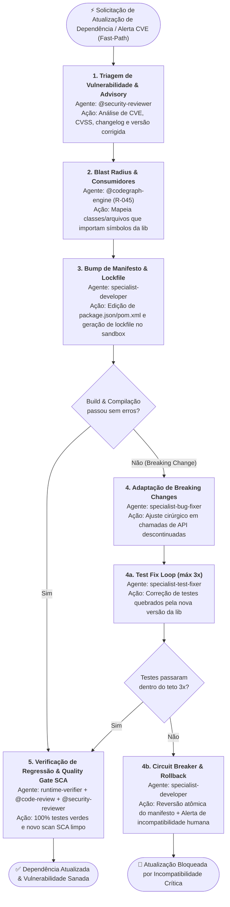

> **Fonte de verdade operacional:** [`CLAUDE.md`](../../../CLAUDE.md) § R-050, R-041 e R-042.  
> **Índice completo:** [`.github/agents/workflows.md`](../workflows.md).

---

### 3.6 WORKFLOW 6: `WORKFLOW-DEPENDENCY-VULNERABILITY-REMEDIATION` (Remediação de Vulnerabilidades, CVEs e Atualização de Dependências)

- **Objetivo**: Detectar, isolar e sanar vulnerabilidades (CVE/SCA) em bibliotecas de terceiros ou executar atualização programada de dependências, mapeando o blast radius no código-fonte, aplicando bumps de versão em arquivos de manifesto (Maven `pom.xml`, NPM `package.json`, Python `pyproject.toml`) e resolvendo cirúrgicamente breaking changes de APIs atualizadas com suíte de testes 100% verde.
- **Gatilhos de Fast-Path**: `"atualizar dependência"`, `"atualizar dependencias"`, `"atualizar pacote"`, `"remediar cve"`, `"vulnerabilidade snyk"`, `"trivy alert"`, `"dependabot"`, `"npm audit fix"`, `"upgrade lib"`, `"cve remediation"`.
- **Política R-041**: **Bypass Total** de `@prompt-structuring`. O alerta técnico de SCA ou pedido de bump é despachado imediatamente.



#### Cadeia Sequencial e Papéis:
1. **Estado 1 — Triagem de Vulnerabilidade & Advisory (`@security-reviewer`)**:
   - *Entrada*: Alerta SCA (Snyk/Trivy/Dependabot/NPM Audit), CVE ID ou pedido de upgrade de dependência.
   - *Saída*: Versão atual vs. versão mínima corrigida, severidade (CVSS), escopo do advisory e identificação de breaking changes conhecidas.
   - *Sub-rotina 1a*: Se o advisory exigir pesquisa profunda de changelogs ou repositórios externos, invoca `@deep-search` como sub-rotina.
2. **Estado 2 — Mapeamento de Blast Radius da Dependência (`@codegraph-engine`)**:
   - *Entrada*: Nome da biblioteca/pacote e símbolos afetados.
   - *Ação*: Consulta determinística via `@optave/codegraph` para mapear todos os arquivos da aplicação que importam ou instanciam classes da dependência. Proibido varredura manual (R-045).
   - *Saída*: Lista de classes/arquivos consumidores e callers diretos.
2b. **Gate 2 Mandatório — Plano de Implementação Técnica (R-064)**:
   - *Autoria*: `<stack>-arch-advisor` emite o Plano de Implementação em `docs/implementation-plans/` mapeando adaptações de breaking changes e compatibilidade.
   - *Aprovação*: Checkpoint humano aprovado (`status: approved`) antes de editar manifestos ou código.
3. **Estado 3 — Bump de Manifesto & Sincronização de Lockfile (`specialist-developer` — requires_plan: true)**:
   - *Entrada*: Arquivo de manifesto (`package.json`, `pom.xml`, etc.) e nova versão.
   - *Ação*: Edição cirúrgica do manifesto e regeneração do lockfile via terminal não-interativo sob `terminal-governance` (`npm install --package-lock-only`, `mvn dependency:resolve`).
   - *Saída*: Manifesto e lockfile sincronizados.
4. **Estado 4 — Adaptação de Breaking Changes & Compilação (`specialist-bug-fixer`)**:
   - *Entrada*: Código da aplicação e eventuais erros de compilação ou incompatibilidade de assinatura de método da nova versão da lib.
   - *Ação*: Diffs cirúrgicos mínimos adaptando o código para a nova API da biblioteca.
   - *Sub-rotina 4a (Test Fix Loop)*: Até 3 tentativas com `specialist-test-fixer` se os testes quebrarem.
   - *Estado 4b (Circuit Breaker & Rollback)*: Se após 3 tentativas o build ou testes não passarem, o especialista reverte atomicamente as alterações no manifesto e escala para decisão humana via `ask_questions`.
5. **Estado 5 — Verificação de Regressão & Quality Gate SCA (`runtime-verifier` + `@code-review` + `@security-reviewer`)**:
   - *Entrada*: Build completo e suíte de testes.
   - *Saída*: Validação de que 100% dos testes passam, linter limpo, nova varredura SCA sem CVEs e preparação de PR via `@pr-gatekeeper`.
   - *Loop de Revisão de Qualidade*: Se o Avaliador Cético reprovar por achados de qualidade não-bloqueantes, aplica-se o Loop de Revisão de Qualidade (§ 1.5), teto de 3 iterações.

#### Typed State Bag (`workflow_state`):
```yaml
workflow_state:
  tipo_remediacao: "cve_vulnerability | scheduled_upgrade | transitive_conflict"
  cve_id: "CVE-2026-XXXX"
  severidade: "CRITICAL | HIGH | MEDIUM | LOW"
  pacote_alvo: "<nome-do-pacote>"
  versao_anterior: "1.2.0"
  versao_alvo: "1.4.2"
  arquivos_manifesto:
    - "package.json"
    - "package-lock.json"
  blast_radius_consumidores:
    - "<caminho/arquivo.ext:linha>"
  breaking_changes_detectadas: false
  status_scan_pos_fix: "vulnerabilidade_sanada | regressao_detectada"
```

---

