> **Fonte de verdade operacional:** [`CLAUDE.md`](../../../CLAUDE.md) § R-050, R-041 e R-042.  
> **Índice completo:** [`.github/agents/workflows.md`](../workflows.md).

---

### 3.4 WORKFLOW 4: `WORKFLOW-FEATURE-DEVELOPMENT` (Nova Feature e Evolução Funcional E2E)

- **Objetivo**: Elicitar requisitos, conceber arquitetura técnica, desenhar contratos de API (OpenAPI), definir matriz de testes por risco, aprovar blueprint com desenvolvedor e implementar sob workflow TDD estrito com validação de segurança OWASP.
- **Gatilhos**: `"criar feature"`, `"nova funcionalidade"`, `"implementar endpoint"`, `"adicionar tela"`, `"novo módulo"`, `"evoluir fluxo"`.
- **Política R-041**: **Ativação Obrigatória** de `@prompt-structuring` caso a solicitação seja de alto nível ou ambígua. Bypassa caso venha de Fast-Chaining pós-diagnóstico com proposta aprovada.

```mermaid
flowchart TD
    Start(["🚀 Solicitação de Feature Nova"]) --> CheckAmbiguity{"Pedido aberto<br/>ou ambíguo?"}

    CheckAmbiguity -- "Sim" --> Struct["<b>1. Prompt Structuring</b><br/>Agente: @prompt-structuring<br/>Ação: Refinamento canônico (loop máx 5x)"]
    CheckAmbiguity -- "Não (Já Estruturado/Fast-Chaining)" --> Req
    Struct --> Req["<b>2. Elicitação de Requisitos</b><br/>Agente: @requirements-analyst / @feature-planner<br/>Ação: Requisitos funcionais BDD/EARS e não-funcionais"]

    Req --> Arch["<b>3. Technical Blueprint & Contratos</b><br/>Agente: @tech-solution-architect<br/>Ação: OpenAPI v3, modelo de dados e divisão por stack"]

    Arch --> CheckScope{"Escopo da Feature"}
    CheckScope -- "Fullstack" --> SplitFull["Divisão [BACKEND_TASKS] e [FRONTEND_TASKS]"]
    CheckScope -- "Backend Only" --> SplitBack["Definição de Endpoints & Persistência"]
    CheckScope -- "Frontend Only" --> SplitFront["Definição de Telas & Mock API DTOs"]

    SplitFull & SplitBack & SplitFront --> BlueprintGate{"<b>3b. Checkpoint de Blueprint</b><br/>Aprovação humana via ask_questions"}

    BlueprintGate -- "Revisar" --> Arch
    BlueprintGate -- "Aprovado" --> TestStrat["<b>4. Estratégia de Testes por Risco</b><br/>Agente: @test-strategy<br/>Ação: Matriz de riscos, casos de borda e cobertura alvo"]

    TestStrat --> TDD["<b>5. Implementação Domain TDD & Paridade UI</b><br/>Agentes: Domain Routers & Specialists<br/>Ação: Contract-First (Red -> Green -> Refactor)<br/>Frontend: 5a Lógica/Store -> 5b Handoff UI Stylist"]

    Arch --> CheckDBFeature{"Exige novas<br/>tabelas/colunas?"}
    CheckDBFeature -- "Sim" --> DBFeature["<b>3c. Migração de Schema</b><br/>Agente: @database-specialist<br/>Ação: DDL idempotente + rollback documentado"]
    DBFeature --> CheckScope

    TDD --> SecReview["<b>6a. Gate 1: Security Review (OWASP) & Lógica</b><br/>Agente: @security-reviewer<br/>Ação: Verificação de testes, injeções, IDOR, auth"]

    SecReview --> CheckSec{"Aprovado em<br/>Gate 1?"}
    CheckSec -- "Vulnerabilidade (tentativa N/2)" --> CheckSecCap{"Tentativas<br/>remediação < 2?"}
    CheckSecCap -- "Sim" --> TDD
    CheckSecCap -- "Não (teto esgotado)" --> SecEscalate["<b>6b. Escalonamento de Segurança</b><br/>ask_questions: revisão manual pareada com dev"]
    CheckSec -- "Limpo" --> UIGate["<b>6c. Gate 2: Design System & Paridade UI</b><br/>Agentes: @angular-developer / @code-review<br/>Ação: Tokens, zero hex inline, classes diálogo/scroll"]
    UIGate --> Gate["<b>6d. PR Preparation & Quality Gate Final</b><br/>Agentes: @code-review → @pr-gatekeeper<br/>Ação: Revisão de diff e geração de PR semântico"]

    Gate --> EndFeat(["✅ Feature Concluída com Sucesso"])
```



#### Cadeia Sequencial e Papéis:
1. **Estado 1 — Estruturação de Prompt (`@prompt-structuring`)**: Transforma pedidos abertos no formato canônico Markdown (`## Tarefa`, `## Contexto`, `## Restrições e Não-Escopo`, `## Formato de Saída Esperado`).
2. **Estado 2 — Elicitação de Requisitos (`@requirements-analyst` / `@feature-planner` — negociação do Sprint Contract — § 1.4)**: Detalha regras funcionais (BDD/EARS) e não-funcionais com critérios de aceitação objetivos, prevenindo *solution-jumping* e persistindo a especificação oficial em `docs/requirements/REQ-<modulo>.md` (perfil Híbrido Documental sob R-056). Os critérios de aceitação aqui definidos constituem o `sprint_contract` que o Avaliador Cético do Estado 6 usará como rubrica de corte objetiva — nenhum critério pode ser adicionado ou reinterpretado retroativamente pelo Gerador (Estado 5) sem nova negociação explícita.
3. **Estado 3 — Technical Blueprint & Contratos (`@tech-solution-architect`)**:
   - Modela contratos de integração (OpenAPI v3), esquema de banco de dados (relacional ou NoSQL/Firestore/BaaS), máquina de estados e mitigação de concorrência.
   - Particionamento de escopo: isola se a demanda é **Fullstack**, **Backend-Only**, **Frontend-Only** ou **Database-Only**.
   - *Estado 3b (Checkpoint de Blueprint)*: Apresenta o blueprint estruturado e aguarda autorização humana explícita via `ask_questions` antes de iniciar qualquer codificação.
   - *Sub-rotina 3c (Decomposição de Tarefas com `@feature-planner`)*: Após aprovação do Blueprint Técnico, se a funcionalidade contiver 3 ou mais frentes de trabalho interdependentes (ex.: modelo/store + telas/diálogos + infra/push + testes), o `@feature-planner` decompõe o plano em subtasks sequenciais `[S]` e paralelas `[P]` com Definition of Done granular, evitando que o implementador improvise a ordem de execução.
   - *⚠️ Invariante de Blueprint e Decomposição Obrigatórios (R-058 / Smell 2.27)*: É terminantemente proibido pular o Estado 3 e despachar diretamente para domain routers ou especialistas de código quando a feature envolver novo schema, máquina de estados (3+ transições), concorrência ou infraestrutura/push. É expressamente vedado ao router listar lacunas de arquitetura e deixá-las para o implementador resolver no improviso.
4. **Estado 4 — Estratégia de Testes por Risco (`@test-strategy`)**: Mapeia casos de borda, matriz de risco e cobertura recomendada (mínimo 80%) antes de codificar.
4b. **Gate 2 Mandatório — Autoria do Plano de Implementação Técnica (R-064)**:
   - *Autoria*: O `<stack>-arch-advisor` emite o Plano de Implementação em `docs/implementation-plans/` (Tier Full) com arquitetura técnica detalhada e allowlist de arquivos.
   - *Aprovação*: Checkpoint obrigatório via `ask_questions` gerando `plan_ref` e `status: approved` antes de qualquer linha de código no Estado 5/6. Mapeia casos de borda, matriz de risco e cobertura recomendada (mínimo 80%) antes de codificar.
5. **Estado 5 — Implementação Domain TDD & Paridade UI (`domain routers & specialists`)**:
   - Padrão **Contract-First**: o contrato OpenAPI / DTO é a SSOT.
   - **Backend**: Execução estrita TDD (Red -> Green -> Refactor) com diffs cirúrgicos em lote (R-046).
   - **Frontend (Modelo Test-Last com Verification Gate)**: Para eliminar gargalos de runners repetitivos e mocks prematuros de DOM, a stack frontend adota **Implementation-First / Test-Last**:
     - *Estado 5a (Lógica, Store & Services)*: O `@angular-developer` constrói componentes standalone, gerência de estado reativo (Signals/NgRx) e serviços primeiro, validando compilação limpa com `get_errors`. A criação dos testes unitários/componentes de regressão é executada ao final (`Test-Last`) pelo `@angular-test-engineer` ou `@angular-test-engineer`.
     - *Estado 5b (Handoff Mandatório de Apresentação & Paridade de UI)*: Handoff obrigatório para o `@angular-developer` para validação do protocolo "Canonical Sibling First" (inspeção prévia de componente irmão canônico homologado), auditoria de design tokens (zero hex inline), classes utilitárias de layout/scroll para diálogos e verificação estrita dos inputs de componentes compartilhados em seus arquivos `.ts` (Smell 2.21). **Agentes e tarefas de UI pura/estilização são formalmente ISENTOS de criar ou rodar testes unitários de lógica** (validação é visual via Visual Feedback Loop e compilação limpa).
6. **Estado 6 — Duplo Quality Gate, Segurança & PR (`@security-reviewer`, `@angular-developer`, `@code-review` e `@pr-gatekeeper` — Papel: Avaliador Cético — § 1.4)**:
   - *Sub-rotina 6a — Gate 1: Security Review (OWASP), Lógica & Contratos*: O `@security-reviewer` audita novos endpoints contra OWASP Top 10 (SQL Injection, IDOR, Broken Authentication, sanitização); validação de testes verdes e compilação limpa (`get_errors`).
   - *Gate 2 (Design System & Paridade de UI)*: Auditoria visual estrita — proibição absoluta de cores hexadecimais inline em SCSS de feature, conferência de propriedades tipadas de componentes `shared/` contra o TypeScript real (prevenindo que atributos não mapeados passem silenciosamente), alinhamento estrutural de diálogos/seções e execução de linters/scripts de auditoria visual do projeto (ex.: `npm run material:auditar`).
   - *Rubrica de Corte contra o Sprint Contract*: O `@code-review` avalia a implementação estritamente contra os critérios de aceitação (`sprint_contract`) negociados no Estado 2, registrando veredito objetivo por critério em `avaliacao_cetica` no `workflow_state` — qualquer critério `nao_atendido` reprova a entrega, sem média compensatória com os demais critérios.
   - *Loop de Revisão de Qualidade*: Se o Avaliador Cético reprovar por achados de qualidade não-bloqueantes, aplica-se o Loop de Revisão de Qualidade (§ 1.5), teto de 3 iterações.
   - O `@code-review` realiza a revisão holística de conformidade, boas práticas e **conformidade documental viva** (verificando se o diff possui impacto em `docs/`, schemas ou READMEs).
   - **Autorreflexão Documental de DoD (R-033)**: Antes de finalizar a entrega, o pipeline avalia autonomamente se a nova funcionalidade introduziu rotas, modelos de dados, componentes compartilhados ou regras de negócio, atualizando de forma automática e atômica a documentação viva do projeto (`docs/`, `README.md`, catálogo de componentes ou ADRs) sem exigir lembrete do usuário.
   - O `@pr-gatekeeper` gera a mensagem de commit semântico, descrição estruturada de PR e atualiza o CHANGELOG.md (sem push autônomo — R-031).

#### Typed State Bag (`workflow_state`):
```yaml
workflow_state:
  feature_id: "<slug-da-feature>"
  escopo_stack: "frontend_only | backend_only | fullstack"
  requisitos_doc: "docs/requirements/REQ-<feature>.md"
  blueprint:
    contrato_openapi: "<caminho/openapi.yaml ou inline>"
    tabelas_banco: ["<tabela_a>", "<tabela_b>"]
    exige_migracao_ddl: false
    tasks_backend:
      - descricao: "Task 1"
        stack: "spring-boot | spring-reactive | ejb"
    tasks_frontend: ["Task 1", "Task 2"]
  matriz_riscos_testes:
    casos_borda: ["Payload vazio", "Timeout", "Duplicidade"]
    casos_borda_seguranca: ["SQL injection", "IDOR", "Auth bypass"]
    threshold_aplicavel: "90 (critico) | 80 (integracao) | 70 (controller)"
  tentativas_remediacao_seguranca: 0  # teto: 2 (Estado 6b)
  status_implementacao:
    backend_concluido: true
    frontend_concluido: true
  security_gate_status: "aprovado | vulnerabilidade_detectada"
  sprint_contract:  # negociado no Estado 2 (Gerador), avaliado no Estado 6 (Avaliador Cético — § 1.4)
    criterios_aceite:
      - "<criterio de aceitacao funcional ou nao-funcional>"
    forma_verificacao: "<teste automatizado, checklist visual ou script de auditoria>"
  avaliacao_cetica:  # preenchido pelo Avaliador (@code-review) no Estado 6
    criterios_avaliados:
      - criterio: "<mesmo criterio do sprint_contract>"
        veredito: "atendido | nao_atendido"
    veredito_final: "aprovado | reprovado"
```

---

