> **Fonte de verdade operacional:** [`CLAUDE.md`](../../../CLAUDE.md) § R-050, R-041 e R-042.  
> **Índice completo:** [`.github/agents/workflows.md`](../workflows.md).

---

### 3.7 WORKFLOW 7: `WORKFLOW-FRAMEWORK-MIGRATION` (Migração de Framework, Plataforma ou Major Version)

- **Objetivo**: Conduzir elevações estruturais de versão maior de framework ou plataforma (ex.: Angular standalone/signals, Spring Boot 2→3, Java 17→21/25, EJB→Spring, Struts→Spring Boot) em cenários *greenfield* (do zero) ou *brownfield in-flight* (migrações pré-existentes ou inacabadas) de forma determinística em **6 etapas canônicas**, particionada em fases entregáveis orientadas a risco, combinando decomposição exaustiva em 5 dimensões, exaustão mecânica de símbolos (Symbol Exhaustion Gate), matriz de rastreabilidade De-Para, codemods automatizados com validação anti-omissão de AST, testes de paridade funcional (Dual-Verification), checkpoints humanos obrigatórios e uma **camada redundante de pós-migração** (Reverse Orphan Audit, Mutation Parity Resilience e Differential Shadow Replay).
- **Gatilhos**: `"migrar framework"`, `"migração angular"`, `"migrar spring boot"`, `"upgrade major"`, `"modernizar stack"`, `"migrar para standalone"`, `"migrar para signals"`, `"migrar para virtual threads"`, `"migrar ejb"`, `"migrar struts"`, `"modernizar legado"`, `"continuar migração"`, `"gaps de migração"`, `"paridade de migração"`.
- **Política R-041**: **Bypass** caso a meta e a stack estejam claras; se o pedido for ambíguo ("modernize nosso sistema"), aciona `@prompt-structuring`.
- **⚠️ Invariante de Colaboração Dual-Stack (não-negociável)**: Sempre que a migração for **cross-stack** (stack de origem ≠ stack de destino — ex.: `ejb-router` → `spring-boot-router`, `struts-router` → `spring-boot-router`, `angular-router` versões AngularJS → Angular moderno), **AMBOS os domain routers participam ativamente de TODAS as etapas do pipeline (1 a 6)**, não apenas da Etapa 1. O router da stack de origem nunca é dispensado após o pre-flight — ele atua como **oráculo de comportamento legado** (via `@business-rules-extractor` e `@codegraph-engine`) durante a elaboração do De-Para (Etapa 2), execução do codemod (Etapa 3), validação de paridade (Etapa 4), baseline (Etapa 5) e na camada de auditoria reversa de órfãos pós-migração (Etapa 6). É **proibido** ao `@tech-solution-architect` produzir um blueprint ou bloco de "Pipeline de Execução do Workflow" citando apenas o router de destino — isso é o anti-padrão que motivou este invariante (ver § 5, invariante 8).
- **⚠️ Invariante de Exclusividade do Motor de Grafo (R-045, não-negociável)**: `@codegraph-engine` é **co-agente obrigatório** — não apenas sub-rotina opcional — nas Etapas 1, 3, 4, 5 e 6. Migração de framework é refatoração estrutural em larga escala: blast radius, dependências, ciclos, dead-code e auditoria reversa de símbolos NUNCA são mapeados manualmente por `@tech-solution-architect` ou pelos domain routers. Omitir `@codegraph-engine` de qualquer etapa é a mesma classe de violação tratada em `WORKFLOW-REFACTORING` (Invariante 3, § 5) e em `WORKFLOW-TECHNICAL-ANALYSIS`.
- **⚠️ Invariante da Matriz De-Para e Symbol Exhaustion Gate (não-negociável)**: Nenhuma migração de tecnologia é conduzida sem a **Matriz De-Para de Migração & Rastreabilidade de Gaps** (`docs/migrations/matriz-de-para-<alvo>.md` ou seção explícita no plano canônico). É terminantemente proibido avançar para codemods sem mapear 100% dos elementos do legado nas **5 Dimensões Críticas**. O faseamento de migração (Fases B1..BN) deve ser estritamente derivado dos IDs da Matriz De-Para (`GAP-xx`). **Symbol Exhaustion Gate**: a Matriz De-Para deve cobrir obrigatoriamente 100% dos símbolos, métodos (públicos e privados) e nós condicionais extraídos deterministamente pelo grafo na Etapa 1. Uma migração NUNCA atinge o Quality Gate ou o Pós-Migração se houver qualquer item com status `[⏳ PENDENTE]` ou `[⚠️ DIVERGENTE]`.
- **⚠️ Invariante de Protocolo Brownfield In-Flight (não-negociável)**: Caso o repositório de destino já possua código de migração pré-existente ou incompleto (cenário *brownfield in-flight*), o workflow PROÍBE planejar novas fases ou codificar antes de executar o **Estado 1b (Reconciliação Delta & Auditoria de Gaps Pré-Existentes)**. A comparação cruzada entre a árvore 5D do legado e o código moderno já escrito deve levantar e numerar todos os GAPs de imediato (`GAP-01..GAP-NN`), eliminando o anti-padrão de descoberta tardia e desordenada de gaps em fases avançadas.
- **⚠️ Invariante de Validação e Redundância Pós-Migração (não-negociável)**: É expressamente vedado considerar uma migração concluída apenas pelo sucesso de build e testes da Etapa 5. O workflow exige compulsoriamente a execução do **Estado 6 (Post-Migration Verification & Redundancy Gate)**, constituído pela tríplice camada independente: *(a)* **Reverse Orphan Audit** (varredura reversa do legado contra o moderno buscando métodos, queries e arquivos esquecidos); *(b)* **Mutation Parity Resilience** (injeção de mutantes sintéticos para comprovar que a suíte Golden Master detecta desvios e não possui falsos-verdes); e *(c)* **Differential Shadow Replay** (comparação determinística de payloads, estados de banco e eventos de saída entre legado e moderno).

```mermaid
flowchart TD
    Start(["🚀 Solicitação de Migração de Framework / Major Version"]) --> IdentifyStacks["<b>0. Identificação de Stacks & Detecção de Cenário</b><br/>Agente: @tech-solution-architect<br/>Classificação: Cross-Stack vs In-Stack | Greenfield vs Brownfield In-Flight"]

    IdentifyStacks --> PreFlight["<b>1. Pre-Flight Assessment, 5D & Symbol Exhaustion</b><br/>Agentes: @tech-solution-architect + @codegraph-engine (obrigatório, R-045)<br/>Co-agentes: domain-router-ORIGEM + @business-rules-extractor<br/>Ação: Decomposição 5D + inventário mecânico de 100% de símbolos e nós condicionais"]

    PreFlight --> CheckBrownfield{"Cenário é<br/>Brownfield In-Flight<br/>(migração parcial)?"}
    CheckBrownfield -- "Sim (In-Flight)" --> DeltaReconcile["<b>1b. Reconciliação Delta & Auditoria de Gaps</b><br/>Agentes: @tech-solution-architect + domain-router-DESTINO<br/>Ação: Cruza código moderno já escrito x árvore 5D do legado; gera matriz De-Para preliminar e cataloga GAP-01..GAP-NN"]
    CheckBrownfield -- "Não (Greenfield)" --> PlanPhasing

    DeltaReconcile --> PlanPhasing["<b>2. Migration Phasing & Blueprint com Matriz De-Para</b><br/>Agente: @tech-solution-architect<br/>Co-agentes: domain-router-ORIGEM + domain-router-DESTINO<br/>Ação: Matriz De-Para canônica completa + fases autônomas B1..BN ancoradas nos IDs De-Para"]

    PlanPhasing --> PhaseGate{"<b>2b. Checkpoint Humano de Fases</b><br/>Aprovação obrigatória via ask_questions<br/>Exibe Dashboard Executivo da Matriz De-Para"}
    PhaseGate -- "Revisar" --> PlanPhasing
    PhaseGate -- "Aprovado" --> BatchCodemod["<b>3. Codemod & Transformação em Lote com Anti-Omission</b><br/>Agente: domain-router-DESTINO (specialist-feature-developer)<br/>Co-agentes: domain-router-ORIGEM (oráculo consultivo) + @codegraph-engine<br/>Ação: Codemods e diffs cirúrgicos com validação de nós AST anti-omissão"]

    BatchCodemod --> ParityRefine["<b>4. Refinamento, Paridade Funcional & Resolução De-Para</b><br/>Agentes: domain-router-DESTINO + specialist-unit-test-writer<br/>Co-agentes: domain-router-ORIGEM + @business-rules-extractor + @codegraph-engine<br/>Ação: Dual-Verification Expandido (Golden Master 100% + De-Para 100% resolvido na fase + 0 ciclos)"]

    ParityRefine --> CheckPhaseItems{"Todos os IDs De-Para<br/>da fase estão [MIGRADO]<br/>ou [DESACOPLADO]?"}
    CheckPhaseItems -- "Não (Gaps Detectados)" --> BatchCodemod
    CheckPhaseItems -- "Sim" --> QualityGateMig["<b>5. Baseline & Quality Gate de Migração</b><br/>Agente: runtime-verifier + @code-review<br/>Sign-offs: domain-router-ORIGEM (100% De-Para coberto) + @codegraph-engine (0 ciclos/dead-code)<br/>Ação: Fechamento formal da Matriz De-Para, build/testes verdes e PR semântico preliminar"]

    QualityGateMig --> CheckMig{"Todas as fases<br/>concluídas?"}
    CheckMig -- "Não (Próxima Fase)" --> BatchCodemod
    CheckMig -- "Sim" --> PostMigRedundancy["<b>6. Post-Migration Verification & Redundancy Gate</b><br/>Agentes: @code-review + @test-strategy + @business-rules-extractor + @runtime-verifier<br/>Ação: Tríplice Redundância: Reverse Orphan Audit + Mutation Parity + Differential Shadow Replay"]

    PostMigRedundancy --> CheckRedundancy{"Discrepâncias,<br/>órfãos ou falhas<br/>de mutação?"}
    CheckRedundancy -- "Sim (Gaps Residuais)" --> RollbackGap["<b>Gera GAP Imediato & Retorna ao Codemod</b><br/>Catalogação do símbolo órfão/divergente na Matriz De-Para"]
    RollbackGap --> BatchCodemod
    CheckRedundancy -- "Zero Gaps (100% Paridade)" --> EndMigDone(["✅ Migração de Framework Concluída com Sucesso & Cutover Certificado (Zero Gaps)"])
```



#### A Estratégia de Prevenção de Gaps em 5 Dimensões Críticas:
A causa raiz de migrações incompletas com dezenas de gaps descobertos tardiamente é a inspeção superficial restrita ao "happy path" do ponto de entrada principal. O workflow exige a decomposição exaustiva do artefato legado em 5 dimensões ortogonais e agnósticas a tecnologia:
1. **Dimensão 1: Borda, Contratos de Entrada & Validações Fail-Fast**:
   - Mapeamento de 100% das interfaces de entrada (APIs síncronas, endpoints RPC/REST, listeners de mensageria/eventos, handlers de UI/CLI).
   - Levantamento de todas as validações pré-voo (ex.: pré-condições de estado, validação de payload/parâmetros, regras de bloqueio de entrada, validações de concorrência ou versão).
   - Mapeamento exaustivo de todos os códigos de erro, mensagens descritivas e exceções de domínio disparadas.
2. **Dimensão 2: Regras de Negócio e Ramificações Condicionais**:
   - Todas as decisões de fluxo e bifurcações condicionais (ex.: flags de tipo de cliente/canal, fluxos alternativos de exceção, regras de cálculo e desvios por perfil ou segmento).
   - Mapeamento reverso de regras em formato declarativo (EARS/INVEST) via `@business-rules-extractor`.
3. **Dimensão 3: Pegada de Persistência Relacional & Transações (Database/State Touches)**:
   - 100% dos repositórios, entidades e tabelas tocadas:
     - Entidades/tabelas principais ou agregados raiz (ex.: `ENTIDADE_PRINCIPAL_LEGADA`, `ENTIDADE_VERSAO_LEGADA`).
     - Entidades/tabelas filhas e itens em cascata (ex.: `ENTIDADE_ITEM_FILHO`, `ENTIDADE_DETALHE`).
     - Entidades/tabelas de rateio, agregação ou valores consolidados (ex.: `ENTIDADE_TOTAL_RATEIO`, `ENTIDADE_TOTAL_CONSOLIDADO`).
     - Entidades/tabelas de auditoria, histórico de movimentação e snapshots de estado (ex.: `ENTIDADE_HISTORICO_MOVIMENTO`, `ENTIDADE_SNAPSHOT_VALOR`).
     - Entidades/tabelas de anotações técnicas, comentários e regras de visibilidade (ex.: `ENTIDADE_NOTAS_AUDITORIA`, `ENTIDADE_VISIBILIDADE`).
     - Sequências de persistência, chaves primárias compostas, índices e triggers de banco.
   - Demarcações transacionais (escopos de transação autônoma, níveis de isolamento, garantias ACID/consistência eventual, condições de rollback).
4. **Dimensão 4: Efeitos Colaterais & Integrações Downstream**:
   - Clientes legados de integração remota (protocolos legados, chamadas RPC/SOAP, stubs de rede).
   - Clientes modernos de comunicação síncrona e reativa.
   - Publicação/consumo de mensagens e eventos (tópicos, filas, message brokers).
   - Motores de geração de relatórios, binários ou documentos (migração para engines e templates declarativos modernos).
   - Notificações de saída (e-mails, mensagens formatadas, assuntos dinâmicos e anexos).
   - Processos secundários de ingestão/upload de arquivos e documentos.
   - Webhooks de alerta e observabilidade ativa (canais de monitoramento e alertas de incidentes) em caso de falha.
5. **Dimensão 5: Contratos de Saída & DTOs de Resposta**:
   - Código de sucesso explícito e padronizado.
   - Payloads de retorno aos clientes da API/interface.
   - Headers, status codes e formatação padronizada de responses.

#### O Symbol Exhaustion Gate e Anti-Omission AST Validator:
Para erradicar a dependência de inferência humana ou de IA sobre o que foi esquecido, o workflow institui dois mecanismos determinísticos de engenharia de compiladores:
1. **Symbol Exhaustion Gate (Inventário Mecânico de Símbolos — Etapa 1/2)**:
   - O `@codegraph-engine` extrai a contagem exata e a listagem de 100% dos símbolos do módulo legado: `total_simbolos = {classes, metodos_publicos, metodos_privados, queries_sql, rotas_endpoints, campos_dto}`.
   - A Matriz De-Para gerada na Etapa 2 deve mapear obrigatoriamente $100\%$ desses símbolos. É proibido avançar com qualquer símbolo omitido sem status formal (`[MIGRADO]`, `[DESACOPLADO]` ou `[OBSOLETO]`).
2. **Anti-Omission AST Validator (Pós-Codemod — Etapa 3)**:
   - Após a geração do código pelo especialista de destino, um validador no sandbox (`ctx_execute`) analisa a AST do código moderno contra os nós mapeados na Representação Intermediária (IR).
   - Se o modelo sofrer de *truncation* ou *silent omission* (ex.: omitir branches de erro, persistência em tabelas secundárias de auditoria ou rateio), o validador emite a lista de nós faltantes (`Missing AST Nodes`) e força a autocorreção cirúrgica imediata antes dos testes.

#### A Matriz De-Para de Migração & Rastreabilidade de Gaps (Padrão Canônico):
Documentada em `docs/migrations/matriz-de-para-<alvo>.md` (ou incorporada ao blueprint canônico em `docs/`), constitui a **Single Source of Truth** visual e auditável da paridade:

| ID | Dimensão | Elemento Legado (Módulo.Método / Tabela) | Regra / Comportamento Observável | Elemento Destino (Módulo.Método / Tabela) | Status Paridade | Evidência de Paridade | Fase Alvo |
|:---:|---|---|---|---|:---:|---|:---:|
| `GAP-01` | Borda | `ServicoOrigemLegado.atualizarStatusProcesso` | Transição de status legado conforme condição A/B | `StatusEnumDestino` + `PersistirStatusDestinoFunction` | `[✅ MIGRADO]` | `PersistirStatusDestinoFunctionTest` | Fase B2 |
| `GAP-02` | Saída | `ServicoOrigemLegado.processarOperacao` (sucesso) | Retorno de código de sucesso e mensagem canônica | `ContextChainDestino.andFinallyExecute` | `[✅ MIGRADO]` | `OperacaoParityTest` | Fase B1 |
| `GAP-03` | Persistência | `DominioOrigemBusiness.salvarNotasAuditoria` | Gravação sequencial de notas em `ENTIDADE_NOTAS_AUDITORIA` | `NotaAuditoriaRepository` + `PersistirDadosDestinoFunction` | `[✅ MIGRADO]` | `PersistirDadosDestinoFunctionTest` | Fase B2 |
| `GAP-04` | Downstream | `GeradorRelatorioLegado.gerarDocumento` | Relatório corporativo gerado via template moderno | `GerarRelatorioDestinoServiceImpl` | `[✅ MIGRADO]` | `GerarRelatorioDestinoServiceImplTest` | Fase B4 |
| `GAP-05` | Persistência | `DominioOrigemBusiness.calcularRateioDivisao` | Rateio de valores totais em `ENTIDADE_TOTAL_RATEIO` | `DivisaoTotalRepository` + `PersistirDadosDestinoFunction` | `[✅ MIGRADO]` | `PersistirDadosDestinoFunctionTest` | Fase B2 |
| `GAP-06` | Downstream | `ServicoAssincronoLegado.dispararScoreRisco` | Predição assíncrona desacoplada em serviço externo | Microsserviço de Analytics / IA | `[ℹ️ DESACOPLADO]` | Desacoplado no pipeline assíncrono correspondente | Arquitetura |

##### Taxonomia Estrita de Status da Matriz:
- `[✅ MIGRADO]`: Portado com paridade comprovada por teste automatizado verde.
- `[⏳ PENDENTE]`: Inventariado no escopo da migração, aguardando execução na fase alvo.
- `[⚠️ DIVERGENTE]`: Portado parcialmente (ex.: stub com retorno fixo, tratamento incompleto de status ou divergência contratual).
- `[ℹ️ DESACOPLADO]`: Intencionalmente extraído para outro serviço/módulo moderno na arquitetura, com justificativa técnica documentada.
- `[🚫 OBSOLETO]`: Código morto ou descontinuado no legado, com aprovação explícita de descarte.

#### Cadeia Sequencial e Papéis:
1. **Estado 0 — Identificação de Stacks & Detecção de Cenário (`@tech-solution-architect`)**:
   - *Ação*: O arquiteto classifica a migração em duas dimensões determinísticas:
     1. **Classificação Tecnológica**: **cross-stack** (stack de origem e de destino distintas — legado→moderno) ou **in-stack** (mesma stack, apenas major version). Determina a obrigatoriedade da colaboração dual-stack.
     2. **Classificação de Cenário**: **greenfield** (projeto do zero, sem código moderno prévio) ou **brownfield_in_flight** (migração já iniciada ou incompleta no repositório moderno).
2. **Estado 1 — Pre-Flight Compatibility Assessment, 5D & Symbol Exhaustion (`@tech-solution-architect` + `@codegraph-engine` + `domain-router-ORIGEM` + `@business-rules-extractor`)**:
   - *Ação*: `@codegraph-engine` (co-agente **obrigatório**, R-045) extrai a árvore completa de chamadas (`callees`/`callers`), referências, ciclos e o inventário completo de símbolos do legado (Symbol Exhaustion Gate). `@tech-solution-architect` lidera a decomposição exaustiva nas **5 Dimensões Críticas** (Borda, Regras, Persistência Relacional, Downstream, Saída), garantindo que tabelas secundárias e efeitos colaterais não passem despercebidos.
   - *Sub-rotina 1a (obrigatória se cross-stack)*: `domain-router-ORIGEM` (ex.: `@ejb-router`, `@struts-router`) atua como oráculo legado, validando a semântica da stack legada (gestão transacional, contratos remotos, componentes de sessão/estado, convenções de framework) e extraindo regras de negócio via `@business-rules-extractor`.
3. **Estado 1b — Reconciliação Delta & Auditoria de Gaps Pré-Existentes (Obrigatório em Cenários `brownfield in-flight`)**:
   - *Ação*: Quando a migração já estiver em andamento (cenário *brownfield in-flight* com código parcial ou inacabado no destino), o arquiteto cruza o inventário 5D do legado contra o código moderno já implementado no repositório de destino.
   - *Saída*: Produz a **Matriz De-Para Preliminar**, catalogando e numerando de imediato todos os gaps encontrados (`GAP-01..GAP-NN`) com status `[⚠️ DIVERGENTE]` (stubs, implementações parciais) ou `[⏳ PENDENTE]` (itens não implementados). Elimina completamente o risco de descobrir dezenas de gaps tardiamente.
4. **Estado 2 — Migration Phasing & Blueprint com Matriz De-Para (`@tech-solution-architect` + `domain-router-ORIGEM` + `domain-router-DESTINO`)**:
   - *Ação*: Elaboração do Technical Blueprint canônico e consolidação da **Matriz De-Para de Migração**, garantindo correspondência para 100% dos símbolos extraídos no Symbol Exhaustion Gate.
   - *Phased Architecture Ancorada*: A decomposição em fases autônomas entregáveis (Fases B1..BN — ex.: Fase B1: Validações Pré-Voo, Fase B2: Persistência Relacional Core, Fase B3: Integrações Downstream, Fase B4: Efeitos Colaterais & Relatórios, Fase B5: Paridade & Cutover) vincula expressamente a lista de IDs da Matriz De-Para atribuídos a cada fase.
   - *Checkpoint Humano (Estado 2b)*: Apresentação da estratégia e aprovação obrigatória do plano via `ask_questions`, exibindo o **Dashboard Executivo da Matriz De-Para**:
     ```
     📊 Dashboard Executivo da Matriz De-Para:
     - Total de Itens: <N> | ✅ Migrados: <N> (<%>)| ⏳ Pendentes: <N> (<%>) | ⚠️ Divergentes: <N> (<%>) | ℹ️ Desacoplados: <N> (<%>)
     ```
   - **Gate Anti-Continuação-Genérica (Invariante 11, § 5)**: Se o Dashboard listar qualquer item `⏳ PENDENTE` ou `⚠️ DIVERGENTE` (stubs, implementações parciais, itens não implementados), o Estado 2b NÃO é considerado satisfeito por uma resposta de continuação genérica do usuário (ex.: clique em sugestão "prossiga para implementar"). O `@tech-solution-architect` DEVE reapresentar cada item pendente com opções explícitas (`ask_questions`: "implementar nesta fase" | "reclassificar [DESACOPLADO] com justificativa" | "adiar para fase futura") e só then avançar para o Estado 3 com a decisão registrada em `de_para_status` por item. Ao retomar a execução, o domain-router-DESTINO que assumir a implementação (Estados 3/4) DEVE reemitir o banner `Agente Ativo: <domain-router-DESTINO>` antes da primeira mutação de arquivo (Invariante 12).
5. **Estado 3 — Codemod & Transformação em Lote com Anti-Omission AST Validator (`domain-router-DESTINO` + `specialist-feature-developer`)**:
   - *Ação*: Execução dos codemods oficiais (`ng update`, OpenRewrite recipes) ou transformações cirúrgicas via sandbox `context-mode` (R-046) estritamente restritas aos IDs De-Para da fase ativa.
   - *Validação Anti-Omission*: Um validador no sandbox (`ctx_execute`) inspeciona o código transformado garantindo que nenhuma branch, exception handler ou persistência secundária mapeada na IR foi omitida. Em caso de omissão (*silent dropping*), o especialista é forçado a corrigir o micro-lote antes dos testes.
   - *Colaboração Contínua*: `domain-router-ORIGEM` permanece ativo como oráculo consultivo validando paridade regra a regra; `@codegraph-engine` recalcula blast radius antes de cada micro-lote.
6. **Estado 4 — Refinamento, Paridade Funcional & Resolução De-Para (`domain-router-DESTINO` + `specialist-unit-test-writer`)**:
   - *Ação*: Ajuste idiomático da nova versão e execução de testes comprovando comportamento idêntico ao baseline.
   - *Gate de Dual-Verification Expandido*: exige **(1)** testes de caracterização (Golden Master) 100% verdes, **(2)** resolução de 100% dos IDs De-Para da fase corrente (zero `PENDENTE` ou `DIVERGENTE`), **(3)** confirmação do `domain-router-ORIGEM` + `@business-rules-extractor` (modo validate) de que nenhuma regra ou efeito colateral da fase foi perdido, e **(4)** `@codegraph-engine` confirmando zero ciclos ou dead-code novos.
   - Se aprovado, transiciona os itens da fase para `[✅ MIGRADO]` e avança para a próxima fase (loop até a última fase).
7. **Estado 5 — Baseline & Quality Gate de Migração (`runtime-verifier` + `@code-review`)**:
   - *Ação*: Build limpo, execução de 100% da suíte de testes de ponta a ponta e preparação de PR semântico preliminar pelo `@pr-gatekeeper`.
   - *Auditoria de Fechamento da Matriz De-Para*: Confirmação de que 100% dos itens inventariados no módulo estão em `[✅ MIGRADO]` ou `[ℹ️ DESACOPLADO]` (com link de rastreabilidade). Zero gaps órfãos ou pendentes.
   - *Sign-off Final Conjunto*: `domain-router-ORIGEM` (paridade funcional e ausência de perdas confirmadas) + `@codegraph-engine` (zero ciclos novos e zero dead-code) + `domain-router-DESTINO` (conformidade com padrões da stack moderna).
   - *Nota de Avaliador Cético (Governança)*: O avaliador cético confirmado nesta etapa é exclusivamente `@code-review`; `@adr-sentinel` NÃO participa deste pipeline por padrão (achado de auditoria de governança, 2026-10-02) — evitando inferência futura equivocada de que `adr-sentinel` estaria cabeado neste fluxo. Se desejado no futuro, a inclusão de `@adr-sentinel` como co-avaliador em quebras de Matriz De-Para com implicação arquitetural exigiria um novo invariante formal.
8. **Estado 6 — Post-Migration Verification & Redundancy Gate (`@code-review` + `@test-strategy` + `@business-rules-extractor` + `@runtime-verifier`)**:
   - *Ação*: Camada autônoma de redundância e certificação pós-migração para garantir totalidade absoluta e zero código esquecido antes do cutover final para produção:
     - **Sub-rotina 6a: Reverse Orphan Audit (Auditoria Reversa de Órfãos)**: O `@code-review` em conjunto com o `@codegraph-engine` varre todo o código-fonte legado contra o código moderno e a Matriz De-Para. Se existir qualquer método legado, endpoint, query nativa, arquivo de configuração XML/properties ou entidade que não possua mapeamento ativo (`[✅ MIGRADO]` ou `[ℹ️ DESACOPLADO]` / `[🚫 OBSOLETO]`), o gate gera um `GAP-REVERSO` imediato e força o retorno à Etapa 3.
     - **Sub-rotina 6b: Mutation Parity Resilience (Testes de Mutação de Paridade)**: O `@test-strategy` orienta a injeção de mutantes sintéticos controlados no código moderno (inversão de operadores booleanos, omissão proposital de escrita em tabelas secundárias de auditoria/histórico, alteração de status codes). A suíte de testes Golden Master DEVE obrigatoriamente quebrar com 100% dos mutantes eliminados. Se qualquer teste continuar verde na presença de uma mutação de regra de negócio, o teste é classificado como falso-positivo / frágil e a aprovação é bloqueada até o reforço das asserções.
     - **Sub-rotina 6c: Differential Shadow Replay & Invariant Comparator**: Execução em paralelo das fixtures canônicas Golden Master nas duas aplicações (legada e moderna), comparando semanticamente via comparador normalizado: *(1)* payload e status de resposta; *(2)* estado final do banco de dados (todas as tabelas filhas, registros de rateio e histórico); *(3)* mensagens disparadas para mensageria. Qualquer discrepância de negócio emite relatório de discrepância de paridade.
   - *Loop de Revisão de Qualidade*: Se o Avaliador Cético reprovar por achados de qualidade não-bloqueantes, aplica-se o Loop de Revisão de Qualidade (§ 1.5), teto de 3 iterações.
   - *Nota de Avaliador Cético (Governança)*: O avaliador cético confirmado nesta etapa (e no Loop de Revisão de Qualidade) é exclusivamente `@code-review`; `@adr-sentinel` NÃO participa deste pipeline por padrão (achado de auditoria de governança, 2026-10-02) — evitando inferência futura equivocada de que `adr-sentinel` estaria cabeado neste fluxo. Se desejado no futuro, a inclusão de `@adr-sentinel` como co-avaliador em quebras de Matriz De-Para com implicação arquitetural exigiria um novo invariante formal.
   - *Certificado de Paridade Total & Cutover Autorizado*: Emissão do artefato formal de encerramento em `docs/migrations/certificado-paridade-<alvo>.md`, com atesto unânime e autorização definitiva de deploy/cutover.

#### Typed State Bag (`workflow_state`):
```yaml
workflow_state:
  stack_migracao: "angular | spring_boot | java_jdk | ejb_to_spring | struts_to_spring"
  cross_stack: true  # true -> aciona colaboracao_dual_stack obrigatoria (routing-graph.yaml)
  cenario_migracao: "greenfield | brownfield_in_flight"
  stack_origem_router: "ejb-router"       # null se in-stack (mesma stack, apenas major version)
  stack_destino_router: "spring-boot-router"
  versao_origem: "17"
  versao_destino: "20"
  fase_atual: 1
  total_fases: 3
  blueprint_migracao: "docs/migrations/plano-migracao-<alvo>.md"
  matriz_de_para_ref: "docs/migrations/matriz-de-para-<alvo>.md"
  symbol_exhaustion_audit:
    total_simbolos_legado: 0
    total_simbolos_mapeados: 0
    cobertura_simbolos_percentual: 100.0  # obrigatorio 100% para avancar
    auditoria_executada_por: "codegraph-engine"
  anti_omission_ast_check:
    nos_ast_verificados: 0
    nos_ast_omitidos: []
    status: "pass | fail"
  de_para_status:
    total_itens: 0
    itens_migrados: 0
    itens_pendentes: 0
    itens_desacoplados: 0
    itens_divergentes: 0
  gaps_criticos_detectados: []
  codemods_executados:
    - "control-flow"
    - "standalone-components"
  regras_negocio_extraidas_origem: "docs/business-rules/regras-legado-<alvo>.md"  # obrigatorio se cross_stack
  grafo_blast_radius_legado:
    total_callers_afetados: 0
    ciclos_detectados_pre_migracao: 0
    consultado_via: "codegraph-engine"  # obrigatorio (R-045), nunca varredura manual
  paridade_funcional_validada: true
  dual_verification_gate: "golden_master_ok + matriz_de_para_100_resolvida + regras_negocio_100_cobertas + zero_ciclos_dead_code_novos"
  sign_off_domain_router_origem: "confirmado | pendente"  # obrigatorio se cross_stack
  sign_off_codegraph_engine: "confirmado | pendente"  # obrigatorio (R-045) — zero ciclos/dead-code novos
  post_migration_verification:
    reverse_orphan_audit: "confirmado_zero_orfaos | orfaos_detectados"
    mutation_parity_resilience: "confirmado_100_mutantes_eliminados | testes_frageis_detectados"
    differential_shadow_replay: "confirmado_zero_discrepancias | discrepancias_detectadas"
    certificado_paridade_emitido: "docs/migrations/certificado-paridade-<alvo>.md"
    cutover_autorizado: true  # bloqueado se houver qualquer divergencia
  checkpoint_aprovacao_humana: "aprovado | pendente"
```

#### 3.7.1 Sub-Padrão Canônico: Motor Agnóstico de Migração de Tecnologias Legadas (IR-Based, Matriz De-Para & Dual-Verification)
- **Princípio de Zero Acoplamento**: Workflows e processos de migração operam estritamente sobre contratos neutros e a **Representação Intermediária Semântica (Semantic IR)** definida em `docs/schemas/migration-ir.schema.json`. O núcleo do workflow é 100% agnóstico e desconhece sintaxes ou bibliotecas concretas de frameworks.
- **Validação Compulsória de Stacks Envolvidas (Fase 0)**: O motor de migração valida e exige que ambas as stacks (origem legada e destino moderno) possuam governança formal de domínio registrada em `.github/agents/<camada>/<stack>/` contendo supervisor hierárquico (`*-router`), sub-catálogo (`*-catalog.yaml`) e especialistas canônicos antes de permitir qualquer avanço (REQ-002 / RNF-003). Uma vez confirmada a governança de ambas as stacks, o motor DEVE manter o domain router de origem como participante ativo (co-agente) em todas as fases subsequentes (1 a 6 de § 3.7), nunca apenas na fase de pré-voo (ver Invariante 8 em § 5 e `colaboracao_dual_stack` em `routing-graph.yaml`).
- **Reconciliação Delta em Migrações Parciais (Fase 1b):** Em cenários brownfield in-flight, a comparação cruzada entre a árvore 5D do legado e os artefatos existentes no destino é pré-requisito mandatório antes de qualquer geração de plano ou emissão de código, produzindo a Matriz De-Para com os GAPs identificados desde o D0.
- **Bootstrapping Interativo de Novo Projeto com Human-in-the-Loop (Fase 3a):** Caso o destino da migração seja um projeto novo (green-field) ou novo módulo autônomo, o especialista da stack alvo é compulsoriamente instruído a consultar o desenvolvedor via `ask_questions` para escolha de ferramentas de build (ex.: Maven vs Gradle), versão de runtime/LTS e formato de empacotamento antes de gerar o esqueleto base oficial (REQ-007 / RNF-005).
- **Dual-Verification Gate com Resolução Integral de De-Para (Fase 4):** A aprovação da migração exige quadruplo critério determinístico: (1) 100% de sucesso em testes de caracterização automatizados (*Golden Master*) executados contra o baseline legado; (2) 100% de resolução dos itens da Matriz De-Para no escopo da fase (`[✅ MIGRADO]` ou `[ℹ️ DESACOPLADO]`); (3) comprovação de cobertura integral da matriz de regras de negócio extraídas via `@business-rules-extractor`, com o domain router de **origem** atestando explicitamente que nenhuma regra ou efeito colateral do inventário 5D foi omitido (REQ-005 / REQ-006); e (4) atesto estrutural do `@codegraph-engine` comprovando zero ciclos e zero código morto novo introduzido.
- **Camada Redundante Pós-Migração (Fase 6):** Nenhuma migração é liberada para cutover em produção sem a execução da Tríplice Auditoria Pós-Migração (Reverse Orphan Audit, Mutation Parity Resilience e Differential Shadow Replay), garantindo que nada do legado foi silenciosamente esquecido ou truncado pelo processo de migração (REQ-008 / REQ-009).
- **Referência Técnica e Contratos:** Especificação de requisitos em [`docs/requirements/REQ-migration-engine.md`](../../docs/requirements/REQ-migration-engine.md) e Technical Blueprint em [`docs/plan/plano-motor-migracao-agnostica.md`](../../docs/plan/plano-motor-migracao-agnostica.md).

