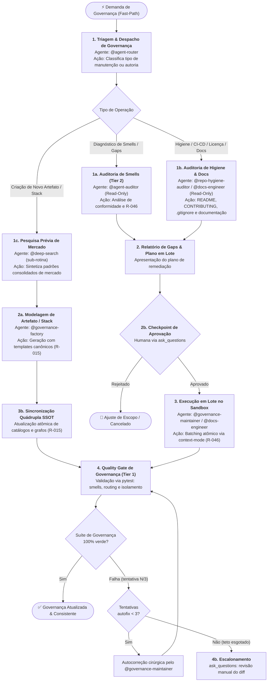

> **Fonte de verdade operacional:** [`CLAUDE.md`](../../../CLAUDE.md) § R-050, R-041 e R-042.  
> **Índice completo:** [`.github/agents/workflows.md`](../workflows.md).

---

### 3.5 WORKFLOW 5: `WORKFLOW-GOVERNANCE-MAINTENANCE` (Governança e Manutenção do Ecossistema)

- **Objetivo**: Auditar, padronizar, expandir e manter o catálogo de agents, skills, prompts e convenções do repositório de governança com pesquisa prévia compulsória, checkpoints humanos para mutações estruturais, execução atômica em lote (R-046) e validação final via suíte determinística de testes.
- **Gatilhos de Fast-Path**: `"auditar governança"`, `"novo agent"`, `"nova skill"`, `"novo prompt"`, `"nova stack"`, `"manutenção de catálogo"`, `"corrigir smell de agent"`, `"higiene de repositório"`.
- **Política R-041**: **Bypass Total** de `@prompt-structuring`. Direcionamento imediato para auditoria ou factory.



#### Cadeia Sequencial e Papéis:
- **Portão de Reúso e Generalização Sistêmica (R-055 — Prioritário & Mandatório)**: Toda demanda de manutenção, revisão, novo padrão ou correção técnica que envolva agents, prompts ou skills DEVE obrigatoriamente responder às 3 perguntas de generalização antes de codificar, eliminando o anti-padrão de correções em silo (*one-off fixes*):
  - **Q1 (Impacto Horizontal / Peers)**: *Esta melhoria ou correção se aplica a outros artefatos do mesmo perfil, camada ou família (ex.: outros routers, outros testers, outros advisors)?* Se sim, expandir compulsoriamente o escopo em lote único (*Single-Turn Batching*, R-046) para cobrir todos os artefatos análogos na mesma entrega.
  - **Q2 (Prevenção Futura / Templates)**: *O template canônico em `templates/` (`router-agent.md`, `operational-agent.md`, etc.) reflete essa nova exigência?* Se não, o template correspondente DEVE ser atualizado na mesma entrega para que futuros artefatos gerados pelo `@governance-factory` já nasçam em conformidade.
  - **Q3 (Blindagem por Teste / Quality Gate)**: *A suíte determinística em `tests/governance_audit/` já valida essa regra?* Se não, uma asserção ou teste específico no pytest DEVE ser criado ou expandido para garantir não-regressão contínua.
1. **Estado 1 — Diagnóstico Read-Only ou Pesquisa Prévia**:
   - *Diagnóstico de Smells & Reúso*: O `@agent-auditor` executa auditoria estática e comportamental contra os smells canônicos de governança e avalia compulsoriamente Q1, Q2 e Q3.
   - *Auditoria de Higiene & Documentação*: O `@repo-hygiene-auditor` audita a saúde do repositório, licença e segurança de versionamento; o `@docs-engineer` mapeia a integridade documental, alinhamento técnico de manuais e conformidade de guias de governança.
   - *Pesquisa Prévia Compulsória (Criação de Artefatos / Stack)*: O `@governance-factory` delega compulsoriamente ao `@deep-search` a investigação de mercado antes de escrever novos prompts, skills ou agents.
2. **Estado 2 — Modelagem e Checkpoint de Aprovação Humana**:
   - Apresentação objetiva dos achados ou especificações do novo artefato, incluindo a matriz de generalização sistêmica (artefatos alvo + peers + templates + testes).
   - *Estado 2b (Checkpoint Humano)*: Toda manutenção estrutural ou criação de stack exige autorização explícita via `ask_questions` antes de qualquer alteração física nos catálogos.
3. **Estado 3 — Execução e Sincronização em Lote por Tipo de Artefato (R-015 / R-046)**:
   - O `@governance-maintainer` aplica as alterações em lote único (*Single-Turn Batching*) utilizando o `context-mode` MCP no sandbox para zero desperdício de tokens, atuando em conjunto com o `@docs-engineer` para atualização e consolidação formal de documentação técnica, manuais e guias de governança.
   - **Sincronização Atômica por Tipo (R-015 — gap corrigido)**: o conjunto de arquivos sincronizados depende do tipo de artefato, nunca uma lista fixa de 4 arquivos:
     - **Novo Agent**: `catalog.yaml` + `routing-graph.yaml` (nós/arestas) + **novo caso em `.github/agents/evals/casos-roteamento.yaml`** (exigência formal de R-040, antes omitida desta lista) + `agent-router.agent.md` (Decision Tree derivada) + `.github/agents/README.md`.
     - **Nova Skill**: `.github/skills/.index.json` + `.github/skills/README.md` + `source_docs:` dos agents consumidores.
     - **Novo Prompt**: `.github/prompts/README.md`.
     - **Nova Stack**: todos os itens acima aplicados ao sub-catálogo de domínio (`*-catalog.yaml`) + domain router correspondente.
4. **Estado 4 — Quality Gate de Governança (Tier 1 Automático)**:
   - Execução determinística dos testes de governança:
     - `test_governance_smells.py` (conformidade com templates e 17 smells).
     - `test_local_project_isolation.py` (100% isolamento de projetos locais — R-038/R-043/R-044).
     - `test_routing_quality_gate.py` (integridade do grafo e alcançabilidade).
   - **Suíte de Evals Comportamental**: para nova rota/agent, valida adicionalmente contra os 60 casos de `.github/agents/evals/casos-roteamento.yaml` (`agent-evals-lab`) — regressão estrutural (pytest) não substitui regressão comportamental de roteamento.
   - **Circuit Breaker (Estado 4b)**: teto de **3 tentativas** de autocorreção. Havendo regressão, o `@governance-maintainer` executa autocorreção cirúrgica; se a 3ª tentativa ainda falhar, escala via `ask_questions` para revisão manual do diff — nunca autocorreção indefinida.
   - *Loop de Revisão de Qualidade*: Se o Avaliador Cético reprovar por achados de qualidade não-bloqueantes, aplica-se o Loop de Revisão de Qualidade (§ 1.5), teto de 3 iterações.

#### Typed State Bag (`workflow_state`):
```yaml
workflow_state:
  tipo_demanda: "auditoria_smells | higiene_repo | criacao_artefato | nova_stack | refatoracao_cascata"
  artefatos_alvo:
    - "<caminho/artefato.ext>"
  diagnostico_smells:
    total_achados: 3
    smells_detectados:
      - "smell-2.2-active-agent-banner"
      - "smell-2.6-absolute-path"
  pesquisa_previa_deep_search:
    realizada: true
    sintese_diretrizes: "<resumo dos padrões de mercado>"
  plano_manutencao_lote:
    - arquivo: ".github/agents/catalog.yaml"
      acao: "atualizar_versao_e_source_docs"
  sincronizacao_por_tipo:
    tipo_artefato: "agent | skill | prompt | stack"
    inclui_evals_casos_roteamento: true  # obrigatorio para novo agent/rota (R-040)
  status_aprovacao_humana: "aprovado"
  quality_gate_tier1: "100_passando"
  tentativas_autofix: 0  # teto: 3 (Estado 4b)
```

---

