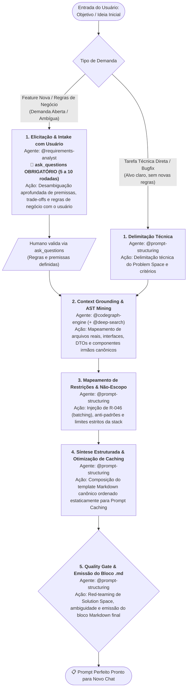

> **Fonte de verdade operacional:** [`CLAUDE.md`](../../../CLAUDE.md) § R-050, R-041 e R-042.  
> **Índice completo:** [`.github/agents/workflows.md`](../workflows.md).

---

### 3.9 WORKFLOW 9: `WORKFLOW-PROMPT-SYNTHESIS` (Síntese e Refino de Prompts para Sessões Limpas)

> **Objetivo**: Conduzir o refinamento estrutural de prompt, enriquecer com mineração determinística de contexto no codebase e sintetizar o prompt canônico perfeito em template Markdown estruturado em bloco de código pronto para inicializar uma nova sessão limpa conduzida por agents ou workflows especialistas (consumo exclusivo downstream).
> **Gatilho de Entrada**: Invocação via `/craft-prompt`, intenção explícita do usuário de sintetizar ou refinar prompt para um novo chat, ou comando de preparação de contexto pré-execução.
> **Fast-Path**: Sim (dispensa Fast-Chaining prévio; ingressa diretamente no Estado 1).



#### Cadeia Sequencial e Papéis:
1. **Estado 1 — Elicitação & Intake com Usuário (`@requirements-analyst` para Negócio / `@prompt-structuring` para Técnico)**:
   - *Via Funcional (Feature / Negócio / Demanda Aberta)*: O `@requirements-analyst` é o agente condutor desta etapa. Aplica *Five Whys* se houver *solution-jumping* precoce e aciona compulsoriamente `ask_questions` em um ciclo aprofundado de 5 a 10 rodadas estruturadas de desambiguação (com opções + campo livre, sem checklist fixo, adaptativo ao domínio) para desambiguar regras de negócio, fluxos de aprovação, permissões e critérios com o usuário (R-027 / Invariante 19). É terminantemente proibido deduzir premissas ou alucinar requisitos de negócio sem confirmação humana. Cláusula de teto: atingida a 10ª rodada de `ask_questions`, eventuais ambiguidades ou lacunas residuais ainda não sanadas devem ser registradas expressamente em `## Restrições e Não-Escopo` como dívida técnica delimitada, autorizando o avanço para o Estado 2 sem loops infinitos.
   - *Via Técnica (Refactor / Bugfix / Tarefa Direta)*: Se a tarefa já possuir alvo e escopo técnicos claros sem novas regras de domínio, o `@prompt-structuring` atua diretamente na delimitação do Problem Space técnico, critérios e não-escopo preliminares.
2. **Estado 2 — Context Grounding & AST Mining (`@codegraph-engine` + `@deep-search`)**:
   - *Ação*: O `@codegraph-engine` é o agente executor OBRIGATÓRIO desta etapa (R-045 / Invariante 18). Ele DEVE ser invocado formalmente via `run_subagent(agentName: 'codegraph-engine', ...)` para extrair deterministamente os caminhos reais de arquivos (seção `## Arquivos e Referências Grounded`), interfaces compartilhadas, contratos de DTOs e identificação de componentes irmãos canônicos homologados (protocolo *Canonical Sibling First*). É terminantemente proibido substituir a invocação do subagente por scripts manuais de varredura `fs` no sandbox via `ctx_execute` (Smell 2.26). Se houver novas dependências de biblioteca externa, o `@deep-search` é acionado via `run_subagent` para obter documentação oficial, versões e contratos reais.
3. **Estado 3 — Mapeamento de Restrições & Não-Escopo (`@prompt-structuring`)**:
   - *Ação*: Definição do Não-Escopo explícito (o que o agente executor NÃO deve alterar, bibliotecas proibidas, garantias de compatibilidade reversa). Injeção compulsória de governança de lote (*Single-Turn Batching* / R-046) e regras inegociáveis da stack do projeto alvo (ex.: convenções de modernização, injeções padronizadas, reatividade estrita, zero estilos inline arbitrários).
4. **Estado 4 — Síntese Estruturada & Otimização de Caching (`@prompt-structuring`)**:
   - *Ação*: Montagem do prompt canônico final utilizando o template Markdown canônico (`templates/prompt-synthesis-output.md`), estruturado nas seções: `# [Papel Especialista / Stack Detectada]`, `## Contexto do Projeto`, `## Arquivos e Referências Grounded`, `## Tarefa`, `## Critérios de Aceitação`, `## Restrições e Não-Escopo`, `## Protocolo de Execução Recomendado` e `## Formato de Saída Esperado`. Otimização de ordem dos tokens para alinhamento com Prompt Caching (conteúdo estático e de convenções no topo; especificidades variáveis da task na cauda).
5. **Estado 5 — Quality Gate & Emissão do Bloco .md (`@prompt-structuring`)**:
   - *Ação*: Avaliação crítica de fechamento com Quality Gate ativo e Red-Teaming analítico contra o Solution Space antes da emissão. O `@prompt-structuring` submete o rascunho do prompt a um checklist de corte com 4 critérios excludentes:
     1. **Classes/métodos internos**: o prompt não pode ditar classes internas, métodos ou assinaturas de código não solicitados pelo usuário;
     2. **Bibliotecas/frameworks/algoritmos não pedidos**: não pode introduzir bibliotecas, frameworks auxiliares ou algoritmos específicos que o usuário não demandou expressamente;
     3. **Arquitetura/design patterns prescritos**: não pode impor design patterns ou decisões de arquitetura interna, preservando a autonomia técnica do agente especialista do novo chat;
     4. **Tecnologias não mencionadas**: não pode injetar tecnologias, ferramentas ou runtimes não citados na solicitação original.
   - *Cláusula de Bloqueio*: Qualquer violação a um dos 4 critérios reprova imediatamente o prompt, forçando re-síntese cirúrgica no Estado 4 antes da liberação.
   - *Finalidade de Consumo Exclusivo*: O prompt emitido destina-se estritamente ao consumo por outros agents ou workflows em uma nova sessão limpa (consumo exclusivo downstream), sendo expressamente vedada sua apresentação como solução final direta de negócio ao usuário.
   - *Emissão*: Emissão do prompt final aprovado encapsulado em bloco de código Markdown (`.md`), pronto para ser colado em um novo chat.

#### Typed State Bag (`workflow_state`):
```yaml
workflow_state:
  workflow_id: "WORKFLOW-PROMPT-SYNTHESIS"
  etapa_atual: 1  # 1..5
  prompt_alvo:
    intencao_original: "<descricao-ou-objetivo-inicial-da-tarefa>"
    stack_detectada: "<stack-alvo-detectada | ex: angular | spring-boot | python>"
    rodadas_elicitacao_realizadas: 5  # 5..10 (Invariante 19)
    lacunas_residuais_declaradas: []  # itens não resolvidos até a 10ª rodada
    arquivos_grounded:
      - "<caminho/relativo/arquivo-alvo-1.ext>"
      - "<caminho/relativo/modelo-ou-contrato.ext>"
    irmao_canonico_referencia: "<caminho/relativo/componente-irmao-canonico.ext>"
    criterios_aceite:
      - "<criterio-de-aceite-funcional-invest-1>"
      - "<criterio-de-aceite-qualidade-ou-teste-2>"
    restricoes_nao_escopo:
      - "<restricao-negativa-ou-nao-escopo-1>"
      - "<convencao-obrigatoria-ou-anti-padrao-2>"
    red_teaming_solution_space:
      aprovado: true
      violacoes_detectadas: []
    formato_saida: "markdown_code_block"
    consumo_exclusivo_agents: true
    bloco_md_gerado: true
```

#### Invariante de Visibilidade Progressiva e Painel de Evidências (Anti-Blackbox Execution):
É expressamente vedado ao agente sintetizador (`@prompt-structuring` / `/craft-prompt`) emitir o prompt final sem antes apresentar o Painel de Evidências detalhado com os resultados individuais de cada uma das 5 etapas no chat (Elicitação no Problem Space, Mineração de Contexto & Grounding no Codebase, Mapeamento de Restrições/Não-Escopo, Síntese Estruturada para Caching e Checklist do Quality Gate). A execução silenciosa ("blackbox") que oculta os achados intermediários e exibe apenas o bloco final solto constitui violação de visibilidade operacional.

- *Sub-rotina 1b (Checkpoint Humano Obrigatório em Ambiguidade — Gate Pattern R-041 / Invariante 19)*: Em qualquer demanda funcional com ambiguidade de domínio ou múltiplos caminhos de negócio viáveis, o workflow DEVE compulsoriamente suspender a execução na Etapa 1 e apresentar as dúvidas e opções de regras de negócio para validação humana explícita via `ask_questions`. É expressamente vedado avançar para a Etapa 2 sem a resposta do solicitante.

---

