> **Fonte de verdade operacional:** [`CLAUDE.md`](../../../CLAUDE.md) § R-050, R-041 e R-042.  
> **Índice completo:** [`.github/agents/workflows.md`](../workflows.md).

---

### 3.2 WORKFLOW 2: `WORKFLOW-REFACTORING` (Refatoração Estrutural e Modernização)

- **Objetivo**: Modificar a estrutura interna do código sem alterar seu comportamento observável, amparado por testes de caracterização (Golden Master), análise de blast radius via grafo, **Contract Testing (Pact-style / consumer-driven)** para contratos compartilhados, plano incremental Mikado com rollback atômico, **camada de redundância proporcional ao blast radius** (auditoria reversa de símbolos, mini mutation gate e differential replay leve quando aplicável) e validação estrita contra ground truth de regras de negócio com **registro formal de `blast_radius_revertido`** em caso de reversão.
- **Gatilhos de Fast-Path**: `"refatorar"`, `"refatoração"`, `"desacoplar"`, `"eliminar god class"`, `"clean architecture"`, `"modularizar"`, `"remover duplicação"`, `"extrair interface"`.
- **Política R-041**: **Bypass** se o alvo estiver claro. Se o pedido for genérico ("melhore a arquitetura"), aciona `@prompt-structuring`.
- **⚠️ Invariante de Contract Testing no Gate de Contratos (não-negociável)**: Sempre que a refatoração atingir APIs públicas, DTOs compartilhados, contratos RPC/REST ou interfaces consumidas por múltiplos microsserviços/módulos, o Estado 2/Sub-rotina 2a exige **Contract Testing formal (Pact-style consumer-driven contract tests ou OpenAPI / JSON Schema Diff)** comprovando que nenhum pacto de consumidor existente é quebrado.
- **⚠️ Invariante de Redundância Proporcional ao Blast Radius (não-negociável)**: Para refatorações com blast radius médio ou alto (múltiplos callers/callees, componentes core ou desacoplamento estrutural), a validação no Estado 5 exige compulsoriamente a tríade de redundância proporcional: *(a)* **Auditoria Reversa de Símbolos** (`reverse_symbol_audit` via grafo garantindo zero métodos/interfaces omitidos); *(b)* **Mini Mutation Gate** (`mini_mutation_gate` comprovando que a rede Golden Master elimina mutantes sintéticos sem falsos-verdes); e *(c)* **Differential Replay Leve** (`differential_replay_leve`, quando aplicável, comparando snapshots de entrada/saída pré e pós-refatoração para funções de cálculo/transformação).
- **⚠️ Invariante de Rollback com Blast Radius Revertido (não-negociável)**: Em caso de falha de validação ou violação de ground truth no Estado 5b, a governança de rollback obriga o registro quantitativo do `blast_radius_revertido` no `workflow_state` (inventário exato dos nós Mikado revertidos, callers e arquivos restaurados), mantendo rastreabilidade total da reversão atômica.

```mermaid
flowchart TD
    StartRefactor(["⚡ Solicitação de Refactor (Fast-Path)"]) --> GroundTruth["<b>1. Mapeamento de Regras Vigentes</b><br/>Agente: @business-rules-extractor<br/>Ação: Extrai regras vigentes em markdown (Ground Truth)"]

    GroundTruth --> BlastRadius["<b>2. Blast Radius & Dependências</b><br/>Agente: @codegraph-engine (R-045)<br/>Ação: Mapeia callers, callees, ciclos e acoplamento"]

    BlastRadius --> CheckContract{"Afeta APIs públicas<br/>ou Consumidores?"}
    CheckContract -- "Sim" --> ContractGate["<b>2a. Contract Testing (Pact-Style) & Deprecation Plan</b><br/>Agente: @tech-solution-architect<br/>Ação: Pact-style consumer-driven tests / Branch by Abstraction"]
    CheckContract -- "Não" --> CheckSafetyNet{"Cobertura de Testes<br/>suficiente por risco?"}
    ContractGate --> CheckSafetyNet

    CheckSafetyNet -- "Não (Código Legado Sem Teste)" --> GoldenMaster["<b>2b. Golden Master Safety Net</b><br/>Agente: specialist-unit-test-writer<br/>Ação: Cria testes de caracterização capturando comportamento atual"]
    CheckSafetyNet -- "Sim" --> SafetyNetPlan["<b>3. Plano Macro Mikado</b><br/>Agente: @refactor-planner + @test-strategy<br/>Ação: Árvore Mikado em micro-etapas + pontos de rollback"]
    GoldenMaster --> SafetyNetPlan

    SafetyNetPlan --> CheckDBSchema{"Exige refatoração<br/>de Schema/Banco?"}
    CheckDBSchema -- "Sim" --> ExpandContract["<b>3b. Expand and Contract</b><br/>Agente: @database-specialist<br/>Ação: Adição de novas colunas/tabelas paralelas"]
    CheckDBSchema -- "Não" --> CheckRiskGate{"Breaking change OU schema OU blast radius grande?"}
    ExpandContract --> CheckRiskGate

    CheckRiskGate -- "Sim" --> PlanGate["<b>3c. Checkpoint de Aprovação do Plano</b><br/>ask_questions: aprovar DAG Mikado antes de mutar"]
    CheckRiskGate -- "Não (escopo local claro)" --> Execution["<b>4. Execução Incremental em Lote</b><br/>Agente: Domain Router / Specialist Developer<br/>Ação: Execução em micro-lotes com diffs cirúrgicos (R-046)"]
    PlanGate --> Execution

    Execution --> Validation["<b>5. Validação de Ground Truth & Redundância Proporcional</b><br/>Agente: @business-rules-extractor (Validate) + @code-review + @code-style-enforcer<br/>Ação: Ground Truth 100% + Reverse Symbol Audit + Mini Mutation Gate + Differential Replay"]

    Validation --> CheckRefactor{"Regras, testes e<br/>redundância 100% aprovados?"}
    CheckRefactor -- "Sim" --> EndRefactor(["✅ Concluído com Sucesso"])
    CheckRefactor -- "Não (Violação de Regra)" --> RefactorRollback["<b>5b. Rollback Decidido pelo Planner & Blast Radius Revertido</b><br/>Agente: @refactor-planner (decide escopo) → domain router/specialist (executa)<br/>Ação: Reversão dos nós DAG afetados + registro de blast_radius_revertido"]
    RefactorRollback --> EndRefactorFail(["🛑 Refatoração Revertida com Segurança"])
```



#### Cadeia Sequencial e Papéis:
1. **Estado 1 — Mapeamento de Regras Vigentes (`@business-rules-extractor`)**: Extrai regras de negócio do código atual em arquivos `.md` estruturados (modo Extract), servindo como baseline de verdade inegociável.
2. **Estado 2 — Blast Radius & Análise de Contratos (`@codegraph-engine`)**: Executa análise estrita determinística (R-045) via `@optave/codegraph` para identificar dependências transitivas, acoplamento e pontos de quebra. Proibido varredura manual.
   - *Sub-rotina 2a (Contract & Deprecation Gate com Contract Testing Pact-Style / Consumer-Driven)*: Se a refatoração atingir métodos públicos, DTOs compartilhados ou interfaces consumidas por múltiplos módulos/microsserviços, o `@tech-solution-architect` e os especialistas de testes aplicam compulsoriamente **Contract Testing (Pact-style consumer-driven contract tests ou OpenAPI / JSON Schema Diff)** para comprovar matematicamente que nenhum consumidor existente será quebrado. Desenha também a transição suave (Branch by Abstraction / Deprecation prévia).
   - *Sub-rotina 2b (Golden Master / Safety Net Gate)*: Se a área a ser refatorada não possuir cobertura automatizada mínima, o `specialist-unit-test-writer` DEVE escrever testes de caracterização que congelem o comportamento existente antes de qualquer alteração estrutural. **Threshold por risco (não flat 80%)**: consultar a matriz de `test-coverage-governance/SKILL.md` § 1 — lógica crítica de negócio exige 90%+, integração API/BD 80%+, controllers/handlers 70%+; `@test-strategy` determina o threshold aplicável ao alvo antes desta decisão, e a medição real usa a ferramenta configurada no projeto (JaCoCo/Istanbul/coverage.py via adapter de stack).
3. **Estado 3 — Plano Macro Mikado & Estratégia de Rollback (`@refactor-planner` + `@test-strategy`)**:
   - Decompõe a meta usando a técnica **Mikado Method**: gera a árvore de pré-requisitos (folhas primeiro, raiz por último) em micro-passos independentes.
   - *Sub-rotina 3b (Database Expand and Contract)*: Se a refatoração envolver schema de banco, o `@database-specialist` orquestra a evolução em fases paralelas (Expand -> Migrate -> Contract), nunca DDL destrutivo direto.
   - *Sub-rotina 3c (Checkpoint de Aprovação do Plano)*: Se a refatoração envolver **breaking change de contrato**, **schema de banco** ou **blast radius grande** (muitos callers/callees no Estado 2), o `@refactor-planner` apresenta o DAG completo e aciona `ask_questions` para aprovação humana explícita **antes** de iniciar o Estado 4 — mesmo padrão de checkpoint usado em `WORKFLOW-FEATURE-DEVELOPMENT` (Estado 3b) e `WORKFLOW-GOVERNANCE-MAINTENANCE` (Estado 2b). Para refatorações de escopo local claro e baixo risco, a aprovação pode ser contextual/implícita (R-031).
   - *Limite de Escala do DAG*: cada nó já é limitado a 1-3 arquivos (contrato do `@refactor-planner`); se o DAG total ultrapassar **15 nós**, o plano DEVE ser fatiado em fases entregáveis independentes (múltiplas sessões/PRs), cada uma terminando em estado *always deployable* — nunca um plano monolítico de execução única inviável.
3b. **Gate 2 Mandatório — Autoria do Plano de Implementação Técnica (R-064)**:
   - *Autoria*: O `<stack>-arch-advisor` detalha o plano técnico em `docs/implementation-plans/` definindo allowlist de arquivos, blast radius e estratégia de rollback a partir do plano Mikado.
   - *Aprovação*: Submetido ao usuário com `status: approved` prévio à execução.
4. **Estado 4 — Execução Incremental em Lote (`domain router / specialists` — requires_plan: true)**: Aplica as alterações respeitando o protocolo R-046 (Single-Turn Batching / context-mode para 5+ arquivos) em micro-lotes. Cada nó do DAG tem seu próprio Gate Out (compilação limpa, testes 100% verdes, diff mínimo — conforme o template de saída do `@refactor-planner`), validando incrementalmente contra a suíte de caracterização a cada micro-lote, não apenas ao final.
5. **Estado 5 — Validação de Não-Regressão, Redundância Proporcional e Compliance (`@business-rules-extractor` + `@code-review` + `@code-style-enforcer`)**:
   - O `@business-rules-extractor` executa o modo Validate comparando o código final com as regras documentadas no Estado 1.
   - *Co-Verificação Analítica de Estilo*: O `@code-style-enforcer` atua em conjunto com o `@code-review` validando a conformidade estrutural com convenções de lint, formatação e pureza idiomática da base refatorada.
   - *Redundância Proporcional ao Blast Radius*: Quando o blast radius for médio ou alto (múltiplos callers, componentes estruturais ou extração de interfaces), a validação incorpora compulsoriamente a tríade de redundância:
     1. **Auditoria Reversa de Símbolos (`reverse_symbol_audit`)**: O `@codegraph-engine` compara o inventário de símbolos, métodos públicos e interfaces pré-refatoração contra o código final para assegurar que nenhum símbolo público ou contrato foi acidentalmente omitido, descontinuado ou tornado privado sem aprovação.
     2. **Mini Mutation Gate (`mini_mutation_gate`)**: Injeção controlada de mutantes sintéticos nas áreas refatoradas para comprovar que a suíte de caracterização / Golden Master é resiliente e acurada (eliminando falsos-verdes).
     3. **Differential Replay Leve (`differential_replay_leve`, quando aplicável)**: Para rotinas determinísticas de transformação de dados, parsers, cálculo ou regras de negócio, replay comparativo de fixtures de entrada e saída capturadas no Estado 1/2 antes da mutação, comprovando equivalência de comportamento com zero drift.
   - *Loop de Revisão de Qualidade*: Se o Avaliador Cético reprovar por achados de qualidade não-bloqueantes, aplica-se o Loop de Revisão de Qualidade (§ 1.5), teto de 3 iterações.
   - *Estado 5b — Rollback Decidido pelo Planner, Executado pelo Especialista com `blast_radius_revertido` (contrato corrigido)*: Se qualquer regra de negócio for violada, o gate de contratos falhar ou os testes de caracterização quebrarem, o `@refactor-planner` — **que não possui nenhuma ferramenta de edição ou terminal** — apenas DECIDE o escopo do rollback (quais nós do DAG revertem, com base na árvore de dependências do Estado 3; preferencialmente incremental, não o plano inteiro) e aciona via `run_subagent` o(s) domain router(s)/specialist(s) que executaram cada nó afetado para reverter fisicamente seus próprios arquivos. **Jamais o `@refactor-planner` executa a reversão diretamente** (ver § 5, invariante 6). A reversão calcula e registra quantitativamente o **`blast_radius_revertido`** (inventário de nós revertidos, arquivos restaurados e callers preservados) no `workflow_state` e escala para decisão humana via `ask_questions`.

#### Typed State Bag (`workflow_state`):
```yaml
workflow_state:
  alvo_refatoracao: "<classe, metodo ou modulo alvo>"
  padrao_estrategico: "mikado_method | branch_by_abstraction | strangler_fig"
  ground_truth_regras_doc: "docs/business-rules/regras-<alvo>.md"
  blast_radius_metricas:
    total_callers: 14
    total_callees: 6
    tem_ciclo: false
    tem_breaking_change: false
  contract_testing:
    exigido: true  # true se afetar APIs publicas ou contratos de consumidores
    tipo: "pact_consumer_driven | openapi_diff | schema_compatibility"
    consumidores_validados:
      - "app-mobile"
      - "web-portal"
    status: "pass | fail | dispensado"
  safety_net_cobertura:
    testes_caracterizacao_presentes: true
    threshold_aplicavel: "90 (critico) | 80 (integracao) | 70 (controller)"
    arquivos_testes_golden_master:
      - "<caminho/arquivo.spec.ext>"
  micro_etapas_planejadas:
    - etapa_idx: 1
      descricao: "<micro-passo mikado>"
      status: "pendente | concluido"
      executor: "<domain-router-ou-specialist>"
  dag_total_nos: 6  # se > 15, fatiar em fases entregáveis independentes
  requer_checkpoint_aprovacao: false  # true -> breaking change | schema | blast radius grande
  status_aprovacao_plano: "aprovado | pendente | contextual_implicita"
  redundancia_proporcional:
    nivel_blast_radius: "baixo | medio | alto"
    auditoria_reversa_simbolos: "pass | fail | dispensado"  # codegraph-engine
    mini_mutation_gate: "pass | fail | dispensado"          # test-strategy / tests
    differential_replay_leve: "pass | fail | dispensado"    # replay de fixtures
  status_validacao_regras: "100_preservadas | violacao_detectada"
  snapshot_reversao: "<tag_de_reversao_ou_stash>"
  rollback_execucao:
    nos_dag_revertidos: []
    arquivos_restaurados: []
    blast_radius_revertido:
      total_callers_restaurados: 0
      modulos_restaurados: []
```

---

