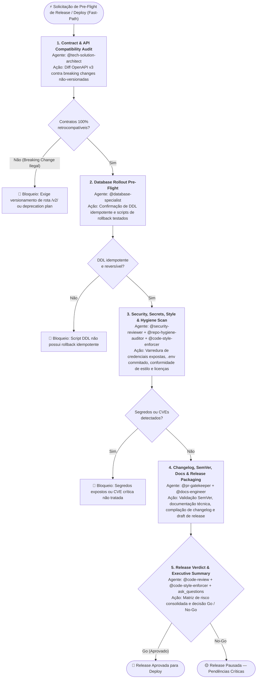

> **Fonte de verdade operacional:** [`CLAUDE.md`](../../../CLAUDE.md) § R-050, R-041 e R-042.  
> **Índice completo:** [`.github/agents/workflows.md`](../workflows.md).

---

### 3.8 WORKFLOW 8: `WORKFLOW-RELEASE-READINESS` (Prontidão de Release, Breaking Changes & Deploy Pre-Flight)

- **Objetivo**: Executar a auditoria consolidada de pré-lançamento e prontidão operacional de uma release ou entrega principal, validando compatibilidade de contratos de API (OpenAPI/gRPC), idempotência e reversibilidade de migrações de banco DDL, ausência de segredos vazados (`.env`, credenciais), conformidade de licenças, integridade do changelog semântico e veredito formal de Go/No-Go para deploy.
- **Gatilhos de Fast-Path**: `"preparar release"`, `"release readiness"`, `"pre-flight deploy"`, `"auditar release"`, `"prontidão de entrega"`, `"validar versão"`, `"tagging de release"`.
- **Política R-041**: **Bypass Total** de `@prompt-structuring`.



#### Cadeia Sequencial e Papéis:
1. **Estado 1 — Contract & API Compatibility Audit (`@tech-solution-architect`)**:
   - *Ação*: Validação de diffs de especificação OpenAPI v3 / contratos de integração entre a versão atual e a release pretendida. Verificação estrita de *breaking changes* não versionadas contra clientes consumidores.
2. **Estado 2 — Database Rollout Pre-Flight & Rollback Check (`@database-specialist`)**:
   - *Ação*: Auditoria de scripts Flyway/DDL pendentes: confirmação de idempotência, ausência de `DROP` destrutivo sem fase de deprecação e existência de scripts de reversão (rollback) testados.
3. **Estado 3 — Security, Secrets & Repository Hygiene Scan (`@security-reviewer` + `@repo-hygiene-auditor` + `@code-style-enforcer`)**:
   - *Ação*: Varredura de diffs contra credenciais vazadas, variáveis `.env` expostas, pacotes de licença incompatível, conformidade de lint/estilo via `@code-style-enforcer` e conformidade de arquivos essenciais (`README`, `CHANGELOG`, `.gitignore`).
4. **Estado 4 — Changelog, SemVer, Docs & Release Packaging (`@pr-gatekeeper` + `@docs-engineer`)**:
   - *Ação*: Compilação das alterações agrupadas por convenção Conventional Commits (`feat`, `fix`, `refactor`, `perf`), validação do bump SemVer (`major`, `minor`, `patch`), geração de release notes e sincronização de documentação técnica via `@docs-engineer`, e atualização formal do `CHANGELOG.md`.
5. **Estado 5 — Release Verdict & Executive Summary (`@code-review` + `@code-style-enforcer` + `ask_questions`)**:
   - *Ação*: Emissão da Matriz de Risco Executiva de Release (com co-verificação analítica do `@code-review` e `@code-style-enforcer`) e checkpoint formal de decisão humana (Go / No-Go / Contingência) via `ask_questions`.

#### Typed State Bag (`workflow_state`):
```yaml
workflow_state:
  release_versao: "v2.8.0"
  semver_tipo: "major | minor | patch"
  contract_compatibility_status: "compativel | breaking_changes_versionadas"
  database_preflight_status: "aprovado_com_rollback | pendencia_ddl"
  security_secrets_scan: "limpo | segredos_detectados"
  repo_hygiene_status: "conforme | inconforme"
  changelog_atualizado: true
  veredito_final: "GO | NO_GO | PENDENCIA"
```

---

