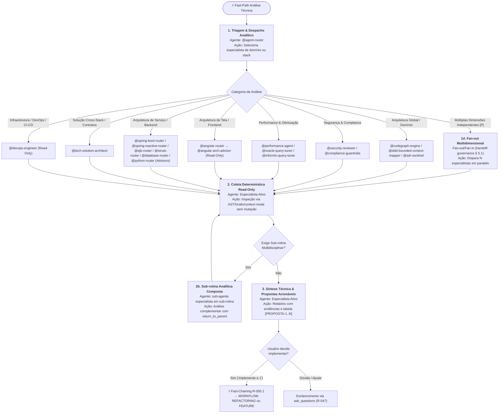

> **Fonte de verdade operacional:** [`CLAUDE.md`](../../../CLAUDE.md) § R-050, R-041 e R-042.  
> **Índice completo:** [`.github/agents/workflows.md`](../workflows.md).

---

### 3.3 WORKFLOW 3: `WORKFLOW-TECHNICAL-ANALYSIS` (Análise Técnica, Diagnóstico e Auditoria Especializada)

- **Objetivo**: Conduzir investigações conceituais, diagnósticos de segurança, performance, conformidade de domínio, arquitetura de telas/fluxos por stack técnica ou levantamento de arquitetura de forma estritamente analítica e não mutativa, concluindo com propostas acionáveis para Fast-Chaining.
- **Gatilhos de Fast-Path**: `"analisar"`, `"diagnosticar"`, `"como funciona"`, `"mapear arquitetura"`, `"verificar segurança"`, `"avaliar performance"`, `"conformidade adr"`, `"bounded context"`, `"analisar tela"`, `"analisar fluxo"`, `"identificar melhorias"`.
- **Política R-041**: **Bypass Total** de `@prompt-structuring`. Direcionamento imediato ao especialista analítico.



#### Cadeia Sequencial e Papéis:
1. **Estado 1 — Despacho para Especialista Analítico**: O router direciona sem desvios para o agente cujo domínio ou stack cobre a pergunta:
   - *Arquitetura Estrutural & Grafo*: `@codegraph-engine` (dependências/ciclos), `@ddd-bounded-context-mapper` (domínios/God Classes), `@adr-sentinel` (conformidade arquitetural).
   - *Segurança & Governança*: `@security-reviewer` (OWASP/CVE/secrets), `@compliance-guardrails` (LGPD/SOC 2).
   - *Engenharia de Performance*: `@performance-agent` (CWV/N+1/profiling), `@oracle-query-tuner` / `@informix-query-tuner` (planos de execução SQL).
   - *Arquitetura de Telas & Fluxos por Stack*: `@angular-arch-advisor` (reatividade de estado, memory leaks, detecção de mudança, SSR), `@spring-boot-arch-advisor` (concorrência, camada de persistência, clean architecture), `@spring-reactive-arch-advisor` (reatividade não-bloqueante, backpressure, event-loop), `@ejb-arch-advisor` (transações distribuídas, Stateless pools).
   - *Viabilidade Técnica & Contratos*: `@tech-solution-architect` (Technical Blueprint, OpenAPI, modelo de dados).
   - *Infraestrutura & DevOps*: `@devops-engineer` (Dockerfile, Kubernetes, pipelines CI/CD, Infrastructure-as-Code — read-only).
   - *Sub-rotina 1d (Fan-out Multidimensional)*: Se a solicitação abranger **2+ categorias independentes simultâneas** (ex.: "avalie segurança E performance deste módulo"), marcada `[P]` por R-018, o `@agent-router` aplica o padrão **Fan-out/Fan-in (Orchestrator-Workers)** já definido em `handoff-governance/SKILL.md` § 5.1: dispara os N especialistas em paralelo (cada um estritamente read-only, sem efeito colateral, portanto seguro paralelizar) e agrega os achados em UM relatório único no Estado 3 (fan-in obrigatório — nunca fragmentar em múltiplas respostas sem síntese).
2. **Estado 2 — Coleta & Diagnóstico Determinístico (Guardrail de Imutabilidade)**:
   - O agente opera estritamente em modo Read-Only / Advisory: **proibido o uso de ferramentas mutativas** (`create_file`, `replace_string_in_file`, `insert_edit_into_file`).
   - Todo achado DEVE citar `arquivo:linha` (R-044) e usar o `context-mode` MCP (`ctx_execute_file` / `ctx_search`) para evitar saturação da janela de contexto.
   - *Sub-rotina 2b (Análise Composta)*: Se a investigação exigir visão multidisciplinar (ex.: arquiteto consultando especialista de banco), aciona sub-rotina com `call_type: "subroutine"` e `return_to_parent: true`. Sujeita ao teto `MAX_DEPTH = 3` de `handoff-governance/SKILL.md` § 2.4 — acima disso, força retorno ao `parent_agent`/`@agent-router` com `motivo: "circuit_breaker_max_depth_exceeded"`.
3. **Estado 3 — Síntese e Propostas Acionáveis para Fast-Chaining (R-047 / R-050.1)**:
   - Emissão de relatório técnico estruturado (Abordagem · Diagnóstico · Evidências com `arquivo:linha` · Impacto · **Confiança** `<0.00–1.00>` conforme `confidence-fallback-policy`).
   - **Tabela Mandatória de Propostas Acionáveis (com Escape Hatch)**: O relatório DEVE concluir com a listagem formal numerada (`[PROPOSTA-1]`, `[PROPOSTA-2]`) indicando o tipo de esforço, arquivos-alvo e o workflow de destino recomendado (`WORKFLOW-REFACTORING`, `WORKFLOW-FEATURE-DEVELOPMENT` ou `WORKFLOW-BUG-FIX`). **Se a análise não revelar achado acionável relevante**, o especialista declara explicitamente `"Nenhuma proposta necessária — conformidade validada"` em vez de manufaturar sugestões de baixo valor apenas para preencher o formato.
   - Encerramento ativo com pergunta ao usuário via `ask_questions` (R-047), habilitando o **Fast-Chaining (R-050.1)** imediato no turno seguinte.

#### Typed State Bag (`workflow_state`):
```yaml
workflow_state:
  tipo_analise: "arquitetura_stack | seguranca_owasp | performance_cwv | grafo_blast_radius | ddd_bounded_context | conformidade_adr"
  escopo_alvo:
    modulo_ou_tela: "<nome-do-modulo-ou-tela>"
    arquivos_analisados:
      - "<caminho/arquivo.ext:linha>"
  diagnostico_sumario: "<resumo dos achados em 1-3 linhas>"
  confianca: 0.85
  analise_multidimensional:
    aplicavel: false
    especialistas_fan_out: []
  propostas_acionaveis:
    - id: "PROPOSTA-1"
      titulo: "<titulo-da-melhoria>"
      tipo: "refactoring | feature | bug_fix"
      arquivos_afetados:
        - "<caminho/arquivo.ext>"
      proximo_workflow: "WORKFLOW-REFACTORING"
```

---

