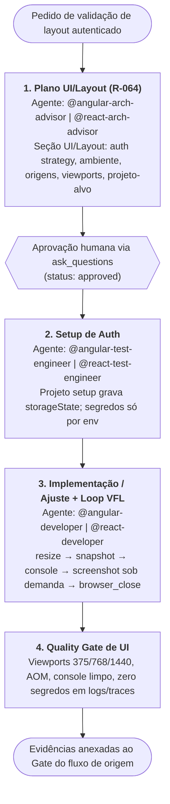

> **Fonte de verdade operacional:** [`CLAUDE.md`](../../../CLAUDE.md) § R-050, R-064 e R-042.
> **Índice completo:** [`.github/agents/workflows.md`](../workflows.md).

---

### 3.A WORKFLOW AUXILIAR: `WORKFLOW-UI-LAYOUT` (Validação de Layout/UI Autenticada — VFL)

> **Objetivo**: Validar layout, responsividade e acessibilidade de telas Angular/React em apps autenticadas via Playwright MCP, sem expor credenciais, com paridade entre stacks.
> **Natureza**: workflow **auxiliar (não numerado)** — vinculado aos fluxos `WORKFLOW-FEATURE-DEVELOPMENT` (Estado de implementação/UI) e `WORKFLOW-BUG-FIX` (bugs de layout). **Não altera** a lista dos workflows canônicos 1-9.
> **Gatilho de Entrada**: pedido de validação visual/layout que exija login (VFL, `storageState`, SSO/MFA) em `[PROJETO-ALVO]`.
> **Skills de referência**: `.github/skills/frontend-visual-feedback-loop/SKILL.md` (ordem de ferramentas, viewports, cleanup) e `.github/skills/playwright-mcp/SKILL.md` (§ 7.1–7.3: versão fixa, auth, MCP vs CLI).

| Estado | Responsável | Entrada | Saída / Critério |
| :--- | :--- | :--- | :--- |
| 1. Plano UI/Layout | `@angular-arch-advisor` / `@react-arch-advisor` (read-only, sem tools `playwright/*`) | Pedido + contexto de `[PROJETO-ALVO]` | Plano R-064 com seção UI/Layout e aprovação humana (`plan_ref` aprovado) |
| 2. Setup de Auth | `@angular-test-engineer` / `@react-test-engineer` | Plano aprovado | `storageState` gerado fora do versionamento; usuário de teste dedicado, menor privilégio, ambiente não produtivo; SSO/MFA via `--user-data-dir` com login humano |
| 3. Loop VFL | `@angular-developer` / `@react-developer` | Sessão autenticada | Ajustes mínimos + evidências por viewport; `browser_close` ao final |
| 4. Quality Gate | Executor + revisão do fluxo de origem | Evidências | Checklist do VFL aprovado; sem credenciais literais |

**Invariantes**:
- R-064: nenhuma edição de código de produção sem `plan_ref` aprovado; aprovação humana obrigatória antes do Estado 2.
- Auth por local do token (`token_storage`): `.github/skills/playwright-mcp/references/auth-token-storage-patterns.md`.
- Credenciais SOMENTE por variáveis de ambiente (nunca em prompt, `browser_type`/`browser_fill_form`, log, trace ou commit); `--extension` proibido.
- `@playwright/mcp` em versão fixa (sem tag flutuante); decisão MCP vs CLI conforme `playwright-mcp/SKILL.md` § 7.3.
- Roteamento: os routers de domínio (`@angular-router`, `@react-router`) despacham em nível plano e não possuem tools `playwright/*`.
