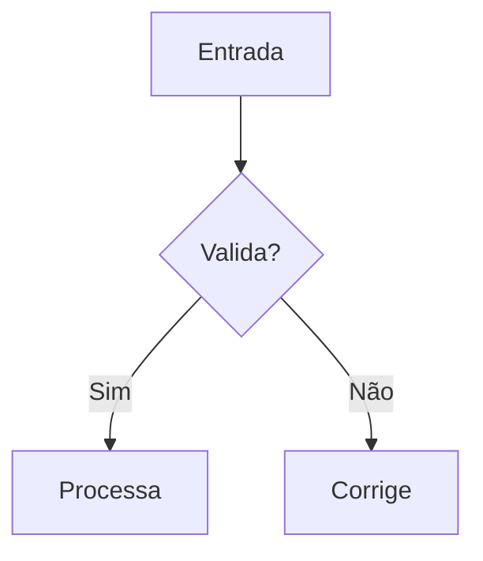
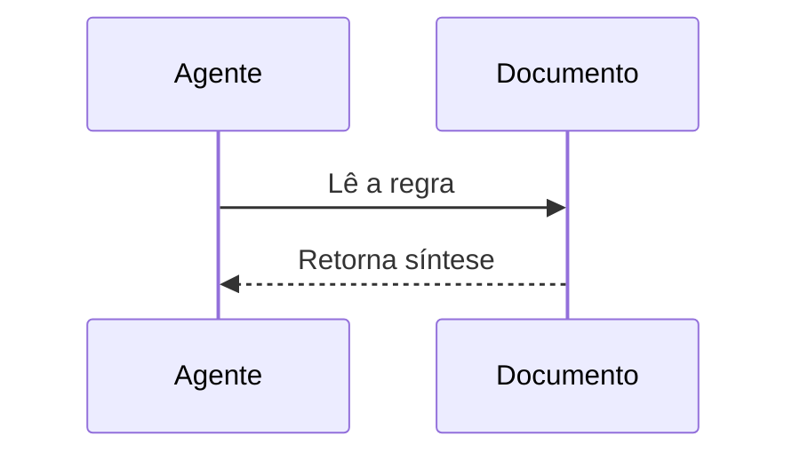

# mermaid-diagrams — Boas práticas genéricas

Mermaid deve ser usado para converter explicações textuais em diagramas curtos, legíveis e fáceis de revisar.

## 1) Quando usar

- Fluxos com decisão, validação ou roteamento.
- Sequências entre agentes, serviços, filas ou APIs.
- Relações entre classes, entidades ou tabelas.
- Estados de um processo ou transição de status.
- Cronogramas, marcos e visões temporais.
- Organização resumida de uma arquitetura ou domínio.

## 2) Escolha do tipo de diagrama

| Objetivo | Tipo Mermaid | Observação |
|---|---|---|
| Fluxo com decisão | `flowchart` | Melhor para pipelines, validações e caminhos alternativos |
| Interação entre participantes | `sequenceDiagram` | Melhor para chamadas, eventos e mensagens |
| Relação entre classes | `classDiagram` | Melhor para contratos e dependências |
| Relacionamento de dados | `erDiagram` | Melhor para entidades e cardinalidade |
| Ciclo de estados | `stateDiagram-v2` | Melhor para transições de status |
| Cronograma | `gantt` | Melhor para etapas e prazos |
| Visão resumida | `mindmap` / `subgraph` | Use para agrupar tópicos relacionados |

## 3) Regras de escrita

- Use IDs curtos, sem acento e sem espaço.
- Use rótulos em PT-BR.
- Mantenha um único objetivo por diagrama.
- Prefira `TD` ou `LR` apenas quando ajudarem a leitura.
- Agrupe seções com `subgraph` quando houver blocos naturais.
- Use `%%` para comentários curtos dentro do diagrama.
- Evite estilos avançados se não forem necessários.
- Quebre o diagrama quando a leitura começar a piorar.
- Valide no renderizador final antes de publicar.

## 4) Fluxo recomendado para o agente

1. Resuma o que o diagrama precisa mostrar.
2. Escolha o tipo mais simples que resolve.
3. Escreva o diagrama em Markdown com bloco `mermaid`.
4. Revise nomes, setas, exceções e legibilidade.
5. Teste no mesmo ambiente onde a documentação será publicada.

## 5) Limitações e cuidados

- O suporte varia entre GitHub, Mermaid Live, wikis e sites internos.
- O layout automático pode reposicionar elementos de forma diferente.
- Recursos avançados nem sempre existem em todos os renderizadores.
- Mermaid não é ideal para desenho pixel-perfect.
- Evite HTML, scripts e recursos bloqueados pelo renderer.
- Diagramas grandes perdem legibilidade rapidamente.

## 6) Exemplos curtos

### Fluxo simples

### Sequência simples

## 7) Anti-padrões

- ❌ Diagrama com objetivo múltiplo (misturar arquitetura + cronograma + fluxo no mesmo bloco)
- ❌ Labels longos demais (quebram layout e legibilidade)
- ❌ Excesso de cores/estilo customizado para documentação operacional
- ❌ IDs com espaços/acentos (quebras de parser em alguns renderizadores)
- ❌ Entregar diagrama sem validar no ambiente final (GitHub/Kroki/wiki)
- ❌ Trocar `flowchart` por imagem estática sem necessidade de renderização avançada

## 8) Fontes de referência

- Mermaid Docs: `https://mermaid.js.org/`
- Mermaid Live: `https://mermaid.live/`
- GitHub Advanced Formatting: `https://docs.github.com/en/get-started/writing-on-github/working-with-advanced-formatting/creating-diagrams`
- Kroki Mermaid: `https://docs.kroki.io/kroki/formats/mermaid/`
