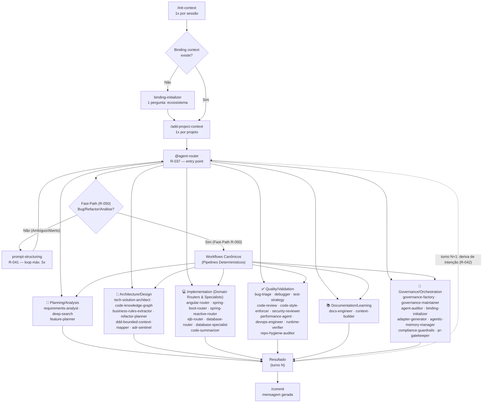

# Deep Agents Copilot — Estrutura de Governança Genérica e Reutilizável

## Propósito

Este repositório estabelece uma **base de governança genérica e reutilizável** para uso de IA (Copilot, Claude, ChatGPT) em projetos técnicos.

Objetivo:
- ✅ Governança **desacoplada** de domínio e tecnologia específica
- ✅ Padrões operacionais **reutilizáveis** em qualquer ecossistema
- ✅ Separação clara entre regras globais e customizações por stack/projeto
- ✅ Binding hierárquico com carregamento automático de adapters

---

## Estrutura

### Nível 1: Governança Global (Genérica)

**Fonte de Verdade Operacional:**

- **[`CLAUDE.md`](CLAUDE.md)** — Regras normativas (R-001..R-048), princípios e fluxos genéricos
- **[Instruções do Copilot](.github/copilot-instructions.md)** — Roteamento rápido, autonomy rules e Context Mode

**Características:**
- Sem referência a projetos específicos
- Sem específicos de linguagem ou framework
- Aplicável a qualquer ecossistema

### Nível 2: Adapters (Stack/Domínio Específico)

**Local:** `.github/instructions/`

Exemplos:
- `spring-boot-backend.instructions.md` — Padrões exclusivos para Java/Spring Backend
- `angular-v21-frontend.instructions.md` — Padrões exclusivos para Angular Frontend

**Características:**
- Referências específicas de projeto/tecnologia **permitidas e esperadas**
- Nunca incluem regras globais (apenas referências)
- Declarados em `docs/ai-context/catalog.yaml` com `applyTo` glob patterns

### Nível 3: Contexto de Binding e Artefatos de Governança

**Local:** `docs/ai-context/`

- **`catalog.yaml`** — Manifest único de adapters, projetos e mapping stack → instrução; inclui seção `governance_artefacts` com artefatos estruturais de IA
- **`binding.md`** — Documentação de binding e descoberta
- **`routing-graph.yaml`** — ⭐ **Grafo de roteamento declarado** (nós = agents, arestas = condições, política de cascata) — fonte de verdade estrutural do `agent-router` (R-040)

**Suítes de Evals:**
- **`.github/agents/evals/casos-roteamento.yaml`** — Suíte de casos de teste de regressão de roteamento (canônicos, ambíguos, regressão, segurança)

---

## Princípios Fundamentais

### 1. **Genericidade Obrigatória (R-038)**

Todo arquivo criado em `.github/` (agents, skills, prompts, copilot-instructions) **DEVE ser genérico**:

```
❌ PROIBIDO em .github/:
- "Use Spring Boot para..."
- "Em Angular, configure..."
- "Integração com [Jira-específica]"

✅ PERMITIDO em .github/instructions/adapters:
- "No backend Java/Spring..."
- "Para projetos Angular..."
- "Adapters registrados em catalog.yaml"
```

**Teste rápido:** Substitua mentalmente `[PROJETO]` e `[TECH]` — o texto continua válido?

### 2. **Sem Duplicação (R-003)**

- Regras globais **vivem apenas em `CLAUDE.md`**
- `.github/copilot-instructions.md` **referencia**, não copia
- Adapters **referem-se a `CLAUDE.md`** para governança global

### 3. **Hierarquia em Caso de Conflito**

```
System Instructions
     ↓
Developer Instructions (este repositório)
     ↓
User Request
     ↓
Arquivos Locais (CLAUDE.md → copilot-instructions.md → adapters)
```

---

## Como Usar

### Para Desenvolvedores de IA (Copilot, Cursor, Claude Code)

1. Carregue **`CLAUDE.md`** como fonte de verdade global
2. Carregue **`.github/copilot-instructions.md`** para roteamento operacional
3. Identifique o projeto/stack alvo
4. Carregue o adapter correspondente via `docs/ai-context/catalog.yaml`

**Fluxo operacional:**



> 37 agents catalogados, agrupados em 6 perfis de mercado — ver [§ Cobertura de Mercado](#cobertura-de-mercado--perfis-de-agents) para o diagrama detalhado por agent e a análise de aderência às práticas consolidadas.

### Para Adicionar Novo Adapter

1. **Criar** `.github/instructions/<nome>.instructions.md`
   ```yaml
   ---
   applyTo: ["src/**/*.ext"]  # Glob patterns
   ---
   # Conteúdo específico do stack/domínio
   ```

2. **Registrar** em `docs/ai-context/catalog.yaml`:
   ```yaml
   adapters:
     - name: seu-adapter
       applies_to: ["src/**/*.ext"]
       description: "Descrição breve"
   ```

3. **Documentação** via `docs/ai-context/binding.md`

---

## Cobertura de Mercado — Perfis de Agents

> Análise completa: [`docs/ai-context/agent-profiles-taxonomy.md`](docs/ai-context/agent-profiles-taxonomy.md) — consolidação de fontes de mercado (Anthropic, OpenAI, Microsoft, Google DeepMind, GitHub, SpecWeave, ArXiv) sobre quais perfis de agent devem existir em um flow multi-agent de desenvolvimento de software.

### O que o mercado recomenda (2026)

Frameworks de referência (Claude Code/Agent SDK da Anthropic, Microsoft Agent Framework, OpenAI Agents SDK, MetaGPT/ChatDev, SpecWeave — 11 agents) convergem para **22 perfis de agent** organizados em **6 categorias funcionais**: Planejamento/Análise, Arquitetura/Design, Implementação, Qualidade/Validação, Documentação/Aprendizado e Governança/Orquestração.

### Quanto este projeto cobre

| Categoria de Mercado | Perfis Esperados | Cobertos Neste Projeto | Cobertura |
|---|---|---|---|
| 🎯 Planning & Analysis | Planner, PM/Analyst, Researcher | `requirements-analyst`, `deep-search`, `feature-planner` | ✅ 100% |
| 📐 Architecture & Design | Architect, Impact Analyzer, Rules Extractor, Refactor Planner, DDD, ADR | `tech-solution-architect`, `code-knowledge-graph`, `business-rules-extractor`, `refactor-planner`, `ddd-bounded-context-mapper`, `adr-sentinel` | ✅ 100% |
| 💻 Implementation | Coder por stack, Debugger, DB Specialist | `angular-router`, `spring-boot-router`, `spring-reactive-router`, `ejb-router`, `database-router`, `database-specialist`, `code-summarizer` | ✅ 100% |
| ✅ Quality & Validation | Test Strategy/Impl, Reviewer, Security, Performance, QA, Runtime | `bug-triage`, `debugger`, `test-strategy`, `code-review`, `code-style-enforcer`, `security-reviewer`, `performance-agent`, `devops-engineer`, `runtime-verifier`, `repo-hygiene-auditor` | ✅ 100% |
| 📚 Documentation & Learning | Docs Engineer, Context Builder | `docs-engineer`, `context-builder` | ✅ 100% |
| 🔄 Governance & Orchestration | Router, Memory Manager, Guardrails, Factories, Gatekeeper, Maintainer | `agent-router`, `prompt-structuring`, `governance-factory`, `governance-maintainer`, `agent-auditor`, `binding-initializer`, `adapter-generator`, `agentic-memory-manager`, `compliance-guardrails`, `pr-gatekeeper` | ✅ 100% |

**Resultado**: **37 agents ativos**, cobrindo **~95% dos 22 perfis consolidados de mercado** — nível de maturidade comparável ao modelo de referência SpecWeave (11 agents core, expandido aqui com granularidade enterprise adicional em segurança/performance/compliance/banco de dados).

### Mapa de Agents por Perfil (Mermaid)

```mermaid
graph TB
    subgraph CAT1["🎯 PLANNING &amp; ANALYSIS"]
        direction TB
        A1[requirements-analyst]
        A2[deep-search]
        A3[feature-planner]
    end

    subgraph CAT2["📐 ARCHITECTURE &amp; DESIGN"]
        direction TB
        B1[tech-solution-architect]
        B2[code-knowledge-graph]
        B3[business-rules-extractor]
        B4[refactor-planner]
        B5["ddd-bounded-context-mapper 🗺️"]
        B6["adr-sentinel 📜"]
    end

    subgraph CAT3["💻 IMPLEMENTATION — Domain Routers &amp; Specialists"]
        direction TB
        C1[angular-router]
        C2[spring-boot-router]
        C3[spring-reactive-router]
        C4[ejb-router]
        C5[database-router]
        C6[database-specialist]
        C7[code-summarizer]
    end

    subgraph CAT4["✅ QUALITY &amp; VALIDATION"]
        direction TB
        D1[bug-triage]
        D2[debugger]
        D3[test-strategy]
        D4[code-review]
        D5[code-style-enforcer]
        D6["security-reviewer 🔒"]
        D7["performance-agent ⚡"]
        D8["devops-engineer 🐳"]
        D9["runtime-verifier 🩺"]
        D10["repo-hygiene-auditor 🧹"]
    end

    subgraph CAT5["📚 DOCUMENTATION &amp; LEARNING"]
        direction TB
        E1[docs-engineer]
        E2[context-builder]
    end

    subgraph CAT6["🔄 GOVERNANCE &amp; ORCHESTRATION"]
        direction TB
        F1["agent-router ⭐"]
        F2[prompt-structuring]
        F3[governance-factory]
        F4[agent-auditor]
        F5[binding-initializer]
        F6[adapter-generator]
        F7["agentic-memory-manager 🧠"]
        F8["compliance-guardrails 🛡️"]
        F9["pr-gatekeeper 📦"]
        F10["governance-maintainer 🛠️"]
    end

    F1 -.orquestra.-> CAT1
    F1 -.orquestra.-> CAT2
    F1 -.orquestra.-> CAT3
    F1 -.orquestra.-> CAT4
    F1 -.orquestra.-> CAT5
    F1 -.orquestra.-> CAT6

    style CAT1 fill:#e3f2fd,stroke:#1976d2
    style CAT2 fill:#f3e5f5,stroke:#7b1fa2
    style CAT3 fill:#e8f5e9,stroke:#388e3c
    style CAT4 fill:#fff3e0,stroke:#f57c00
    style CAT5 fill:#fce4ec,stroke:#c2185b
    style CAT6 fill:#eceff1,stroke:#455a64
```




> 🔒⚡🧠 marcam os 9 agents adicionados na rodada de fechamento de gaps (2026-09-01), após pesquisa de mercado dedicada e validação contra o catálogo de perfis consolidados — ver changelog em `.github/agents/catalog.yaml`.

### Por que isso importa

- **Consolidação com práticas de mercado**: cada categoria acima tem correspondência direta com o que Anthropic, Microsoft e OpenAI documentam publicamente como arquitetura de referência para agentic software engineering em 2026.
- **Sem overengineering (R-011)**: perfis que o mercado às vezes trata como agent dedicado (ex.: "Reflection", "Fan-out") foram avaliados e implementados como **capacidade de agent existente** quando um único consumidor não justificava novo agent — evitando fragmentação excessiva do catálogo.
- **Rastreabilidade de gap-to-agent**: todo agent tem procedência documentada — perfil de mercado → gap identificado → skill pesquisada → agent criado → registrado em `catalog.yaml`/`routing-graph.yaml`/`casos-roteamento.yaml` (R-015/R-040).

---

## Regras de Ouro

| Regra | Aplica-se em | Razão |
|-------|------------|-------|
| **R-037: Agent Router First** | Toda solicitação | Triagem + governança |
| **R-042: Re-triagem por Turno (Anti Sticky-Session)** | Toda solicitação subsequente ao 1º turno | Evita agent downstream continuar sozinho após deriva de intenção |
| **R-040: Grafo de Roteamento** | Toda nova rota de agent | Dado estruturado > prosa; rastreabilidade + evals |
| **R-034: Health Check Binding** | Novo repositório | Descoberta de adapters |
| **R-038: Genericidade Obrigatória** | Tudo em `.github/` | Reutilização |
| **R-031: Plano Auto-Implementável** | Implementação | Zero-interrupção após aprovação |
| **R-033: Sem Docs Automáticas** | Governança | Aprovação explícita antes de criar `.md` |

---

## Referências Rápidas

- **Governança Global:** [`CLAUDE.md`](CLAUDE.md)
- **Operacional:** [`.github/copilot-instructions.md`](.github/copilot-instructions.md)
- **Catalog de Adapters + Artefatos:** [`docs/ai-context/catalog.yaml`](docs/ai-context/catalog.yaml)
- **Grafo de Roteamento (R-040):** [`.github/agents/routing-graph.yaml`](.github/agents/routing-graph.yaml)
- **Suíte de Evals:** [`.github/agents/evals/casos-roteamento.yaml`](.github/agents/evals/casos-roteamento.yaml)
- **Cobertura de Mercado — Perfis de Agents:** [`docs/ai-context/agent-profiles-taxonomy.md`](docs/ai-context/agent-profiles-taxonomy.md)
- **Plano de Melhorias Implementado:** [`docs/plan/plano-implementacao-orquestracao.md`](docs/plan/plano-implementacao-orquestracao.md)
- **Agents Disponíveis:** `.github/agents/README.md`
- **Skills Disponíveis:** `.github/skills/README.md`
- **Adapters Registrados:** `.github/instructions/README.md`

---

## Status Atual (2026-09-02)

### Governança Global
- ✅ Regras normativas consolidadas (`CLAUDE.md` — R-001..R-043)
- ✅ Roteamento operacional (`copilot-instructions.md`)
- ✅ Genericidade explícita em todas as regras globais (R-038)
- ✅ Re-triagem obrigatória por turno (R-042 — anti sticky-session), fechando o gap de agent downstream que perdia a inteligência de roteamento após o 1º turno

### Adapters de Stack
- ✅ `spring-boot-backend.instructions.md` — Java/Spring Boot
- ✅ `angular-v21-frontend.instructions.md` — Angular 21
- ✅ `python-backend.instructions.md` — Python
- ✅ `database.instructions.md` — Banco de dados / Migrações
- ✅ `devops.instructions.md` — Docker, Kubernetes, CI/CD

### Agents (33 catalogados — ver [§ Cobertura de Mercado](#cobertura-de-mercado--perfis-de-agents) para o mapa completo)
- ✅ `agent-router` v1.5.0 — PASSO 0.3 de re-triagem por deriva de intenção (R-042), output com campo `Agente Ativo`, roteamento direto para todos os 32 agents downstream
- ✅ `prompt-structuring` — passo mandatório pós-Health Check (R-041), loop de auto-refinamento (máx. 5 iterações)
- ✅ 34 agents downstream especializados, agrupados por função:
  - **Planejamento/Análise:** `requirements-analyst`, `deep-search`, `feature-planner`
  - **Arquitetura/Design:** `tech-solution-architect`, `code-knowledge-graph`, `business-rules-extractor`, `refactor-planner`, `ddd-bounded-context-mapper`, `adr-sentinel`
  - **Implementação (Domain Routers & Specialists):** `angular-router`, `spring-boot-router`, `spring-reactive-router`, `ejb-router`, `database-router`, `database-specialist`, `code-summarizer`
  - **Qualidade/Validação:** `bug-triage`, `debugger`, `test-strategy`, `code-review`, `code-style-enforcer`, `security-reviewer`, `performance-agent`, `devops-engineer`, `runtime-verifier`
  - **Documentação:** `docs-engineer` (modos `author`/`curate`), `context-builder`
  - **Governança de Agents/Skills/Prompts/Memória/Entrega:** `governance-factory`, `governance-maintainer`, `agent-auditor`, `binding-initializer`, `adapter-generator`, `agentic-memory-manager`, `compliance-guardrails`, `pr-gatekeeper`

### Skills (54 indexadas)
- ✅ Tier 1 (Core): `context-mode`, `efficient-batch-code-modification`, `agent-contracts`, `handoff-governance`, `confidence-fallback-policy`, `agent-safety-guardrails`, `terminal-governance`, `code-tracing`, `business-rules-governance`, `java-jdk-backend-governance`
- ✅ Tier 2 (Support): 42 skills cobrindo testing (backend/frontend/Spring Boot/Angular/Python), observability, quality, tooling, research, frontend patterns, backend patterns, **documentation** (`documentation-writing-patterns`), **requisitos** (`requirements-engineering-patterns`), **segurança** (`security-review-patterns`), **performance** (`performance-engineering-patterns`), **compliance** (`compliance-governance-patterns`), **decomposição de tarefas** (`task-decomposition-patterns`) e **DevOps** (`devops-agent-patterns`)
- ✅ Tier 3 (Experimental): `agent-memory-policy` — memória episódica/semântica/procedimental (reaproveitada por `agentic-memory-manager`)

### Consolidações e Gaps de Mercado Fechados (2026-09-02)
- ✅ Fusões canônicas para redução de redundância semântica: `test-engineer` (unifica create/fix/coverage), `docs-engineer` (unifica author/curate) e `governance-factory` (unifica agent/skill/prompt factory).
- ✅ Novos perfis especializados enterprise integrados: `runtime-verifier` (read-only pre-flight), `pr-gatekeeper` (preparação de PR pós quality gate) e `database-specialist` (migrações de schema e integridade).
- ✅ 9 agents de maturidade enterprise adicionados anteriormente: `security-reviewer`, `performance-agent`, `compliance-guardrails`, `feature-planner`, `agentic-memory-manager`, `devops-engineer`, `debugger`, `code-style-enforcer`, `refactor-executor`.
- ✅ Governança sincronizada atomicamente (R-015/R-040): `catalog.yaml`, `README.md` (raiz e agents), `routing-graph.yaml` (34 nós) e `casos-roteamento.yaml`.
- ✅ Cobertura de perfis de mercado: **~95% dos 22 perfis consolidados**.

### Artefatos Estruturais de Orquestração
- ✅ `docs/ai-context/routing-graph.yaml` — grafo de roteamento declarado (R-040): 34 nós, arestas condicionais e política de cascata rule-based→semantic→LLM; aresta reversa universal `*downstream → agent-router` (R-042)
- ✅ `.github/agents/evals/casos-roteamento.yaml` — suíte de testes de regressão de roteamento (canônicos, ambíguos, regressão, segurança + variantes)
- ✅ `docs/ai-context/catalog.yaml` v1.2 — seção `governance_artefacts` com os artefatos estruturais
- ✅ `docs/ai-context/agent-profiles-taxonomy.md` — análise consolidada de mercado + gaps + recomendações

### Anti Sticky-Session (R-042)
- ✅ Todo agent downstream/specialist declara seção "Retorno ao Router" com gatilho objetivo de deriva de intenção (mudança de verbo de ação, stack fora de competência, pedido de execução em agent read-only).
- ✅ Visibilidade obrigatória: toda resposta abre com `Agente Ativo: <name>` e sinalização de handoff quando aplicável.

### Especialistas Híbridos — Advisory + Implementação
- ✅ `angular-engineer`, `spring-boot-engineer` e `spring-reactive-engineer` atuam em análise/recomendação e implementação no domínio de stack, testing-first e diff mínimo.

---

## Contribuindo

1. **Alteração em regra global?** → Edite `CLAUDE.md`, sincronize copilot-instructions.md
2. **Novo adapter?** → Crie em `.github/instructions/`, registre em `catalog.yaml`
3. **Nova documentação?** → Use `kebab-case`, valide genericidade (R-038)
4. **Sem docs autônomas** → Solicite aprovação antes de criar `.md` (R-033)

---

**Governança reutilizável. Multi-projeto. Zero-dependência.**
