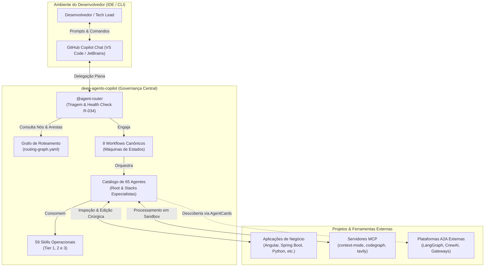
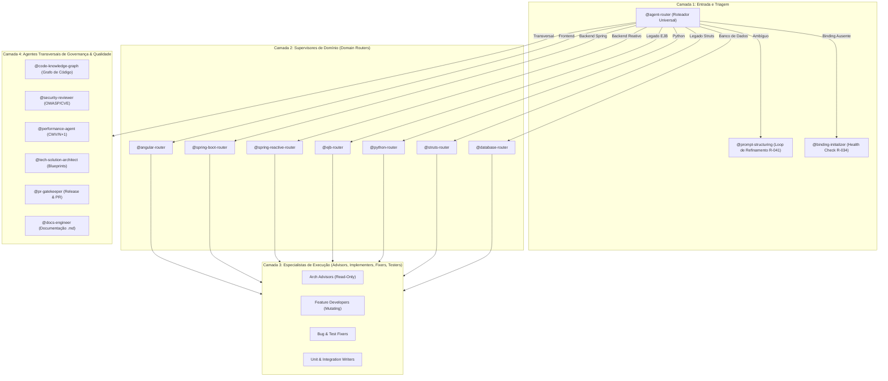
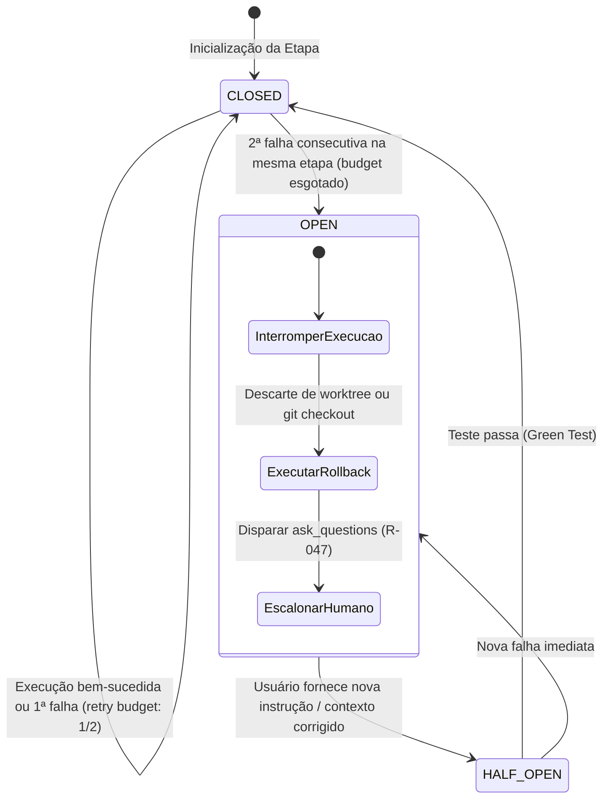
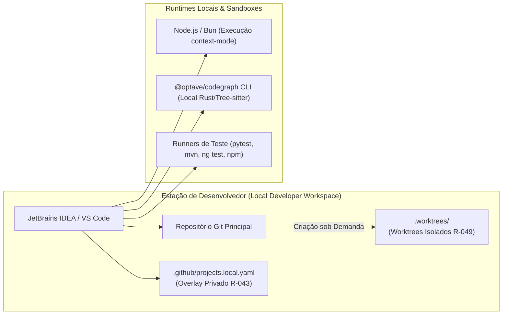
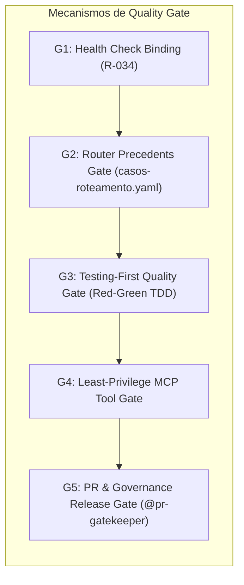

# Guia Canônico de Arquitetura e Governança
## `deep-agents-copilot` — Sistema de Orquestração e Governança Multi-Agente para Engenharia de Software

> **Fonte de verdade operacional**: Este documento consolida a visão arquitetural, o modelo estático e dinâmico, os guardrails normativos e os padrões de resiliência e segurança do ecossistema `deep-agents-copilot`. Todas as decisões de design aqui documentadas são fundamentadas em normas internacionais e pesquisas de ponta do setor em 2026.

---

## 1. Introdução e Metas de Qualidade (arc42 §1)

O `deep-agents-copilot` é uma infraestrutura de governança reutilizável, desacoplada e independente de plataforma, projetada para orquestrar agentes autônomos de IA (GitHub Copilot, Claude Code, Cursor) em tarefas complexas de engenharia de software corporativo.

### 1.1 Metas de Negócio e Engenharia
1. **Orquestração Agent-First Determinística**: Substituir prompts genéricos e chatbots monolíticos por uma divisão de trabalho especializada (65 agentes de catálogo), onde cada agente possui papéis, ferramentas e restrições estritamente delimitadas.
2. **Eficiência e Token Budget**: Eliminar context bloat e desperdício de créditos por meio do paradigma *Think-in-Code* (processamento em sandbox via `context-mode` MCP) e *Artifact Offloading*.
3. **Resiliência e Contenção de Falhas**: Garantir que agentes nunca entrem em loops infinitos de tentativa e erro ou corrompam o workspace do desenvolvedor (Circuit Breakers com Retry Budget e Rollback Atômico).
4. **Segurança e Menor Privilégio**: Assegurar conformidade com a taxonomia OWASP Agentic AI 2026 e aplicar zoneamento estrito de permissões MCP (separação física entre agentes de consulta e agentes de mutação de código).
5. **Interoperabilidade Aberta**: Disponibilizar capacidades e identidades via padrão aberto A2A (*Agent-to-Agent* v1.0.0 / Linux Foundation).

### 1.2 Árvore de Qualidade Arquitetural
- **Confiabilidade (ISO 25010 / Reliability)**: 100% de previsibilidade nas rotas através de um Grafo de Roteamento formal (`routing-graph.yaml`) e suíte de 136 testes automatizados.
- **Segurança (ISO 25010 / Security)**: Zero vazamento de segredos, zero execução arbitrária fora do workflow e confinamento de privilégios.
- **Manutenibilidade (ISO 25010 / Maintainability)**: Separação estrita de responsabilidades: Governança Global (`CLAUDE.md`), Instruções Operacionais (`copilot-instructions.md`), Adapters de Stack (`.instructions.md`) e Overlay Privado (`projects.local.yaml`).

---

## 2. Restrições e Limitações Arquiteturais (arc42 §2)

### 2.1 Restrições Normativas Globais
- **R-002 / R-031 — Zero Ação Autônoma Crítica**: Proibição terminante de `git push`, `git commit` autônomos ou criação de arquivos desnecessários sem aprovação humana expressa.
- **R-037 — Agent Router First**: Todo turno ou nova intenção deve ser avaliado pelo `@agent-router`.
- **R-042 — Re-triagem Obrigatória por Turno (Anti Sticky-Session)**: Prevenção de ancoragem em sessões antigas ou deriva de intenção silenciosa.
- **R-043 / R-044 — Isolamento Local e Anonimização**: Dados específicos de projetos corporativos reais vivem exclusivamente em arquivos gitignored (`projects.local.yaml`), vedando commit de caminhos reais no repositório de governança.
- **R-049 — Governança Compulsória de Terminal**: Vedada a execução de terminal sem vinculação à skill `terminal-governance` e sem o uso obrigatório de comandos não-interativos (`--no-pager`).

---

## 3. Contexto e Fronteiras do Sistema (arc42 §3)



---

## 4. Estratégia de Solução (arc42 §4)

A arquitetura do `deep-agents-copilot` apoia-se em seis pilares estratégicos validados pela indústria:

1. **Delegação Plana (*Flat Delegation*) vs. Aninhamento Profundo**:
   - O `@agent-router` atua como classificador e supervisor de alto nível, emitindo a decisão de rota para que o orquestrador raiz despache o agente downstream em nível plano.
   - *Fundamentação*: Elimina os custos de token e o risco de cascading failures decorrentes do aninhamento recursivo (`router -> subagente -> subagente`).
2. **Workflows Determinísticos Baseados em Máquinas de Estados**:
   - Todo ciclo de desenvolvimento segue um dos 8 Workflows Canônicos (`WORKFLOW-BUG-FIX`, `WORKFLOW-REFACTORING`, etc.), com transições estritas e Quality Gates formais.
3. **Paradigma *Think-in-Code* via Sandboxing (R-008)**:
   - Toda leitura volumosa, agregação ou análise de código acontece dentro do sandbox do `context-mode` MCP (`ctx_execute`, `ctx_search`). Apenas o sumário executivo entra na janela de conversação.
4. **Isolamento Físico de Execução via Git Worktrees**:
   - Para execuções concorrentes ou explorações paralelas, cada agente mutante opera em um worktree isolado (`.worktrees/<task>`), protegendo lockfiles e compilações contra concorrência destrutiva.
5. **Context Engineering e Offloading de Artefatos**:
   - Adoção dos 4 pilares (*Write, Select, Compress, Isolate*) e uso de referências tipadas por ponteiro/hash (`tipo: "pointer"`) para artefatos superiores a 2 KB / 50 linhas.
6. **Alinhamento Normativo Aberto**:
   - Implementação das taxonomias internacionais de segurança (OWASP ASI01..ASI10:2026), MCP Security da NSA e especificação A2A AgentCard da Linux Foundation.

---

## 5. Visão de Blocos de Construção — *Building Blocks* (arc42 §5)



### 5.1 Catálogo de Domínios e Papéis dos Agentes

| Categoria | Componente / Router | Papéis Especialistas Contidos |
|---|---|---|
| **Roteamento Central** | `@agent-router` | Triagem universal, Health Check (R-034), Fast-Path (R-041/R-050) |
| **Frontend** | `@angular-router` | arch-advisor, feature-developer, bug-fixer, ui-stylist, unit-test-writer, component-test-writer, test-fixer, e2e-writer |
| **Backend Spring Boot** | `@spring-boot-router` | arch-advisor, feature-developer, bug-fixer, perf-tuner, unit-test-writer, integration-test-writer, test-fixer |
| **Backend Reativo** | `@spring-reactive-router` | arch-advisor, feature-developer, bug-fixer, resilience-tuner, unit-test-writer, integration-test-writer, test-fixer |
| **Backend Legado Java** | `@ejb-router` / `@struts-router` | Especialistas canônicos para EJB (2.x/3.x, CMT/JTA) e Struts (1.x/2.x, Actions, FormBeans) |
| **Backend Python** | `@python-router` | arch-advisor, feature-developer, bug-fixer, perf-tuner, unit-test-writer, integration-test-writer, test-fixer |
| **Banco de Dados** | `@database-router` | oracle-migration-dev, oracle-plsql-expert, oracle-query-tuner, informix-migration-dev, informix-spl-expert, informix-query-tuner |
| **Qualidade & Segurança** | Transversais | `@security-reviewer`, `@performance-agent`, `@code-review`, `@compliance-guardrails` |
| **Arquitetura & Grafo** | Transversais | `@code-knowledge-graph`, `@tech-solution-architect`, `@ddd-bounded-context-mapper`, `@adr-sentinel` |

---

## 6. Visão de Execução e Dinâmica — *Runtime View* (arc42 §6)

### 6.1 Os 8 Workflows Canônicos Determinísticos (R-050)

Todo desenvolvimento de software é executado através de uma máquina de estados finitos que proíbe desvios informais:

1. **`WORKFLOW-BUG-FIX`**: Triagem com RCA estruturado (5 Whys / Fishbone) e regra *evidence before hypothesis* (mínimo de 2 fontes independentes de evidência observável) + classificação determinística `flaky` vs `regressao_real` (`@bug-triage`) → Caracterização e Reprodução Automatizada via Red Test isolado ou spec de layout/VFL (`specialist-unit-test-writer`/`specialist-component-test-writer`/`specialist-ui-stylist`) com pré-voo de baseline → Declaração antecipada de `blast_radius_estimado` e `rollback_plan` atômico + Correção Cirúrgica Mínima (`specialist-bug-fixer` ou `specialist-ui-stylist`) → Green Test, Linter e **Mini Mutation-Check** proporcional ao risco (1 a 3 mutantes sintéticos eliminados pelo Red Test contra falsos-verdes) (`runtime-verifier`) → Quality Gate com **Loop de Revisão de Qualidade** (R-050.4, máx. 3 iterações), autorreflexão documental (R-033) e **Observação Pós-Fix / Canary Gate** para defeitos críticos (P0/P1, auth, integridade de dados) (`@code-review` / `@pr-gatekeeper`).
2. **`WORKFLOW-REFACTORING`**: Mapeamento de Regras Vigentes / Ground Truth (`@business-rules-extractor`) → Blast Radius determinístico via grafo (`@code-knowledge-graph`, R-045) com **Contract Testing (Pact-style consumer-driven ou OpenAPI / JSON Schema Diff)** no gate de contratos (Estado 2a) e Golden Master Safety Net (Estado 2b) → Plano Macro Mikado com árvore de pré-requisitos e pontos de rollback (`@refactor-planner` + `@test-strategy`) com checkpoint humano se alto risco → Execução Incremental em Lote cirúrgico (`domain router / specialists`, R-046) → Validação de Ground Truth (100% preservadas), **Loop de Revisão de Qualidade** (R-050.4) e **Camada de Redundância Proporcional ao Blast Radius** (Auditoria Reversa de Símbolos `reverse_symbol_audit` via grafo, Mini Mutation Gate `mini_mutation_gate` e Differential Replay Leve `differential_replay_leve`) (`@business-rules-extractor` + `@code-review`), com governança de Rollback no Estado 5b calculando e registrando formalmente o **`blast_radius_revertido`** (nós Mikado, arquivos e callers restaurados) no `workflow_state`.
3. **`WORKFLOW-TECHNICAL-ANALYSIS`**: Despacho analítico Read-Only → Coleta determinística via AST/Grafo → Relatório com Propostas Acionáveis (`[PROPOSTA-1..N]`) → Fast-Chaining (R-050.1).
4. **`WORKFLOW-FEATURE-DEVELOPMENT`**: Elicitação de Requisitos (`@requirements-analyst`) → Technical Blueprint (`@tech-solution-architect`) → Estratégia de Testes (`@test-strategy`) → Implementação Domain TDD (com handoff para `@angular-ui-stylist` em UI) → Duplo Quality Gate (Gate 1: Lógica/OWASP; Gate 2: Design System & Paridade UI) com **Loop de Revisão de Qualidade** (R-050.4, máx. 3 iterações).
5. **`WORKFLOW-GOVERNANCE-MAINTENANCE`**: Auditoria estrutural de smells (`@agent-auditor`) → Aprovação humana → Execução atômica em lote (`@governance-maintainer`) → Quality Gate de Governança (Tier 1) com **Loop de Revisão de Qualidade** (R-050.4).
6. **`WORKFLOW-DEPENDENCY-VULNERABILITY-REMEDIATION`**: Scan e triagem de severidade (`@security-reviewer`) → Blast Radius de breaking changes → Bump cirúrgico → Adaptação de código → Quality Gate SCA com **Loop de Revisão de Qualidade** (R-050.4).
7. **`WORKFLOW-FRAMEWORK-MIGRATION`**: Pre-Flight Assessment com 5D e Symbol Exhaustion Gate (`@tech-solution-architect` + `@code-knowledge-graph` + router de origem) → Migration Phasing com Matriz De-Para → Codemod em Lote por Fase com Anti-Omission AST Validator → Paridade Funcional Dual-Verification → Baseline Quality Gate → Post-Migration Verification & Redundancy Gate (Estado 6: Tríplice Redundância com Reverse Orphan Audit, Mutation Parity e Differential Shadow Replay) com **Loop de Revisão de Qualidade** (R-050.4).
8. **`WORKFLOW-RELEASE-READINESS`**: Verificação de contratos de API e integridade de schema → Auditoria de segurança e higiene de repositório (`@repo-hygiene-auditor`) → Geração de CHANGELOG e PR (`@pr-gatekeeper`) → Veredito de Release.

### 6.2 Ciclo de Vida do Handoff e Banner Universal (R-042 / R-048)

Todo agente emite obrigatoriamente no início da resposta o banner de rastreabilidade para garantir auditoria em tempo real:

```markdown
Agente Ativo: @<agente-executor>
Handoff: @<origem> → @<destino> (motivo: <motivo_declarado>)
Workflow: <NOME-DO-WORKFLOW>
Etapa do Workflow: <N> — <Nome da Etapa>
Skills Carregadas: <skill-1>, <skill-2>
```

### 6.3 Mecanismo de Circuit Breaker Stateful e Rollback



### 6.4 Endurecimento Determinístico e Paridade de Governança nos Workflows Operacionais

O ecossistema multi-agente estabelece **paridade horizontal de rigor determinístico** entre fluxos de migração, correção de defeitos e modernização estrutural:

| Conceito-Chave | `WORKFLOW-BUG-FIX` | `WORKFLOW-REFACTORING` | `WORKFLOW-FRAMEWORK-MIGRATION` |
|---|---|---|---|
| **Investigação Baseada em Fatos** | **RCA Estruturado (5 Whys / Fishbone)** com regra estrita de *evidence before hypothesis* (mínimo de 2 fontes observáveis: stack trace, runtime log, payload HTTP, APM). | **Mapeamento de Regras Vigentes / Ground Truth** extraído formalmente via `@business-rules-extractor` antes de qualquer mutação. | **Symbol Exhaustion Gate**: inventário mecânico via AST/Grafo de 100% dos métodos públicos/privados, queries e nós. |
| **Classificação & Pré-Voo** | **Classificação `flaky` vs `regressao_real`** no Estado 1; pré-voo limpo na suíte vizinha para isolar instabilidade de ambiente/concorrência. | **Análise de Blast Radius via Grafo** (`@code-knowledge-graph`, R-045) identificando callers, callees e acoplamento transitivo. | **5 Dimensões Críticas & Brownfield Delta**: reconciliação delta obrigatória antes do blueprint. |
| **Blindagem de Contratos** | **Pré-declaração de `blast_radius_estimado` e `rollback_plan`** no `workflow_state` antes de autorizar qualquer diff cirúrgico. | **Contract Testing (Pact-style / consumer-driven ou OpenAPI / JSON Schema Diff)** no Estado 2a para APIs públicas e contratos compartilhados. | **Matriz De-Para Unívoca**: rastreabilidade 100% dos contratos e entidades mapeadas entre origem e destino. |
| **Resiliência contra Falsos-Verdes** | **Mini Mutation-Check** proporcional ao risco no Estado 4 (1 a 3 mutantes sintéticos eliminados pelo Red Test). | **Mini Mutation Gate** no Estado 5 validando a sensibilidade e precisão da suíte Golden Master / caracterização. | **Mutation Parity Resilience**: injeção de mutantes sintéticos comprovando resiliência da suíte Golden Master. |
| **Redundância & Verificação Pós-Execução** | **Observação Pós-Fix / Canary Gate** no Estado 5 com métricas de telemetria (5xx, APM, latência) para bugs críticos (P0/P1, auth, integridade). | **Camada de Redundância Proporcional ao Blast Radius** no Estado 5 (Auditoria Reversa de Símbolos, Mini Mutation Gate e Differential Replay Leve). | **Tríplice Redundância Pós-Migração**: Reverse Orphan Audit + Mutation Parity + Differential Shadow Replay (Estado 6). |
| **Governança de Rollback** | Circuit Breaker (teto de 3 iterações) com reversão atômica estritamente amparada pelo `rollback_plan`. | Reversão atômica dos nós do DAG Mikado com cálculo, registro e auditoria quantitativa de **`blast_radius_revertido`**. | Reversão completa de cutover amparada pela preservação integral do sistema e testes de paridade dual. |

---

## 7. Visão de Implantação e Ambiente (arc42 §7)



---

## 8. Conceitos Transversais e Boas Práticas (arc42 §8)

### 8.1 Context Engineering e Offloading de Artefatos (Anthropic 2026)
- **Os 4 Pilares**:
  1. *Write*: Instruções declarativas concisas sem prosa redundante.
  2. *Select*: Consulta de dados pontuais via busca indexada FTS5 (`ctx_search`).
  3. *Compress*: Compactação pós-leitura de evidências (`context-compact`).
  4. *Isolate*: Isolamento de contexto por subagente.
- **Regra dos 2 KB / 50 Linhas**: Artefatos que excedem esse limiar são gravados em arquivo ou indexados no context-mode e trafegam no handoff exclusivamente como ponteiro estruturado:
  ```yaml
  evidencias:
    - tipo: "pointer"
      artifact_ref: "docs/architecture/spec.md"
      hash: "sha256:e3b0c442..."
      resumo_executivo: "Resumo executivo em 2 linhas."
  ```

### 8.2 Edições em Lote Único e Diffs Cirúrgicos (R-046 / R-051)
- **Single-Turn Batching**: Edições de múltiplos arquivos são enviadas em lote na mesma rodada de tool calls.
- **Diff Cirúrgico**: Uso de 2-3 linhas de contexto exclusivo para garantir unicidade e evitar loops de re-submissão.
- **Proteção Anti-Corrupção e Unicidade de Âncora (R-051)**: Para arquivos >200 linhas, formato `.yaml`/`.yml`/`.json` ou **Markdown estruturado** (`.agent.md`, `.instructions.md`, tabelas com entradas parecidas), é proibido usar `insert_edit_into_file` ou `replace_string_in_file` com âncoras ambíguas. O agente deve verificar a unicidade estrita da âncora em memória (`count === 1`), abortando caso haja risco de colisão (evitando o fallback de casamento aproximado/fuzzy da tool que pode corromper ou apagar blocos inteiros), e validar imediatamente a integridade estrutural pós-escrita.

### 8.4 Visual Feedback Loop (VFL) e Paridade de UI (2026)
Para eliminar a "cegueira visual" de testes headless (Smell 2.21), o ecossistema adota o ciclo **Visual Feedback Loop (VFL)** agnóstico de tecnologia (`frontend-visual-feedback-loop`):
1. **Renderização Isolada (Component-Driven)**: Componentes são executados em sandbox (Storybook CSF3 / rota efêmera) desacoplados de backend.
2. **Dupla Representação**: Inspeção semântica via Árvore de Acessibilidade (AOM) para garantir que nomes de ícone não vazem como texto literal, combinada com capturas nos 3 viewports canônicos (`375px`, `768px`, `1440px`).
3. **Protocolo "Canonical Sibling First"**: Nenhum componente ou diálogo é criado a partir do zero; agentes inspecionam obrigatoriamente um componente irmão canônico homologado no repositório para clonar hierarquia de tags, grid responsivo e classes utilitárias de scroll.
4. **Duplo Quality Gate no Workflow de Features**:
   - **Gate 1**: Lógica, contratos, testes unitários verdes e auditoria OWASP.
   - **Gate 2**: Design System, paridade visual, validação estrita de `@Input()` em arquivos `.ts` de componentes compartilhados e proibição estrita de cores hexadecimais inline.

### 8.5 Sincronização Automática de Documentação Viva e Autorreflexão de DoD (R-033)
Para erradicar o "drift documental" e dispensar ordens manuais do desenvolvedor para atualização de documentação, o ecossistema estabelece o princípio da **Living Documentation Orientada a Autorreflexão**:
- **Gatilho de Autorreflexão**: Antes de finalizar qualquer entrega em `WORKFLOW-FEATURE-DEVELOPMENT`, `WORKFLOW-BUG-FIX` ou `WORKFLOW-REFACTORING`, os agentes executores e o `@pr-gatekeeper` avaliam compulsoriamente: *"Esta entrega introduziu novas rotas, modelos de dados, componentes de UI, padrões visuais ou regras de negócio?"*
- **Sincronização Atômica Compulsória**: Se afirmativo, os documentos correspondentes em `docs/`, `README.md`, catálogos de componentes compartilhados e ADRs são atualizados e comitados na mesma entrega como critério de *Definition of Done (DoD)*.
- **Distinção Normativa (R-033)**: Permanece terminantemente proibido criar arquivos `.md` especulativos ou relatórios prolixos desconectados da alteração real; a regra autoriza e exige exclusivamente a **manutenção da documentação viva existente**.

### 8.3 Segurança e Zoneamento de Ferramentas MCP (NSA CSI MCP Security 2026)
- **Zona 1 (Read-Only)**: `read_file`, `ast_query`, `grep_search`. Obrigatória para agentes consultivos.
- **Zona 2 (Mutating)**: `replace_string_in_file`, `create_file`. Restrita a Implementers em workflows autorizados.
- **Zona 3 (Execution)**: `run_in_terminal` estritamente controlado por `terminal-governance` (R-049).

---

## 9. Registro de Decisões Arquiteturais e Validações de Mercado (ADRs / arc42 §9)

A tabela a seguir correlaciona as principais decisões arquiteturais adotadas no `deep-agents-copilot` com as publicações e padrões de referência da indústria que as validam:

| ID | Decisão Arquitetural Adotada | Problema Resolvido | Padrão / Publicação de Mercado que Valida a Decisão |
|---|---|---|---|
| **ADR-01** | **Orquestração Flat Delegation com Router Central (R-037/R-042)** | Loops recursivos descontrolados e consumo exponencial de tokens em subagentes aninhados. | **Anthropic (2026)**: *Agentic Coding Trends Report 2026* & *Building Effective Agents* (Recomendação de orquestrador central com despacho plano para workers especializados). |
| **ADR-02** | **Máquinas de Estados Finitos para Workflows (R-050)** | Imprevisibilidade e comportamento emergente caótico de agentes sem fluxo determinístico. | **LangChain / LangGraph (2025-2026)**: Paradigma de grafos cíclicos dirigidos com persistência de estado e checkpoints determinísticos. |
| **ADR-03** | **Think-in-Code via Sandboxing Context Mode (R-008)** | Esgotamento da janela de contexto e perda de atenção por ingestão de arquivos brutos no chat. | **LangChain (2026)**: *Context Engineering Guide* & Denis Rothman (*Context Engineering for Multi-Agent Systems*, 2026). |
| **ADR-04** | **Circuit Breakers com Retry Budget e Rollback Atômico** | Agentes que entram em loops infinitos tentando consertar testes quebrados sem intervenção. | **Enterprise MAS Design Patterns (2026)** & **Gartner Top Strategic Technology Trends 2026**: Contenção de falhas em cascata e circuit breakers para IA autônoma. |
| **ADR-05** | **Isolamento de Agentes Mutantes via Git Worktrees (R-049)** | Conflito em lockfiles (`package.json`, `pom.xml`), concorrência de compilação e travas de git index. | **Augment Code & Cursor (2026)**: Arquiteturas de execução paralela de agentes em worktrees efêmeros com merge controlado. |
| **ADR-06** | **Taxonomia OWASP Top 10 for Agentic Applications 2026** | Vulnerabilidades específicas de sistemas agênticos autônomos (ASI01 a ASI10:2026). | **OWASP GenAI Security Project (Dez/2025 - 2026)**: *OWASP Top 10 for Agentic Applications 2026* (ratificado para ASI01..ASI10). |
| **ADR-07** | **Zoneamento e Segurança de Ferramentas MCP (Least Privilege)** | Injeção indireta de parâmetros (CVE-2025-6514), Tool Squatting e elevação de privilégio. | **NSA (Maio/2026)**: *CSI Model Context Protocol (MCP): Security Design Considerations* & **Cloud Security Alliance (CSA)**: *Agentic MCP Security Best Practices v1*. |
| **ADR-08** | **Padronização e Exportação A2A AgentCard** | Dependência de catálogo proprietário e falta de interoperabilidade com plataformas externas. | **Linux Foundation (Março/2026)**: *A2A Protocol Specification v1.0.0* & **IETF (Abril/2026)**: *draft-aevum-agentcard-00*. |
| **ADR-09** | **Isolamento de Contexto de Projetos Locais (R-043/R-044)** | Vazamento de nomes de classes, repositórios e regras de negócio proprietárias em templates globais. | **12-Factor App & OWASP Privacy by Design**: Segregação de código de controle (governança) e dados de instância (código cliente). |
| **ADR-10** | **Proibição de Pagers Interativos no Terminal (R-035)** | Bloqueio e congelamento de agentes em comandos Git que disparam `less` (ex: `git diff`). | **IEEE Standard for Portable Operating System Interfaces (POSIX)**: Execução não-interativa e desacoplamento de TTY para processos automatizados. |

---

## 10. Requisitos de Qualidade e Conformidade (arc42 §10)



- **Cobertura de Testes**: 100% de aprovação na suíte global de testes (`pytest`), cobrindo conformidade de smells de governança, integridade de rotas, isolamento de projetos locais, rastreabilidade de incidentes e conformidade com o schema A2A AgentCard.
- **Verificação Contínua de Regressão**: Toda alteração no roteador deve manter pontuação mínima e conformidade com os casos canônicos e de regressão declarados em `evals/casos-roteamento.yaml`.

---

## 11. Riscos Técnicos e Dívida Arquitetural (arc42 §11)

| Risco Arquitetural | Severidade | Estratégia de Mitigação Implementada |
|---|:---:|---|
| **Esgotamento de Janela de Contexto (Context Bloat)** | Alta | Aplicação do limiar de 2 KB / 50 linhas para offloading de artefatos e uso obrigatório de processamento em sandbox do context-mode. |
| **Loops de Tentativa de Correção Infinitos** | Alta | Multi-Agent Circuit Breaker desarmando em `state: OPEN` após 2 falhas consecutivas, acionando escalonamento humano obrigatório. |
| **Divergência de Modelos entre IDEs (JetBrains vs VS Code)** | Média | Protocolo de Model Awareness no catálogo e testes agnósticos validados via IDE API e terminal neutro. |
| **Incompatibilidade em Ferramentas MCP Externas** | Média | Zoneamento formal de ferramentas (Zona 1/2/3) e validação estrita de schemas contra injeção de parâmetros (ASI02). |

---

## 12. Glossário Terminológico (arc42 §12)

- **Agent Router**: Ponto de entrada obrigatório (R-037) que classifica a intenção do usuário e decide a rota ideal no catálogo.
- **Flat Delegation**: Padrão de orquestração onde o router apenas declara a rota e o orquestrador raiz despacha o especialista em nível plano, sem aninhamento de subagentes.
- **Fast-Path**: Atalho determinístico de roteamento que direciona pedidos claros de bugs, refatorações com alvo ou análises técnicas diretamente para a etapa 1 do workflow canônico, sem passar por `@prompt-structuring`.
- **Fast-Chaining**: Transição imediata de um diagnóstico analítico (Etapa 3 do `WORKFLOW-TECHNICAL-ANALYSIS`) para a execução tática em `WORKFLOW-REFACTORING` ou `FEATURE-DEVELOPMENT` com transporte de estado.
- **Typed State Bag (`workflow_state`)**: Estrutura tipada de dados compartilhada entre etapas de um workflow para preservar artefatos, hipóteses e resultados sem perda de fidelidade.
- **Context Offloading**: Técnica de substituir grandes cargas úteis de dados no chat por referências tipadas por ponteiro (`tipo: "pointer"`) associadas a arquivos ou hashes do `context-mode`.
- **Circuit Breaker**: Mecanismo de resiliência que monitora falhas de etapas e interrompe a automação ao atingir o teto de 2 tentativas consecutivas.
- **A2A AgentCard**: Especificação aberta padronizada pela Linux Foundation para declaração de identidade, capacidades e contratos de agentes de IA.
- **Git Worktree Isolation**: Técnica de checkout paralelo em pastas isoladas (`.worktrees/`) para permitir que agentes mutantes alterem código sem colisão de lockfiles ou concorrência de compilação.

