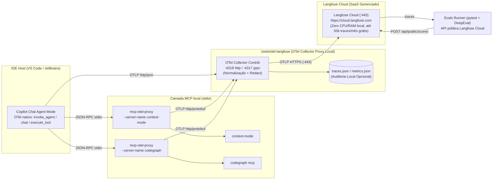
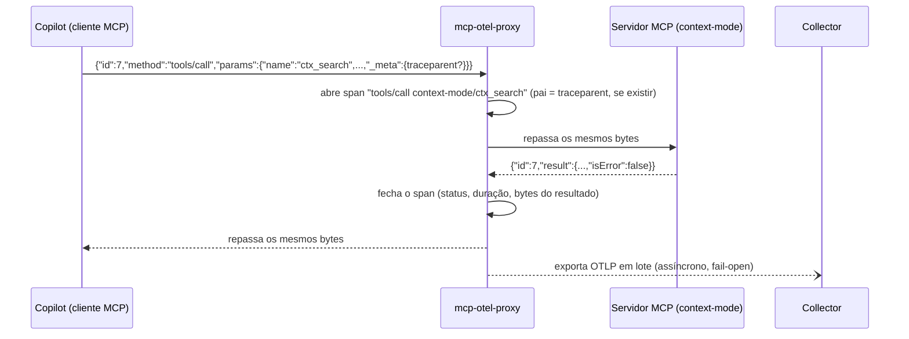

# Blueprint Técnico — Observabilidade de Agents de IA (Copilot + MCP + OTel/Langfuse)

> **Estado**: WF4_BLUEPRINT_SPEC · **Autor**: tech-solution-architect · **Status**: PROPOSTO (aguarda ADR via @docs-engineer)
> **Base normativa**: [agent-observability-otel](../../.github/skills/agent-observability-otel/SKILL.md) (OTel GenAI Semconv v1.41+) · [handoff-governance](../../.github/skills/handoff-governance/SKILL.md) (schema v1.3) · [agent-evals-lab](../../.github/skills/agent-evals-lab/SKILL.md) · [ARCHITECTURE_AND_GOVERNANCE_GUIDE](./ARCHITECTURE_AND_GOVERNANCE_GUIDE.md) (arc42 §7/§8.3)
> **Infra existente**: [tools/otel-langfuse](../../tools/otel-langfuse/README.md) (Collector Contrib :4317/:4318 Proxy Local → Langfuse Cloud SaaS :443 + `traces.json` opcional)

---

## 1. Resumo da Solução

| Item | Decisão |
|---|---|
| **Abordagem** | Telemetria passiva em 3 camadas: (1) OTel nativo da IDE (Copilot Chat VS Code / JetBrains); (2) **proxy stdio transparente** (Node) na frente de cada servidor MCP local; (3) Collector central que normaliza a semântica, mascara segredos, gera spanmetrics e envia para o Langfuse. |
| **Componentes novos** | `tools/mcp-otel-proxy/` (pacote Node), extensão aditiva `handoff_payload.rastreabilidade` (schema v1.4), pipeline de evals sobre os traces do Langfuse. |
| **Componentes alterados** | `.vscode/mcp.json`, `tools/otel-langfuse/otel-collector-config.yaml`, `tools/otel-langfuse/test-trace.js`, `.env.example`, `.gitignore`, SKILLs agent-observability-otel e handoff-governance (removidos docker-compose local e dependências pesadas de ClickHouse/MinIO/Postgres em favor de Langfuse Cloud). |
| **Decisões do usuário** | Interceptação via proxy stdio configurado em `.vscode/mcp.json`; **captura completa de conteúdo sempre ativa** (ver §7 — risco e mitigações obrigatórias). |
| **Blast radius (code-knowledge-graph)** | Não existe `package.json` nem proxy MCP no repo (greenfield). `tools/otel-langfuse` não tem consumidores em runtime. `tests/governance_audit/` não valida o schema de `mcp.json` → **COMPATIBLE**. handoff-governance é referenciado por 136 arquivos → a mudança de schema deve ser **somente aditiva**. |

### 1.1 Gaps detectados na infra atual

| ID | Gap | Evidência | Correção |
|---|---|---|---|
| G-01 | Credencial Basic do Langfuse fixa no config do Collector | `otel-collector-config.yaml` → `exporters.otlp_http/langfuse.headers` | Mover para `${env:LANGFUSE_OTLP_AUTH}` |
| G-02 | Pipeline de métricas só exporta para `debug` | `service.pipelines.metrics` | Conector `spanmetrics` + exporter `file/metrics` (Prometheus opcional) |
| G-03 | Trace sintético usa `gen_ai.system` (deprecado desde v1.36) | `test-trace.js` | Emitir `gen_ai.provider.name` + span `execute_tool` MCP |
| G-04 | Sem `memory_limiter`, normalização ou mascaramento | `processors: [batch]` | Pipeline de processors da §4.3 |
| G-05 | Tools MCP invisíveis fora da IDE (sem duração real no servidor nem erros JSON-RPC) | `.vscode/mcp.json` executa `codegraph` e `context-mode` direto | Proxy stdio (§4.2) |
| G-06 | CORS do receiver aceita qualquer origem (`http://*`) | `receivers.otlp.protocols.http.cors` | Restringir a `http://localhost:*` (§7) |

---

## 2. Arquitetura de Ponta a Ponta



### 2.1 Camada 1 — Client IDE

| IDE | Configuração | Valores canônicos |
|---|---|---|
| **JetBrains** (Copilot / Claude Code) | Settings → Open Telemetry (já documentado no README da infra) | exporter `otlp-http`, protocolo `http/json`, endpoint `http://localhost:4318`, service name `deep-agents-copilot`, capture content **ON** |
| **VS Code** (Copilot Chat) | Chaves de OTel do Copilot Chat no `settings.json` **ou** variáveis `OTEL_*` padrão no ambiente do processo da IDE | `OTEL_EXPORTER_OTLP_ENDPOINT=http://localhost:4318`, `OTEL_EXPORTER_OTLP_PROTOCOL=http/json`, `OTEL_SERVICE_NAME=deep-agents-copilot`, `OTEL_RESOURCE_ATTRIBUTES=service.namespace=deep-agents,deployment.environment=local` |

> ⚠️ Os nomes exatos das chaves de settings do Copilot Chat mudam entre versões → a tarefa **DOCS-02** confirma os nomes via `@deep-search` antes de documentar. As variáveis `OTEL_*` são o fallback que funciona em qualquer IDE.

### 2.2 Camada 2 — Interceptação MCP (proxy stdio)

O proxy é um processo intermediário que **não altera nenhum byte**. O cliente MCP enxerga o proxy como se fosse o servidor; o proxy inicia o servidor real como processo filho, repassa stdin/stdout sem mudanças e lê uma cópia das mensagens JSON-RPC (uma por linha) para emitir spans.



### 2.3 Camada 3 — Collector Proxy e Langfuse Cloud

Adota **Langfuse Cloud** (cloud.langfuse.com ou us.cloud.langfuse.com) como backend SaaS gerenciado (gratuito até 50.000 traces/mês), eliminando completamente a dependência de contêineres pesados locais (PostgreSQL, ClickHouse, Redis, MinIO) que oneravam CPU e memória da estação. O OTel Collector local atua como um **proxy/gateway leve e transparente**: o único ponto de política para normalização semântica (Semconv v1.41+), mascaramento de segredos PII/tokens e geração de métricas antes do despacho HTTPS para a nuvem.

---

## 3. Modelo de Dados de Rastreabilidade

### 3.1 Hierarquia de spans canônica

```text
[invoke_agent agent-router]                          SERVER · raiz da interação do usuário (IDE)
  ├── [chat <modelo>]                                CLIENT · tokens in/out, finish_reasons
  ├── [execute_tool runSubagent]                     INTERNAL · handoff (IDE)
  │     └── [invoke_agent tech-solution-architect]   CLIENT · gen_ai.agent.name = destino
  │           ├── [chat <modelo>]
  │           └── [execute_tool context-mode/ctx_execute]      INTERNAL · IDE (type=mcp)
  │                 └── [tools/call context-mode/ctx_execute]  CLIENT · proxy (quando o traceparent chega)
  └── [chat <modelo>]
```

### 3.2 Contrato de atributos (Spec-First)

```yaml
# contracts/otel/agent-span-attributes.v1.yaml — contrato declarativo (fonte da verdade do Collector e do proxy)
resource:
  service.name:            { req: true,  values: [deep-agents-copilot, mcp-otel-proxy] }
  service.namespace:       { req: true,  value: deep-agents }
  deployment.environment:  { req: true,  values: [local, ci] }
  mcp.server.name:         { req: proxy, example: context-mode }        # extensão do repo
spans:
  invoke_agent:
    kind: [SERVER, CLIENT]
    name: "invoke_agent {gen_ai.agent.name}"
    attributes:
      gen_ai.operation.name:      { req: true, value: invoke_agent }
      gen_ai.provider.name:       { req: true, example: github.copilot }   # NUNCA gen_ai.system
      gen_ai.agent.name:          { req: true, example: tech-solution-architect }
      gen_ai.agent.id:            { req: false }
      gen_ai.conversation.id:     { req: true, note: "id da sessão de chat; alias legado agent.conversation.id" }
      gen_ai.request.model:       { req: recommended }
      deep_agents.workflow:       { req: false, example: WORKFLOW-FEATURE-DEVELOPMENT }
      deep_agents.state_lock:     { req: false, example: WF4_BLUEPRINT_SPEC }
      deep_agents.handoff.from:   { req: when_delegated }
      deep_agents.handoff.motivo: { req: when_delegated }
      langfuse.session.id:        { req: true, derived_from: gen_ai.conversation.id }
  chat:
    kind: CLIENT
    name: "chat {gen_ai.request.model}"
    attributes:
      gen_ai.operation.name:          { req: true, value: chat }
      gen_ai.provider.name:           { req: true }
      gen_ai.request.model:           { req: true }
      gen_ai.response.model:          { req: recommended }
      gen_ai.usage.input_tokens:      { req: recommended, type: int }
      gen_ai.usage.output_tokens:     { req: recommended, type: int }   # total = soma, calculado no cliente
      gen_ai.response.finish_reasons: { req: recommended, type: "string[]" }
      gen_ai.input.messages:          { req: capture_content }          # captura completa ON (§7)
      gen_ai.output.messages:         { req: capture_content }
  execute_tool:                        # emitido pela IDE
    kind: INTERNAL
    name: "execute_tool {gen_ai.tool.name}"
    attributes:
      gen_ai.operation.name:       { req: true, value: execute_tool }
      gen_ai.tool.name:            { req: true, format: "<server>/<tool> para MCP", example: context-mode/ctx_search }
      gen_ai.tool.type:            { req: true, values: [function, mcp] }
      gen_ai.tool.call.id:         { req: recommended }
      gen_ai.tool.call.arguments:  { req: capture_content, max_bytes: 16384 }
      gen_ai.tool.call.result:     { req: capture_content, max_bytes: 16384 }
      tool.execution.status:       { req: true, values: [success, error, timeout] }
      tool.execution.duration_ms:  { req: true, type: int }
      error.type:                  { req: on_error, examples: [jsonrpc_-32602, tool_error, timeout, transport_closed] }
  mcp_tools_call:                      # emitido pelo proxy
    kind: CLIENT
    name: "{mcp.method.name} {gen_ai.tool.name}"
    attributes:
      gen_ai.operation.name:       { req: true, value: execute_tool }
      gen_ai.tool.type:            { req: true, value: mcp }
      gen_ai.tool.name:            { req: true }
      mcp.method.name:             { req: true, examples: [tools/call, initialize, tools/list, resources/read] }
      mcp.session.id:              { req: recommended, note: "uuid gerado pelo proxy para cada processo filho" }
      mcp.protocol.version:        { req: recommended, source: "initialize.result.protocolVersion" }
      jsonrpc.request.id:          { req: true }
      network.transport:           { req: true, value: pipe }
      tool.execution.status:       { req: true }
      tool.execution.duration_ms:  { req: true }
      mcp.result.bytes:            { req: true, type: int, note: "base da métrica de pressão de contexto" }
      error.type:                  { req: on_error }
metrics:
  gen_ai.client.token.usage:        { type: histogram, unit: "{token}", source: IDE }
  gen_ai.client.operation.duration: { type: histogram, unit: s, source: IDE }
  gen_ai.tool.execution.duration:   { type: histogram, unit: ms, source: "spanmetrics(execute_tool)", dims: [gen_ai.tool.name, gen_ai.tool.type, tool.execution.status] }
  mcp.result.bytes:                 { type: histogram, unit: By, source: proxy }
  gen_ai.session.cost:              { type: counter, unit: USD, source: "Langfuse (cálculo por modelo)" }
```

> ⚠️ Os atributos `gen_ai.*` e `mcp.*` estão com status *Development* na spec. Os prefixos `deep_agents.*` e `tool.execution.*` são extensões do repositório (mantidas por compatibilidade com a SKILL). A tarefa **MCP-07** confirma os nomes na spec vigente via `@deep-search`.

### 3.3 Propagação de contexto

| Fronteira | Mecanismo principal | Correlação de fallback |
|---|---|---|
| Sessão de chat → spans | `gen_ai.conversation.id` (IDE) → mapeado para `langfuse.session.id` no Collector | janela de tempo + `service.instance.id` |
| Agent → Agent (handoff) | o span `execute_tool runSubagent` da IDE é pai do `invoke_agent <destino>`; o Collector deriva `deep_agents.handoff.from` / `motivo` | bloco `rastreabilidade` no `handoff_payload` (§3.4) |
| IDE → proxy MCP | W3C `traceparent`/`tracestate` em `params._meta` do JSON-RPC (lido pelo proxy sem alterar a mensagem) | `gen_ai.tool.call.id` ≈ `jsonrpc.request.id` + `gen_ai.tool.name` + janela de ±2s (EVALS-02) |
| Proxy → servidor MCP | o proxy **não injeta** nada (não altera bytes) | — |

### 3.4 Extensão aditiva do handoff (schema v1.3 → v1.4)

```yaml
handoff_payload:
  versao: "1.4"                  # v1.4: bloco opcional de rastreabilidade OTel (aditivo, retrocompatível)
  # ... campos da v1.3 inalterados ...
  rastreabilidade:               # OPCIONAL — preencher quando o emissor conhecer o contexto
    conversation_id: "<gen_ai.conversation.id>"
    trace_id: "<32 hex>"         # opcional
    parent_span_id: "<16 hex>"   # opcional
    workflow: "<WORKFLOW-*>"
    state_lock: "<CURRENT_STATE_LOCK>"
```

Regra: a falta do bloco **nunca** invalida um handoff (COMPATIBLE). O `yaml-governance` valida o formato hex quando o bloco existir.

---

## 4. Especificação dos Componentes

### 4.1 Configuração MCP (contrato de `.vscode/mcp.json`)

```json
{
  "servers": {
    "context-mode": {
      "command": "node",
      "args": ["tools/mcp-otel-proxy/bin/mcp-otel-proxy.js", "--server-name", "context-mode", "--",
               "cmd.exe", "/c", "npx", "-y", "context-mode"],
      "env": {
        "CONTEXT_MODE_IDLE_TIMEOUT_MS": "0",
        "OTEL_EXPORTER_OTLP_ENDPOINT": "http://localhost:4318",
        "OTEL_SERVICE_NAME": "mcp-otel-proxy",
        "MCP_OTEL_CAPTURE_CONTENT": "true",
        "MCP_OTEL_MAX_ATTR_BYTES": "16384",
        "MCP_OTEL_TOOL_TIMEOUT_MS": "120000"
      }
    },
    "codegraph": {
      "command": "node",
      "args": ["tools/mcp-otel-proxy/bin/mcp-otel-proxy.js", "--server-name", "codegraph", "--",
               "cmd.exe", "/c", "codegraph", "mcp", "--multi-repo"],
      "env": {
        "OTEL_EXPORTER_OTLP_ENDPOINT": "http://localhost:4318",
        "OTEL_SERVICE_NAME": "mcp-otel-proxy",
        "MCP_OTEL_CAPTURE_CONTENT": "true"
      }
    }
  }
}
```

Chave de desligamento: `MCP_OTEL_DISABLED=true` faz o proxy só repassar os bytes (rollback sem editar o `mcp.json`).

### 4.2 `tools/mcp-otel-proxy/` — requisitos

| ID | Requisito |
|---|---|
| PX-01 | **Não altera bytes**: stdin→filho e filho→stdout repassados como estão; o parse é feito numa cópia, linha a linha (framing NDJSON do MCP stdio). |
| PX-02 | **stdout reservado ao protocolo**; logs do proxy só em stderr (e opcionalmente em OTLP logs). |
| PX-03 | **Fail-open**: Collector fora do ar, erro de parse ou erro no exporter nunca travam nem derrubam a sessão MCP. Exportação em lote assíncrona com fila limitada (descarta o item mais antigo quando cheia). |
| PX-04 | Correlação pelo `id` JSON-RPC num mapa de requisições pendentes; notificações (sem `id`) viram span events, não spans. |
| PX-05 | Métodos instrumentados: `initialize` (captura `protocolVersion`, `serverInfo`), `tools/list`, `tools/call`, `resources/*`, `prompts/*`. |
| PX-06 | Status: `result.isError=true` → `error` / `tool_error`; `error.code` → `error` / `jsonrpc_<code>`; sem resposta em `MCP_OTEL_TOOL_TIMEOUT_MS` → `timeout`; filho encerrado com requisições pendentes → `error` / `transport_closed`. |
| PX-07 | Truncamento na borda: argumentos/resultados maiores que `MCP_OTEL_MAX_ATTR_BYTES` são cortados com o sufixo `…[truncated N bytes]`; `mcp.result.bytes` sempre guarda o tamanho real. |
| PX-08 | Mascaramento local antes de exportar (defesa em profundidade, além do Collector): `ghp_|gho_|github_pat_`, `sk-[A-Za-z0-9]{20,}`, `pk-lf-|sk-lf-`, `Bearer\s+\S+`, `AKIA[0-9A-Z]{16}`, `-----BEGIN .* PRIVATE KEY-----`. |
| PX-09 | Ciclo de vida: repassa SIGINT/SIGTERM/exit ao filho, faz `forceFlush` do exporter com limite de 2s e sai com o exit code do filho. Compatível com Windows (`cmd.exe /c`, `shell:false`). |
| PX-10 | Overhead: p95 ≤ 2ms por mensagem; memória residente ≤ 50MB. |
| PX-11 | Dependências mínimas: `@opentelemetry/api`, `@opentelemetry/sdk-trace-base`, `@opentelemetry/exporter-trace-otlp-proto`, `@opentelemetry/resources`, `@opentelemetry/semantic-conventions`; versões fixas + lockfile commitado; Node ≥ 20 LTS. |

### 4.3 Collector — configuração-alvo

```yaml
# tools/otel-langfuse/otel-collector-config.yaml (alvo declarativo)
receivers:
  otlp:
    protocols:
      grpc: { endpoint: 0.0.0.0:4317 }
      http:
        endpoint: 0.0.0.0:4318
        cors: { allowed_origins: ["http://localhost:*", "http://127.0.0.1:*"] }   # G-06

processors:
  memory_limiter: { check_interval: 1s, limit_mib: 512, spike_limit_mib: 128 }
  resource/defaults:
    attributes:
      - { key: service.namespace, value: deep-agents, action: upsert }
      - { key: deployment.environment, value: "${env:DEPLOY_ENV}", action: insert }
  transform/semconv:              # normalização legado → v1.41
    trace_statements:
      - context: span
        statements:
          - set(attributes["gen_ai.provider.name"], attributes["gen_ai.system"]) where attributes["gen_ai.provider.name"] == nil and attributes["gen_ai.system"] != nil
          - delete_key(attributes, "gen_ai.system")
          - set(attributes["gen_ai.conversation.id"], attributes["agent.conversation.id"]) where attributes["gen_ai.conversation.id"] == nil and attributes["agent.conversation.id"] != nil
          - set(attributes["langfuse.session.id"], attributes["gen_ai.conversation.id"]) where attributes["gen_ai.conversation.id"] != nil
          - set(attributes["gen_ai.tool.type"], "mcp") where attributes["mcp.method.name"] != nil
  transform/redact-secrets:       # obrigatório com captura completa de conteúdo
    trace_statements:
      - context: span
        statements:
          - replace_all_patterns(attributes, "value", "(ghp_|gho_|github_pat_)[A-Za-z0-9_]+", "***REDACTED_GH***")
          - replace_all_patterns(attributes, "value", "(sk|pk)-lf-[A-Za-z0-9-]+", "***REDACTED_LF***")
          - replace_all_patterns(attributes, "value", "sk-[A-Za-z0-9]{20,}", "***REDACTED_KEY***")
          - replace_all_patterns(attributes, "value", "Bearer\\s+[A-Za-z0-9._~+/=-]+", "Bearer ***REDACTED***")
          - replace_all_patterns(attributes, "value", "AKIA[0-9A-Z]{16}", "***REDACTED_AWS***")
  batch: { timeout: 1s, send_batch_size: 64 }

connectors:
  spanmetrics:
    histogram: { unit: ms }
    dimensions:
      - name: gen_ai.operation.name
      - name: gen_ai.tool.name
      - name: gen_ai.tool.type
      - name: tool.execution.status
      - name: gen_ai.agent.name

exporters:
  otlp_http/langfuse:
    endpoint: "https://cloud.langfuse.com/api/public/otel"    # Langfuse Cloud SaaS
    headers: { Authorization: "Basic ${env:LANGFUSE_OTLP_AUTH}" }   # G-01
  file/traces:  { path: /var/log/otel/traces.json,  rotation: { max_megabytes: 100, max_backups: 5 } }
  file/metrics: { path: /var/log/otel/metrics.json, rotation: { max_megabytes: 50,  max_backups: 3 } }
  debug: { verbosity: basic }

service:
  pipelines:
    traces:
      receivers: [otlp]
      processors: [memory_limiter, resource/defaults, transform/semconv, transform/redact-secrets, batch]
      exporters: [otlp_http/langfuse, file/traces, spanmetrics, debug]
    metrics:
      receivers: [otlp, spanmetrics]
      processors: [memory_limiter, resource/defaults, batch]
      exporters: [file/metrics, debug]
    logs:
      receivers: [otlp]
      processors: [memory_limiter, resource/defaults, transform/redact-secrets, batch]
      exporters: [debug]
```

> Validação recomendada: `otelcol-contrib validate --config tools/otel-langfuse/otel-collector-config.yaml` ou via container leve isolado de testes (a sintaxe OTTL muda entre versões do Collector).

### 4.4 Evals sobre traces

| Fonte | Métrica | Gate (agent-evals-lab) |
|---|---|---|
| Spans `invoke_agent` + `runSubagent` | **Routing Accuracy**: agente real vs esperado em `.github/agents/evals/casos-roteamento.yaml` | regressão de roteamento 100% |
| Spans `execute_tool` | **Tool Correctness** e detecção do Smell 2.26 (≥ 2 `ctx_execute` seguidos no mesmo turno) | 0 violações nos casos canônicos |
| `tool.execution.status` | taxa de erro/timeout por tool MCP | ≤ 2% |
| `gen_ai.usage.*` + `mcp.result.bytes` | orçamento de tokens/contexto por sessão; alerta em 80% | p95 dentro do orçamento |
| Nº de spans `execute_tool` por `invoke_agent` | teto de tool turns (R-060, ≤ 5) | 100% de conformidade |
| Scores | publicados no Langfuse (`POST /api/public/scores`) ligados ao `trace_id` | — |

---

## 5. Context Firewall — Divisão de Tarefas

> Não há `[FRONTEND_TASKS]` de aplicação: a UI é o Langfuse pronto. As tarefas de backend estão divididas nos domínios abaixo. O `@agent-router` escolhe o especialista de cada domínio.

### [INFRA_TASKS]
1. **INFRA-01** — Apontar coletor para o Langfuse Cloud (`https://cloud.langfuse.com/api/public/otel`) com `${env:LANGFUSE_OTLP_AUTH}` e atualizar `.env.example`; remover `docker-compose.yml` e dependências locais de ClickHouse/MinIO/Postgres. — Domínio: infra/otel · revisão `@security-reviewer`
2. **INFRA-02** — Aplicar os processors da §4.3 (`memory_limiter`, `resource/defaults`, `transform/semconv`, `transform/redact-secrets`) e o CORS restrito (G-06); validar com `otelcol-contrib validate`. — Domínio: infra/otel
3. **INFRA-03** — Conector `spanmetrics` + exporter `file/metrics` com rotação; rotação também em `file/traces` (G-02). — Domínio: infra/otel
4. **INFRA-04** — Atualizar `test-trace.js`: trocar `gen_ai.system` por `gen_ai.provider.name`, acrescentar um span filho `execute_tool` com `gen_ai.tool.type=mcp` e um segredo sintético para provar o mascaramento (G-03). — Domínio: infra/node
5. **INFRA-05** — Política de retenção configurada diretamente no painel Langfuse Cloud (SaaS), compatível com a captura completa (§7). — Domínio: infra/cloud

### [MCP_TASKS]
1. **MCP-01** — Criar o pacote `tools/mcp-otel-proxy/` (`package.json`, lockfile, `bin/mcp-otel-proxy.js`, README) cumprindo PX-01..PX-11. — Domínio: Node
2. **MCP-02** — Mapa de requisições pendentes + classificação de status/erros (PX-04, PX-06) + leitura de `params._meta.traceparent` (§3.3).
3. **MCP-03** — Truncamento e mascaramento local (PX-07, PX-08).
4. **MCP-04** — Ciclo de vida, flush e Windows (PX-09); `MCP_OTEL_DISABLED` como chave de rollback.
5. **MCP-05** — Atualizar `.vscode/mcp.json` conforme §4.1 e o `.gitignore` (`tools/mcp-otel-proxy/node_modules/`).
6. **MCP-06** — Testes do proxy com um servidor MCP falso (eco): transparência byte a byte, timeout, `isError`, filho encerrado, Collector fora do ar (fail-open) e overhead (PX-10). — Estratégia: `@test-strategy`
7. **MCP-07** — Confirmar os nomes `gen_ai.*` / `mcp.*` e se o Copilot envia `_meta.traceparent`, contra a spec vigente. — `@deep-search`

### [EVALS_TASKS]
1. **EVALS-01** — Extrator `tests/evals/langfuse_traces.py` (API pública do Langfuse, filtro por `langfuse.session.id` / intervalo de tempo). — `@test-strategy` → implementador Python
2. **EVALS-02** — Job de correlação IDE↔proxy por `tool.call.id` / nome / janela de tempo (fallback da §3.3).
3. **EVALS-03** — Métricas da §4.4 como testes pytest/DeepEval ligados a `casos-roteamento.yaml` e `tests/operational_flow/casos-workflows.yaml`; publicação dos scores no Langfuse.
4. **EVALS-04** — Integrar em `.github/prompts/eval-workflows.prompt.md` (execução local e em CI com Collector temporário).

### [DOCS_TASKS]
1. **DOCS-01** — ADR "Proxy stdio para telemetria MCP + captura completa de conteúdo" no `ARCHITECTURE_AND_GOVERNANCE_GUIDE.md` §9. — `@docs-engineer`
2. **DOCS-02** — README da infra: seção VS Code (chaves confirmadas via `@deep-search`) e seção do proxy.
3. **DOCS-03** — SKILL agent-observability-otel: incluir `gen_ai.conversation.id`, atributos `mcp.*`, o proxy e a nota de exceção de captura; handoff-governance: schema v1.4 (§3.4) e a regra correspondente no `yaml-governance`.
4. **DOCS-04** — Atualizar `docs/agent-context/context-mode.md`, `codegraph-guia-uso.md` e `docs/context/setup-context-mode-intellij.md` (nova linha de comando via proxy; o JetBrains usa uma configuração MCP equivalente).

**Ordem de execução**: INFRA-01 → (INFRA-02/03/04 ∥ MCP-01..04) → MCP-06 → MCP-05 → EVALS-01..04 → DOCS-01..04. MCP-07 e DOCS-02 correm em paralelo desde o início.

---

## 6. Riscos, Compatibilidade e Rollback

| Risco | Classe | Mitigação | Rollback |
|---|---|---|---|
| Proxy corromper o stdio e derrubar o MCP | COMPATIBLE (se PX-01 for cumprido) | testes byte a byte (MCP-06), fail-open | `MCP_OTEL_DISABLED=true` ou reverter o `mcp.json` |
| Copilot não propagar `_meta.traceparent` | Funcional | correlação heurística (EVALS-02) | — |
| Spec *Development* mudar nomes de atributos | COMPATIBLE | `transform/semconv` funciona como camada de alias no Collector | editar só o Collector |
| Schema de handoff v1.4 | COMPATIBLE (aditivo) | bloco opcional | ignorar o bloco |
| Sintaxe OTTL mudar entre versões do Collector | Operacional | imagem fixada + `validate` | config anterior versionada |

## 7. Segurança — captura completa de conteúdo (decisão do usuário)

A captura completa **diverge** da SKILL (§6/§7: "não logar prompt/completion por padrão"). Ela só é aceitável com **todos** os controles abaixo, registrados em ADR (DOCS-01) e revisados pelo `@security-reviewer`:
1. Mascaramento duplo de segredos (proxy PX-08 + Collector `transform/redact-secrets`).
2. Ingestão segura em trânsito TLS para Langfuse Cloud com CORS local estritamente restrito a `localhost` no coletor proxy (G-06).
3. Retenção limitada (INFRA-05) e `traces.json` / `metrics.json` fora do Git (confirmar no `.gitignore` da infra).
4. Credenciais só via `.env` (G-01); `.env` nunca commitado.
5. Exporter remoto SaaS aprovado: Langfuse Cloud (`https://cloud.langfuse.com`, com tráfego criptografado TLS e segredos mascarados localmente).
