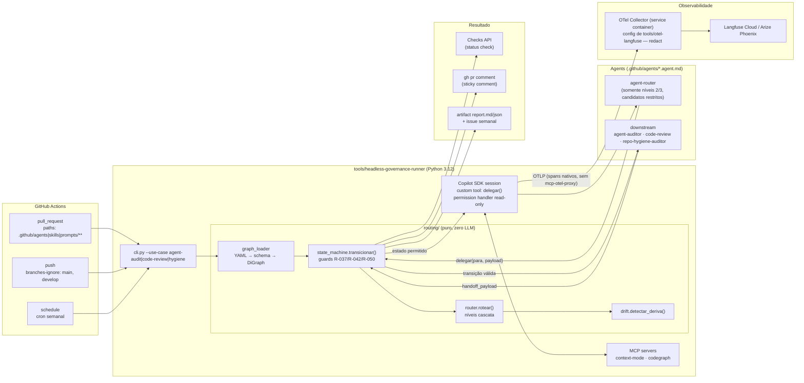

# Blueprint Técnico — GitHub Copilot SDK como Orquestrador Headless de Governança (CI/CD)

> **Status**: PROPOSTO · **Data**: 2026 · **Estado de origem**: `WF4_BLUEPRINT_SPEC` (WORKFLOW-FEATURE-DEVELOPMENT, Etapa 3) · **Autor**: tech-solution-architect · **Curadoria**: docs-engineer
> **Nota de Rastreabilidade**: Documento padronizado conforme a convenção de Blueprints Técnicos em `docs/architecture/` (`BLUEPRINT_*.md`), desambiguando da série numérica canônica de ADRs pontuais em `docs/adr/` (anteriormente referenciado preliminarmente como `ADR-001`).
> **Base normativa**: [copilot-instructions.md](../../.github/copilot-instructions.md) (R-037, R-042, R-046, R-050, R-060, R-064) · [routing-graph.yaml](../../.github/agents/routing-graph.yaml) · [catalog.yaml](../../.github/agents/catalog.yaml) · [casos-roteamento.yaml](../../.github/agents/evals/casos-roteamento.yaml) · [handoff-governance](../../.github/skills/handoff-governance/SKILL.md) · [agent-evals-lab](../../.github/skills/agent-evals-lab/SKILL.md)
> **Reconcilia com**: [BLUEPRINT_AGENT_OBSERVABILITY.md](./BLUEPRINT_AGENT_OBSERVABILITY.md) (proxy stdio + OTel Collector → Langfuse Cloud)
> **Pendência de verificação externa**: nomes exatos de pacotes/APIs do Copilot SDK (sessão, custom tools, hooks de permissão, export OTel) devem ser confirmados via `@deep-search` antes da PoC. Os trechos de código deste blueprint são **ilustrativos** e independentes da API final.
---

## 1. Resumo Executivo

| Item | Decisão |
|---|---|
| **Decisão** | Adotar o GitHub Copilot SDK (binding **Python**) como runtime de um **runner headless** em GitHub Actions. O roteamento deixa de ser convenção textual: `routing-graph.yaml` é compilado para uma **state machine em código** (guard clauses R-037/R-042/R-050) e o LLM só escolhe dentro do conjunto de transições permitidas. |
| **Componentes novos** | `tools/headless-governance-runner/` (pacote Python: `routing/`, `runner/`, `reporters/`, `telemetry/`) · `tests/routing_unit/` (pytest determinístico, zero LLM) · 3 workflows: `.github/workflows/governance-agent-audit.yml`, `governance-code-review.yml`, `governance-hygiene-schedule.yml` · schema JSON `routing-graph.schema.json` |
| **Componentes alterados** | `tests/operational_flow/workflow_eval_simulator.py` (passa a delegar ao motor `routing/` — elimina 3ª fonte de verdade) · `tests/requirements.txt` (dep. do pacote em modo editável) · `.github/agents/routing-graph.yaml` (**aditivo**: `tipo: keyword_match` explícito, `score_formula`, `politica_desvio` default) · `tools/otel-langfuse/otel-collector-config.yaml` (reuso como service container no CI, sem alteração semântica) · `agent-evals-lab/SKILL.md` (§5 ganha camada "determinística") |
| **Componentes NÃO alterados** | `.vscode/mcp.json` e `tools/mcp-otel-proxy/` (IDE interativa continua idêntica) · `.github/workflows/routing-quality-gate.yml` (continua como gate estrutural) · conteúdo dos `*.agent.md` |
| **Blast radius (codegraph-engine)** | Consumidores atuais de `routing-graph.yaml`/`catalog.yaml`: `tests/routing_gate/test_routing_quality_gate.py`, `tests/evals/{conftest,test_routing_accuracy_evals}.py`, `tests/operational_flow/{test_operational_workflows,test_workflow_trajectories,workflow_eval_simulator}.py`, `tests/governance_audit/{test_architectural_blueprint_gate_governance,test_catalog_agents_referenced_in_canonical_workflows}.py`, `tools/codegraph-visualizer/generator/generate-graph.py`, `.githooks/pre-commit`, `.a2a/agentcards/*`. Mudança no YAML é **somente aditiva → COMPATIBLE**. Runner é greenfield. |
| **Stack de testes existente** | 100% pytest (7 diretórios). Único workflow CI: `routing-quality-gate.yml` (Python 3.12). Zero vitest. |

### 1.1 Achados estruturais do `routing-graph.yaml` (input do parser)

Estrutura real: `version`, `nos` (37: 1 `entry_point`, 1 `health_check`, 1 `mandatory_pre_step`, 7 `domain_router`, 25 `downstream`, 2 `fallback`), `workflows` (9, cada um com `estados` ordenados por `etapa`, `agent`, `sub_rotinas_permitidas`, gates), `arestas` (42), `politica_cascata` (níveis 0.9 / 0.7 / 0.5 / 0.0 + `ambiguity_zone` Δ≤0.05 + `out_of_domain` 0.2), `convencao_papeis_genericos`.

| ID | Gap | Evidência | Tratamento no parser |
|---|---|---|---|
| RG-01 | 37 de 42 arestas não declaram `condicoes.tipo` (são arestas de keyword implícitas) | `condicoes: {keywords, sinal_r006}` sem `tipo` | Inferir `tipo=keyword_match`; propor tornar explícito (aditivo) |
| RG-02 | Não existe fórmula formal de `score` — só thresholds | `politica_cascata.nivel_1_rule_based.threshold: 0.9` | Declarar `score_formula` versionada no YAML; motor lê a fórmula, testes a fixam |
| RG-03 | `politica_desvio` ausente em workflows (ex.: WORKFLOW-BUG-FIX → `null`) | `workflows[0].politica_desvio` | Default `strict` quando ausente (fail-closed) |
| RG-04 | `estados.*.agent` usa aliases `specialist-<papel>` e listas `a \| b` | `red_test_and_layout_reproduction.agent` | Resolver por tag `role:` do sub-catálogo do domain router; `\|` vira conjunto permitido |
| RG-05 | Decision Tree do `agent-router.agent.md` é "documentação derivada" sem teste de paridade | `description` do YAML | Teste de paridade YAML ↔ Markdown (ver §8) |

---

## 2. Contexto

Hoje `WORKFLOW-GOVERNANCE-MAINTENANCE`, os evals (`tests/evals/`, skill `agent-evals-lab`) e as auditorias (`repo-hygiene-auditor`, `agent-auditor`) só executam dentro de sessão interativa na IDE. O roteamento (R-037 agent-router first, R-042 anti sticky-session, R-050 workflows canônicos) é imposto por instruções em Markdown, seguido por convenção do LLM; violações só são detectadas *a posteriori* (suíte `regressao` de `casos-roteamento.yaml`, 35 casos — muitos nasceram de desvios reais, ex.: `regr-028`).

O Copilot SDK expõe o mesmo runtime de orquestração do Copilot CLI (planejamento, tool invocation, multi-turno, MCP nativo, BYOK) como biblioteca, permitindo: (1) executar agents fora da IDE; (2) interpor **código** entre a decisão do LLM e a execução de tools/delegações.

---

## 3. Opções Consideradas

| # | Opção | Descrição |
|---|---|---|
| O1 | **Manter só interativo** | Nenhum runner; governança continua 100% em prompt + pytest estrutural atual. |
| O2 | **Runner completo com Copilot SDK (Python)** | State machine em código + SDK para execução de agents/MCP + CI GitHub Actions. |
| O3 | **Runner sem SDK (MCP CLI + API de modelo direta)** | Orquestração própria (loop de tools, MCP client, planning) sobre API de LLM genérica/BYOK. |
| O4 | **Copilot CLI não-interativo em shell step** | `copilot -p "<prompt>"` em Actions, sem camada de código entre decisão e execução. |

### 3.1 Critérios objetivos (peso)

| Critério | Peso | O1 | O2 | O3 | O4 |
|---|---|---|---|---|---|
| C1 Enforcement estrutural R-037/R-042/R-050 (guard em código) | 30% | 0 | 5 | 5 | 1 |
| C2 Testabilidade determinística do roteamento | 20% | 1 | 5 | 5 | 1 |
| C3 Custo de construção/manutenção do loop agentic | 15% | 5 | 4 | 1 | 5 |
| C4 Paridade com o runtime usado na IDE (mesmo comportamento de agent/MCP) | 15% | 5 | 4 | 2 | 4 |
| C5 Vendor lock-in (maior = menor lock-in) | 10% | 3 | 2 | 5 | 2 |
| C6 Observabilidade nativa (OTel) | 10% | 2 | 4 | 3 | 2 |
| **Score ponderado (0–5)** | | **2.05** | **4.35** | **3.70** | **2.35** |

**Critério de escolha**: maior score ponderado **e** nota ≥4 em C1 e C2 (obrigatórios para os Eixos 2 e 3). Somente O2 e O3 atendem; O2 vence por C3/C4 (não reimplementar loop agentic nem MCP client). O3 permanece como **plano de saída** (§9, rollback de lock-in) porque o motor `routing/` é independente do SDK.

---

## 4. Decisão

Adotar **O2**. Princípio central: **"o código decide o grafo, o LLM decide o conteúdo"**. O motor de roteamento é um pacote Python puro, sem dependência do SDK; o SDK é um *adapter* substituível.

### 4.1 Diagrama de arquitetura



---

## 5. Eixo 1 — CI/CD e Automação Headless

### 5.1 Stack: Python (justificativa)

| Fator | Evidência no repo | Peso na decisão |
|---|---|---|
| Suíte de testes | 100% pytest (`tests/**`), `pytest.ini` na raiz | Motor e testes na mesma linguagem → `tests/routing_unit/` importa o motor diretamente |
| Reuso | `workflow_eval_simulator.py`, `test_routing_quality_gate.py` já parseiam `routing-graph.yaml` em Python | Convergência para um único parser |
| Tools existentes | 6 de 7 em `tools/` são Python; só `mcp-otel-proxy` é Node/TS | Consistência operacional |
| CI existente | `routing-quality-gate.yml` já usa `setup-python@v5` 3.12 + cache pip | Zero novo toolchain |
| Contra | `mcp-otel-proxy` em TS; SDK TS tende a ser o binding mais maduro | Aceito: o runner não depende do proxy (§7) |

### 5.2 Estrutura de diretórios proposta

```text
tools/headless-governance-runner/
├── pyproject.toml                  # pacote governance_runner (extras: [sdk], [otel])
├── README.md
├── schema/routing-graph.schema.json
└── src/governance_runner/
    ├── routing/                    # PURO — sem import do SDK nem rede
    │   ├── model.py                # Enums Workflow, TipoNo, NivelRouting; dataclasses frozen
    │   ├── graph_loader.py         # YAML → validação schema → grafo dirigido → TabelaTransicao
    │   ├── router.py               # rotear(solicitacao, grafo) -> DecisaoRota
    │   ├── state_machine.py        # transicionar(sessao, evento, tabela) -> Sessao
    │   ├── drift.py                # detectar_deriva(sessao, turno, catalogo) -> Deriva
    │   └── handoff.py              # valida handoff_payload (schema handoff-governance)
    ├── runner/
    │   ├── sdk_adapter.py          # sessão SDK, custom tool delegar(), permission handler
    │   ├── use_cases.py            # agent_audit | code_review | hygiene (escopo + budget)
    │   └── budget.py               # teto de premium requests / turnos (R-060)
    ├── reporters/{checks.py,pr_comment.py,artifact.py}
    ├── telemetry/otel.py           # atributos deep_agents.* + resource attrs CI
    └── cli.py
tests/routing_unit/                 # ver §7
```

### 5.3 Workflows GitHub Actions (ilustrativos)

**(a) `agent-auditor` em PR** — `.github/workflows/governance-agent-audit.yml`

```yaml
name: Governance · Agent Audit
on:
  pull_request:
    paths: ['.github/agents/**', '.github/skills/**', '.github/prompts/**']
permissions: { contents: read, pull-requests: write, checks: write }
concurrency:
  group: agent-audit-${{ github.event.pull_request.number }}
  cancel-in-progress: true
jobs:
  audit:
    if: github.event.pull_request.head.repo.full_name == github.repository && !github.event.pull_request.draft
    runs-on: ubuntu-latest
    services:
      otel: { image: otel/opentelemetry-collector-contrib, ports: ['4318:4318'] }
    steps:
      - uses: actions/checkout@v4
      - uses: actions/setup-python@v5
        with: { python-version: '3.12', cache: pip }
      - run: pip install -e "tools/headless-governance-runner[sdk,otel]"
      - run: pytest tests/routing_unit -q            # gate mecânico antes de gastar premium requests
      - run: governance-runner --use-case agent-audit --base ${{ github.base_ref }} --report checks,pr-comment
        env:
          COPILOT_SDK_TOKEN: ${{ secrets.COPILOT_SDK_TOKEN }}
          GH_TOKEN: ${{ github.token }}
          OTEL_EXPORTER_OTLP_ENDPOINT: http://localhost:4318
          GOV_MAX_PREMIUM_REQUESTS: '15'
```

**(b) `code-review` em push para branches não protegidas** — `.github/workflows/governance-code-review.yml`

```yaml
name: Governance · Code Review
on:
  push:
    branches-ignore: [main, develop, 'release/**']
permissions: { contents: read, checks: write }
concurrency:
  group: code-review-${{ github.ref }}
  cancel-in-progress: true
jobs:
  review:
    runs-on: ubuntu-latest
    steps:
      - uses: actions/checkout@v4
        with: { fetch-depth: 0 }
      - uses: actions/setup-python@v5
        with: { python-version: '3.12', cache: pip }
      - run: pip install -e "tools/headless-governance-runner[sdk]"
      - run: governance-runner --use-case code-review --diff "${{ github.event.before }}..${{ github.sha }}" --report checks
        env:
          COPILOT_SDK_TOKEN: ${{ secrets.COPILOT_SDK_TOKEN }}
          GH_TOKEN: ${{ github.token }}
          GOV_MAX_PREMIUM_REQUESTS: '10'
          GOV_SKIP_IF_DIFF_LINES_LT: '5'
```

**(c) `repo-hygiene-auditor` semanal** — `.github/workflows/governance-hygiene-schedule.yml`

```yaml
name: Governance · Repo Hygiene (weekly)
on:
  schedule: [{ cron: '0 6 * * 1' }]
  workflow_dispatch: {}
permissions: { contents: read, issues: write }
jobs:
  hygiene:
    runs-on: ubuntu-latest
    environment: governance-scheduled        # secrets BYOK protegidos por environment
    steps:
      - uses: actions/checkout@v4
      - uses: actions/setup-python@v5
        with: { python-version: '3.12', cache: pip }
      - run: pip install -e "tools/headless-governance-runner[sdk,otel]"
      - run: governance-runner --use-case hygiene --report artifact,issue
        env:
          COPILOT_SDK_TOKEN: ${{ secrets.COPILOT_SDK_TOKEN }}
          GH_TOKEN: ${{ github.token }}
          GOV_MAX_PREMIUM_REQUESTS: '40'
      - uses: actions/upload-artifact@v4
        with: { name: hygiene-report, path: out/hygiene-report.* }
```

### 5.4 Formato de saída

| Caso | Canal primário | Canal secundário | Conteúdo |
|---|---|---|---|
| agent-audit (PR) | **Checks API** (`governance/agent-audit`, conclusão `neutral` na PoC, `failure` em Produção) | Sticky PR comment via `gh pr comment --edit-last` (1 comentário por PR, atualizado) | Veredito, achados por arquivo com anotações de linha, trilha de estados percorridos, custo (premium requests) |
| code-review (push) | Checks API (anotações por linha) | — (sem PR ainda) | Achados + severidade |
| hygiene (cron) | Artifact `hygiene-report.{md,json}` | Issue única rotulada `governance/hygiene` (edita a existente) | Relatório semanal + tendência |

Contrato mínimo do relatório JSON: `{use_case, veredito, trilha:[{workflow, etapa, agent, transicao_ok}], achados:[{arquivo, linha, regra, severidade, mensagem}], custo:{premium_requests, turnos}, trace_id}`. O `trace_id` liga o check ao trace no Langfuse.

### 5.5 Billing, quota e throttling de premium requests

| Mecanismo | Implementação | Efeito |
|---|---|---|
| Custo por execução | `custo ≈ Σ(requisições de modelo por turno × multiplicador do modelo)`; registrado em span attr `deep_agents.premium_requests` | Visível por caso de uso e por PR |
| Teto rígido | `GOV_MAX_PREMIUM_REQUESTS` em `budget.py`; ao atingir → encerra com check `neutral` + "budget_exhausted" (nunca `success` silencioso) | Custo limitado por execução |
| Teto de turnos | R-060 (≤5 tool turns por ciclo) imposto por código, não por prompt | Evita loops O(N²) |
| Gate mecânico antes do LLM | `pytest tests/routing_unit` e `routing-quality-gate` rodam primeiro; falhou → não gasta premium | Zero custo em PR estruturalmente inválido |
| Cache por hash | Hash SHA-256 dos arquivos auditados; hash já auditado com mesmo `routing-graph` version → skip | Re-push sem mudança relevante = custo 0 |
| Escopo por diff | Somente arquivos alterados vão para o prompt (`--base`) | Contexto proporcional ao PR |
| Concurrency + drafts | `cancel-in-progress`, skip de PR draft e de forks | Sem execuções redundantes |
| Seleção de modelo | Modelo do agent vem de `catalog.yaml` (`model`); override de CI por env para modelo de menor multiplicador em code-review | Custo/qualidade por caso de uso |
| Orçamento mensal | Dashboard (Produção) com soma de `deep_agents.premium_requests` por semana; alerta a 80% | Governança de FinOps |

> ⚠️ **Questão aberta Q-01**: o `GITHUB_TOKEN` padrão do Actions pode não ter entitlement de Copilot. Assumido: token dedicado (GitHub App ou fine-grained PAT de conta de serviço com licença Copilot) em `COPILOT_SDK_TOKEN`, **ou** BYOK. Confirmar via `@deep-search` (modelo de cobrança do SDK em automação).

---

## 6. Eixo 2 — Enforcement Determinístico de R-037 / R-042 / R-050

### 6.1 Pipeline de compilação do grafo

1. **Carregar** `routing-graph.yaml` e `catalog.yaml`.
2. **Validar schema** (`routing-graph.schema.json`): chaves obrigatórias, `tipo` ∈ enum, `threshold_score` ∈ [0,1], `workflows[*].estados[*].etapa` contíguos.
3. **Construir DiGraph** (nós = `nos[*].id`; arestas = `arestas[*]` com `tipo` inferido — RG-01).
4. **Invariantes de grafo** (fail-closed, erro de carga aborta o runner):
   - exatamente 1 `entry_point` = `agent-router`, com **grau de entrada 0** ("nunca é destino");
   - `mandatory_pre_step` (`prompt-structuring`) tem aresta de retorno obrigatória para `agent-router`;
   - todo nó `downstream`/`domain_router` alcançável a partir de `agent-router`;
   - todo `estados.*.agent` resolve para nó existente ou alias `specialist-<papel>` válido (RG-04);
   - todo nó existe em `catalog.yaml` e tem `.agent.md`.
5. **Emitir `TabelaTransicao`** imutável: `{(Workflow, etapa) -> EtapaSpec(agent_permitidos, sub_rotinas_permitidas, requer_aprovacao, proxima)}`.

### 6.2 Modelo de estados (1:1 com os 9 workflows canônicos)

```python
class Workflow(StrEnum):
    BUG_FIX = "WORKFLOW-BUG-FIX"                         # 5 etapas
    REFACTORING = "WORKFLOW-REFACTORING"                 # 5
    TECHNICAL_ANALYSIS = "WORKFLOW-TECHNICAL-ANALYSIS"   # 3
    FEATURE_DEVELOPMENT = "WORKFLOW-FEATURE-DEVELOPMENT" # 6
    GOVERNANCE_MAINTENANCE = "WORKFLOW-GOVERNANCE-MAINTENANCE"  # 4
    DEPENDENCY_VULN = "WORKFLOW-DEPENDENCY-VULNERABILITY-REMEDIATION"  # 5
    FRAMEWORK_MIGRATION = "WORKFLOW-FRAMEWORK-MIGRATION" # 5
    RELEASE_READINESS = "WORKFLOW-RELEASE-READINESS"     # 5
    PROMPT_SYNTHESIS = "WORKFLOW-PROMPT-SYNTHESIS"       # 5

class Fase(StrEnum):
    ROUTER = "router"; EM_WORKFLOW = "em_workflow"; AGUARDANDO_HUMANO = "aguardando_humano"; CONCLUIDO = "concluido"

@dataclass(frozen=True)
class Sessao:
    fase: Fase
    workflow: Workflow | None
    etapa: int                      # 0 = ainda no router
    agente_ativo: str
    aprovacoes: frozenset[str] = frozenset()
```

Os nomes de etapa **não são hardcoded**: vêm de `workflows[*].estados` (ex.: `WORKFLOW-GOVERNANCE-MAINTENANCE` = `read_only_audit_and_diagnosis → human_approval_checkpoint → governed_batch_execution → tier1_governance_quality_gate`). O enum `Workflow` é validado contra o YAML na carga (enum ≠ YAML → erro).

### 6.3 Função de transição com guard clauses

```python
def transicionar(s: Sessao, ev: Evento, t: TabelaTransicao) -> Sessao:
    # R-037 — agent-router first: nenhuma entrada em workflow sem decisão do router
    if s.fase is Fase.ROUTER and ev.origem != "agent-router":
        raise ViolacaoR037(ev)
    # R-042 — anti sticky-session: deriva devolve o controle ao router (nunca continua)
    if s.fase is Fase.EM_WORKFLOW and detectar_deriva(s, ev.turno, t.catalogo).houve:
        return replace(s, fase=Fase.ROUTER, workflow=None, etapa=0, agente_ativo="agent-router")
    # R-050 — workflow canônico: só a próxima etapa declarada, com agent permitido
    spec = t.proxima(s.workflow, s.etapa) if s.workflow else t.entrada(ev.workflow)
    if spec is None or ev.para not in spec.agent_permitidos:
        raise TransicaoInvalida(s, ev, esperado=spec)
    # R-064 / Invariante 11 — checkpoint humano só por aprovação explícita (id), nunca "prossiga"
    if spec.requer_aprovacao and ev.aprovacao_id not in s.aprovacoes:
        return replace(s, fase=Fase.AGUARDANDO_HUMANO)
    validar_handoff(ev.payload)     # schema handoff-governance; inválido → TransicaoInvalida
    return replace(s, fase=Fase.EM_WORKFLOW, workflow=spec.workflow, etapa=spec.etapa, agente_ativo=ev.para)
```

### 6.4 Mapeamento regra → construção de código

| Regra | Hoje (texto) | Construção de código | Teste unitário (sem LLM) |
|---|---|---|---|
| **R-037** agent-router first | Instrução em `copilot-instructions.md` §1.1 | (1) `Fase.ROUTER` é o estado inicial obrigatório de `Sessao`; (2) guard `ViolacaoR037`; (3) invariante de grafo "entry_point com grau de entrada 0"; (4) o SDK **não** expõe `run_subagent` livre — só a custom tool `delegar()` que chama `transicionar` | `test_evento_fora_do_router_levanta_R037`, `test_entry_point_sem_arestas_de_entrada` |
| **R-042** anti sticky-session | Agent downstream "deve checar deriva" | `drift.detectar_deriva()` função pura, invocada pelo runner **a cada turno** antes de qualquer tool; resultado positivo força `Fase.ROUTER` | `test_deriva_verbo_analisar_para_implementar`, `test_execucao_pedida_a_agent_read_only` |
| **R-050** 9 workflows canônicos | Árvore de decisão em Markdown | `TabelaTransicao` compilada de `workflows[*].estados`; `TransicaoInvalida` para salto/retrocesso não declarado; `sub_rotinas_permitidas` como allowlist de `delegar()` em modo sub-rotina | `test_pular_etapa_levanta_transicao_invalida` (parametrizado nos 9 workflows) |
| **R-041** fast-path | `fast_path_bypass` na aresta de `prompt-structuring` | `router.rotear()` retorna `workflow` direto se `workflow.fast_path` e gatilho casar; senão exige etapa `prompt-structuring` (loop ≤5, retorno a `agent-router`) | `test_fast_path_bug_fix_pula_prompt_structuring` |
| **R-064 / Inv. 11** checkpoint humano | Instrução "nunca satisfeito por continuação genérica" | `aprovacao_id` explícito (id do `ask_questions`/label de PR); texto livre nunca vira aprovação | `test_prossiga_generico_nao_aprova_checkpoint` (espelho mecânico de `regr-028`) |
| **R-060** teto de turnos | Instrução | `budget.py` conta turnos/premium requests; excedeu → `CircuitBreaker` | `test_sexto_turno_aciona_circuit_breaker` |

### 6.5 Função de roteamento (camada mecânica)

`rotear(solicitacao, grafo) -> DecisaoRota(nivel, candidatos[top-3], escolhido|None, score)`:

1. **Health check** (aresta `tipo: health_check`, R-034) — precondição de arquivo, verificável em disco.
2. **Fast-path** — casamento de `workflows[*].gatilhos` (normalização: casefold + remoção de acentos + fronteira de palavra).
3. **Nível 1 rule-based** — score por aresta conforme `score_formula` declarada (RG-02); `score ≥ 0.9` → decisão final **determinística**.
4. **Níveis 2/3 e ambiguity_zone** (Δ top-1/top-2 ≤ 0.05) — o código **não decide**, mas produz `candidatos` e o LLM do `agent-router` só pode escolher **dentro** desse conjunto (a tool `delegar()` rejeita `para ∉ candidatos`).
5. **Escalonamento humano** (`< 0.5`) → `ask_questions` headless = check `action_required` com top-3; **out_of_domain** (`< 0.2`) → recusa estruturada.

### 6.6 Detecção de deriva (R-042) como função pura

```python
def detectar_deriva(s: Sessao, turno: Turno, cat: Catalogo) -> Deriva:
    motivos = []
    if classe_verbo(turno.texto) != classe_verbo_do_estado(s):          # analisar → implementar
        motivos.append("mudanca_verbo_acao")
    if (stk := stack_detectada(turno)) and stk not in cat.stacks(s.agente_ativo):
        motivos.append("stack_fora_competencia")
    if exige_mutacao(turno) and cat.read_only(s.agente_ativo):          # tools sem edição no catalog
        motivos.append("execucao_em_agent_read_only")
    if s.fase is Fase.CONCLUIDO:
        motivos.append("nova_solicitacao_pos_conclusao")
    return Deriva(houve=bool(motivos), motivos=tuple(motivos))
```

`classe_verbo` usa léxico versionado (`routing/lexicon.yaml`, derivado dos `gatilhos`/`keywords` do grafo) — sem embeddings, sem LLM. `read_only` deriva de `catalog.yaml[*].tools` (ausência de ferramentas de edição). A aresta existente `tipo: intent_drift_detected` do grafo é o destino da transição.

---

## 7. Eixo 3 — Testes Determinísticos de Roteamento

### 7.1 Onde os testes entram

**Novo diretório `tests/routing_unit/`** (não reaproveitar `tests/evals/`): `tests/evals/` mede comportamento/telemetria (DeepEval, Langfuse) e tem dependências de rede; `routing_unit` deve rodar em <5 s, offline, em todo PR, antes de qualquer premium request.

```text
tests/routing_unit/
├── conftest.py                    # fixtures: grafo real compilado + grafos sintéticos mínimos
├── test_graph_loader.py           # schema + invariantes de grafo (§6.1)
├── test_router_rule_based.py      # parametrizado por casos-roteamento.yaml (nivel_routing=rule-based)
├── test_router_cascata.py         # thresholds, ambiguity_zone, out_of_domain, allowlist de candidatos
├── test_state_machine_r050.py     # 9 workflows × (avanço válido, salto, retrocesso, agent errado)
├── test_drift_r042.py             # 4 motivos de deriva + ausência de falso positivo
├── test_guards_r037_r064.py       # entrada sem router, checkpoint por continuação genérica
├── test_handoff_schema.py         # payload mínimo handoff-governance
└── test_markdown_parity.py        # workflows/etapas do YAML ↔ árvore em copilot-instructions.md (RG-05)
```

`tests/operational_flow/workflow_eval_simulator.py` passa a importar `governance_runner.routing` (adapter fino) — os testes de trajetória existentes continuam passando sobre o mesmo motor.

### 7.2 Casos ilustrativos

```python
# test_router_rule_based.py — keyword conhecida (espelha canon-001)
@pytest.mark.parametrize("caso", casos_rule_based(), ids=lambda c: c["id"])
def test_rota_rule_based(grafo, caso):
    d = rotear(caso["input"]["solicitacao"], grafo)
    assert d.nivel is NivelRouting.RULE_BASED
    assert d.escolhido == caso["expected"]["agent_route"]
    assert d.score >= caso["expected"]["score_minimo"]

def test_bug_com_npe_vai_para_bug_triage(grafo):
    d = rotear("NullPointerException em OrderService no /checkout", grafo)
    assert (d.escolhido, d.workflow) == ("bug-triage", Workflow.BUG_FIX)
```

```python
# test_drift_r042.py — deriva bloqueia sticky-session
def test_pedido_de_implementacao_em_agent_read_only_devolve_ao_router(tabela):
    s = Sessao(Fase.EM_WORKFLOW, Workflow.TECHNICAL_ANALYSIS, 2, "tech-solution-architect")
    ev = Evento(origem="usuario", turno=Turno("agora implemente a correção no service"))
    novo = transicionar(s, ev, tabela)
    assert novo.fase is Fase.ROUTER and novo.agente_ativo == "agent-router"
    assert "execucao_em_agent_read_only" in detectar_deriva(s, ev.turno, tabela.catalogo).motivos
```

```python
# test_state_machine_r050.py — rejeição de transição inválida
@pytest.mark.parametrize("wf", list(Workflow))
def test_pular_etapa_e_rejeitado(tabela, wf):
    s = Sessao(Fase.EM_WORKFLOW, wf, 1, tabela.spec(wf, 1).agent_unico())
    alvo_etapa3 = tabela.spec(wf, 3).agent_unico()
    with pytest.raises(TransicaoInvalida):
        transicionar(s, Evento(origem="agent-router", para=alvo_etapa3, payload=HANDOFF_OK), tabela)
```

### 7.3 Matriz de cobertura mínima

| Dimensão | Cobertura mínima | Fonte dos casos |
|---|---|---|
| Invariantes de grafo | 100% das invariantes §6.1 (inclui mutantes sintéticos que devem falhar) | fixtures sintéticas |
| Roteamento rule-based | 100% dos casos `canonicos` com `nivel_routing: rule-based` (de 40) | `casos-roteamento.yaml` |
| Cascata | 1 caso por nível (0.9/0.7/0.5/0.0) + ambiguity_zone + out_of_domain | sintéticos + 5 `ambiguos` (esperado: **não** decidir, retornar candidatos) |
| State machine | 9 workflows × {avanço válido, salto, retrocesso, agent não permitido, sub-rotina fora da allowlist} = ≥45 casos | `routing-graph.yaml` |
| Deriva R-042 | 4 motivos × (positivo, negativo) = ≥8 | sintéticos |
| Guards R-037/R-064/R-060 | ≥1 positivo + 1 negativo cada | espelhos mecânicos de `regressao` (ex.: `regr-028`) |
| Cobertura de código `routing/` | ≥ 95% linhas, 100% branches de guard | `pytest --cov=governance_runner.routing` |

### 7.4 — Estratégia de Testes Formal (validada por @test-strategy)

A presente seção formaliza a estratégia de testes para o motor de governança determinístico e runner headless, estabelecendo matrizes de risco, segregação em camadas de pirâmide, casos de teste críticos e gates objetivos de transição de fase.

#### 1. Matriz de Risco vs. Cobertura (Eixo 1, Eixo 2, Eixo 3)

##### Eixo 1 — Runner Headless (CI/CD e Automação)

| Risco | Severidade | Cobertura Já Proposta no Blueprint | Veredito |
|---|---|---|---|
| **Falha silenciosa do runner** (runner termina com exit 0 sem reportar erro ou gerar parecer) | Alta | Exit codes estruturados no CLI (§5.2) e verificação de artefatos | **Parcial**: Requer asserção explícita de fail-closed e geração obrigatória de relatório. |
| **Token expirado / Q-01** (sessão do Copilot SDK perde credenciais durante execução longa) | Crítica | Q-01 mitigada via verificação e renovação preventiva de token | **Suficiente**: Bloqueante para PoC→Piloto; isolado por mock em N2. |
| **Custo descontrolado / Loop infinito** (subagents disparando chamadas em excesso sem freio) | Alta | Módulo `budget.py` com teto rígido de premium requests (R-060) | **Suficiente**: Testado deterministicamente com budget zero e budget excedido. |
| **PR de fork externo** (injeção de segredos ou execução não autorizada em ambiente de CI) | Crítica | GitHub Actions com permissões restritas e separação de contexto fork | **Suficiente**: Alinhado às boas práticas de segurança de CI/CD. |
| **Prompt Injection via diff** (conteúdo malicioso no diff manipula instruções do agente) | Alta | Sanitização de entrada e delimitação estrita de contexto de diff | **Parcial**: Necessário caso de teste específico para payloads adversariais. |
| **Divergência Markdown ↔ YAML** (árvore textual de regras colide com o grafo compilado) | Média | RG-05 e teste unitário `test_markdown_parity.py` (§7.1) | **Suficiente**: Cobertura estática e determinística garantida em N1. |
| **Configuração ausente / inválida** (`routing-graph.yaml` ou variáveis de ambiente corrompidas) | Alta | Validação estrita via JSON Schema (`graph_loader.py` + schema) | **Suficiente**: Fail-closed com `ValidationError` imediato na inicialização. |
| **Falha de rede OTel** (indisponibilidade do OTel Collector derrubar a execução do runner) | Média | Coletor em service container local com timeout e export desacoplado | **Parcial**: Exige fail-open da telemetria para não abortar auditoria válida. |

##### Eixo 2 — State Machine (Transições e Invariantes)

A análise formal identificou **4 classes de equivalência de risco alto/médio** não cobertas integralmente pela proposta original do blueprint:
1. **Estado corrompido / inconsistente entre `routing-graph.yaml` e `catalog.yaml` (referência órfã)**: Agente ou papel referenciado em workflow/estado inexistente no catálogo oficial (ou vice-versa), provocando colapso de runtime na resolução de despachos.
2. **Transições concorrentes e idempotência de eventos**: Recebimento de eventos duplicados, retransmissões ou despachos fora de ordem que possam corromper a sessão ou disparar turnos duplicados.
3. **Timeout de handoff sem fallback**: Agente ativo retém a sessão além do limite operacional sem emitir payload válido de handoff nem acionar o router.
4. **Grafo com ciclo não intencional**: Inclusão acidental de arestas de transição que formem loops infinitos sem condição de saída ou sem avanço de etapa finita.

**Recomendação de novos arquivos de teste em `tests/routing_unit/`**:
- `test_graph_consistency_cross_ref.py`: Validação de integridade referencial bidirecional estrita entre `routing-graph.yaml` e `catalog.yaml` (zero referências órfãs).
- `test_state_machine_idempotency.py`: Verificação de idempotência da função pura `transicionar(sessao, evento, tabela)` sob replays e tratamento de timeouts com fallback seguro para `agent-router`.

##### Eixo 3 — Testes Unitários de Roteamento (`tests/routing_unit/`)

- **Gate mecânico mínimo**: Cobertura estrita de `routing/` mantida em **≥95% de linhas** e **100% de branches** de guards e condicionais.
- **Mutation Testing Seletivo**: Adição de testes de mutação (via `mutmut` ou `cosmic-ray`) com **kill rate mínimo de ≥80%**, restrito aos 4 módulos de maior blast radius:
  - `router.py` (decisão mecânica de roteamento e cascata)
  - `state_machine.py` (transições e guards R-050)
  - `drift.py` (detecção pura de deriva de intenção R-042)
  - `handoff.py` (validação e integridade de payload de handoff)
- **Execução**: Assíncrona e semanal (pipeline agendado), garantindo robustez matemática sem penalizar o tempo de feedback do PR (<5 s).

---

#### 2. Estratégia de Teste em Camadas (Pirâmide Adaptada)

| Nível | Camada | Escopo & Dependências | Frequência & SLA |
|---|---|---|---|
| **N1** | **Unit Puro** | Motor puro de roteamento (`governance_runner.routing`). Zero I/O, zero rede, zero SDK, zero subprocessos. | Todo PR / Commit (<5 s). Bloqueante. |
| **N2** | **Integração do Runner** | Orquestração do runner (`governance_runner.runner`), mock do Copilot SDK, mock da CLI `gh`, mock do OTel Collector. | Todo PR no workflow de CI (<30 s). Bloqueante. |
| **N3** | **Contract Test (Handoff)** | Validação de schema e integridade do payload contra a especificação normativa `handoff-governance/SKILL.md`. | Todo PR que altere definições de handoff, agentes ou workflows. |
| **N4** | **E2E em Sandbox** | Execução pontual com Copilot SDK real contra repositório de teste em ambiente isolado (sandbox). | Opcional em PRs de rotina; compulsório antes de promover Piloto → Produção. |

---

#### 3. Tabela dos 13 Casos de Teste Críticos

| ID | Caso de Teste | Nível | Prioridade | Risco Coberto |
|---|---|---|---|---|
| **TC-01** | Roteamento rule-based determinístico por fixture canônica (espelha `canon-001`) | N1 | P1 | Roteamento errôneo ou desvio de ponto de entrada |
| **TC-02** | Rejeição estrita de salto de etapa e transição ilegal em workflow canônico (R-050) | N1 | P1 | Violação de ciclo de vida / bypass de governança |
| **TC-03** | Detecção mecânica de deriva de intenção em agente read-only com retorno ao router (R-042) | N1 | P1 | Sticky-session e execução indevida em agente analítico |
| **TC-04** | Integridade referencial cruzada entre `routing-graph.yaml` e `catalog.yaml` | N1 | P1 | Referência órfã / agente inexistente no catálogo |
| **TC-05** | Idempotência da máquina de estados sob reprocessamento de eventos idênticos | N1 | P1 | Transições concorrentes / corrupção de estado por replay |
| **TC-06** | Detecção de ciclos e garantia de aciclicidade estrita em workflows finitos | N1 | P1 | Grafo com loop infinito não intencional |
| **TC-07** | Throttling e interrupção forçada ao atingir teto de budget de premium requests (R-060) | N1/N2 | P1 | Custo descontrolado / exaustão de cota de API |
| **TC-08** | Paridade bidirecional entre documentação Markdown e grafo YAML (RG-05) | N1 | P2 | Divergência entre documentação instrucional e motor |
| **TC-09** | Tratamento de expiração de credenciais / token expirado no runner headless (Q-01) | N2 | P1 | Falha silenciosa ou crash por expiração de token em CI |
| **TC-10** | Captura de exceção interna e preservação de exit code não-zero (anti-silent-failure) | N2 | P1 | Mascaramento de erros de auditoria com status verde em CI |
| **TC-11** | Sanitização e imunidade contra Prompt Injection advindo de diff de PR | N2 | P1 | Injeção de instruções maliciosas via código analisado |
| **TC-12** | Validação de payload de handoff contra contrato estrito de governança | N3 | P1 | Quebra de contrato de dados entre agentes sucessores |
| **TC-13** | Resiliência e desacoplamento do pipeline ante indisponibilidade do coletor OTel | N2 | P2 | Falha de infraestrutura de telemetria abortar auditoria |

---

#### 4. Gate de Qualidade Objetivo por Transição de Fase

| Fase | Critérios Obrigatórios para Aprovação (Quality Gate) |
|---|---|
| **PoC → Piloto** | • Suíte `tests/routing_unit/` 100% verde.<br>• 13 Casos de Teste Críticos (TC-01 a TC-13) implementados e aprovados.<br>• Premissa Q-01 (gestão de token no SDK) confirmada e resolvida.<br>• Zero flakiness comprovado em 10 execuções consecutivas da suíte completa em CI. |
| **Piloto → Produção** | • Cobertura mantida (≥95% linhas, 100% branches nos módulos de guard).<br>• Mutation testing com kill rate ≥80% nos 4 módulos críticos (`router`, `state_machine`, `drift`, `handoff`).<br>• Taxa de falsos-positivos de violação de governança inferior a 10% em PRs reais.<br>• Pelo menos 1 execução E2E em sandbox (N4) validada com sucesso.<br>• 4 semanas consecutivas de operação estável em ambiente de homologação. |
| **Gate Contínuo (Todo PR)** | • Execução de `pytest tests/routing_unit/` bloqueante em todo PR.<br>• Nenhuma chamada a premium request permitida se o gate determinístico falhar. |

---

#### 5. Não-Escopo Explícito

A presente estratégia delimita com clareza as fronteiras de atuação, reafirmando que:
1. **Avaliação da qualidade de respostas de LLMs downstream**: Continua sob responsabilidade exclusiva da camada observacional em `tests/evals/` e da skill `agent-evals-lab` (DeepEval, Ragas, MLflow, Langfuse), não sendo objeto desta suíte determinística.
2. **Implementação de código de testes**: Esta especificação define a arquitetura e os requisitos formais de teste; a codificação dos testes unitários compete aos papéis de implementação (`@python-router` / implementer Python).
3. **Infraestrutura de CI além do especificado**: Não altera runners de Actions, permissões de repositório ou segredos além das definições de workflow descritas em §5.3.
4. **Camada de Frontend / UI**: Escopo totalmente desacoplado de interfaces gráficas; dashboards e métricas permanecem delegados ao Langfuse Cloud / OTel Collector.

---

### 7.5 Coexistência com os evals observacionais

| Camada | O que mede | Ferramenta | Substitui? |
|---|---|---|---|
| **Estrutural** (existente) | Integridade do YAML, nós ↔ arquivos, smells | `tests/routing_gate/`, `tests/governance_audit/` | Mantida |
| **Determinística** (nova) | Mecânica de roteamento/transição — "o sistema *consegue* pular etapa?" | `tests/routing_unit/` | **Não** substitui nada; adiciona |
| **Observacional** (existente) | Se o LLM obedece na IDE, qualidade da resposta, fidelidade, tool-selection, segurança | `casos-roteamento.yaml`, `tests/evals/`, DeepEval/Langfuse (`agent-evals-lab`) | Continua **necessária** |

Os testes determinísticos provam que, **no runner**, a governança é estruturalmente imposta. Eles **não** medem: qualidade do parecer do `agent-auditor`, decisões de níveis 2/3 (semântico/LLM), comportamento do Copilot Chat na IDE (que não passa pelo motor). Por isso `casos-roteamento.yaml` continua sendo a fonte de verdade de regressão comportamental; o motor apenas reutiliza seus casos rule-based como dados de entrada.

---

## 8. Fronteira de Observabilidade (reconciliação com BLUEPRINT_AGENT_OBSERVABILITY.md)

| Aspecto | IDE interativa (inalterado) | Runner headless (novo) |
|---|---|---|
| Emissor de spans de agent/chat | OTel nativo do Copilot Chat | OTel nativo do Copilot SDK (`invoke_agent`, `chat`, `execute_tool`) |
| Spans de tools MCP | **`tools/mcp-otel-proxy`** (stdio) via `.vscode/mcp.json` — gap G-05 | Emitidos pelo próprio runtime do SDK (MCP é cliente dele) → **proxy não é usado** |
| Spans de roteamento | Inexistentes (decisão é do LLM) | **Novos**: `deep_agents.route` e `deep_agents.transition` (attrs: `workflow`, `etapa`, `nivel_routing`, `score`, `guard_result`, `drift_motivos`) |
| Collector | `tools/otel-langfuse` local (:4318) | Mesma config de `otel-collector-config.yaml` como **service container** do job (reuso de redact/`memory_limiter` — G-04) |
| Backend | Langfuse Cloud | Langfuse Cloud (padrão) · Arize Phoenix como exporter adicional opcional |
| Captura de conteúdo | Sempre ativa (decisão do usuário, §7 do blueprint) | **Desativada por padrão** em CI (diff de PR é conteúdo não confiável e pode conter segredos); ativável por env em `workflow_dispatch` |
| Resource attrs | `service.name` IDE | `service.name=headless-governance-runner`, `cicd.pipeline.name`, `vcs.ref.head.name`, `vcs.change.id` |
| `handoff_payload.rastreabilidade` (schema v1.4 aditivo) | Preenchido por convenção | Preenchido **por código** em `delegar()` (trace_id/span_id) |

**Regra de fronteira**: somente a fatia de execução migrada para o runner dispensa o proxy. Qualquer execução na IDE (incluindo `WORKFLOW-GOVERNANCE-MAINTENANCE` interativo) continua exigindo `tools/mcp-otel-proxy`. Exportar OTLP **direto** do runner para o SaaS (sem Collector) só é permitido após o redact equivalente estar implementado no `telemetry/otel.py` e coberto por teste (paridade com `tests/otel_langfuse/test_sanitizer.py`).

---

## 9. Riscos, Trade-offs e Rollback

| # | Risco | Prob. | Impacto | Mitigação | Rollback |
|---|---|---|---|---|---|
| RK-01 | **Vendor lock-in** Copilot SDK/GitHub | Alta | Médio | Motor `routing/` sem import do SDK; SDK isolado em `sdk_adapter.py` (porta `AgentRuntime`) | Trocar adapter por O3 (MCP client + API BYOK) sem tocar em `routing/` nem nos testes |
| RK-02 | **Custo de premium requests** em automação | Alta | Médio | §5.5 (teto, cache por hash, gate mecânico primeiro, concurrency, escopo por diff); PoC opt-in por label | Desabilitar workflow (`if: false`) ou reduzir a `workflow_dispatch` |
| RK-03 | **Duas fontes de verdade** (Markdown para LLM interativo × código para runner) divergirem | Alta | Alto | `routing-graph.yaml` é a **única** fonte; código só *compila* o YAML (nunca duplica regras em Python); `test_markdown_parity.py` falha se workflows/etapas de `copilot-instructions.md`/`agent-router.agent.md` divergirem do YAML; atualização de `casos-roteamento.yaml` obrigatória em PR que altere o grafo (regra já existente, análoga a R-015) | Reverter PR do grafo; runner recusa carregar YAML inválido (fail-closed) |
| RK-04 | **Credenciais em CI** (`COPILOT_SDK_TOKEN`, chaves BYOK, `GITHUB_TOKEN`) | Média | Alto | `permissions` mínimas por job; nunca `pull_request_target` com checkout do head; forks sem secrets (job pulado); BYOK apenas em `environment` protegido; token de conta de serviço com escopo mínimo e rotação; redact no Collector | Revogar token/app; jobs falham fechados |
| RK-05 | **Prompt injection** via conteúdo do PR (agent.md malicioso instruindo o auditor) | Média | Alto | Permission handler do SDK **nega** shell/escrita/rede nos 3 casos de uso (read-only); diff tratado como dado não confiável; `delegar()` só aceita destinos da `TabelaTransicao` | Mesmo que a instrução seja obedecida, não há tool mutativa disponível |
| RK-06 | SDK recente (jan/2026) com API instável | Média | Médio | Pin de versão; teste de contrato do adapter; PoC sem gate | Congelar versão; fallback O4 para relatório não bloqueante |
| RK-07 | Falso negativo do léxico de deriva (R-042) | Média | Médio | Léxico derivado do grafo + casos de regressão; na dúvida, `houve=True` (fail-safe = volta ao router) | Ajustar léxico; custo de falso positivo é só 1 re-roteamento |
| RK-08 | Gate hard bloqueando merge por instabilidade do LLM | Média | Alto | Produção bloqueia só em achados de severidade `critical` confirmados por regra determinística; demais = `neutral` | Voltar check para não obrigatório em branch protection |

**Trade-off central**: ganha-se enforcement estrutural e testabilidade apenas no runner; a IDE continua dependente de convenção. Aceito porque a IDE passa a ter uma **rede de segurança pós-fato** (auditoria em PR) e o motor serve de oráculo para os evals observacionais.

---

## 10. Zero Regressão de Governança

| Regra | Como o runner **reforça** (nunca contorna) |
|---|---|
| R-037 | Estado inicial obrigatório `Fase.ROUTER`; não existe caminho de código que invoque agent downstream sem `transicionar()` aprovado. `run_subagent` genérico **não** é exposto ao LLM. |
| R-042 | Deriva checada por código a cada turno (hoje depende do agent lembrar). |
| R-046 / R-060 | Batching e teto de turnos impostos por `budget.py`; tools MCP de leitura em lote (`ctx_batch_execute`) são as únicas de inspeção habilitadas. |
| R-050 | Salto/retrocesso de etapa é exceção, não "instrução ignorada". |
| R-064 / Inv. 11 | Checkpoint humano exige `aprovacao_id` explícito; no CI não há humano → execução para em `AGUARDANDO_HUMANO` e publica o pedido no check. **Nenhum caso de uso do runner avança para etapas mutativas** (`governed_batch_execution`) nas fases deste ADR. |
| R-063 | O processo raiz do runner (CLI) não executa lógica de domínio; só carrega grafo, instancia sessão e publica resultado. |
| R-045 / Inv. 10 | `codegraph` acessado via MCP pela sessão do agent `codegraph-engine`; falha → check `neutral` com Causa/Local/Ação, sem fallback de varredura. |

**Invariante do ADR**: *toda* tool registrada no SDK passa por uma allowlist derivada de `catalog.yaml[agent].tools` ∩ política do caso de uso (read-only). Tool fora da allowlist → negada pelo permission handler e registrada como span `guard_result=denied`.

---

## 11. Roadmap em Fases

| Fase | Escopo | Gate | Critério de saída |
|---|---|---|---|
| **PoC** | Workflow (a) `agent-auditor` read-only em PR (opt-in por label `governance-audit`); motor `routing/` + `graph_loader` + invariantes; sticky comment | **Nenhum** (check `neutral`) | 10 PRs auditados; custo médio medido; 0 violação de guard em trilha; Q-01 (token/billing) resolvida |
| **Piloto** | + workflow (b) `code-review` em push; `tests/routing_unit/` completo (matriz §7.3) no `routing-quality-gate.yml`; spans `deep_agents.*` no Langfuse; convergência do `workflow_eval_simulator.py` | **Soft**: `routing_unit` obrigatório (determinístico); auditoria LLM não bloqueia | Cobertura ≥95% em `routing/`; taxa de falso positivo do auditor < 10% (amostragem humana) |
| **Produção** | + workflow (c) `repo-hygiene-auditor` semanal; gate **hard** (branch protection) para achados `critical`; dashboard de custo de premium requests + alerta 80% | **Hard** | 4 semanas estáveis; orçamento mensal dentro do limite; runbook de rollback publicado |

---

## 12. Consequências

**Positivas**: governança de roteamento verificável por software; auditoria contínua fora da IDE; custo observável por PR; `casos-roteamento.yaml` ganha execução determinística para a fatia rule-based; base para futuras execuções mutativas governadas (fora do escopo deste ADR).

**Negativas**: nova dependência (SDK) e novo segredo em CI; custo recorrente de premium requests; necessidade de manter `routing-graph.yaml` rigorosamente sincronizado (agora ele quebra CI).

**Neutras**: IDE interativa e `mcp-otel-proxy` inalterados; evals observacionais inalterados.

---

## 13. Decisão Final (MADR)

- **Opção escolhida**: **O2 — Runner headless com Copilot SDK (Python)**, com motor de roteamento puro compilado de `routing-graph.yaml`.
- **Justificativa objetiva**: única opção com score ponderado máximo (4.35) e nota ≥4 nos critérios obrigatórios C1 (enforcement) e C2 (testabilidade); O3 retido como estratégia de saída por design (RK-01).
- **Condições para ACEITO**: (1) Q-01 confirmada via `@deep-search`; (2) aprovação humana do roadmap; (3) persistência formal via `@docs-engineer`; (4) estratégia de testes formal validada por `@test-strategy` (seção 7.4) — CONCLUÍDA.

### 13.1 Context Firewall — Divisão de Tarefas

#### [BACKEND_TASKS]
1. Pacote `governance_runner.routing` (model, graph_loader + schema, router, state_machine, drift, handoff) — Especialista: `@python-router` → implementer Python
2. Adições aditivas ao `routing-graph.yaml` (RG-01..RG-03) + atualização de `casos-roteamento.yaml` — Especialista: `@docs-engineer` (governança) com `WORKFLOW-GOVERNANCE-MAINTENANCE`
3. `tests/routing_unit/` conforme §7 + convergência do `workflow_eval_simulator.py` — Especialista: `@test-strategy` → `@python-router`
4. `sdk_adapter`, `budget`, `reporters`, `telemetry` + 3 workflows YAML — Especialista: `@python-router` (após PoC aprovada)

#### [FRONTEND_TASKS]
- Não aplicável (sem UI). Dashboard de custo é configuração de Langfuse, não código de frontend.
