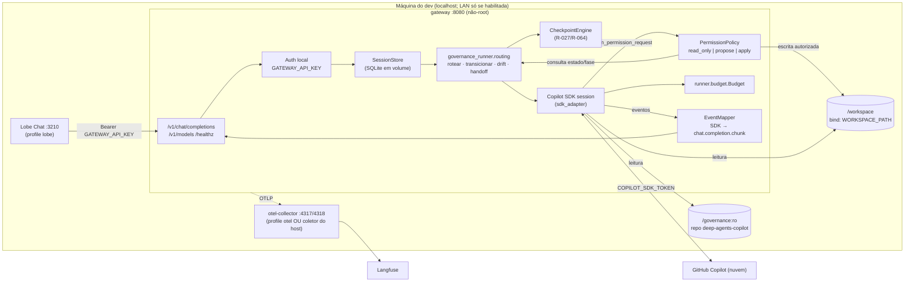

# Technical Blueprint: Gateway Local OpenAI ⇄ Copilot SDK (opt-in, por desenvolvedor)

> **Status**: PROPOSTO · **Data**: 2026-09-29 · **Estado de origem**: `WF4_BLUEPRINT_SPEC` (WORKFLOW-FEATURE-DEVELOPMENT, Etapa 3) · **Autor**: `tech-solution-architect`
> **Reconcilia com**: [`BLUEPRINT_COPILOT_SDK_HEADLESS_RUNNER.md`](./BLUEPRINT_COPILOT_SDK_HEADLESS_RUNNER.md) (reaproveita `governance_runner.routing`, `runner.budget`, `runner.sdk_adapter` como dependência instalada, sem cópia de código)
> **Não-escopo confirmado**: Cline está fora do escopo desta proposta (descartado explicitamente pelo usuário).
> **Destino sugerido de código**: `deploy/local-chat-gateway/` (novo)

---

## Resumo da Solução Técnica

- **Abordagem**: um novo gateway em Python executa a sessão do Copilot SDK. Reaproveita o pacote `governance_runner` (de `tools/headless-governance-runner/`) como dependência instalada — sem copiar código. Expõe o protocolo OpenAI Chat Completions para Lobe Chat (UI exclusiva consolidada). É um **executor com regras aplicadas em código**, não um proxy passivo de texto.
- **Componentes reaproveitados**: `routing.router.rotear`, `routing.state_machine.transicionar`, `routing.handoff.validar_handoff`, `routing.drift.detectar_deriva`, `runner.budget.Budget` (`GOV_MAX_PREMIUM_REQUESTS`, `TETO_TURNOS_R060=5`), `runner.sdk_adapter` (`criar_cliente_sdk_real`, `SDKAuthenticationError`, `construir_permission_handler_read_only`), coletor `tools/otel-langfuse` (portas 4317/4318, processador `transform/redact-secrets`).
- **Componentes novos**: `deploy/local-chat-gateway/` (`docker-compose.yml`, `Dockerfile`, `.env.example`) + pacote Python `local_chat_gateway`.

### Correções à Premissa Original (achado do arch-advisor)

1. **`ToolCallData`** não é tratado hoje pelo `sdk_adapter.py` — ele só consome `AssistantMessageData` e `SessionIdleData`. O `EventMapper` precisa assinar esse evento adicionalmente, só para exibição na UI.
2. **Quem barra a tool call é o callback `on_permission_request`**, não um evento — a decisão de allow/deny acontece ali, não no stream de eventos.
3. **O handler de permissão existente é somente-leitura** — agents que alteram arquivos exigem um `PermissionPolicy` novo (`read_only`/`propose`/`apply`), composto ao lado do handler read-only existente, sem alterá-lo.

---

## 1) Contexto

Mesmo espírito do **R-043 (Local Overlay Pattern)**: 1 dev = 1 token Copilot pessoal = 1 stack local. Opt-in, gitignored, **nunca multi-tenant, nunca token compartilhado, nunca exposto publicamente por padrão**.

**Problema a resolver**: a governança (roteamento R-037, deriva R-042, transições R-050, orçamento R-060) hoje só é aplicada em código dentro do runner headless de CI. UIs de chat genéricas (como Lobe Chat) não têm contexto de workspace nem quick-pick nativo para `ask_questions`.

---

## 2) Opções Consideradas e Tabela de Decisão

| Critério | Peso | O1 Gateway Python próprio | O2 LiteLLM + provider custom | O3 Proxy passivo p/ `api.githubcopilot.com` | O4 Servidor MCP exposto às UIs |
|---|---|---|---|---|---|
| Aplica R-037/R-042/R-050 em código antes de alterar arquivos | 0,30 | 5 | 3 | 0 | 2 |
| Reuso do código existente (routing, budget, auth) | 0,20 | 5 | 2 | 0 | 3 |
| Compatibilidade nativa com Lobe Chat | 0,15 | 5 | 5 | 5 | 1 |
| Superfície de segurança (token, rede) | 0,15 | 4 | 3 | 2 | 3 |
| Custo operacional e dependências | 0,10 | 4 | 2 | 5 | 3 |
| Aderência ao ToS e uso oficial do SDK | 0,10 | 5 | 4 | 1 | 4 |
| **Total ponderado** | 1,00 | **4,75** | 3,10 | 1,55 | 2,50 |

**Decisão**: O1. O3 vetado — proxy passivo viola diretamente o objetivo de enforcement mecânico (Seção 7).

---

## 3) Arquitetura



### 3.1) Serviços do `docker-compose.yml`

| Serviço | Imagem | Profile | Porta (host) | Notas |
|---|---|---|---|---|
| `gateway` | build local multi-stage (`builder` → `runtime` slim, `USER 10001`) | sempre ativo | `127.0.0.1:${GATEWAY_PORT:-8080}:8080` | healthcheck `GET /healthz`; `read_only: true` + `tmpfs /tmp`; `cap_drop: [ALL]`; `no-new-privileges` |
| `lobe-chat` | `lobehub/lobe-chat:<versão fixada>` | `lobe` | `127.0.0.1:3210:3210` | `OPENAI_PROXY_URL=http://gateway:8080/v1`, `OPENAI_API_KEY=${GATEWAY_API_KEY}`, `ACCESS_CODE` obrigatório |
| `otel-collector` | `otel/opentelemetry-collector-contrib:<versão fixada>` | `otel` | sem porta no host | monta `../../tools/otel-langfuse/otel-collector-config.yaml:ro`, sem config duplicada |

**Regras gerais**: rede bridge interna própria; toda porta publicada vai em `127.0.0.1` por padrão (LAN só via `GATEWAY_BIND=0.0.0.0` explícito no `.env`, com aviso no README); build context = raiz do repo (instala `tools/headless-governance-runner[sdk]`).

### 3.2) `.env.example` (sem dado real)

| Variável | Padrão | Finalidade |
|---|---|---|
| `COPILOT_SDK_TOKEN_FILE` | `./secrets/copilot_token` | Docker secret (preferido a env var); gitignored |
| `GATEWAY_API_KEY` | `change-me` | Bearer UI↔gateway; recusa subir se valor for `change-me` |
| `GATEWAY_BIND` / `GATEWAY_PORT` | `127.0.0.1` / `8080` | Exposição de rede |
| `WORKSPACE_PATH` | *(vazio, obrigatório p/ escrita)* | Repositório-alvo local |
| `PROJECTS_LOCAL_YAML` | `../../projects.local.yaml` | Tradução de `root_path` (R-043) |
| `GATEWAY_PERMISSION_MODE` | `read_only` | `read_only` \| `propose` \| `apply` |
| `GOV_MAX_PREMIUM_REQUESTS` | `15` | Por sessão (reusa `budget.py`) |
| `GATEWAY_MAX_PREMIUM_PER_DAY` | `100` | Teto diário local |
| `GATEWAY_REQUEST_TIMEOUT_S` / `GATEWAY_SESSION_TTL_S` | `300` / `1800` | Timeouts |
| `OTEL_EXPORTER_OTLP_ENDPOINT` | *(vazio = desligado)* | `http://otel-collector:4318` ou `http://host.docker.internal:4318` |
| `COPILOT_MODEL` | *(padrão do SDK)* | Modelo de LLM subjacente |

`.gitignore` do diretório: `.env`, `secrets/`, `data/`.

---

## 4) Contrato do Adapter OpenAI ⇄ Copilot SDK (Spec-First)

Endpoints: `GET /v1/models` (lista apenas `deep-agents/router` — sem "modelo por agent" que permita contornar a triagem R-037), `POST /v1/chat/completions` (streaming SSE e não-streaming), `GET /healthz` (sem auth, não chama o Copilot).

Schemas principais: `ChatMessage`, `ChatCompletionRequest`, `ChatCompletion`, `ChatCompletionChunk`, `Error` (`authentication_error`, `invalid_request_error`, `rate_limit_error`, `governance_error`, `timeout_error`, `server_error`).

### 4.1) Mapeamento de Eventos do SDK → SSE

| Evento do SDK | Saída SSE | Regra |
|---|---|---|
| Início da requisição | chunk `delta.role=assistant` + banner `Agente Ativo: <agent>` (R-042) | 1º chunk |
| `AssistantMessageData` | `delta.content=<texto>` | Um chunk por evento, sem buffer |
| Evento de tool (nome de classe a confirmar — RT-01) | `delta.content="\n> 🔧 tool: <nome> (<allow\|deny>)\n"` | Só exibição; decisão real é do `on_permission_request` |
| Negação no callback de permissão | `delta.content="> ⛔ negado: <motivo/regra>"` | Não encerra o stream |
| Checkpoint emitido | bloco de checkpoint (Seção 5) + `finish_reason=stop` | Sessão passa a `AGUARDANDO_CHECKPOINT` |
| `SessionIdleData` | chunk `finish_reason=stop` + `data: [DONE]` | Encerramento normal |
| Budget esgotado | `delta.content="> budget_exhausted"` + `finish_reason=length` + `[DONE]` | R-060 |
| `SDKAuthenticationError` (antes/depois do 1º chunk) | HTTP 401 JSON ou chunk de erro + `[DONE]` | — |
| Timeout | idem, `timeout_error`/504 | — |

**Identidade de sessão**: rodapé `‹dac:sess=<id8>›` em toda resposta do assistente + fallback por hash (`sha256(1ª mensagem + created)`). Estado (`Sessao`, `Budget`, checkpoints) em SQLite no volume `gateway-data`, TTL `GATEWAY_SESSION_TTL_S`.

---

## 5) Fallback de `ask_questions` (R-027/R-064)

```text
🛑 CHECKPOINT HUMANO [cp-7f3a] — R-027
Pergunta: Aplicar as 3 alterações propostas em src/…?
  1) Aprovar e aplicar
  2) Rejeitar
  3) Ajustar escopo
  0) Outro — responda "0: <texto livre>"
Responda com UMA linha: "cp-7f3a 1" (ID opcional se houver só um checkpoint aberto).
```

- **Gramática de parsing** (`CheckpointEngine`, função pura testável): `^\s*(cp-[0-9a-f]{4}\s+)?([0-9]+)(\s*:\s*(.+))?\s*$`
- **Invariante 11**: respostas vagas ("prossiga", "continue", "ok", "sim") ou fora da gramática **não resolvem o checkpoint** — a pergunta é reemitida sem mudança, consumindo **zero premium requests** (resposta local).
- **Bloqueio duro**: com checkpoint aberto, `PermissionPolicy` nega qualquer escrita (HTTP 409 em modo não-stream).

---

## 6) Modelo de Workspace para Agents Mutadores

- **Montagens**: `${WORKSPACE_PATH}` → `/workspace` (leitura/escrita); repo `deep-agents-copilot` → `/governance:ro`. Sem `WORKSPACE_PATH`, força `read_only`.
- **R-043**: gateway lê `projects.local.yaml`, traduz `root_path` (incl. Windows `D:\…`) → `/workspace`. Só aceita o projeto cujo `root_path` corresponde ao `WORKSPACE_PATH` montado; demais são recusados (`governance_error: project_not_mounted`).

| Modo | Leitura | Escrita | Shell/rede | Git |
|---|---|---|---|---|
| `read_only` (padrão) | `/workspace`, `/governance` | ❌ | ❌ | ❌ |
| `propose` | idem | ❌ executa; ✅ gera diff como checkpoint | ❌ | ❌ |
| `apply` | idem | ✅ só se as 4 guardas passarem | ❌ | ❌ (commit fica com o dev) |

**As 4 guardas de escrita em `apply`**: (1) fase atual permite escrita (R-050); (2) `detectar_deriva() is None` (R-042); (3) nenhum checkpoint aberto (R-027); (4) caminho resolvido (`realpath`) dentro de `/workspace`, fora de `.git/`, `.env*`, `secrets/`, `**/*.pem`.

---

## 7) Aplicação do Motor de Roteamento

Pipeline por requisição (nunca proxy passivo):

```
auth local → carregar Sessao → CheckpointEngine (se aberto)
  → rotear() (1º turno) ou detectar_deriva()
  → transicionar()
  → abrir sessão SDK (on_permission_request=PermissionPolicy, tool delegar())
  → stream
```

`TransicaoInvalidaError`/`HandoffPayloadInvalidoError` viram `governance_error` (409) — nunca ignoradas. `routing-graph.yaml` compilado uma vez no startup; falha de schema → `/healthz` retorna 503.

---

## 8) Budget e Limites (R-060)

- `Budget(max_premium_requests=GOV_MAX_PREMIUM_REQUESTS)` por sessão, persistido; `TETO_TURNOS_R060=5` por ciclo de chat (não por sessão inteira).
- Acumulador diário `GATEWAY_MAX_PREMIUM_PER_DAY` em SQLite → 429 ao estourar.
- Timeouts cancelam sessão SDK; sessões ociosas > `GATEWAY_SESSION_TTL_S` são expurgadas.
- Reusa heurística de `_ClienteSDKReal.invoke()` para mapear 401/403/expirado → `authentication_error`. Token nunca é logado. Startup falha rápido se secret ausente/vazio.

---

## 9) Observabilidade

Sem novo pipeline — spans OTLP (`gen_ai.*` + `dac.session_id`, `dac.agent`, `dac.state`, `dac.permission_decision`, `dac.premium_requests`) para (a) coletor do host via `host.docker.internal:4318` ou (b) profile `otel` (mesmo `otel-collector-config.yaml`, somente leitura). Endpoint vazio = telemetria desligada, gateway funciona normalmente.

---

## 10) Matriz de Riscos Técnicos

| ID | Risco | Prob. | Impacto | Mitigação |
|---|---|---|---|---|
| RT-01 | SDK Python exige Copilot CLI + Node, ou nomes de classe de evento de tool diferem | Alta | Alto | Spike via `@deep-search` antes da Fase 1; incluir CLI no runtime; testes de contrato do `EventMapper` |
| RT-02 | Outro processo na LAN consome a cota do dev | Média | Alto | Bind `127.0.0.1` por padrão; `GATEWAY_API_KEY` obrigatório; recusa subir com `change-me` |
| RT-03 | Escrita fora do workspace (path traversal, symlink) | Baixa | Crítico | `realpath` + allowlist; container `read_only`; `cap_drop ALL`; UID não-root |
| RT-04 | Identidade de sessão perdida (UI edita/regenera histórico) | Média | Médio | Rodapé `dac:sess` + fallback hash; sem correspondência → nova sessão (`rotear()` seguro por padrão) |
| RT-05 | Resposta vaga aprova checkpoint | Média | Alto | Gramática estrita + Invariante 11 com teste obrigatório |
| RT-06 | Vazamento de token em log/trace | Baixa | Crítico | Docker secret; redação no gateway e coletor; teste de varredura de logs |
| RT-07 | Deriva de versão Lobe Chat quebra consumo SSE | Média | Médio | Tags fixadas; smoke test de SSE no aceite |
| RT-08 | ToS/uso do token Copilot fora da IDE | Baixa | Alto | Uso oficial via SDK, token pessoal, sem compartilhamento; nota no README |
| RT-09 | Caminhos Windows/bind mounts (Docker Desktop) | Média | Baixo | Tradução `root_path` testada com `D:\…`; documentar WSL2 |

### 10.1) Não-Escopo Explícito

- ❌ Multi-tenant, token compartilhado, SSO, gestão de usuários.
- ❌ Exposição pública/internet — sem TLS/ingress; LAN só via opt-in explícito.
- ❌ Substituir a IDE — sem edição inline, diff interativo, debugging.
- ❌ Git automatizado (commit/push/PR) e execução de shell pelo agent.
- ❌ Customização de código no Lobe Chat.
- ❌ **Cline** (descartado explicitamente).
- ❌ Alterar o runner de CI (`cli.py`, `use_cases.py`) além de adições compatíveis ao pacote.

---

## 11) Context Firewall — Divisão de Tarefas

### [BACKEND_TASKS]

1. **Spike RT-01** — confirmar requisitos de runtime do `github-copilot-sdk` e nomes das classes de evento de tool. Responsável: `@deep-search`.
2. **Pacote `local_chat_gateway`** — endpoints conforme Seção 4, auth Bearer local.
3. **`EventMapper`** — eventos SDK → `chat.completion.chunk` (Seção 4.1), testes de contrato por fixture.
4. **`PermissionPolicy`** — `read_only`/`propose`/`apply` com as 4 guardas (Seção 6); adição compatível ao lado do handler read-only existente.
5. **`CheckpointEngine`** — gramática (Seção 5) e Invariante 11, função pura testável.
6. **`SessionStore` em SQLite** — `Sessao`, `Budget` persistido, teto diário, TTL.
7. **Resolver R-043** — `projects.local.yaml` → `/workspace`, incl. caminhos Windows.
8. **`deploy/local-chat-gateway/`** — Dockerfile multi-stage não-root, docker-compose com profiles, healthchecks, `.env.example`, `.gitignore`. Seguir `devops.instructions.md`.
9. **Telemetria OTLP opcional** — atributos `dac.*`, reusando `otel-collector-config.yaml`.
10. **Estratégia de testes** — pirâmide + casos críticos RT-02/03/05/06. Responsável: `@test-strategy`.
11. **README e ADR** — `deploy/local-chat-gateway/README.md` + ADR MADR. Responsável: `@docs-engineer`.

### [FRONTEND_TASKS]

1. **Nenhuma customização de código** — Lobe Chat é consumidor padrão da API OpenAI; apenas configuração declarativa via compose (já coberta na tarefa 8 do backend).
2. **Smoke manual por UI** — listar modelo `deep-agents/router`, streaming, renderização de checkpoint, erro 401 (parte do checklist de aceite).

---

## 12) Decisões Fechadas (Checkpoint Humano — 2026-09-29)

- **D1 — Modo de permissão padrão**: ✅ `read_only`. Nenhuma escrita em arquivo é permitida no MVP; só leitura/consulta/roteamento.
- **D2 — Persistência de sessão**: ✅ SQLite em volume. Estado (`Sessao`/`Budget`/checkpoints) sobrevive a restart do container.
- **D3 — Framework HTTP**: ✅ FastAPI + uvicorn.
- **D4 — UIs no MVP**: ✅ Apenas **Lobe Chat** (`docker-compose --profile lobe`). Lobe Chat consolidado como UI visual local exclusiva.
- **Fase 0 aprovada**: spike RT-01 via `@deep-search` (Seção 14).

---

## 13) Checklist de Aceite

- [ ] `docker compose --profile lobe up` sobe com healthchecks verdes em até 60s; recusa subir com `GATEWAY_API_KEY=change-me` ou secret ausente.
- [ ] Portas expostas só em `127.0.0.1` com `.env` padrão.
- [ ] Requisição sem Bearer → 401; token Copilot inválido → 401 `copilot_token_invalid` ou chunk de erro + `[DONE]`.
- [ ] `/v1/models` lista apenas `deep-agents/router`.
- [ ] 1º chunk SSE traz banner `Agente Ativo:`; stream termina com `finish_reason` + `[DONE]`.
- [ ] Em `read_only`, 100% das escritas negadas e exibidas como `⛔`.
- [ ] Em `apply`, escrita fora de `/workspace` (incl. symlink/`..`) negada; escrita com checkpoint aberto negada (409).
- [ ] Respostas vagas não resolvem checkpoint e consomem 0 premium requests.
- [ ] Transição inválida gera `governance_error` com a regra citada; deriva R-042 bloqueia continuidade.
- [ ] 16º premium request (padrão 15) → `budget_exhausted`/429; 6º tool turn do ciclo é encerrado (R-060).
- [ ] Timeout cancela sessão SDK, retorna 504/`timeout_error`.
- [ ] Varredura de logs/traces: zero ocorrências de padrões PAT/OAuth/Bearer.
- [ ] Com profile `otel` (ou coletor do host), spans com `dac.session_id` chegam ao Langfuse; sem endpoint, gateway funciona normalmente.
- [ ] `git status` limpo após uso — `.env`, `secrets/`, `data/` ignorados.
- [ ] Smoke no Lobe Chat aprovado com tags fixadas.
- [ ] Suíte existente de `tools/headless-governance-runner` continua 100% verde (zero regressão).

---

## 14) Spike RT-01 — Resultado (`@deep-search`, 2026-09-29)

Confiança: **média** (0.68) — achados concretos com fonte citada, 3 lacunas explícitas declaradas (nunca especuladas).

| # | Pergunta | Resultado | Fonte |
|---|---|---|---|
| 1 | Requisitos de runtime (CLI/Node.js) | **Não precisa de Node.js.** O SDK Python **empacota (bundle) o runtime/CLI automaticamente** — só Go/Java/Rust exigem instalação manual do binário. `python -m copilot download-runtime` é **pré-download opcional** (evita fetch no 1º uso), não dependência externa separada. | README oficial `github/copilot-sdk`; mcpservers.org |
| 2 | Evento de tool call | Existe par dedicado: `tool.execution_start` / `tool.execution_complete`. Também há `assistant.message_delta` (streaming), `assistant.reasoning`/`reasoning_delta`, `session.error`. | mcpservers.org/agent-skills/github/copilot-sdk |
| 3 | Callback de permissão | Confirmado `on_permission_request` em `create_session(...)`, handler compatível com `PermissionHandler` (ex.: `PermissionHandler.approve_all`). `sdk_adapter.py` local já retorna `{"permissionDecision": "allow"\|"deny"}`. | README Python oficial; `sdk_adapter.py` (código local) |
| 4 | Streaming nativo | **Confirmado** — `assistant.message_delta` é streaming token-a-token real, distinto de `assistant.message` (bloco completo). Mapeia 1:1 para SSE. | mcpservers.org; github.blog changelog GA (2026-06-02) |
| 5 | Autenticação | Reconfirmado `CopilotClient(github_token=...)` com PAT pessoal (mesmo mecanismo já validado em produção, `CHANGELOG.md:42`). Também há suporte a `GITHUB_TOKEN` de Actions com política org habilitada — não aplicável ao MVP local (1 dev = 1 PAT pessoal, D1-D4). | dev.to/pwd9000; `CHANGELOG.md:42` |

### 14.1) Lacunas Declaradas (validar por inspeção de runtime antes de codificar)

1. **Tamanho de imagem Docker / versão mínima do runtime bundled** — não documentado publicamente; medir empiricamente (`docker images --format` pós-build).
2. **Nome exato da classe Python do evento de tool call** — README cita `Tool`/`ToolInvocation`/`ToolResult` como *tipos de definição*, não como *classe de evento*. Validar via `python -c "import copilot; print(dir(copilot))"` antes de escrever o `EventMapper`.
3. **Suporte nativo a `"ask"` e composição de múltiplos `on_permission_request`** — não confirmado; tratar como **não suportado nativamente** até prova em contrário — o `PermissionPolicy` (Seção 6) deve ser um único handler agregador que decide internamente (mesmo padrão de `construir_permission_handler_read_only`), nunca assumir chaining nativo.

### 14.2) Ajuste ao Blueprint com Base no Spike

- **Seção 4.1 (mapeamento de eventos)** deve renomear a linha genérica "Evento de tool (nome a confirmar)" para os 2 eventos reais: `tool.execution_start` → chunk `🔧 tool: <nome> (iniciando)`; `tool.execution_complete` → chunk com resultado + decisão do `on_permission_request`.
- **Ganho não previsto**: como `assistant.message_delta` já é streaming nativo, o `EventMapper` **não precisa bufferizar** blocos completos — mapeamento 1:1 delta→chunk SSE, simplificando a Tarefa 3 do backend.
- **Dockerfile (Tarefa 8)**: adicionar passo de medição de tamanho de imagem ao checklist de aceite (Seção 13) como item de validação, já que não há número de referência publicado.

## Próximo Passo

1. ~~Checkpoint humano D1–D4~~ ✅ Concluído (Seção 12).
2. ~~Spike RT-01~~ ✅ Concluído (Seção 14) — confiança média, 3 lacunas de nomenclatura a validar por inspeção de runtime na Fase 1 de implementação.
3. Handoff para `@agent-router` — Tarefa 2 do backend (pacote `local_chat_gateway`, endpoints FastAPI) como próxima fase, já com D1 (`read_only`), D2 (SQLite), D3 (FastAPI+uvicorn) e D4 (Lobe Chat) fechados.

