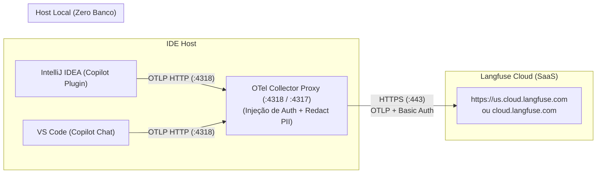

# Guia de Configuração: Telemetria OpenTelemetry (GitHub Copilot + Langfuse Cloud)

Este documento orienta a configuração da telemetria de Coding Agents (**GitHub Copilot** e **Claude Code**) no **IntelliJ IDEA** e no **VS Code**, exportando traces e métricas com **OpenTelemetry (OTel)** e visualizando em tempo real no **Langfuse Cloud**.

> [!WARNING]
> **Limitação Conhecida (Known Issue - GitHub Copilot no IntelliJ IDEA)**:
> A exportação nativa de telemetria OTel via plugin do GitHub Copilot no **IntelliJ IDEA** (JetBrains) ainda **não está funcional** — a IDE não emite os traces/spans esperados para o coletor local (`http://127.0.0.1:4318`), mesmo com a opção habilitada nas configurações.
> 
> **Status dos Componentes:**
> - ✅ **OTel Collector Proxy Local**: Totalmente testado, operacional e validado.
> - ✅ **Langfuse Cloud (SaaS)**: Recepção de traces, visualização e métricas 100% operacionais.
> - ✅ **Testes Sintéticos**: Validados com sucesso via scripts (`node tools/otel-langfuse/test-trace.js` e `python tools/otel-langfuse/test_trace.py`).
> - ⚠️ **GitHub Copilot (IntelliJ IDEA)**: Emissão nativa pendente de correção/suporte pelo plugin oficial da JetBrains/GitHub.
> - ℹ️ **GitHub Copilot (VS Code)**: Suporte documentado via `settings.json`.

---

## 🏛️ Topologia de Telemetria (Zero Footprint Local)

Para evitar consumo excessivo de CPU e memória RAM na máquina de desenvolvimento (evitando contêineres pesados como PostgreSQL, ClickHouse, Redis e MinIO locais), a arquitetura utiliza o **OTel Collector Proxy Local** despachando via HTTPS diretamente para o **Langfuse Cloud** (plano gratuito oficial de até 50.000 traces/mês):



---

## 1. Pré-requisito: Subir o Proxy OTel Local (~45 MB de RAM, 0% CPU)

O proxy local é necessário porque os plugins de IDE operam em processos isolados que não devem expor nem gerenciar segredos de nuvem diretamente. O proxy injeta automaticamente o cabeçalho `Authorization: Basic ...` e normaliza os atributos semânticos para o padrão `gen_ai.*` (Semconv v1.41+).

### 1.1 Obter as Chaves no Langfuse Cloud
1. Crie sua conta gratuita em **[cloud.langfuse.com](https://cloud.langfuse.com)** (ou `us.cloud.langfuse.com`).
2. Vá em **Settings → API Keys** e gere seu par:
   - **Public Key**: `pk-lf-...`
   - **Secret Key**: `sk-lf-...`
3. Gere o Base64 de `public_key:secret_key`:
   - **Git Bash / Linux / macOS**:
     ```bash
     echo -n "pk-lf-xxx:sk-lf-yyy" | base64
     ```
   - **PowerShell (Windows)**:
     ```powershell
     [Convert]::ToBase64String([Text.Encoding]::UTF8.GetBytes("pk-lf-xxx:sk-lf-yyy"))
     ```

### 1.2 Iniciar o Proxy via Docker

Execute no terminal (Git Bash no Windows):
```bash
MSYS_NO_PATHCONV=1 docker run -d \
  --name otel-proxy \
  --restart unless-stopped \
  -p 4318:4318 -p 4317:4317 \
  -e LANGFUSE_OTLP_AUTH="<seu_token_base64>" \
  -v "d:/workspace/deep-agents-copilot/tools/otel-langfuse/otel-collector-config.yaml:/etc/otelcol-contrib/config.yaml:ro" \
  otel/opentelemetry-collector-contrib:latest \
  --config=/etc/otelcol-contrib/config.yaml
```
*(No Linux ou macOS, substitua o caminho de volume por `"$(pwd)/tools/otel-langfuse/otel-collector-config.yaml"`)*.

---

## 2. Configuração no IntelliJ IDEA (Em Avaliação / Inoperante)

> [!CAUTION]
> **Status de Emissão no IntelliJ IDEA: Não Funcional**
> Apesar de a interface do plugin disponibilizar os campos de configuração de Open Telemetry abaixo, testes locais confirmam que a versão atual do plugin do GitHub Copilot para JetBrains **não despacha requisições OTLP** para o endpoint configurado. A configuração abaixo reflete os parâmetros formais esperados para quando a funcionalidade for estabilizada pelo mantenedor.

No IntelliJ IDEA (versões 2025.x / 2026.x):

1. Abra **File → Settings** (atalho `Ctrl + Alt + S`).
2. Navegue até **Tools → GitHub Copilot → Chat → Open Telemetry**.
3. Configure os campos exatamente como abaixo:

| Campo na Tela | Valor | Descrição |
|---|---|---|
| **Enable Open Telemetry export** | `[x]` Marcado | Habilita a emissão de traces do Copilot |
| **Exporter type** | `otlp-http` | Protocolo HTTP |
| **OTLP protocol** | `http/json` | Serialização JSON suportada pelo Coletor |
| **OTLP endpoint** | `http://127.0.0.1:4318` | Endereço do proxy local (usar `127.0.0.1` evita problemas de IPv6 no Windows) |
| **Output file** | *(deixar vazio)* | O envio é feito via HTTP local |
| **Capture prompt/response content** | `[x]` Marcado | Registra o texto dos prompts e respostas no Langfuse |
| **Service name** | `deep-agents-copilot` | Identificador do projeto |
| **Resource attributes** | *(vazio / sem linhas)* | A autenticação é provida pelo proxy local |

4. Clique em **Apply** e **OK**.
5. **Reinicie o IntelliJ** (**File → Exit** e abra novamente) para ativar o cliente OTel.

---

## 3. Configuração no VS Code

No VS Code, as configurações do GitHub Copilot Chat OTel são definidas em `settings.json`:

1. Abra as configurações do VS Code (`Ctrl + ,` ou `Cmd + ,`).
2. Clique no ícone de **Open Settings (JSON)** no canto superior direito.
3. Adicione ou ajuste o bloco de telemetria do Copilot:

```json
{
  "github.copilot.chat.otel.enabled": true,
  "github.copilot.chat.otel.exporterType": "otlp-http",
  "github.copilot.chat.otel.otlpEndpoint": "http://127.0.0.1:4318",
  "github.copilot.chat.otel.protocol": "http/json",
  "github.copilot.chat.otel.serviceName": "deep-agents-copilot",
  "github.copilot.chat.otel.captureContent": true
}
```

4. Salve o arquivo e recarregue a janela (`Developer: Reload Window` no painel de comandos `Ctrl + Shift + P`).

---

## 4. Validação e Testes de Conexão

### 4.1 Teste Sintético via Script
No terminal do projeto:
```bash
node tools/otel-langfuse/test-trace.js
```
Saída esperada:
```text
📡 Enviando spans de teste (invoke_agent + execute_tool MCP) para http://localhost:4318/v1/traces ...
✅ Sucesso! Status HTTP: 200
OTel Collector recebeu os spans e despachou para o Langfuse Cloud.
Acesse https://cloud.langfuse.com para visualizar o trace no dashboard.
```

### 4.2 Teste com o Copilot Chat
> [!NOTE]
> Devido à limitação conhecida mencionada no início deste guia, os testes disparados a partir do **IntelliJ IDEA** não registrarão spans no momento. Utilize o **VS Code** ou os **scripts de teste sintético** para verificar o pipeline fim a fim.

1. Abra o painel do Copilot Chat no IntelliJ ou no VS Code.
2. Envie qualquer comando (ex.: *"Explique este arquivo"*).
3. Abra **[cloud.langfuse.com](https://cloud.langfuse.com)** (ou `us.cloud.langfuse.com`), selecione seu projeto e clique na aba **Tracing**:
   - Os traces `chat`, `invoke_agent` e `execute_tool` estarão listados em tempo real com contagem de tokens, latência e conteúdo dos turnos.

