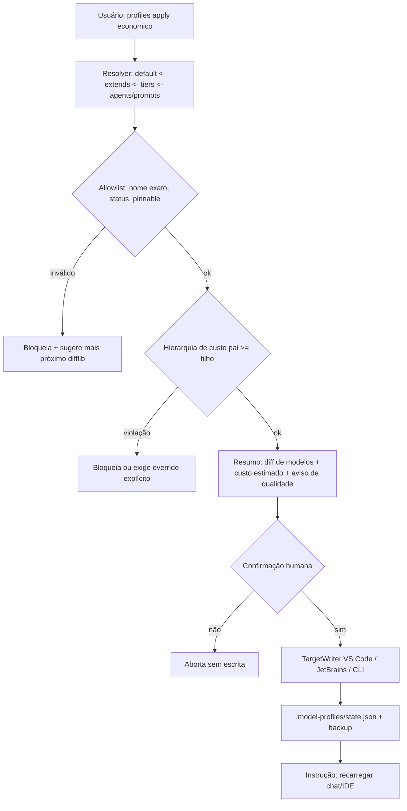

Agente Ativo: tech-solution-architect
[CURRENT_STATE_LOCK: WF4_BLUEPRINT_SPEC]

# Plano de Implementação Técnica — Perfis de Modelo (model-profiles) + Allowlist de Modelos

> **Status: APPROVED (2026-10-10).** Ondas B0–B3 concluídas; pendente apenas validação manual do usuário (suíte completa, required check no branch protection, validação visual na IDE de T-B0.1/B0.3/B0.4).

## 1. Contexto, objetivo e decisões humanas vigentes

**Objetivo:** permitir ao usuário controlar o custo dos modelos usados por agents (`.agent.md`) e prompts (`.prompt.md`) via perfis pré-definidos (`default`, `economico`, `balanceado`) ou customizados, **sem alterar o padrão consolidado** (perfil `default` == frontmatters atuais). Alvos: **JetBrains e VS Code** (Copilot CLI não pode quebrar).

**Linha de base real (evidência `@codegraph-engine`, 2026-10-10)** — 88 arquivos com `model:`:

| Modelo atual | Agents | Prompts | Total | Observação |
|---|---|---|---|---|
| `Claude Opus 5.5` | 2 (`tech-solution-architect`, `debugger`) | 0 | 2 | ambos com `model_exception_reason` (R-021) |
| `Claude Sonnet 5.5` | 52 (inclui 2 templates) | 5 | 57 | routers, advisors, developers |
| `Gemini 3.8 Flash` | 11 (inclui 2 templates) | 18 | 29 | operacionais, test-writers, ctx-* |

> Nota: o insumo citava ~25 Sonnet / ~12 Gemini; a contagem real é maior (agents de stack + prompts). O teste de paridade (T-B1.6) usa a contagem real dinâmica, não números fixos.

**Decisões já tomadas (não reabrir sem nova aprovação):**
- D1. `model:` não é dinâmico; arrays de fallback funcionam só no VS Code e quebram o Copilot CLI ⇒ **sempre string única**.
- D2. Fonte única `model-profiles.yaml` (built-in, versionado) + `model-profiles.local.yaml` (custom, gitignored, R-043) com chaves `extends`, `tiers`, `agents`, `prompts`. Precedência: **`agents`/`prompts` > `tiers` > `extends` > `default`**.
- D3. Gerador em `tools/` no padrão `governance_sync` (`--check`/`--dry-run`/`--apply`, `SyncReport`), com comandos `profiles list|apply|status|restore|init|doctor`.
- D4. Variantes gravadas com model string única em **nível de usuário ou diretório gitignored**, **sem tocar** canônicos em `.github/`.
- D5. `apply` exibe resumo + aviso de perda de qualidade + confirmação explícita antes de gravar.
- D6. Regra de hierarquia de custo: **subagent não pode usar modelo de custo maior que o pai** ⇒ perfis rebaixados também rebaixam orquestrador/routers.
- D7. A cada troca: reaplicar + recarregar o chat (VS Code: `Developer: Reload Window`/novo chat; JetBrains: reabrir Copilot Chat).
- D8. Validação de modelo em 3 camadas (allowlist versionada; job agendado de refresh; checagem online opcional/manual). Frescor: `verified_at` > 30 dias ⇒ aviso. Respeitar R-054 (zero discovery em runtime por agents/routers).
- D9. Whitelist premium existente (`ALLOWED_PREMIUM_AGENTS` em `tests/governance_audit/test_agent_model_tier_governance.py`) continua valendo para os canônicos.

**Fora de escopo:** alterar qualquer frontmatter canônico, `catalog.yaml`/subcatálogos, agentcards, `deploy/local-chat-gateway`; chamar API não oficial de modelos; escolher modelo dinamicamente em runtime.

## 2. Blueprint técnico

### 2.1 Componentes

| Componente | Tipo | Versionado | Papel |
|---|---|---|---|
| `model-allowlist.yaml` | dado | sim | SSOT de nomes válidos de modelo (camada 1) |
| `model-profiles.yaml` | dado | sim | perfis built-in `default`/`balanceado`/`economico` + mapa agent→tier |
| `model-profiles.local.yaml` | dado | **não** (gitignored, R-043) | perfis custom do usuário |
| `model-profiles.local.yaml.example` | dado | sim | exemplo comentado para `profiles init` |
| `tools/model_profiles/` | CLI Python | sim | resolver + gerador de variantes + doctor |
| `tools/model_allowlist/` | CLI Python | sim | validação e refresh da allowlist (camada 2) |
| `.model-profiles/` (raiz, gitignored) | saída | não | estado (`state.json`), backups, variantes geradas (quando alvo = diretório local) |
| `.github/workflows/model-allowlist-refresh.yml` | CI agendado | sim | parse da página oficial → PR com diff |

### 2.2 Fluxo



### 2.3 Modelo de tiers (mapa agent → tier, derivado do default)

| Tier | Membros (default) | Regra |
|---|---|---|
| `premium` | `tech-solution-architect`, `debugger` | únicos com `model_exception_reason` |
| `orchestration` | `agent-router`, `*-router` (7 stacks), prompt `agent-router` | pai de quase todos os subagents |
| `standard` | demais agents/prompts hoje em `Claude Sonnet 5.5` | advisors, developers, planners |
| `light` | agents/prompts hoje em `Gemini 3.8 Flash` | operacionais, test-writers, ctx-* |

O mapa agent→tier é **gerado e verificado** a partir dos frontmatters atuais (teste de paridade); não é digitado à mão.

## 3. Contratos e interfaces (Spec-First)

### 3.1 Schema `model-allowlist.yaml` (esboço)

```yaml
schema_version: 1
verified_at: 2026-10-10          # frescor global; > 30 dias => aviso
freshness_days: 30
sources:
  official: https://docs.github.com/copilot/reference/ai-models/supported-models
models:
  - name: <string, nome EXATO aceito em model:>   # obrigatório, único
    aliases: [<string>]          # ex.: forma qualificada "Nome (copilot)" — pendente T-B0.1
    provider: anthropic|google|openai|xai|github
    status: ga|preview|deprecated|retired|special
    pinnable: true|false         # false => proibido em model: (ex.: Auto)
    retirement_date: <YYYY-MM-DD|null>
    cost:                        # null => pendente de preenchimento
      label: low|medium|high|variable|null
      unit: credits_per_1M_tokens
      input: <int|null>
      output: <int|null>
      cache_read: <int|null>
      cache_write: <int|null>
    cost_rank: <int|null>        # ordinal usado pela regra de hierarquia (D6)
    verified_at: <YYYY-MM-DD>
    source: <url | "jetbrains-model-picker-screenshot@YYYY-MM-DD">
```

Regras de validação: `name` único; `pinnable=false` proíbe uso em `model:`; `status in {retired}` bloqueia; `deprecated` ou `retirement_date` em ≤ 30 dias ⇒ aviso; `cost_rank=null` ⇒ hierarquia de custo não verificável ⇒ `doctor` avisa e `apply` exige confirmação reforçada.

### 3.2 Conteúdo inicial proposto (print do model picker JetBrains, 2026-10-10)

```yaml
models:
  - name: Auto
    provider: github
    status: special
    pinnable: false               # seletor da IDE; não pinável via frontmatter até validação T-B0.4
    cost: { label: variable, unit: credits_per_1M_tokens, input: null, output: null, cache_read: null, cache_write: null }
    cost_rank: null
    verified_at: 2026-10-10
    source: jetbrains-model-picker-screenshot@2026-10-10
  - name: Claude Sonnet 5.5
    provider: anthropic
    status: ga
    pinnable: true
    cost: { label: medium, unit: credits_per_1M_tokens, input: 200, output: 1000, cache_read: 10, cache_write: 250 }
    cost_rank: null               # a definir após preencher custos dos demais
    verified_at: 2026-10-10
    source: jetbrains-model-picker-screenshot@2026-10-10
  - { name: Gemini 3.8 Flash, provider: google,    status: ga, pinnable: true, cost: null, cost_rank: null, verified_at: 2026-10-10, source: jetbrains-model-picker-screenshot@2026-10-10 }
  - { name: Claude Haiku 5.5,  provider: anthropic, status: ga, pinnable: true, cost: null, cost_rank: null, verified_at: 2026-10-10, source: jetbrains-model-picker-screenshot@2026-10-10 }
  - { name: Claude Opus 5.5,   provider: anthropic, status: ga, pinnable: true, cost: null, cost_rank: null, verified_at: 2026-10-10, source: jetbrains-model-picker-screenshot@2026-10-10 }
  - { name: GPT-6.1 Sol,       provider: openai,    status: ga, pinnable: true, cost: null, cost_rank: null, verified_at: 2026-10-10, source: jetbrains-model-picker-screenshot@2026-10-10 }
  - { name: Grok 4.7,          provider: xai,       status: ga, pinnable: true, cost: null, cost_rank: null, verified_at: 2026-10-10, source: jetbrains-model-picker-screenshot@2026-10-10 }
```

`status: ga` dos 6 pináveis é presumido pelo print e deve ser confirmado contra a página oficial (T-B1.2). `cost: null` = pendente de preenchimento (item aberto IA-2).

### 3.3 Schema `model-profiles.yaml` / `model-profiles.local.yaml`

```yaml
schema_version: 1
tier_map:                         # gerado/verificado contra frontmatters atuais
  premium: [tech-solution-architect, debugger]
  orchestration: [agent-router, "*-router", "prompt:agent-router"]
  standard: ["<demais Sonnet>"]
  light: ["<demais Gemini Flash>"]
profiles:
  default:                        # == frontmatters atuais (teste de paridade)
    tiers: { premium: Claude Opus 5.5, orchestration: Claude Sonnet 5.5, standard: Claude Sonnet 5.5, light: Gemini 3.8 Flash }
  balanceado:                     # PROPOSTA — a confirmar (IA-3)
    extends: default
    description: "Remove Opus; mantém Sonnet na orquestração/standard; light em Haiku ou Flash conforme custo"
    quality_warning: "Arquitetura e debug profundo perdem raciocínio premium."
    tiers: { premium: Claude Sonnet 5.5, orchestration: Claude Sonnet 5.5, standard: Claude Sonnet 5.5, light: Gemini 3.8 Flash }
  economico:                      # PROPOSTA — a confirmar (IA-3)
    extends: balanceado
    description: "Rebaixa orquestração e standard (D6) para modelos de menor custo"
    quality_warning: "Roteamento, planos e código podem perder precisão; routers podem errar triagem."
    tiers: { premium: Claude Sonnet 5.5, orchestration: Claude Haiku 5.5, standard: Claude Haiku 5.5, light: Gemini 3.8 Flash }
# model-profiles.local.yaml (gitignored) — exemplo
# profiles:
#   meu-perfil:
#     extends: economico
#     tiers: { standard: Grok 4.7 }
#     agents: { tech-solution-architect: Claude Opus 5.5 }
#     prompts: { commit: Gemini 3.8 Flash }
```

Alternativas de composição a avaliar quando os custos forem preenchidos: `Grok 4.7` ou `GPT-6.1 Sol` em `standard` do `balanceado`; `Gemini 3.8 Flash` em `orchestration` do `economico`. **Nenhum perfil é aprovado sem `cost_rank` dos modelos usados** (gate T-B1.3). Regra D6 é verificada por `cost_rank`: `rank(filho) <= rank(pai)` segundo `routing-graph.yaml`; exceções do `default` (Opus sob router Sonnet) ficam cobertas por `model_exception_reason` e listadas no `doctor` como aceitas.

### 3.4 Contrato da CLI (sem código)

| Comando | Efeito | Escrita |
|---|---|---|
| `profiles list` | lista perfis built-in + locais, tiers resolvidos, custo estimado relativo | não |
| `profiles status` | perfil ativo (`state.json`), alvos gravados, drift vs. canônico, frescor da allowlist | não |
| `profiles apply <perfil> [--target vscode\|jetbrains\|all] [--dry-run] [--yes]` | resolve, valida, mostra resumo + aviso, pede confirmação, grava variantes + backup | sim (fora de `.github/`) |
| `profiles restore` | remove variantes geradas/restaura backup ⇒ volta ao canônico (`default`) | sim |
| `profiles init` | cria `model-profiles.local.yaml` a partir do `.example` (nunca sobrescreve) | sim (gitignored) |
| `profiles doctor [--online]` | valida allowlist, frescor, hierarquia, colisões de nome; `--online` só orienta checagem manual no picker | não |
| `allowlist check` (`--check` padrão CI) | todo `model:` canônico + perfis built-in ∈ allowlist e pináveis | não |

Exit codes seguem `SyncReport.compute_exit_code` (0 ok, 1 drift/erro). `--yes` só é aceito com `--dry-run` previamente executado na mesma versão do perfil (hash em `state.json`).

## 4. Decisão de Design Pattern (mini-ADR — design-pattern-selection-patterns)

### Mini-ADR 1 — Resolução de perfil
- **Contexto:** merge determinístico de 4 camadas (default, extends, tiers, overrides por agent/prompt) com precedência fixa.
- **Decisão:** **nenhum pattern** — função pura de merge em camadas (dict merge ordenado) com detecção de ciclo em `extends`.
- **Alternativas consideradas:** Chain of Responsibility (overengineering para 4 camadas fixas); Decorator por camada (indireção sem ganho).
- **Consequências:** simples, testável por tabela; custo zero de abstração; nova camada exige mudar a função (aceitável).

### Mini-ADR 2 — Escrita por IDE
- **Contexto:** 2–3 destinos (VS Code, JetBrains, Copilot CLI) com locais e regras de precedência distintos, ainda não validados (T-B0).
- **Decisão:** **Strategy** (`TargetWriter` com uma implementação por destino: `locate()`, `write()`, `restore()`, `reload_hint()`).
- **Alternativas consideradas:** if/else por IDE (rejeitado: 3 destinos × 3 operações já dispersam regras); sistema de plugins (rejeitado: anti-overengineering).
- **Consequências:** isola a incerteza de cada IDE; destino inválido é desligável sem afetar os outros; custo: 1 interface + 3 classes pequenas.

### Mini-ADR 3 — Validação de nomes de modelo
- **Contexto:** não há API oficial estável; nome inválido cai silenciosamente no modelo do pai.
- **Decisão:** **nenhum pattern** — allowlist estática versionada + refresh agendado que abre PR (humano no loop).
- **Alternativas consideradas:** consulta online em todo `apply` (rejeitado: depende de plano/política da org e viola R-054); scraping no CI de PR (rejeitado: flakiness bloquearia PRs não relacionados).
- **Consequências:** determinístico e offline; risco de defasagem mitigado por `verified_at` + aviso de 30 dias.

## 5. Alternativas Rejeitadas (Obrigatória)
- **Array de modelos com fallback no frontmatter:** só VS Code; quebra Copilot CLI (D1).
- **Editar frontmatters canônicos in-place (com ou sem `git update-index --skip-worktree`):** viola D4, quebra paridade `catalog.yaml`/R-015 e testes de tier; gera diffs acidentais. Mantida apenas como **fallback condicional** sujeito a nova aprovação se T-B0.2 provar que nenhuma IDE suporta sobreposição sem colisão.
- **Variantes com nome diferente (`agent-router@economico`):** quebra `run_subagent(agentName: ...)` e `routing-graph.yaml`.
- **Selecionar `Auto` via frontmatter:** custo variável/não determinístico; não pinável até validação.
- **Descoberta de modelos em runtime pelos agents:** viola R-054.

## 6. Context Firewall — Divisão de Tarefas por Stack

Legenda: `{paralelizavel: sim|nao, responsavel: @agent}`. Ondas: **B0** (spike de validação, sem código de produto) → **B1** (dados + validação + testes) → **B2** (gerador CLI) → **B3** (automação, CI, docs).

#### [BACKEND_TASKS]

**Onda B0 — Spikes de validação (gate go/no-go para B2)**
- [x] **T-B0.1** Nome de exibição (`Claude Sonnet 5.5`) vs qualificado (`Claude Sonnet 5.5 (copilot)`) em `model:` — testar em VS Code, JetBrains e Copilot CLI; registrar qual forma é aceita em cada um e se o fallback silencioso ocorre. Resultado define `aliases` e a forma canônica (evidência parcial (inferida de docs/config local; confirmar na IDE): B0.1 forma canônica = nome de exibição limpo). `{paralelizavel: sim, responsavel: @runtime-verifier}`
- [x] **T-B0.2** Local e precedência de variantes: (a) VS Code — pasta de agents/prompts de usuário e `chat.agentFilesLocations`/`chat.promptFilesLocations` apontando para `.model-profiles/out/`; (b) JetBrains — suporte a agents/prompts de nível de usuário ou diretório configurável; (c) comportamento em **colisão de nome** com `.github/agents/*` (qual vence, duplica, erro). Sem resultado positivo ⇒ PARAR e reabrir decisão D4 via `ask_questions` (resolvido via T-B0.2-R: JetBrains NO-GO, D4 substituída pela E1). `{paralelizavel: sim, responsavel: @runtime-verifier}`
- [x] **T-B0.3** Confirmar comportamento de nome inválido (cai no modelo do pai?) e necessidade de recarga após troca (D7) em ambas IDEs (evidência parcial (inferida de docs/config local; confirmar na IDE): B0.3 fallback silencioso + recarga). `{paralelizavel: sim, responsavel: @runtime-verifier}`
- [x] **T-B0.4** Verificar se `Auto` é aceito em `model:` (mantém `pinnable: false` até prova) (evidência parcial (inferida de docs/config local; confirmar na IDE): B0.4 Auto não pinável). `{paralelizavel: sim, responsavel: @runtime-verifier}`

**Onda B1 — Dados, allowlist e testes de governança**
- [x] **T-B1.1** Criar `model-allowlist.yaml` com schema §3.1 e conteúdo §3.2 (7 itens). `{paralelizavel: nao, responsavel: @python-developer}`
- [x] **T-B1.2** Conferir status/aposentadoria dos 7 itens na página oficial via `@deep-search` (sem chamada direta) e preencher `source`/`retirement_date`. `{paralelizavel: sim, responsavel: @deep-search}`
- [x] **T-B1.3** Preencher `cost`/`cost_rank` dos 6 modelos pendentes (fonte oficial ou picker) — gate para aprovar `balanceado`/`economico`. `{paralelizavel: sim, responsavel: humano + @deep-search}`
- [x] **T-B1.4** Criar `model-profiles.yaml` (§3.3) com `tier_map` gerado dos frontmatters atuais e `model-profiles.local.yaml.example`. `{paralelizavel: nao, responsavel: @python-developer}`
- [x] **T-B1.5** `.gitignore`: adicionar `model-profiles.local.yaml` e `.model-profiles/` na seção R-043 (caminhos literais, padrão atual). `{paralelizavel: sim, responsavel: @python-developer}`
- [x] **T-B1.6** `tests/governance_audit/test_model_allowlist_governance.py`: (a) todo `model:` em `.github/agents/**` e `.github/prompts/**` (inclui templates) ∈ allowlist e `pinnable`; (b) todo modelo dos perfis built-in ∈ allowlist; (c) nome fora ⇒ mensagem com sugestão `difflib`; (d) schema válido e `name` único; (e) `verified_at` > 30 dias ⇒ `warnings.warn` (não falha). `{paralelizavel: sim, responsavel: @python-test-engineer}`
- [x] **T-B1.7** `tests/governance_audit/test_model_profiles_parity.py`: perfil `default` resolvido == `model:` atual de cada um dos 88 arquivos; `tier_map` cobre 100% sem duplicidade; precedência D2 por tabela; detecção de ciclo em `extends`. `{paralelizavel: sim, responsavel: @python-test-engineer}`
- [x] **T-B1.8** Garantir que `test_agent_model_tier_governance.py`, `test_router_model_tier_fanout.py`, `test_hybrid_model_routing_and_zero_noise_governance.py` e `test_governance_smells.py::test_r015_*` seguem verdes **sem alteração** (canônicos intocados). `{paralelizavel: sim, responsavel: @python-test-engineer}`

**Onda B2 — Gerador `tools/model_profiles/` (somente após go de B0)**
- [x] **T-B2.1** Loader/validador de allowlist + resolver de perfis (função pura, Mini-ADR 1) reutilizando `tools/governance_sync/core.py`. `{paralelizavel: nao, responsavel: @python-developer}`
- [x] **T-B2.2** Validador de hierarquia de custo (D6) usando `routing-graph.yaml` + `cost_rank`; exceções do default por `model_exception_reason`. `{paralelizavel: sim, responsavel: @python-developer}`
- [x] **T-B2.3** `TargetWriter` (Strategy) para VS Code e JetBrains conforme achados de T-B0.2; writer CLI apenas se T-B0.1/T-B0.2 indicarem necessidade. Variante = cópia do canônico com **somente** a linha `model:` substituída (string única) (substituída por T-B2.3′ (E1)). `{paralelizavel: sim, responsavel: @python-developer}`
- [x] **T-B2.4** Comandos `list/status/apply/restore/init/doctor` (§3.4) com resumo, aviso de qualidade, confirmação, `state.json`, backup e instrução de recarga (substituída por T-B2.4′ (E1) — implementado com suspend/resume em `tools/model_profiles/suspend.py` e `cli.py`). `{paralelizavel: nao, responsavel: @python-developer}`
- [x] **T-B2.5** Testes unitários `tests/model_profiles/` (tmp_path, sem tocar `$HOME` real): resolver, hierarquia, writers, restore idempotente, recusa sem confirmação, `--dry-run` sem escrita, recusa de escrita em `.github/` (substituída por T-B2.5′ (E1)). `{paralelizavel: sim, responsavel: @python-test-engineer}`

**Onda B3 — Automação, CI e documentação**
- [x] **T-B3.1a** Esqueleto de workflow `.github/workflows/model-allowlist-refresh.yml` (esqueleto desativado, permissions reduzidas para `contents: read` por decisão de security-review; agendamento cron comentado para disparo sob demanda via workflow_dispatch). `{paralelizavel: sim, responsavel: @devops-engineer}`
- [x] **T-B3.1b** Automação ativa de refresh `tools/model_allowlist/refresh.py` (implementado com `__init__.py`, `__main__.py`, flag `--check` em `.github/workflows/model-allowlist-refresh.yml` e testes em `tests/model_allowlist/`). `{paralelizavel: sim, responsavel: @devops-engineer}`
- [x] **T-B3.2** `routing-quality-gate.yml`: incluir `model-allowlist.yaml`, `model-profiles.yaml`, `.github/prompts/**` e `tools/model_profiles/**` nos `paths` de disparo. `{paralelizavel: sim, responsavel: @devops-engineer}`
- [x] **T-B3.3** `docs/guides/model-profiles.md` (uso por IDE, recarga, custom, restore, limites) e `docs/architecture/model-profiles-allowlist.md` (via `@docs-engineer`); seção curta no `README.md`. `{paralelizavel: sim, responsavel: @docs-engineer}`

#### [FRONTEND_TASKS]
- N/A — não há UI de aplicação; a interação é via CLI e model picker nativo das IDEs. Nenhuma rota/shell envolvida.

## 7. Blast radius

| Área | Impacto | Classificação |
|---|---|---|
| 88 frontmatters canônicos (`.github/agents`, `.github/prompts`) | **somente leitura** (testes e gerador leem) | COMPATIBLE |
| `catalog.yaml` + 7 subcatálogos, `routing-graph.yaml` | leitura (D6) | COMPATIBLE |
| Testes de tier/paridade existentes (4 arquivos) | sem alteração; devem seguir verdes | COMPATIBLE |
| `deploy/local-chat-gateway/.../agent_catalog.py`, `tools/agentcard_exporter` | leem canônico; não enxergam variantes | COMPATIBLE (limitação documentada) |
| `.gitignore` | +2 entradas | COMPATIBLE |
| CI `routing-quality-gate.yml` | +paths; novo teste pode falhar se surgir `model:` fora da allowlist | COMPATIBLE (gate novo intencional) |
| Ambiente do usuário (pastas de usuário das IDEs) | escrita pelo `apply` | REVERSÍVEL via `restore` |
| Copilot CLI | lê canônicos (string única) | COMPATIBLE |

## 8. Matriz de risco

| # | Risco | Prob. | Impacto | Mitigação |
|---|---|---|---|---|
| R1 | IDE não suporta variante de nível de usuário ou colisão de nome gera duplicata/ignora variante | Alta | Alto | Spike T-B0.2 com go/no-go; parar e reabrir D4 |
| R2 | Nome de modelo inválido cai silenciosamente no modelo do pai (custo/qualidade inesperados) | Média | Alto | Allowlist + teste CI + `doctor`; T-B0.3 |
| R3 | Forma do nome (exibição vs `(copilot)`) difere entre IDEs | Média | Médio | T-B0.1; `aliases`; writer por IDE |
| R4 | Perfil econômico degrada roteamento/qualidade | Alta | Médio | `quality_warning` + confirmação; `restore` em 1 comando; default intocado |
| R5 | Subagent mais caro que o pai | Média | Médio | Validador D6 bloqueia; exceções explícitas |
| R6 | Allowlist defasada (aposentadoria, novos modelos) | Média | Médio | job agendado + `verified_at` 30 dias |
| R7 | Página oficial muda layout ⇒ refresh quebra | Média | Baixo | falha visível + issue; nunca altera allowlist sem PR humano |
| R8 | Custos ausentes impedem ranking | Alta (hoje) | Médio | gate T-B1.3 antes de aprovar perfis rebaixados |
| R9 | Vazamento de perfil local/corporativo no repo | Baixa | Médio | gitignore R-043 + `test_local_project_isolation.py` |
| R10 | Usuário esquece de recarregar e acha que trocou | Média | Baixo | `apply` imprime instrução; `status` mostra perfil ativo |

## 9. 🛡️ Modelagem de Ameaças & Requisitos de Segurança (Shift-Left)
- **Vetores (STRIDE):** *Tampering* — `model-profiles.local.yaml` malicioso apontando para modelo não aprovado pela org ⇒ bloqueado pela allowlist; *Tampering/Elevation* — writer gravando fora do diretório alvo (path traversal via nome de agent) ⇒ normalizar e restringir a diretórios resolvidos; *Information disclosure* — perfis locais com nomes de projetos corporativos ⇒ gitignored (R-043); *Supply chain* — job de refresh com token de escrita ⇒ permissões mínimas, só abre PR, sem auto-merge; *Repudiation* — trocas de perfil sem rastro ⇒ `state.json` com timestamp, perfil e hash.
- **Requisitos mandatórios:** parse YAML com `safe_load`; recusar escrita sob `.github/`; sem execução de rede no gerador (exceto doc/orientação de `doctor --online`, que não chama API); refresh usa apenas a URL oficial fixada; nenhuma credencial no repositório.

## 10. Estratégia de testes
- **Governança (CI por PR):** T-B1.6 (allowlist), T-B1.7 (paridade default == frontmatters, precedência, ciclo), T-B1.8 (regressão dos testes de tier existentes).
- **Unitários (CI por PR):** T-B2.5 com `tmp_path`/monkeypatch de diretórios de usuário; tabela de precedência; D6 com grafo sintético; sensor sintético de nome inválido com sugestão.
- **Contrato do refresh:** fixture HTML congelada da página oficial (parse ok) + fixture com layout alterado (deve falhar com mensagem explícita).
- **Manual / aceitação (por IDE):** checklist T-B0 repetido após B2: `apply economico` → recarregar → confirmar modelo no picker/log em VS Code e JetBrains → `restore` → confirmar retorno ao default; Copilot CLI continua carregando canônicos.
- Pirâmide e casos detalhados podem ser refinados por `@test-strategy`.

## 11. Cobertura JetBrains + VS Code

| Capacidade | VS Code | JetBrains | Copilot CLI |
|---|---|---|---|
| `model:` string única | sim | sim | sim (único formato aceito) |
| Local de variante (usuário / dir configurável) | a validar T-B0.2 | a validar T-B0.2 | não alvo (usa canônico) |
| Forma do nome (exibição vs `(copilot)`) | a validar T-B0.1 | a validar T-B0.1 | a validar T-B0.1 |
| Recarga após troca | Reload Window / novo chat | reabrir Copilot Chat / reiniciar IDE | n/a |
| Checagem online (camada 3) | model picker manual | model picker manual | n/a |

## 12. Validação e rollback
- **Validação:** `pytest tests/governance_audit tests/model_profiles` verde; `allowlist check` exit 0; `profiles apply default --dry-run` ⇒ diff vazio vs canônico.
- **Rollback do usuário:** `profiles restore` (remove variantes, restaura backup, limpa `state.json`) + recarregar IDE.
- **Rollback do repositório:** revert do(s) commit(s) — apenas arquivos novos + 2 linhas de `.gitignore` + paths do workflow; canônicos nunca foram alterados (T1). Desabilitar o job agendado via `workflow_dispatch`-only se necessário.

## 13. Itens abertos (aprovação humana)
- **IA-1** Forma canônica do nome em `model:` (exibição vs qualificado) — depende de T-B0.1.
- **IA-2** ✅ DECIDIDO (2026-10-10): Custos e cost_rank preenchidos conforme print JetBrains 2026-10-10 (T-B1.3 destravada).
- **IA-3** ✅ DECIDIDO (2026-10-10): Composição de `balanceado` e `economico` aprovada em `model-profiles.yaml` (orchestration em Haiku 5.5 para economico).
- **IA-4** ✅ DECIDIDO (2026-10-10): `economico` rebaixa `orchestration` para `Claude Haiku 5.5` (D6).
- **IA-5** ✅ DECIDIDO (2026-10-10): se T-B0.2 falhar, plano B = reabrir D4 (edição in-place dos canônicos com `git update-index --skip-worktree`), via emenda a este plano com nova aprovação.
- **IA-6** `Auto` permanece `pinnable: false` permanentemente ou após T-B0.4?
- **IA-7** Cadência do job de refresh (semanal proposto) e destino do alerta (issue vs. só job vermelho).
- **IA-8** Registrar a governança como nova regra numerada (R-0xx) em `CLAUDE.md` — exigiria plano de governança separado.

### 🔒 Checklist Defensivo Pré-Code-Review
- [x] Nenhum arquivo em `.github/agents/**` ou `.github/prompts/**` alterado (ressalva: canônicos .github/agents e prompts não alterados — confirmar com git status).
- [x] Todos os arquivos tocados ∈ `allowed_files` (confirmado via `git status --short`: todos os 53 arquivos modificados/criados pertencem a `allowed_files`; zero exceções fora da lista).
- [x] `model-profiles.local.yaml` e `.model-profiles/` ignorados pelo git (restaurado no .gitignore na seção R-043 e validado com git check-ignore).
- [ ] Testes de tier/paridade pré-existentes verdes sem modificação (validar rodando a suíte completa (ação do usuário)).
- [x] Gate B0 registrado com evidência antes de iniciar B2 (ressalva: canônicos .github/agents e prompts não alterados — confirmar com git status; evidência registrada na Emenda E1, T-B0.2-R e T-B0.5).

---

## 14. Emenda E1 — Reabertura da D4 (desvio rastreável DEV-D4-01)

> **Status da emenda: `draft` — PENDENTE de aprovação humana do texto consolidado.** O `status: approved` do frontmatter cobre **somente** as seções 1–13 (2026-10-10) e **não** se estende a esta emenda. As seções 1–13 não foram alteradas: D4, §5 (in-place rejeitado) e IA-5 ficam como registro histórico.
>
> - **Gatilho:** T-B0.2 NO-GO parcial · **Autor:** tech-solution-architect · **Data:** a registrar na aprovação final
> - **Decisões afetadas:** D4, §2.1, §3.4/§9 ("recusar escrita sob `.github/`"), reversibilidade T1, Mini-ADR 2, §12, IA-5.

### 14.1 Fato novo
- **T-B0.2(b) JetBrains — NO-GO:** lê agents/prompts só de `.github/agents` e `.github/prompts`; não há diretório de usuário nem caminho configurável.
- **T-B0.2(a)/(c) VS Code — pendente:** teste manual de colisão de nome não realizado. Deixou de ser gate, porque C foi descartada (14.4).
- **Consequência:** D4 é inexequível para JetBrains, que é alvo obrigatório.

### 14.2 Alternativas avaliadas
- **A** — in-place + `git update-index --skip-worktree` (plano B registrado em IA-5).
- **B** — in-place visível no clone local, alterando só a linha `model:`, com restore garantido (`state.json` + journal + lock) e guard de pre-commit/CI.
- **C** — híbrida: variantes fora de `.github/` para VS Code + in-place para JetBrains (condicionada ao teste de colisão no VS Code).

### 14.3 Matriz comparativa

| Critério | A — skip-worktree | B — in-place visível | C — híbrida |
|---|---|---|---|
| Perda de edição | Alta: `git stash` ignora; restore por arquivo inteiro sobrescreve | Baixa: restore por linha com verificação de hash | B (JetBrains) + nula (VS Code) |
| pull/rebase/merge | Alta: erro "would be overwritten" com arquivo oculto no `git status`; `tools/agent_*_sync` reescrevem agents | Média: o Git recusa de forma explícita; fluxo `suspend → pull → resume` | Média |
| Estado órfão em crash | Alto: as flags persistem ocultas | Baixo: journal write-ahead + `doctor --repair` | B + diretório órfão |
| Drift de `state.json` | Alto: oculto | Baixo: `status` compara hashes com o `git status` | Médio: 2 backends |
| Concorrência | Média | Baixa: lock exclusivo | Mais alta: 2 writers |
| Windows/EOL/locks | Média: `autocrlf` oculto | Média → baixa: bytes só na linha `model:`, EOL/BOM preservados, `os.replace` + retry | B |
| Commit acidental | Baixo, até rodar `--no-skip-worktree` | Baixo com guard de pre-commit + CI (paridade B1.7) | B |
| R-015 / `catalog.yaml` | HEAD intacto; não escrito | HEAD intacto; não escrito | idem |
| Testes de tier/R-015 locais | Falham de forma confusa | Falham na hora com mensagem acionável | B |
| Paridade B1.7 / allowlist B1.6 | CI ok | CI ok; a paridade passa a funcionar como guard | B |
| Reversibilidade | T2 + passo extra para remover a flag | T2; emergência: `git checkout -- .github/agents .github/prompts` | T2, 2 caminhos |
| UX do restore | Opaca | Explícita e auditável | 2 modelos mentais |
| Custo | Médio | Médio | Alto |
| Clone compartilhado JetBrains + VS Code | — | — | Na prática vira B |

### 14.4 Recomendação e decisões humanas preliminares (ask_questions)
- **Recomendação:** B como **D4′**; A rejeitada (oculta drift, não é coberta por `stash`, pull/rebase obscuros, crash invisível).
- **Q1:** aprovar B e rejeitar A (revoga o plano B de IA-5) → **aprovado**.
- **Q2:** C → **descartada** (sem Onda B2b). O teste de colisão VS Code deixa de ser gate.
- **Q3:** reversibilidade T2 + `allowed_files` extra (`.githooks/pre-commit`, `tests/governance_audit/conftest.py`) → **aceito**.
- **Q4:** sem `.gitattributes`; o writer preserva o EOL de cada arquivo → **decidido**.
- **Q5:** testes de governança com perfil ativo falham na hora, com mensagem acionável → **decidido**.
- **Q6:** RR2 (Copilot CLI no clone usa a variante) → **aceito e documentado**.

**D4′ (proposta):** variantes gravadas in-place no clone local, **exclusivamente na linha `model:`** do frontmatter de `.github/agents/**/*.agent.md` e `.github/prompts/**/*.prompt.md`, com restore por linha, `state.json` + journal + lock e guard de pre-commit/CI. Qualquer outra escrita sob `.github/` continua recusada; `catalog.yaml` e `routing-graph.yaml` nunca são escritos.

### 14.5 Requisitos de design (restore garantido)
- **R1** O restore reverte por linha para o valor `model:` de `HEAD` (`git show HEAD:<path>`). Se a linha atual ≠ `variant_model`, o arquivo vira `CONFLICT` e não é tocado (`--force-line` explícito).
- **R2** Recusar `apply` com alvos sujos ou merge/rebase em andamento.
- **R3** Journal write-ahead: `phase: pending → applied → restored`; `doctor --repair` para órfãos.
- **R4** Lock exclusivo `.model-profiles/lock` (PID + timestamp, detecção de stale).
- **R5** Preservar encoding, BOM e EOL; regex ancorada no frontmatter; escrita atômica + retry/relato em `PermissionError`.
- **R6** `state.json` v1: `{schema_version, profile, profile_hash, phase, head_commit, applied_at, files:[{path, head_blob, original_model, variant_model, eol, sha256_after}]}`.
- **R7** `status`/`doctor` detectam drift, flags skip-worktree residuais, hooks ausentes e journal órfão.
- **R8** `suspend`/`resume` para o fluxo de pull/rebase.

### 14.6 Tarefas revisadas (valem somente após a aprovação final da E1)
- [x] **T-B0.2-R** Registrar T-B0.2: (b) NO-GO; (a)/(c) fora de escopo (C descartada). `{responsavel: humano + @runtime-verifier}`
- [x] **T-B0.5** Spike in-place JetBrains: alterar `model:` de 1 agent → recarregar → confirmar o modelo no picker/log; repetir com arquivo CRLF (confirmado pelo usuário em 2026-10-10). `{responsavel: humano + @runtime-verifier}`
- [x] **T-B2.3′** `InPlaceWriter` único (R1, R5); `UserDirWriter` removido (implementado em `tools/model_profiles/writer.py` e `targets.py`). `{paralelizavel: nao, responsavel: @python-developer}`
- [x] **T-B2.4′** `list/status/apply/restore/suspend/resume/init/doctor` com R2–R8; `apply` exibe a contagem de arquivos e o aviso "não commitar" (implementado com suspend/resume em `tools/model_profiles/suspend.py` e `cli.py`). `{paralelizavel: nao, responsavel: @python-developer}`
- [x] **T-B2.5′** `tests/model_profiles/` com repositório Git temporário: crash entre arquivos + `--repair`; lock; LF/CRLF/BOM byte-idênticos; edição de corpo preservada; `CONFLICT`; recusa em merge/rebase; recusa fora da linha `model:` (implementado em `tests/model_profiles/`). `{paralelizavel: sim, responsavel: @python-test-engineer}`
- [x] **T-B2.6** `conftest.py`: falhar na hora nos testes de tier, fanout, R-015 e paridade se `state.json.phase != restored` (implementado em `tests/governance_audit/conftest.py` com `evaluate_state_guard`). `{paralelizavel: sim, responsavel: @python-test-engineer}`
- [x] **T-B3.4** `.githooks/pre-commit`: bloquear linha `model:` staged ≠ perfil `default` resolvido, ou alvo staged com perfil ativo; mudança legítima exige `model-profiles.yaml` no mesmo commit. `{responsavel: @devops-engineer}`
- [x] **T-B3.5** Step CI "variant-leak-guard" em `routing-quality-gate.yml` (reusa B1.7), com `paths` em `.github/agents/**` e `.github/prompts/**`. Job configurado com `permissions: { contents: read }` e `persist-credentials: false`; deve ser registrado como required check no branch protection de `main` e `develop` (ação humana mandatória). `{responsavel: @devops-engineer}`
- [x] **T-B3.6** `init`/`doctor` verificam `core.hooksPath=.githooks` (verificação `[HOOKS_PATH]` ativa em `tools/model_profiles/doctor.py`). `{responsavel: @python-developer}`
- [x] **T-B3.3′** Docs: `suspend → pull → resume`, rollback de emergência, proibição de skip-worktree, RR2. `{responsavel: @docs-engineer}`

### 14.7 Critérios de aceite
1. `apply` + `restore` deixam o `git status` limpo e os arquivos byte-idênticos a HEAD (LF, CRLF, BOM).
2. O diff de `apply` contém somente linhas `model:`.
3. Edição de corpo feita com perfil ativo sobrevive ao restore.
4. Kill no meio do `apply` → `doctor --repair` restaura 100%.
5. Instância concorrente é recusada pelo lock.
6. Pre-commit bloqueia variante staged; com `--no-verify`, o CI falha no variant-leak-guard.
7. CI sem `state.json` mantém verdes tier, fanout, R-015, paridade e allowlist; localmente, com perfil ativo, há fail-fast com mensagem acionável.
8. JetBrains e VS Code exibem o modelo da variante após recarga e o default após restore.
9. `catalog.yaml` e `routing-graph.yaml` nunca são escritos.

### 14.8 Riscos residuais
- **RR1** Hooks ausentes ou `--no-verify` (o CI captura; push em branch pessoal ainda é possível). Mitigação mandatória: o workflow `routing-quality-gate.yml` (job `routing-quality-gate`) DEVE ser configurado como **required check** nas regras de Branch Protection do repositório (`main` e `develop`), constituindo ação de governança humana/administrativa no GitHub.
- **RR2** O Copilot CLI no clone usa a variante enquanto o perfil está ativo (aceito; documentar).
- **RR3** `tools/agent_*_sync` executados com perfil ativo (mitigação proposta: abortar se `state.json` estiver ativo).
- **RR4** Cache da IDE (instrução D7).
- **RR5** Atrito em pull/rebase.

### 14.9 Pendência para promover a E1 a `approved`
- Aprovação humana explícita do texto consolidado 14.1–14.8 e atualização de `allowed_files` e `reversibility` no frontmatter **por nova revisão registrada**, sem apagar o histórico.

### 14.10 Registro de aprovação da E1
- **Status da emenda: `approved`.** Aprovado por humano via `ask_questions` ("Aprovar E1"), após as decisões Q1–Q6 (14.4). Os status `draft` registrados acima ficam como histórico.
- **Efeitos:** D4′ substitui D4; IA-5 (plano A, skip-worktree) foi revogado; alternativa C descartada; reversibilidade passa a **T2**.
- **`allowed_files` adicionais autorizados:** `.githooks/pre-commit`, `tests/governance_audit/conftest.py`.
- **Pendência de execução:** ✅ CONCLUÍDO (2026-10-10) — `reversibility: T2` e `allowed_files` espelhados no frontmatter com `reversibility_history` preservando os valores anteriores.
- **Sequência liberada:** T-B0.2-R → T-B0.5 (gate humano) → Onda B2′ → Onda B3′.
