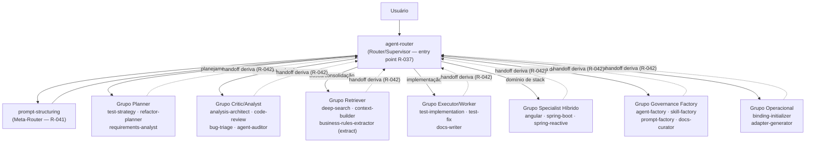

# Categorização e Agrupamento de Agents

> Este documento classifica os 24 agents do catálogo em categorias/grupos consolidados de mercado para engenharia de agentes de IA e prompt engineering, com base em pesquisa (Tavily) sobre taxonomias 2025-2026. Objetivo: dar vocabulário comum, facilitar onboarding e orientar o design de novos agents.

---

## 1) Taxonomias de Mercado Consolidadas (fontes)

### 1.1 — Padrões Fundamentais de Andrew Ng (2024, referência-base do campo)

4 padrões agentic (RTPM), citados como base de praticamente toda taxonomia posterior:

| Padrão | Definição |
|---|---|
| **Reflection** | Agent examina sua própria saída e itera para melhorá-la (self-critique). |
| **Tool Use** | LLM decide quais ferramentas/funções chamar para executar a tarefa. |
| **Planning** | LLM decompõe tarefa complexa em subtarefas ordenadas. |
| **Multi-Agent Collaboration** | Múltiplos agents especializados colaboram — analogia a "contratar vários funcionários". |

Fonte: Andrew Ng, X/deeplearning.ai (mar/2024) — https://www.linkedin.com/posts/itis-aditya-mehra_a-wonderful-course-on-agentic-ai-by-andrew-activity-7381422540109389824-Synj

### 1.2 — 5 Padrões de Workflow da Anthropic (2024, complementares a Ng)

| Padrão | Definição |
|---|---|
| **Prompt Chaining** | Sequência fixa, cada chamada alimenta a próxima. |
| **Routing** | Classificar a entrada primeiro, depois enviar para caminho especialista. |
| **Parallelization** | Fan-out simultâneo, depois agregação/votação. |
| **Orchestrator-Workers** | Um planejador decompõe, workers executam subtarefas imprevisíveis a priori. |
| **Evaluator-Optimizer** | Gerar → criticar → revisar em loop limitado. |

Fonte: Anthropic, "Building Effective Agents" (dez/2024) — referenciado em https://www.augmentcode.com/guides/agentic-design-patterns

### 1.3 — Papéis Funcionais (role-based taxonomy)

Consolidação de múltiplas fontes 2026 (Reddit r/AI_Agents, DataAspirant, GeniOS) em papéis nomeados, análogos a uma equipe humana:

| Papel | Função | Exemplo de framework |
|---|---|---|
| **Router / Triage** | Classifica intenção e decide destino — nunca executa domínio. | OpenAI Agents SDK `triage_agent`, LangGraph Supervisor |
| **Planner** | Decompõe objetivo em subtarefas/etapas antes da execução. | Anthropic Orchestrator-Workers |
| **Executor / Worker** | Executa a subtarefa concreta (código, teste, documento). | Claude Agent SDK workers |
| **Critic / Reviewer** | Analisa saída/artefato e aponta problemas — read-only por definição. | Anthropic Evaluator-Optimizer |
| **Retriever / Researcher** | Busca informação externa/local para fundamentar decisão. | RAG agents, `tavily`-equipped agents |
| **Specialist** | Domínio técnico profundo e restrito (stack, linguagem, framework). | "Agents as tools" (delegação hierárquica) |
| **Supervisor / Orchestrator** | Coordena múltiplos agents, gerencia estado compartilhado. | LangGraph Supervisor (padrão-default de produção 2026) |

Fontes:
- https://www.reddit.com/r/AI_Agents/comments/1jx9hvp/3_agent_patterns_are_dominating_agentic_systems
- https://thegenios.com/blog/seven-types-of-ai-agents (GeniOS, "router-specialist" e "planner-executor-evaluator" como subpadrões de multi-agent)
- https://dataaspirant.com/blog/ai-agent-design-patterns ("Agents as tools: delegation hierarchy")

### 1.4 — Topologia de Orquestração (como os agents se conectam)

| Topologia | Descrição | Adoção 2026 |
|---|---|---|
| **Sequential / Pipeline** | Cadeia ordenada, saída de um alimenta o próximo. | Baixo custo, alta previsibilidade |
| **Hierarchical / Supervisor** | Supervisor delega a workers/domain-supervisors; retorno ao supervisor. | **Padrão-default de produção em 2026** (LangGraph, Claude Agent SDK, OpenAI Agents SDK, Google ADK convergem aqui) |
| **Handoff dinâmico** | Roteamento em runtime baseado em contexto, com retorno explícito ("transfer back"). | OpenAI Agents SDK (`handoffs=[...]`), LangGraph `add_handoff_back_messages` |
| **Fan-out / Parallel** | Múltiplos workers processam subtarefas independentes simultaneamente. | Usado quando subtarefas são genuinamente independentes |

Fontes:
- https://mudassirkhan.me/blog/multi-agent-design-patterns
- https://www.digitalapplied.com/blog/multi-agent-orchestration-5-patterns-that-work ("Supervisor is the 2026 production default")
- https://github.com/ombharatiya/ai-system-design-guide/blob/main/07-agentic-systems/04-multi-agent-orchestration.md

**Conclusão da pesquisa aplicável a este projeto:** a arquitetura já adotada aqui (`agent-router` como supervisor único de entrada + handoff explícito de retorno via R-042 + `run_subagent`) **é exatamente o padrão hierárquico/handoff consolidado como default de produção em 2026** — validado pela pesquisa de mercado.

---

## 2) Mapeamento do Catálogo Atual às Categorias de Mercado

### 2.1 — Grupo: Router / Triage (Entry Point + Meta-Refinamento)

Agents que **nunca executam domínio** — apenas classificam e delegam.

| Agent | Papel específico |
|---|---|
| `agent-router` | Router/Supervisor — entry point obrigatório, único ponto de decisão de rota (R-037). |
| `prompt-structuring` | Meta-Router / Reflection aplicado ao próprio prompt — refina a entrada antes da classificação (exceção R-041, análogo ao "Conductor-Model Meta Prompting"). |

> **Atualização (2026-08-31):** `research-router` foi removido e substituído por `deep-search` — reclassificado no grupo 2.4 (Retriever/Researcher), sua taxonomia real (ver `docs/plan/plano-otimizacao-catalogo-agents.md` §A.1).

### 2.2 — Grupo: Planner (Decomposição sem Execução)

Agents que decompõem objetivo em plano estruturado, sem codificar.

| Agent | Papel específico |
|---|---|
| `test-strategy` | Planner — decompõe cobertura de testes em matriz de cenários priorizados. |
| `refactor-planner` | Planner — decompõe refatoração em etapas seguras com rollback. |
| `requirements-analyst` | Planner (pré-técnico) — decompõe pedido ambíguo em requisitos estruturados/testáveis. |

### 2.3 — Grupo: Critic / Reviewer / Analyst (Read-Only, Evaluator Pattern)

Agents que avaliam artefato/situação e reportam — nunca implementam (padrão Anthropic "Evaluator").

| Agent | Papel específico |
|---|---|
| `analysis-architect` | Critic/Analyst (tiers B1/B2/B3) — avalia impacto local, amplo, contratos, cross-sistema; inclui capacidade de Fan-out para eixos independentes (§5.4). |
| `code-review` | Critic — avalia diff/PR por severidade em 6 dimensões, nunca corrige. |
| `bug-triage` | Critic/Diagnóstico — avalia sintoma, localiza causa raiz, propõe plano (não corrige). |
| `agent-auditor` | Critic/Analyst de **meta-nível** — audita o próprio catálogo de governança (agents/skills/prompts), detecta smells estruturais e recomenda handoff (nunca corrige diretamente). |

> **Atualização (2026-08-31):** `impact-architect` foi removido e absorvido por `analysis-architect` (tier B1) — ver `docs/plan/plano-otimizacao-catalogo-agents.md` §A.2. `agent-auditor` foi adicionado como novo Critic de meta-nível (Parte D do mesmo plano).

### 2.4 — Grupo: Retriever / Researcher

Agents cuja função central é buscar/consolidar evidência (local ou externa) antes de outro agent decidir.

| Agent | Papel específico |
|---|---|
| `deep-search` | Retriever/Researcher especializado — pesquisa interna (terminal, `context-mode`) e externa (Tavily), decisão atômica vs. composta, fan-out de sub-queries via `run_subagent`. Substitui `research-router` (que decidia só entre responder direto ou delegar). |
| `context-builder` | Retriever — coleta e condensa contexto técnico em `docs/context/*.md` para consumo por outro agent. |
| `business-rules-extractor` (modo *extract*) | Retriever de regra de negócio — busca e documenta regras implícitas no código como ground truth. |

### 2.5 — Grupo: Executor / Worker (Implementação)

Agents que produzem/alteram artefato concreto (código, teste, documento).

| Agent | Papel específico |
|---|---|
| `test-implementation` | Worker — implementa suítes de teste conforme estratégia definida. |
| `test-fix` | Worker cirúrgico — corrige testes quebrados identificados, diff mínimo. |
| `docs-writer` | Worker — gera documentação técnica nova em `.md`. |
| `business-rules-extractor` (modo *validate*) | Worker de validação — compara código refatorado contra ground truth. |

### 2.6 — Grupo: Specialist Híbrido (Advisory + Implementação — "Agents as Tools")

Especialistas de stack profunda que operam em 2 modos (análise sem código / implementação com testing-first) — corresponde ao padrão "Agents as tools" (delegação por domínio coerente de ferramentas).

| Agent | Domínio |
|---|---|
| `angular` | Frontend Angular (arquitetura, reatividade, performance, a11y + implementação). |
| `spring-boot` | Backend Spring Boot (arquitetura, JDK, observabilidade + implementação). |
| `spring-reactive` | Backend reativo Spring WebFlux/Reactor (capacidade, backpressure + implementação). |

### 2.7 — Grupo: Governança de Artefatos (Factory Pattern / Meta-Agents)

Agents que criam/mantêm **outros artefatos de governança** (não código de aplicação) — um meta-nível acima dos demais grupos.

| Agent | Artefato gerido |
|---|---|
| `agent-factory` | Arquivos `.agent.md`. |
| `skill-factory` | Arquivos `SKILL.md`. |
| `prompt-factory` | Arquivos `.prompt.md`. |
| `docs-curator` | Documentação de governança já existente (curadoria/padronização). |

### 2.8 — Grupo: Operacional / Bootstrap (Infraestrutura de Sessão)

Agents de execução determinística, baixa ambiguidade, tipicamente 1-shot por projeto/sessão.

| Agent | Função |
|---|---|
| `binding-initializer` | Cria esqueleto `catalog.yaml` + `binding.md` (1 pergunta). |
| `adapter-generator` | Faz scanner read-only de projeto externo e gera adapter em `.github/instructions/`. |

---

## 3) Diagrama — Grupos e Fluxo Hierárquico (Supervisor Pattern)

`*` = candidato à consolidação, ver `plano-otimizacao-catalogo-agents.md`.

> **Nota (2026-08-31):** o catálogo já reflete a execução do plano de otimização — `research-router`/`impact-architect` removidos; `deep-search`/`agent-auditor` adicionados. Contagem atual: 24 agents / 50 skills.

---

## 4) Por Que Esta Taxonomia (Justificativa)

- **Hierárquico/Supervisor confirmado como padrão-default 2026**: a pesquisa de mercado (LangGraph, Claude Agent SDK, OpenAI Agents SDK, Google ADK) converge no padrão que este repositório já usa — `agent-router` como supervisor único, handoff explícito de retorno (R-042), e `run_subagent` como mecanismo de transferência de controle.
- **Role-based (Router/Planner/Critic/Retriever/Executor/Specialist) é o vocabulário mais citado** em 2026 para nomear responsabilidade de agent individual — mais estável que classificar por "o que ele faz na prática" (que muda por projeto).
- **Especialistas híbridos (`angular`/`spring-boot`/`spring-reactive`) mapeiam ao padrão "Agents as tools"**: um specialist com conjunto coerente de ferramentas de um domínio, chamado pelo orquestrador como se fosse uma ferramenta — evita "tool list" genérica e confusa (anti-padrão citado por DataAspirant 2026).
- **Fator de alerta confirmado pela pesquisa**: "over-delegation"/excesso de indireção (múltiplos roteadores em cascata) é citado como anti-padrão explícito — reforça a recomendação da Parte A do plano de otimização (fundir `research-router` em `agent-router`/`analysis-architect`).

---

## 5) Categorias de Mercado Ausentes no Catálogo Atual

> Cruzamento das taxonomias de §1 contra os 24 agents mapeados em §2. Para cada categoria/padrão **não representado**, descrevemos a característica central, a evidência do gap e se é uma lacuna real ou uma omissão intencional (dado o escopo deste projeto de governança).

### 5.1 — Reflection puro (self-critique sobre o próprio artefato de saída)

| Característica | Descrição |
|---|---|
| Definição de mercado | Agent que gera uma saída, **reexamina o próprio artefato** (não o prompt de entrada) e itera até melhorar a qualidade — padrão Ng "Reflection". |
| O que existe hoje (parecido, mas diferente) | `prompt-structuring` aplica reflection **sobre o prompt de entrada** (meta-nível, antes de qualquer execução), não sobre a saída de um agent downstream. Nenhum agent reexamina seu próprio artefato entregue (código, plano, documento) antes de reportar. |
| Gap real ou intencional? | **Gap real, mas de baixo risco.** O testing-first dos specialists híbridos (`angular`/`spring-boot`/`spring-reactive`) e o `get_errors` cumprem parcialmente o papel de validação, mas não como loop de auto-crítica declarado. |
| Onde poderia se aplicar | `docs-writer` (reexaminar o `.md` gerado contra a skill `documentation-writing-patterns` antes de finalizar) ou `test-implementation` (reexaminar cobertura antes de reportar sucesso). |

> **✅ Resolvido (2026-08-31):** pesquisa de mercado (Taskade 2026, Techademy 2026, Future AGI 2026) confirmou que Reflection de baixo/médio risco deve ser **self-reflection interna** (mesmo modelo, 1 round, grounded) — **não** um agent `critic` dedicado, cujo custo de orquestração não se paga para artefatos de risco baixo (violaria R-011). Criada skill `reflection-self-critique-patterns` (Tier 2), consumida por `docs-writer` e `test-implementation`. Nenhum novo agent foi criado.

### 5.2 — Evaluator-Optimizer (loop limitado gerar → criticar → revisar)

| Característica | Descrição |
|---|---|
| Definição de mercado | Um agent gerador e um agent crítico trocam turnos em **loop com limite explícito de iterações** até o artefato passar em critério objetivo — padrão Anthropic. |
| O que existe hoje (parecido, mas diferente) | `code-review` e `bug-triage` são críticos (read-only) mas **não fecham o loop** com o agent gerador — reportam achados e encerram, sem ciclo de revisão automática. O único loop com limite explícito no catálogo é o de `prompt-structuring` (máx. 5 iterações), mas é sobre o prompt, não sobre o artefato final. |
| Gap real ou intencional? | **Intencional em parte** — R-031 (Plano Auto-Implementável) e R-011 (sem overengineering) desencorajam loops autônomos de correção (`test-fix` tem regra explícita "sem loop: 1 tentativa, se falhar reportar e aguardar"). O padrão de mercado existe, mas a governança deste projeto prioriza humano-no-loop em vez de loop autônomo gerador↔crítico. |
| Onde poderia se aplicar | `code-review` → `bug-triage`/`test-fix` com retorno automático de 1 rodada de correção antes de re-revisar (hoje é handoff manual, não loop fechado). |

### 5.3 — Prompt Chaining (pipeline sequencial fixo, sem supervisor central)

| Característica | Descrição |
|---|---|
| Definição de mercado | Sequência **fixa e determinística** de chamadas, onde a saída de um agent alimenta diretamente o próximo, sem retorno a um roteador central a cada etapa. |
| O que existe hoje (parecido, mas diferente) | A arquitetura é **hub-and-spoke** (estrela): todo handoff retorna ao `agent-router` (R-042), nunca agent→agent diretamente em cadeia fixa. Os comandos `/plan → /implement → /validate` **simulam** uma cadeia, mas cada estágio ainda passa pela triagem do roteador. |
| Gap real ou intencional? | **Intencional.** Hub-and-spoke com retorno ao supervisor é o padrão de auditabilidade (R-042) escolhido deliberadamente — abrir mão dele para ganhar velocidade de pipeline fixo reduziria a re-triagem por turno, que é um requisito de governança central deste projeto. |

### 5.4 — Parallelization / Fan-out (workers processam subtarefas independentes simultaneamente)

| Característica | Descrição |
|---|---|
| Definição de mercado | Múltiplos workers/agents processam subtarefas **genuinamente independentes** em paralelo, com resultado agregado ao final (fan-out/scatter-gather). |
| O que existe hoje (parecido, mas diferente) | `research-router`* (candidato à remoção — ver plano de otimização) **mencionava** decompor pesquisa composta em sub-queries paralelas via `run_subagent`; hoje essa capacidade vive em `deep-search` (seu substituto). Nenhum outro agent (ex.: `test-implementation` rodando specs de múltiplos módulos, ou `angular`+`spring-boot` avaliando o mesmo impacto em paralelo) usava fan-out real. |
| Gap real ou intencional? | **Gap real, oportunidade não explorada.** Cenários como "avaliar impacto de uma mudança cross-stack" (frontend + backend simultaneamente) hoje seriam sequenciais via `agent-router`, quando poderiam ser paralelizados. |
| Onde poderia se aplicar | `analysis-architect` poderia paralelizar sub-análises (ex.: contrato de API + dependência de banco) via `run_subagent` em fan-out, agregando ao final — hoje descrito apenas como capacidade textual do extinto `research-router`. |

> **✅ Resolvido (2026-08-31):** pesquisa de mercado (Beam AI 2026, "6 Multi-Agent Orchestration Patterns") confirma fan-out/fan-in como padrão consolidado para "4+ tarefas sem dependência entre si" — mas não como **agent dedicado** (um "fan-out coordinator" seria apenas um hop extra de indireção sem valor de decisão, mesmo anti-padrão de "over-delegation" já flagado neste documento §4). Capacidade **"Fan-out — Análise Paralela"** adicionada diretamente à Decision Tree de `analysis-architect` (dispatch via `run_subagent`, payload via `handoff-governance`, agregação/fan-in explícita). Nenhum novo agent foi criado.

### 5.5 — Debate (crítica multi-perspectiva sobre o mesmo artefato)

| Característica | Descrição |
|---|---|
| Definição de mercado | 2+ agents analisam o **mesmo artefato/decisão** de perspectivas diferentes (ex.: segurança vs. performance) e um terceiro agent concilia — usado em decisões de alto risco (jurídico, financeiro, arquitetura crítica). |
| O que existe hoje | Nenhum. Toda análise no catálogo é de **1 agent por vez** (mesmo `analysis-architect` com tiers B1/B2/B3 é sequencial, não multi-perspectiva paralela). |
| Gap real ou intencional? | **Omissão intencional/aceitável.** Debate custa ~2.5× o custo de 1 modelo único (achado da pesquisa de mercado) — desproporcional para o escopo atual (governança de repositório, não decisão jurídica/financeira). |

### 5.6 — Swarm (agentes-pares dinâmicos em larga escala)

| Característica | Descrição |
|---|---|
| Definição de mercado | Dezenas a centenas de agents-pares sem hierarquia estrita, coordenando-se dinamicamente (ex.: OpenAI Swarm, 300+ agents com Kimi K2.6). |
| O que existe hoje | Nenhum — o catálogo tem 24 agents com hierarquia estrita (1 supervisor + downstream). |
| Gap real ou intencional? | **Omissão correta.** Padrão de mercado reservado para populações de tarefas que excedem 50 agents concorrentes — fora de escala e de propósito para este repositório de governança. |

### 5.7 — Hierárquico Multi-Nível (3+ camadas — supervisores de domínio entre o orquestrador e os workers)

| Característica | Descrição |
|---|---|
| Definição de mercado | Um orquestrador de topo delega a **supervisores de domínio** (ex.: "supervisor de backend", "supervisor de frontend"), que por sua vez delegam a workers — 3+ níveis, distinto do orquestrador-worker de 2 níveis. |
| O que existe hoje (parecido, mas diferente) | A arquitetura atual é **2 níveis**: `agent-router` (nível 1) → downstream/specialist (nível 2). Não há "supervisor de backend" agrupando `spring-boot`+`spring-reactive`, nem "supervisor de frontend" para `angular`. |
| Gap real ou intencional? | **Intencional dado o tamanho atual.** Mercado recomenda hierárquico multi-nível apenas quando o domínio abrange múltiplos subdomínios especializados de forma consistente — com apenas 1 specialist por domínio de stack hoje (`angular`, `spring-boot`, `spring-reactive`), um nível extra de supervisor de domínio seria overengineering (R-011). Reavaliar se novos specialists (`python-django`, `react`, `nodejs`) forem adicionados e precisarem de agrupamento por "família de stack". |

### 5.8 — Utility-Based Agent (função de utilidade explícita, scoring contínuo de alternativas)

| Característica | Descrição |
|---|---|
| Definição de mercado | Agent que escolhe a ação de **maior valor esperado** entre alternativas (scoring contínuo), em vez de apenas satisfazer um objetivo binário — ex.: agent de priorização de leads que pontua e ordena opções. |
| O que existe hoje (parecido, mas diferente) | `agent-router` declara `Confidence Score` (0.00–1.00) para a rota escolhida, mas é um score de **confiança da classificação**, não uma função de utilidade comparando múltiplas rotas alternativas por valor esperado. |
| Gap real ou intencional? | **Omissão aceitável.** O catálogo é de classificação categórica (rule-based → semantic → LLM-based, conforme `confidence-fallback-policy`), não de otimização contínua — adequado ao domínio (roteamento de tarefas de desenvolvimento, não alocação de recursos/pricing). |

### 5.9 — Learning / Self-Improving Agent (loop de aprendizado ativo)

| Característica | Descrição |
|---|---|
| Definição de mercado | Agent que **melhora o próprio comportamento com o tempo** a partir de experiência (memória procedimental atualizando o próprio prompt/estratégia) — ex.: Hermes Agent self-evolving skills, Letta self-editing memory. |
| O que existe hoje (parecido, mas diferente) | Existe a **skill** `agent-memory-policy` (Tier 3 — Experimental) que define a **política** de memória procedimental com guardrails e aprovação humana obrigatória — mas nenhum agent do catálogo **implementa** de fato um loop de auto-atualização; é política declarada, não comportamento ativo. |
| Gap real ou intencional? | **Gap reconhecido e sinalizado como experimental pelo próprio projeto** (Tier 3 já indica maturidade baixa/uso restrito). Não é uma lacuna de descoberta — é um roadmap já registrado, aguardando maturidade/aprovação para virar comportamento ativo de algum agent. |

### 5.10 — Resumo das Lacunas

| Categoria ausente | Gap real ou intencional | Prioridade se for endereçar | Status (2026-08-31) |
|---|---|---|---|
| Reflection puro (sobre output) | Gap real, baixo risco | Baixa | ✅ Resolvido — skill `reflection-self-critique-patterns` (self-reflection, sem novo agent) |
| Evaluator-Optimizer (loop fechado) | Intencional (R-011/R-031) | Não recomendado sem mudança de governança | Sem ação (intencional) |
| Prompt Chaining (pipeline fixo) | Intencional (R-042 hub-and-spoke) | Não recomendado | Sem ação (intencional) |
| Fan-out / Parallelization | Gap real, oportunidade | Média — aplicável a `analysis-architect` | ✅ Resolvido — capacidade "Fan-out — Análise Paralela" adicionada a `analysis-architect` (sem novo agent) |
| Debate | Intencional (custo/escala) | Não recomendado | Sem ação (intencional) |
| Swarm | Intencional (fora de escala) | Não aplicável | Sem ação (intencional) |
| Hierárquico multi-nível (3+ camadas) | Intencional (tamanho atual) | Reavaliar se catálogo de specialists crescer | Sem ação (reavaliar no futuro) |
| Utility-based (scoring contínuo) | Intencional (domínio categórico) | Não aplicável | Sem ação (intencional) |
| Learning / Self-improving | Reconhecido, Tier 3 experimental | Já roteirizado — sem ação nova | Sem ação (já roteirizado) |

**Conclusão da análise de fechamento de gaps (2026-08-31):** dos 2 gaps classificados como "reais" (Reflection, Fan-out), pesquisa de mercado dedicada confirmou que **nenhum justifica um novo agent standalone** — ambos foram resolvidos como capacidades incrementais em agents já existentes, preservando o princípio de "hop único de roteamento" e evitando o anti-padrão de over-delegation citado em §4. Nenhum novo agent foi criado como resultado desta análise; apenas 1 skill nova (`reflection-self-critique-patterns`) e 3 agents com pequenos incrementos de capacidade (`docs-writer`, `test-implementation`, `analysis-architect`).

---

## 6) Como Usar Este Documento

- **Ao criar um novo agent** (via `@agent-factory`): primeiro identifique a qual grupo ele pertence (§2) — isso define o template-base (`research-agent.md` para Router/Planner/Critic/Retriever; `operational-agent.md` para Executor/Specialist/Governance/Bootstrap) e o formato de saída esperado (`agent-contracts/SKILL.md` § 8).
- **Ao avaliar redundância**: 2 agents no mesmo grupo com escopo de "profundidade" diferente (ex.: `impact-architect` vs `analysis-architect`, ambos em Critic/Analyst) são candidatos fortes a fusão via tiers — ver `docs/plan/plano-otimizacao-catalogo-agents.md`.
- **Ao atualizar o grafo de roteamento** (`docs/ai-context/routing-graph.yaml`, R-040): agrupar arestas por grupo facilita auditoria de cobertura (nenhum grupo sem rota de entrada, nenhuma rota órfã).

---

## 7) Fontes Consultadas (Tavily, pesquisa 2026)

1. https://thegenios.com/blog/seven-types-of-ai-agents — "The 7 Types of AI Agents: A Clean Taxonomy for 2026"
2. https://www.augmentcode.com/guides/agentic-design-patterns — "What Are Agentic Design Patterns? 2026 Pattern Catalog" (12 padrões consolidados Ng + Anthropic)
3. https://dataaspirant.com/blog/ai-agent-design-patterns — "AI Agent Design Patterns: 8 Core Architectures (2026)"
4. https://www.digitalapplied.com/blog/agent-architecture-patterns-taxonomy-2026 — 4 quadrantes, 8 padrões canônicos
5. https://www.digitalapplied.com/blog/multi-agent-orchestration-5-patterns-that-work — "Supervisor is the 2026 production default"
6. https://mudassirkhan.me/blog/multi-agent-design-patterns — sequential/orchestrator-worker/hierarchical/dynamic handoff
7. https://github.com/ombharatiya/ai-system-design-guide/blob/main/07-agentic-systems/04-multi-agent-orchestration.md — Supervisor Pattern, Swarms/Handoffs
8. https://www.reddit.com/r/AI_Agents/comments/1jx9hvp/3_agent_patterns_are_dominating_agentic_systems — papéis nomeados (Planner/Executor/Retriever/Critic)
9. https://www.linkedin.com/posts/itis-aditya-mehra_a-wonderful-course-on-agentic-ai-by-andrew-activity-7381422540109389824-Synj — Andrew Ng RTPM

### Fontes Adicionais (fechamento de gaps, 2026-08-31)

10. https://www.taskade.com/blog/self-improving-ai-agents-reflection — "Self-Improving AI Agents: The Reflection Loop" (self-reflection vs. critic agent separado)
11. https://www.techademy.com/react-plan-execute-reflection-agent-patterns — "ReAct, Plan-and-Execute & Reflection: AI Agent Patterns"
12. https://futureagi.com/blog/evaluating-llm-self-reflection-loops-2026 — "Evaluating LLM Self-Reflection Loops" (single-shot critique, limite de rounds)
13. https://beam.ai/agentic-insights/multi-agent-orchestration-patterns-production — "6 Multi-Agent Orchestration Patterns for Production" (fan-out/fan-in, 4+ tarefas independentes)
14. https://alphacorp.ai/blog/what-is-ai-agent-orchestration-7-patterns-ranked-for-production-2026 — custo de token overhead em multi-agent (3-10×), critério de escolha de padrão por formato da tarefa

