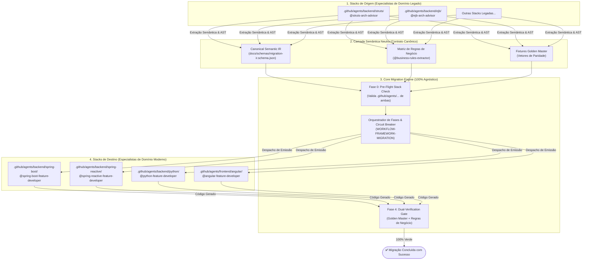

# Technical Blueprint — Motor Agnóstico de Migração de Tecnologias Legadas

**Status:** Proposta de Arquitetura (Aguardando Aprovação — Estado 3b)  
**Data:** 2026-09-12  
**Autor:** @tech-solution-architect  
**Referência de Requisitos:** [`docs/requirements/REQ-migration-engine.md`](../requirements/REQ-migration-engine.md)  
**Workflow:** WORKFLOW-FEATURE-DEVELOPMENT (Etapa 3 — Technical Blueprint & Contratos)

---

## 1. Visão Geral da Solução e Decisões de Design

### 1.1 O Desafio Arquitetural
A migração de sistemas legados (ex.: Apache Struts 1.x/2.x, Java EJB 2.x/3.x) para frameworks modernos (ex.: Spring Boot, Spring Reactive, Python FastAPI, Angular) costuma falhar por acoplamento excessivo entre as sintaxes de origem e destino, resultando em:
1. **Explosão combinatória $O(N \times M)$:** Cada novo par de frameworks exige um novo tradutor/workflow completo.
2. **Poluição de workflows:** Workflows com condicionais e regras acopladas a frameworks concretos (`if struts then ...`).
3. **Regressão silenciosa:** Falta de testes de paridade determinísticos antes do deploy.

### 1.2 A Solução Arquitetural: IR-Based Decoupled Pipeline
Adotamos o padrão canônico da engenharia de compiladores e modernização enterprise (OpenRewrite, LLVM, Sourcegraph): **Pipeline Baseado em Representação Intermediária Semântica (Semantic IR)**.



---

## 2. Especificação do Schema da Representação Intermediária (Semantic IR)

A **Representação Intermediária (IR)** é o contrato único e imutável que trafega entre os especialistas de origem e destino. Ela é validada contra um JSON Schema canônico (`docs/schemas/migration-ir.schema.json`).

### 2.1 Estrutura Canônica da IR (TypeScript Definition)

```typescript
export interface MigrationIR {
  schemaVersion: "1.0.0";
  metadata: {
    migrationId: string;
    timestamp: string;
    sourceStack: {
      domain: "backend" | "frontend" | "database";
      name: string;              // ex.: "struts", "ejb"
      version?: string;           // ex.: "1.3.10", "3.0"
      catalogRef: string;         // ex.: ".github/agents/backend/struts/struts-catalog.yaml"
    };
    targetStack: {
      domain: "backend" | "frontend" | "database";
      name: string;              // ex.: "spring-boot", "python"
      version?: string;           // ex.: "3.4.0", "3.12"
      catalogRef: string;         // ex.: ".github/agents/backend/spring-boot/spring-boot-catalog.yaml"
    };
    moduleName: string;
  };
  
  // Contratos de Entrada/Saída da Aplicação (APIs, Interfaces)
  entryPoints: Array<{
    id: string;                   // ex.: "EP-LOGIN-001"
    name: string;
    type: "http_endpoint" | "rpc_service" | "message_listener" | "batch_job";
    route?: {
      path: string;
      method: "GET" | "POST" | "PUT" | "DELETE" | "PATCH";
    };
    inputSchema: Record<string, unknown>;   // JSON Schema do DTO de entrada
    outputSchema: Record<string, unknown>;  // JSON Schema do DTO de resposta
    errorSchemas: Array<{
      statusCode: number;
      errorCode: string;
      schema: Record<string, unknown>;
    }>;
    security: {
      authenticated: boolean;
      roles?: string[];
    };
  }>;

  // Modelo de Domínio e Entidades
  domainEntities: Array<{
    name: string;
    description?: string;
    fields: Array<{
      name: string;
      type: "string" | "integer" | "decimal" | "boolean" | "date" | "uuid" | "binary";
      required: boolean;
      primaryKey?: boolean;
      unique?: boolean;
    }>;
    relationships: Array<{
      type: "one_to_many" | "many_to_one" | "many_to_many" | "one_to_one";
      targetEntity: string;
      foreignKeyField: string;
    }>;
  }>;

  // Regras de Negócio Extraídas (Rastreabilidade via @business-rules-extractor)
  businessRules: Array<{
    ruleId: string;               // ex.: "RN-001"
    title: string;
    description: string;
    category: "validation" | "calculation" | "state_transition" | "permission";
    preconditions: string[];
    actions: string[];
    postconditions: string[];
    associatedEntryPoints: string[];
  }>;

  // Vetores de Paridade Funcional (Golden Master Fixtures)
  characterizationVectors: Array<{
    vectorId: string;
    entryPointId: string;
    description: string;
    scenario: string;
    inputPayload: Record<string, unknown>;
    mockDependencies?: Array<{
      targetService: string;
      method: string;
      returns: unknown;
    }>;
    expectedOutputPayload: Record<string, unknown>;
    expectedStatusCode: number;
  }>;
}
```

---

## 3. Máquina de Estados do Motor de Migração (Core State Machine)

O motor de migração opera através de 6 fases estritas e determinísticas, gerenciadas por uma extensão formal de `WORKFLOW-FRAMEWORK-MIGRATION` (R-050):

| Fase | Nome da Fase | Agente Responsável | Critério de Entrada | Critério de Saída / Gate |
|---|---|---|---|---|
| **Fase 0** | **Pre-Flight Stack Governance Check** | `@tech-solution-architect` | Solicitação de migração recebida | Ambas as stacks (origem e destino) possuem `.github/agents/<camada>/<stack>/` completo com supervisor, catalog e 7 especialistas |
| **Fase 1** | **Characterization & Rule Extraction** | `source-stack-arch-advisor` + `@business-rules-extractor` | Pré-voo aprovado | Vetores Golden Master gerados e matriz de regras documentada em `docs/business-rules/` |
| **Fase 2** | **Semantic IR Generation** | `source-stack-arch-advisor` | Fase 1 concluída | Arquivo `migration-ir.json` gerado e 100% válido contra o JSON Schema canônico |
| **Fase 3a** | **Target Project Bootstrapping (Human-in-the-Loop)** | `target-stack-feature-developer` | IR validada & projeto alvo novo | Decisões de build/runtime (Maven vs Gradle, Java LTS) confirmadas pelo usuário via `ask_questions` e esqueleto base inicializado |
| **Fase 3b** | **Idiomatic Code Emission** | `target-stack-feature-developer` | Projeto alvo inicializado/existente | Código moderno implementado sob TDD a partir da IR, com diffs cirúrgicos em lote (R-046) e zero menção a classes legadas |
| **Fase 4** | **Dual-Verification Parity Gate** | `target-stack-test-fixer` + `@runtime-verifier` | Código emitido | 100% dos testes Golden Master passando verdes e 100% das regras comprovadas por asserções |
| **Fase 5** | **Baseline Quality Gate & PR Readiness** | `@code-review` + `@security-reviewer` + `@pr-gatekeeper` | Paridade comprovada | Build limpo, zero vulnerabilidades OWASP, changelog e PR estruturado preliminar |
| **Fase 6** | **Post-Migration Verification & Redundancy Gate** | `@code-review` + `@test-strategy` + `@business-rules-extractor` + `@runtime-verifier` | Fase 5 aprovada | Tríplice redundância aprovada: zero órfãos no Reverse Orphan Audit, 100% mutantes eliminados no Mutation Parity e zero discrepâncias no Differential Shadow Replay. Emissão de Certificado de Paridade Total |

### 3.1 Sub-rotina Fase 3a: Target Project Bootstrapping (Interactive Human Gate)

Quando o destino da migração for um novo repositório ou módulo autônomo (Cenário Green-Field), o motor de migração suspende a emissão direta de código de domínio e aciona a sub-rotina interativa de inicialização:

1. **Consulta Obrigatória via `ask_questions` (R-027 / RNF-005):**
   O especialista da stack de destino (`target-stack-feature-developer`) submete as decisões estruturais ao desenvolvedor:
   - **Ferramenta de Build:** Ex.: `Maven (pom.xml)` vs `Gradle (Kotlin DSL / Groovy)` para Spring Boot; `npm` vs `pnpm` vs `yarn` para Angular; `uv` vs `poetry` vs `pip` para Python.
   - **Versão LTS de Runtime:** Ex.: `Java 21 LTS` vs `Java 25 LTS`; `Node 20 LTS` vs `Node 22 LTS`; `Python 3.11` vs `Python 3.12`.
   - **Formato de Packaging:** Ex.: `Jar (Cloud-native)` vs `War (Traditional Application Server)`.
   - **Metadados do Projeto:** `groupId`, `artifactId` e namespace raiz de pacotes.
2. **Scaffolding Oficial da Stack:**
   Apenas após o recebimento das respostas do usuário, o agente executa a inicialização oficial (ex.: via Spring Initializr CLI/API, Maven Archetype ou Angular CLI no sandbox).
3. **Registro de Governança Local (R-043):**
   O novo projeto é registrado no overlay local `.github/projects.local.yaml` via `/add-project-context`, gerando o respectivo adapter em `.github/instructions/local/<novo-projeto>.instructions.md` sem poluir o repositório de governança compartilhado.


### Circuit Breakers e Proteções de Rollback (R-050.2)
1. **Breaker de Governança (Fase 0):** Se a stack de origem ou destino não estiver no projeto, a migração é **imediatamente suspensa**, acionando `@governance-factory` para criar a stack faltante.
2. **Breaker de Schema (Fase 2):** Se a IR falhar na validação do JSON Schema, o avanço para a stack de destino é bloqueado; o especialista da stack de origem corrige a extração.
3. **Breaker de Paridade (Fase 4):** Se um teste Golden Master falhar ou um comportamento divergir, a migração **não pode avançar para PR**. É disparada a sub-rotina de correção cirúrgica pelo `target-stack-test-fixer`. Máximo de 3 iterações antes de escalonamento humano via `ask_questions`.

---


### 3.3 Sub-rotina Fase 6: Post-Migration Verification & Redundancy Gate (Tríplice Camada)
A última camada de segurança antes do cutover definitivo opera em três etapas independentes e estritamente auditáveis:
1. **Reverse Orphan Audit**: Varredura reversa mecânica pelo `@code-review` + `@code-knowledge-graph` contra a árvore de arquivos, métodos, queries e configurações da aplicação legada. Todo símbolo legado deve possuir vínculo auditado no moderno (`[✅ MIGRADO]`) ou justificativa explícita (`[ℹ️ DESACOPLADO]` / `[🚫 OBSOLETO]`). Qualquer símbolo desacompanhado gera bloqueio imediato com a flag `ORPHAN_CODE_DETECTED`.
2. **Mutation Parity Resilience**: O `@test-strategy` comanda a injeção de mutantes sintéticos controlados no código moderno para comprovar a sensibilidade da suíte Golden Master. Se qualquer teste permanecer verde durante a mutação de uma regra de negócio, a suíte é reprovada por fragilidade/falso-positivo até o reforço das asserções.
3. **Differential Shadow Replay**: Replay das fixtures canônicas em paralelo nos dois ambientes, validando a igualdade estrita de payloads de saída, integridade de tabelas secundárias de banco de dados (histórico, rateio, snapshots) e eventos emitidos.
Ao final, emite-se formalmente o **Certificado de Paridade Total & Cutover Autorizado** (`docs/migrations/certificado-paridade-<alvo>.md`).
## 4. Context Firewall — Divisão de Tarefas por Stack

### [CORE_ENGINE_TASKS] — Orquestração & Governança (Agnóstico)
1. **`CORE-01`**: Criar o JSON Schema canônico da Representação Intermediária em `docs/schemas/migration-ir.schema.json`.
2. **`CORE-02`**: Formalizar o workflow canônico `WORKFLOW-LEGACY-MIGRATION` (ou especialização de `WORKFLOW-FRAMEWORK-MIGRATION`) em `.github/agents/workflows.md` com a máquina de estados e o banner visual de progresso.
3. **`CORE-03`**: Implementar o checklist de pré-voo determinístico no `@tech-solution-architect` e `@agent-router` para validação de existência dos ecossistemas de domínio envolvidos (`.github/agents/<camada>/<stack>/`).
4. **`CORE-04`**: Criar testes automatizados em pytest (`tests/governance_audit/test_migration_engine_governance.py`) validando o desacoplamento do motor e a rejeição de stacks não cadastradas.
5. **`CORE-05`**: Formalizar a Tríplice Camada de Redundância Pós-Migração (Fase 6) e o Symbol Exhaustion Gate em `workflows.md` e suíte de testes de regressão de governança.

### [SOURCE_STACK_TASKS] — Adapters de Extração de Legado
1. **`SRC-01` (Struts)**: Capacitar o `@struts-arch-advisor` com prompts e skills para mapear `struts-config.xml`, `Action` e `ActionForm` para os nós `entryPoints` e `domainEntities` da IR.
2. **`SRC-02` (EJB)**: Capacitar o `@ejb-arch-advisor` com prompts e skills para mapear `ejb-jar.xml`, SessionBeans (SLSB/SFSB) e MDBs para os nós de serviços e regras da IR.
3. **`SRC-03` (Golden Master Extractor)**: Integrar geração automatizada de fixtures de testes de caracterização a partir do código legado.

### [TARGET_STACK_TASKS] — Geradores de Código Idiomático Moderno
1. **`TGT-01` (Spring Boot)**: Capacitar `@spring-boot-feature-developer` para ler a IR e gerar Controllers REST (`@RestController`), Records DTO, Services (`@Service`) e Entities JPA idiomáticas.
2. **`TGT-02` (Spring Reactive)**: Capacitar `@spring-reactive-feature-developer` para gerar rotas funcionais WebFlux (`RouterFunction`) e fluxos reativos (`Mono`/`Flux`) a partir da IR.
3. **`TGT-03` (Python)**: Capacitar `@python-feature-developer` para gerar endpoints FastAPI, schemas Pydantic e modelos SQLAlchemy a partir da IR.
4. **`TGT-04` (Angular)**: Capacitar `@angular-feature-developer` para gerar componentes standalone, rotas e Signal Stores a partir de entrypoints frontend da IR.

---

## 5. Análise de Riscos e Impacto

| Risco Identificado | Severidade | Estratégia de Mitigação |
|---|:---:|---|
| **Perda de semântica na tradução para a IR** | Alta | Criação de tipos genéricos extensíveis (`customAttributes`) na IR e validação cruzada obrigatória com `@business-rules-extractor`. |
| **Geração de código alvo com dialetos legados (anti-pattern)** | Alta | O gerador da stack de destino consome apenas a IR neutra, nunca o código legado original. O Context Firewall impede contaminação. |
| **Tentativa de migração para stack inexistente no projeto** | Média | O gate da Fase 0 bloqueia em tempo de design qualquer execução cuja stack de origem ou destino não tenha seu ecossistema `.agent.md` cadastrado. |
| **Flakiness em testes Golden Master** | Média | Mock determinístico de dependências externas (banco, queues, APIs terceiras) documentadas explicitamente no nó `test_fixtures` da IR. |

---

## 6. Próximo Passo do Workflow

- **Etapa Concluída:** Etapa 3 — Technical Blueprint & Contratos (`@tech-solution-architect`)
- **Checkpoint Estado 3b:** Autorização formal humana do Blueprint via `ask_questions`.
- **Próxima Etapa:** Etapa 4 — Estratégia de Testes TDD (`@test-strategy`) para estruturação da suíte de paridade e matriz de cobertura.

