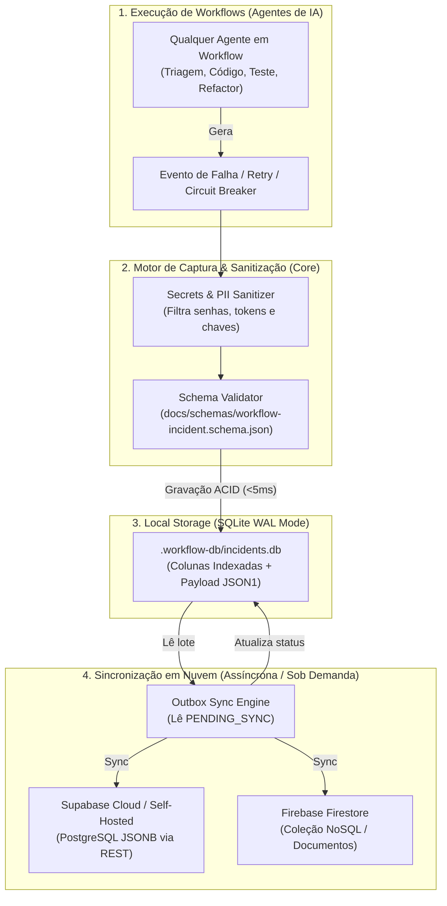

# Technical Blueprint — Persistência Local e Nuvem de Incidentes de Workflows

**Status:** Proposta de Arquitetura (Aguardando Aprovação — Estado 3b)  
**Data:** 2026-09-12  
**Autor:** @tech-solution-architect  
**Referência de Requisitos:** [`docs/requirements/REQ-workflow-incident-persistence.md`](../requirements/REQ-workflow-incident-persistence.md)  
**Workflow:** WORKFLOW-FEATURE-DEVELOPMENT (Etapa 3 — Technical Blueprint & Contratos)

---

## 1. Visão Geral da Solução e Decisões de Design

### 1.1 O Desafio
Durante a execução dos 8 Workflows Canônicos de IA (R-050), agentes enfrentam diversos tipos de incidentes: falhas de sintaxe em tools, quebras de testes de paridade, acionamento de circuit breakers, erros de runtime ou deriva de intenção. Atualmente, essas falhas existem apenas de forma efêmera no contexto do chat, perdendo-se após a sessão ou exigindo parsing manual de logs.

### 1.2 A Solução Arquitetural: Local-First Outbox Pattern
Adotamos uma arquitetura **Local-First com Padrão Outbox Assíncrono**, garantindo que a captura ocorra localmente com latência próxima de zero, e que a sincronização para bancos em nuvem de baixo custo (Supabase / Firestore) ocorra de forma desacoplada e assíncrona.



---

## 2. DDL do Banco Local SQLite (JSON1 Extension)

O banco de dados local reside em `.workflow-db/incidents.db` (diretório gitignored local). A estrutura combina colunas relacionais para buscas rápidas com uma coluna JSON para o documento canônico integral. Na inicialização da conexão, são configurados os pragmas de performance: `PRAGMA journal_mode = WAL;` e `PRAGMA synchronous = NORMAL;`.

```sql
-- DDL para SQLite 3.38+ (Suporte nativo a JSON1)

CREATE TABLE IF NOT EXISTS workflow_incidents (
    incident_id TEXT PRIMARY KEY,
    workflow_id TEXT NOT NULL,
    workflow_name TEXT NOT NULL,
    session_id TEXT,
    agent_id TEXT NOT NULL,
    step_index INTEGER NOT NULL,
    step_name TEXT NOT NULL,
    severity TEXT NOT NULL CHECK(severity IN ('LOW', 'MEDIUM', 'HIGH', 'CRITICAL')),
    category TEXT NOT NULL CHECK(category IN ('TOOL_FAILURE', 'RUNTIME_EXCEPTION', 'CIRCUIT_BREAKER', 'PARITY_BREAK', 'QUALITY_GATE_FAILURE', 'HUMAN_ESCALATION')),
    status TEXT NOT NULL CHECK(status IN ('OPEN', 'RETRYING', 'MITIGATED', 'ESCALATED_TO_HUMAN', 'CIRCUIT_TRIPPED')),
    created_at TEXT NOT NULL,
    sync_status TEXT NOT NULL DEFAULT 'PENDING_SYNC' CHECK(sync_status IN ('PENDING_SYNC', 'SYNCED', 'LOCAL_ONLY')),
    synced_at TEXT,
    target_backend TEXT DEFAULT 'none',
    document_payload TEXT NOT NULL -- Documento JSON completo validado contra o schema
);

-- Índices de consulta rápida para auditoria e sincronização
CREATE INDEX IF NOT EXISTS idx_incidents_workflow ON workflow_incidents(workflow_id);
CREATE INDEX IF NOT EXISTS idx_incidents_agent ON workflow_incidents(agent_id);
CREATE INDEX IF NOT EXISTS idx_incidents_sync ON workflow_incidents(sync_status) WHERE sync_status = 'PENDING_SYNC';
CREATE INDEX IF NOT EXISTS idx_incidents_severity ON workflow_incidents(severity);
CREATE INDEX IF NOT EXISTS idx_incidents_created ON workflow_incidents(created_at);
```

---

## 3. DDL de Compatibilidade com Nuvem (Supabase & Firestore)

### 3.1 DDL Nativo para Supabase (PostgreSQL JSONB)
Como o Supabase utiliza PostgreSQL, o payload é persistido nativamente na coluna `document_payload JSONB`, habilitando operadores JSON como `->>`, `@>`, e índices GIN de alta performance.

```sql
-- DDL para Supabase (PostgreSQL 15+)
CREATE TABLE IF NOT EXISTS public.workflow_incidents (
    incident_id UUID PRIMARY KEY,
    workflow_id TEXT NOT NULL,
    workflow_name TEXT NOT NULL,
    session_id TEXT,
    agent_id TEXT NOT NULL,
    step_index INTEGER NOT NULL,
    step_name TEXT NOT NULL,
    severity TEXT NOT NULL,
    category TEXT NOT NULL,
    status TEXT NOT NULL,
    created_at TIMESTAMPTZ NOT NULL DEFAULT timezone('utc'::text, now()),
    document_payload JSONB NOT NULL
);

-- Índice GIN para busca profunda dentro de qualquer campo do erro ou contexto
CREATE INDEX IF NOT EXISTS idx_supabase_incidents_gin ON public.workflow_incidents USING GIN (document_payload);
CREATE INDEX IF NOT EXISTS idx_supabase_incidents_workflow ON public.workflow_incidents(workflow_id);
CREATE INDEX IF NOT EXISTS idx_supabase_incidents_agent ON public.workflow_incidents(agent_id);

-- Exemplo de consulta analítica no Supabase:
-- SELECT agent_id, count(*) FROM public.workflow_incidents WHERE severity = 'CRITICAL' GROUP BY agent_id;
```

### 3.2 Mapeamento para Firebase Firestore
No Firestore, o documento é inserido diretamente na coleção `workflow_incidents` com o ID do documento igual a `incident_id`:
```text
/workflow_incidents/{incidentId}
  ├── incidentId: "uuid-..."
  ├── workflowId: "WF-BUG-2026-001"
  ├── workflowName: "WORKFLOW-BUG-FIX"
  ├── severity: "HIGH"
  ├── category: "CIRCUIT_BREAKER"
  ├── errorDetails: { errorType: "...", message: "..." }
  └── timestamp: Timestamp(2026-09-12T...)
```

---

## 4. Context Firewall — Divisão de Tarefas por Stack

### [CORE_PERSISTENCE_TASKS] — Motor de Captura e Sanitização
1. **`CORE-01`**: Implementar o módulo Python/JS de sanitização de segredos (`SecretScrubber`) que substitui chaves, Bearer tokens e senhas por `[REDACTED]`.
2. **`CORE-02`**: Implementar o validador do schema de incidentes contra `docs/schemas/workflow-incident.schema.json`.
3. **`CORE-03`**: Implementar o decorador/interceptor de captura de falhas nos workflows para acionar a gravação no banco local em caso de erro.
4. **`CORE-04`**: Garantir o isolamento de contingência (Fail-Safe: falha de banco local grava em fallback log sem travar o agente).

### [LOCAL_STORAGE_TASKS] — Repositório SQLite Local
1. **`SQL-01`**: Implementar o módulo de inicialização e migração do SQLite (`.workflow-db/incidents.db`) com pragmas WAL e criação idempotente de tabelas e índices.
2. **`SQL-02`**: Implementar as operações de escrita (`insert_incident`), consulta por workflow e contagem por severidade.
3. **`SQL-03`**: Criar suíte de testes unitários e de integração em pytest validando persistência local, rollback e concorrência básica.

### [CLOUD_SYNC_TASKS] — Outbox Sync para Supabase / Firestore
1. **`SYNC-01`**: Implementar o worker de sincronização que lê registros com `sync_status = 'PENDING_SYNC'`.
2. **`SYNC-02`**: Implementar o adapter Supabase (REST via PostgREST / httpx) para persistência em lote no PostgreSQL JSONB.
3. **`SYNC-03`**: Implementar o adapter Firestore (REST API / SDK) para envio direto de documentos.
4. **`SYNC-04`**: Atualizar o status local dos registros para `SYNCED` após confirmação do servidor remoto.

---

## 5. Análise de Riscos e Mitigações

| Risco Identificado | Severidade | Estratégia de Mitigação |
|---|:---:|---|
| **Vazamento de credenciais nos logs/banco** | Crítica | Módulo `SecretScrubber` obrigatório antes de qualquer serialização de payload no banco. |
| **Degradação de performance do agente** | Média | Escrita no SQLite com modo WAL ativado e gravação assíncrona; tempo de escrita inferior a 5ms. |
| **Falha ou bloqueio do arquivo SQLite (lock)** | Média | Padrão Fail-Safe: try/catch captura falha e redireciona para `.workflow-db/fallback.log`, nunca lançando exception ao agente. |
| **Custo de nuvem imprevisível** | Baixa | Padrão Outbox envia em lote agrupado (batch size = 50), minimizando contagem de requests e aproveitando 100% o Free Tier do Supabase ou Firestore. |

---

## 6. Próximo Passo do Workflow

- **Etapa Concluída:** Etapa 3 — Technical Blueprint & Contratos (`@tech-solution-architect`)
- **Checkpoint Estado 3b:** Autorização formal humana do Blueprint via `ask_questions`.
- **Próxima Etapa:** Etapa 4 — Estratégia de Testes TDD (`@test-strategy`) para criação da matriz de testes do recorder e do banco local.

