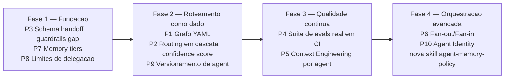
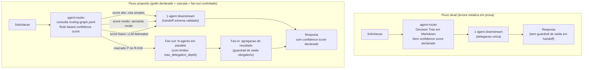

# Proposta — Padrões de Orquestração (LangChain/LangGraph) Aplicados à Governança Agent-First

> **Proveniência**: documento consolidado em duas etapas. Primeira versão baseada em análise do repositório e conhecimento treinado; segunda versão enriquecida com pesquisa ao vivo via Tavily (28/08/2026) cobrindo LangGraph, Anthropic, OpenAI Agents SDK, Microsoft Agent Framework, CrewAI, LangChain Memory, Semantic Routing e AI Agent Evaluation — fontes com URLs reais citadas na [seção 8](#8-referências).

## 1) Objetivo

Comparar a arquitetura de orquestração multi-agent deste repositório (agent-router + downstream + skills de governança) com os padrões de design consolidados no ecossistema LangChain/LangGraph e práticas de mercado equivalentes (Anthropic, OpenAI, AutoGen, CrewAI), e propor melhorias **mantendo a genericidade obrigatória (R-038)** — ou seja, adotar **padrões de design**, não a biblioteca LangChain como dependência técnica.

## 2) Resumo Executivo

- O repositório já implementa, de forma independente, análogos a boa parte dos conceitos centrais do LangChain/LangGraph: `agent-contracts` ≈ *Tool/Agent schemas*, `handoff-governance` ≈ *Command/Send*, `confidence-fallback-policy` ≈ *routing com score*, `context-mode` ≈ *Memory*, `agent-observability-otel` ≈ *LangSmith tracing*, `agent-evals-lab` ≈ *LangSmith Evaluations/DeepEval*.
- O maior gap estrutural é que o roteamento (`agent-router`) é uma **árvore de decisão estática em prosa** (Decision Tree em texto), enquanto o padrão de mercado consolidado em 2026 — LangGraph `StateGraph` LTS, OpenAI Agents SDK, Microsoft Agent Framework (unificação AutoGen + Semantic Kernel GA abr/2026) — é um **grafo de estados explícito e versionado**, com estado tipado, rastreável e checkpointável por design.
- Não há hoje um **schema de estado compartilhado** formal entre agents — o "estado" viaja apenas como texto no `handoff_payload` YAML, sem validação estrutural; o padrão de mercado exige estado tipado como objeto de primeira classe.
- A pesquisa Tavily confirmou que **5 padrões de orquestração multi-agent** se consolidaram em produção em 2026 (fan-out, pipeline, debate, supervisor, swarm) — o repositório cobre implicitamente "supervisor" e "pipeline" mas sem nomeação ou distinção formal entre eles, o que torna a escolha opaca.
- **Context Engineering** (termo cunhado por Andrej Karpathy/Anthropic, 2025) substituiu "Prompt Engineering" como disciplina: a maioria das falhas de agents em produção são falhas de *context assembly* (documentos errados, histórico excessivo, tool definitions ausentes) — a skill `agent-contracts` deveria incluir requisitos de context assembly e prompt caching por agent.
- O gap de **guardrails em handoffs** foi confirmado pelo Tavily como problema explícito documentado no OpenAI Agents SDK: tool guardrails *não* se aplicam a handoffs — os agents intermediários ficam sem validação de saída nessa transição.
- A suíte de evals contínua (`agent-evals-lab`) e observabilidade (`agent-observability-otel`) já seguem o estado da arte 2026 (DeepEval, OTel GenAI semconv) — a lacuna é **execução real em CI** e integração entre as duas camadas (traces de produção alimentando casos de teste automaticamente).
- Recomenda-se evoluir o `agent-router` de "árvore de decisão em Markdown" para um **grafo de roteamento declarado em YAML** com routing em cascata (rule-based → semantic → LLM-based), confidence score reportado explicitamente em cada output, e suíte de evals versionada como quality gate de cada mudança.

## 3) Análise Comparativa — Conceito de Mercado × Equivalente Atual × Gap

| Conceito (LangChain/LangGraph/mercado) | Equivalente atual no repositório | Gap identificado (confirmado via Tavily) |
|---|---|---|
| **Chain** (sequência determinística de passos) | Fluxo `/research` → `/plan` → `/implement` → `/validate`; skills como blocos de conhecimento reutilizável | Chains não são versionadas como artefato reexecutável; cada execução é reconstruída em prosa a cada sessão |
| **Agent** (LLM + tools + loop de decisão) | `.github/agents/*.agent.md` com frontmatter `tools:` | Falta schema de I/O por tool (JSON Schema); `tools:` é lista plana sem tipagem |
| **Tool / Function calling schema** | Nomes de tools no frontmatter (`read_file`, `ctx_search`, etc.) | Sem contrato de argumento/retorno declarado; *Tool Correctness / Argument Correctness* (métricas do `agent-evals-lab`) não têm ground truth para validar |
| **5 padrões de orquestração multi-agent 2026** (fan-out, pipeline, debate, supervisor, swarm) | "supervisor" e "pipeline" existem implicitamente; sem nomeação nem distinção formal | Ausência de nomenclatura formal impede escolha consciente de padrão por caso de uso; custo operacional de supervisor (2 LLM calls/domínio) vs. handoff (1 call) não é considerado |
| **Memory short-term / long-term (LangMem 6 dimensões)** | `context-mode` (`ctx_search`, `ctx_index`, sessão) | Sem distinção formal de tipo, escopo, TTL e permissão de escrita; memória procedimental (agents reescrevendo próprios prompts) inexistente |
| **StateGraph (nós + arestas + estado tipado checkpointável)** | Fluxo descrito em Mermaid (README, CLAUDE.md) — documentação, não objeto de runtime | Estado entre agents não é tipado nem checkpointável; decisões de roteamento não são rastreáveis por design |
| **Router Chain com confidence em cascata** (rule → semantic → LLM-based) | `agent-router` com Decision Tree em Markdown + `confidence-fallback-policy` (0.0–1.0) | Routing rule-based puro sem confidence scoring real; sem logging de top-3 scores por request para calibração; ambiguity zone (top-2 scores dentro de 0.05) não é tratada |
| **Command / Send / Handoff estruturado** | `handoff-governance/SKILL.md` — payload YAML `handoff_payload` | Payload é convenção documental sem schema validável; **gap crítico confirmado**: guardrails de tool *não* se aplicam a handoffs (OpenAI Agents SDK documentado) — agents intermediários ficam sem validação de saída |
| **Context Engineering (Anthropic 2025)** | `agent-contracts/SKILL.md` — entrada/saída mínima | Sem política de context assembly por agent; sem requisito de prompt caching (pode reduzir custo em 90% e latência em 85% segundo Anthropic); sem estrutura XML canônica de system prompt |
| **Human-in-the-loop / interrupt() checkpoint** | R-027 (`ask_questions`), R-031 (plano auto-implementável), `/ctx-checkpoint` | Falta padrão único de ponto de retomada versionado por execução (equivalente a `thread_id` + `checkpoint_id` do LangGraph) |
| **Agent Identity (Microsoft Entra Agent ID / MAF)** | Agent identificado apenas pelo nome em `catalog.yaml` | Sem campos de identidade/autoria em contratos: qual agent emitiu o handoff, com qual modelo, em qual momento — rastreabilidade parcial |
| **Limites de delegação / execução** (CrewAI `max_iter`, `allow_delegation=False`) | Regra "delegação única" + R-027 para bloqueios | Sem `max_delegation_depth`, `max_execution_time` declarados nos contratos — risco de loop de delegação sem circuit breaker |
| **Observability (LangSmith / OTel GenAI / W&B Weave)** | `agent-observability-otel/SKILL.md` (spans `invoke_agent`, `execute_tool`, métricas `gen_ai.*`) | Design alinhado com estado da arte 2026; falta instrumentação ativa e integração `traces de produção → casos de teste` |
| **Evals contínuos em CI (DeepEval / Braintrust)** | `agent-evals-lab/SKILL.md` (design completo com casos + pytest) | Suíte de casos reais não existe no repositório; evals não são quality gate de CI; sem métricas por categoria de agent (routing vs. research vs. implementation) |
| **Versionamento semântico de comportamento de agent** | Arquivos `.agent.md` versionados via Git (implícito) | Sem `version:` no frontmatter; sem distinção entre "breaking change de comportamento" e "ajuste cosmético de texto" |

## 4) Propostas de Melhoria

### 4.1) Prioridade Alta

#### P1 — Formalizar o grafo de roteamento como dado (YAML), não apenas prosa
- **Descrição**: adicionar `docs/ai-context/routing-graph.yaml` com nós = agents, arestas = condições de roteamento (palavras-chave, sinais do R-006, score threshold), mantendo a Decision Tree em `agent-router.agent.md` como *documentação derivada*, não fonte única.
- **Racional** *(confirmado Tavily)*: LangGraph StateGraph LTS (out/2025) consolida grafo como objeto de primeira classe — rastreável, checkpointável, auditável. Hoje adicionar uma rota exige editar `agent-router.agent.md` (prosa) + `catalog.yaml` (metadados) + `copilot-instructions.md` (índice) — 3 pontos de verdade. Um grafo YAML permite validação automática, diffs legíveis e geração de casos de regressão a partir do próprio grafo.
- **Impacto**: `.github/agents/agent-router.agent.md`, `.github/agents/catalog.yaml`, `docs/ai-context/routing-graph.yaml` (novo), `agent-evals-lab` (casos gerados a partir do grafo).
- **Esforço**: Médio.

#### P2 — Routing em cascata com confidence score explícito no output
- **Descrição**: evoluir a `confidence-fallback-policy` para incluir routing em cascata (rule-based → semantic → LLM-based) e exigir que o `agent-router` reporte o score calculado no output (hoje é regra interna implícita). Adicionar logging estruturado de top-3 candidatos por request para calibração contínua.
- **Racional** *(confirmado Tavily)*: RouteLLM (ICLR 2025) mostra redução de custo de ~48-75% roteando apenas 14-26% para modelo forte; calibração de threshold deve ser orientada por *observed false-positive rates* de logs reais, não por intuição. A "ambiguity zone" (top-2 scores dentro de 0.05) requer tiebreaker explícito.
- **Impacto**: `.github/skills/confidence-fallback-policy/SKILL.md` (nova seção de cascata), `.github/agents/agent-router.agent.md` (output com score declarado).
- **Esforço**: Médio.

#### P3 — Schema de estado de handoff versionado + cobertura de guardrails em handoffs
- **Descrição**: (a) promover `handoff_payload` para schema formal validável com campos obrigatórios tipados; (b) adicionar na `handoff-governance` seção explícita sobre o **gap de guardrails em handoffs** — confirmado como problema no OpenAI Agents SDK: tool guardrails *não* se aplicam a handoffs, deixando agents intermediários sem validação de saída.
- **Racional** *(confirmado Tavily)*: documentação oficial do OpenAI Agents SDK descreve este gap e recomenda estratégias compensatórias. Para um ecossistema com 17 agents e roteamento hierárquico, este gap é risco operacional de segurança, não só de formato.
- **Impacto**: `.github/skills/handoff-governance/SKILL.md` (schema + seção de guardrails gap), `.github/skills/agent-contracts/SKILL.md`, `docs/ai-context/schemas/handoff-payload.schema.json` (novo, opcional).
- **Esforço**: Baixo-Médio.

#### P4 — Suíte de evals versionada como quality gate de CI
- **Descrição**: materializar os casos do `agent-evals-lab/SKILL.md` como arquivo versionado em `docs/ai-context/evals/` (casos canônicos, ambíguos, regressão, segurança em YAML/JSON). Integrar com a regra de manutenção: qualquer PR que altere `agent-router.agent.md` deve atualizar a suíte.
- **Racional** *(confirmado Tavily)*: survey LangChain 2025 (1.300+ devs): 57% têm agents em produção; 90% rastreiam; evals ainda "early stage". Padrão emergente: evals rodam em cada commit como quality gates (não apenas em releases), com dataset curado de traces de produção. DeepEval (Apache 2.0) é vendor-neutral e pytest-native — compatível sem lock-in.
- **Impacto**: novo `docs/ai-context/evals/casos-roteamento.yaml`; `.github/skills/agent-evals-lab/SKILL.md` referencia arquivo real.
- **Esforço**: Médio.

### 4.2) Prioridade Média

#### P5 — Context Engineering por agent (Anthropic 2025)
- **Descrição**: adicionar na `agent-contracts/SKILL.md` uma seção de **context assembly** obrigatória: política de prompt caching (conteúdo estático primeiro, variável depois), estrutura XML canônica de system prompt (separação `<instructions>`, `<context>`, `<examples>`, `<input>`), e regra de context budget máximo por agent.
- **Racional** *(confirmado Tavily)*: Anthropic documenta que prompt caching pode reduzir custo em 90% e latência em 85%; "Se um amigo que não conhece seu negócio ler o prompt e ficar confuso, o modelo também ficará" — regra #1 de Anthropic para agents em 2025/2026. Frameworks como Promptfoo (51K+ devs) trazem CI/CD para prompts.
- **Impacto**: `.github/skills/agent-contracts/SKILL.md` (nova seção context assembly).
- **Esforço**: Baixo-Médio.

#### P6 — Padrão "Orchestrator-Workers" para análise paralela (fan-out/fan-in)
- **Descrição**: formalizar em `handoff-governance` um segundo modo de delegação: *fan-out* controlado (N agents em paralelo quando R-018 marca `[P]`) com ponto explícito de *fan-in* (aggregação de resultado antes de responder ao usuário). Documentar custo operacional: supervisor = 2 LLM calls/domínio vs. handoff direto = 1 call.
- **Racional** *(confirmado Tavily)*: LangGraph, OpenAI Agents SDK e Microsoft MAF convergem para o padrão supervisor como default de produção para tarefas cross-domain. CrewAI usa `Process.hierarchical` para isso. O repositório cobre implicitamente supervisor e pipeline, mas sem nomeação formal e sem orientação de quando usar cada um.
- **Impacto**: `.github/skills/handoff-governance/SKILL.md`, `.github/agents/agent-router.agent.md`, `CLAUDE.md` (R-018 ganha nota de aplicação a fan-out de agents).
- **Esforço**: Médio.

#### P7 — Distinção explícita Memory short-term vs long-term + 6 dimensões de memória
- **Descrição**: documentar em `context-mode/SKILL.md` as 6 dimensões de memória (duração, tipo, escopo, estratégia de atualização, mecanismo de retrieval, permissões de escrita), distinguindo short-term (sessão, `ctx_search` local) de long-term (cross-sessão, `ctx_index` persistente). Criar skill candidata `agent-memory-policy` para a dimensão procedimental (agents atualizando próprios prompts).
- **Racional** *(confirmado Tavily)*: LangMem SDK (fev/2025) formaliza 3 tipos de memória long-term — Episódica, Semântica e Procedimental; a procedimental (agents reescrevendo seus próprios system prompts) não tem equivalente no repositório. Mem0 (REST API) oferece alternativa vendor-neutral.
- **Impacto**: `.github/skills/context-mode/SKILL.md`; nova skill candidata `agent-memory-policy` (Fase 4).
- **Esforço**: Baixo.

#### P8 — Limites de delegação e execução declarados nos contratos
- **Descrição**: adicionar campos `max_delegation_depth`, `max_execution_time` e `allow_redelegation` no schema de `agent-contracts`, como campos opcionais com defaults razoáveis.
- **Racional** *(confirmado Tavily)*: CrewAI usa `max_iter` (default 15) e `max_execution_time` para prevenir loops infinitos; `allow_delegation=False` para evitar delegação recursiva. Em 2026, *durable execution* e *circuit breakers* são "table stakes" — sem esses limites, loops de delegação não têm mecanismo de interrupção além das regras de prosa.
- **Impacto**: `.github/skills/agent-contracts/SKILL.md`.
- **Esforço**: Baixo.

### 4.3) Prioridade Baixa

#### P9 — Versionamento semântico de comportamento de agent
- **Descrição**: adicionar campo opcional `version:` no frontmatter de `.agent.md` (ex.: `version: "1.3.0"`), incrementado quando a Decision Tree/critérios de roteamento mudam, permitindo correlacionar regressões de roteamento a mudanças específicas.
- **Racional**: hoje o histórico Git cobre isso implicitamente, mas sem sinal explícito de "breaking change de comportamento" vs. "ajuste cosmético de texto". Alinhado com o padrão de prompt registry emergente.
- **Impacto**: todos os `.github/agents/*.agent.md` (aditivo, não obrigatório de início).
- **Esforço**: Baixo.

#### P10 — Agent Identity nos contratos de handoff
- **Descrição**: adicionar ao `handoff_payload` campos de identidade do agent emissor: nome, versão, modelo LLM usado e timestamp da delegação.
- **Racional** *(confirmado Tavily)*: Microsoft Agent Framework (MAF GA abr/2026) introduz **Microsoft Entra Agent ID** — identidade gerenciada por agent como primitiva de segurança enterprise; a contribuição OTel do MAF rastreia handoffs com identidade como atributo de span.
- **Impacto**: `.github/skills/handoff-governance/SKILL.md` (campos adicionais), `.github/skills/agent-observability-otel/SKILL.md` (correlação com spans).
- **Esforço**: Baixo.

## 5) Riscos e Trade-offs

| Risco | Mitigação |
|---|---|
| Importar terminologia LangChain pode sugerir acoplamento de tecnologia, violando R-038 (Genericidade Obrigatória) | Adotar apenas os **padrões de design** (grafo de estado, memory tiers, fan-out/fan-in, routing em cascata) — nunca referenciar a biblioteca LangChain em si nos arquivos de `.github/`; usar nomenclatura própria do repositório |
| Formalizar schemas (YAML/JSON Schema) pode aumentar carga de manutenção para um repositório que prioriza Markdown legível por humanos | Introduzir schemas de forma **aditiva e opcional** primeiro (P1-P4), validando ganho real antes de tornar obrigatório em R-XXX |
| Fan-out/fan-in (P6) contraria a regra atual "prefira delegação única" e gera overhead de coordenação; custo de 2 LLM calls/domínio no padrão supervisor | Restringir fan-out a casos explicitamente marcados `[P]` pelo R-018; documentar trade-off de custo (supervisor 2x vs. handoff 1x) para escolha consciente |
| Evals reais (P4) podem ficar desatualizados e virar ruído | Vincular atualização da suíte à mesma entrega de qualquer PR que altere `agent-router.agent.md` (análogo ao R-015 para catálogos) |
| Gap de guardrails em handoffs (P3) pode não ser aplicável da mesma forma fora do OpenAI Agents SDK | Tratar como risco genérico de "validação de saída em transições de delegação", não como regra específica do SDK — formulação agnóstica de framework (R-038) |
| Routing em cascata (P2) aumenta latência quando a decisão precisa escalar para o nível LLM | Regra de prioridade: rule-based cobre ~85% dos casos; semantic e LLM são fallbacks raros — latência adicional só ocorre em casos ambíguos genuínos |

## 6) Roadmap Sugerido (Fases)

- **Fase 1 (fundação, baixo risco)**: P3 (schema de handoff + guardrails gap), P7 (memory tiers), P8 (limites de delegação) — mudanças aditivas em skills já existentes, sem novo artefato estrutural.
- **Fase 2 (roteamento como dado)**: P1 (grafo YAML), P2 (routing em cascata com confidence score), P9 (versionamento semântico) — muda a fonte de verdade do roteamento sem alterar comportamento observável.
- **Fase 3 (qualidade contínua)**: P4 (suíte de evals real em CI) e P5 (context engineering) — fecha o ciclo de regressão e custo/latência.
- **Fase 4 (orquestração avançada)**: P6 (fan-out/fan-in), P10 (agent identity), nova skill `agent-memory-policy` — mudanças de maior esforço, dependem das fases anteriores estáveis.

## 7) Comparativo de Fluxo — Atual vs. Proposto

## 8) Referências

> Fontes verificadas via pesquisa Tavily ao vivo em 28/08/2026.

### LangGraph / LangChain
- *Multi-Agent Orchestration: 5 Patterns That Work in 2026*: https://www.digitalapplied.com/blog/multi-agent-orchestration-5-patterns-that-work
- *LangGraph Supervisor vs Swarm: Tradeoffs and Architecture*: https://focused.io/lab/multi-agent-orchestration-in-langgraph-supervisor-vs-swarm-tradeoffs-and-architecture
- *AI Agent Orchestration Frameworks Guide 2026*: https://levelop.dev/blog/ai-agent-orchestration-frameworks-guide-2026
- LangChain — Conceitos (Chains, Agents, Tools, Memory): https://docs.langchain.com/oss/python/concepts/memory
- LangGraph — Multi-agent systems (StateGraph, Command, Send): https://langchain-ai.github.io/langgraph/concepts/multi_agent/
- *LangMem SDK Launch (fev/2025)*: https://www.langchain.com/blog/langmem-sdk-launch
- *Best AI Agent Memory Frameworks 2026*: https://atlan.com/know/best-ai-agent-memory-frameworks-2026

### Anthropic
- *Building Effective AI Agents (eBook)*: https://resources.anthropic.com/building-effective-ai-agents
- *AWS re:Invent 2025 — What Anthropic Learned Building AI Agents in 2025*: https://dev.to/kazuya_dev/aws-reinvent-2025-what-anthropic-learned-building-ai-agents-in-2025-aim277-16lc
- *Writing Tools for Agents (Anthropic Engineering)*: https://www.anthropic.com/engineering/writing-tools-for-agents
- *Context Engineering (Sourcegraph 2025)*: https://sourcegraph.com/blog/context-engineering

### OpenAI
- *OpenAI Agents SDK — Guardrails, Handoffs, and Orchestration*: https://openai.github.io/openai-agents-python/guardrails
- *OpenAI Agents SDK Features Review*: https://mem0.ai/blog/openai-agents-sdk-review
- OpenAI Agents SDK Documentation: https://developers.openai.com/api/docs/guides/agents

### Microsoft (AutoGen / Semantic Kernel / MAF)
- *Microsoft Agent Framework: The Architecture Behind the Convergence*: https://mikezupper.com/posts/microsoft-agent-framework-architecture-overview
- *Two Lineages, One Framework: AutoGen + Semantic Kernel = MAF*: https://alexbevi.com/blog/2026/06/18/two-lineages-one-framework-how-autogen-and-semantic-kernel-became-the-microsoft-agent-framework
- *Microsoft Agent Framework Production-Ready Convergence*: https://cloudsummit.eu/blog/microsoft-agent-framework-production-ready-convergence-autogen-semantic-kernel

### CrewAI
- *Orchestrating Specialist AI Agents with CrewAI*: https://activewizards.com/blog/orchestrating-specialist-ai-agents-with-crewai-a-guide
- *AI Agents Guide for Developers: LangChain & CrewAI*: https://daily.dev/blog/ai-agents-guide-for-developers-langchain-crewai

### Routing e Confidence Score
- *AI Agent Model Routing and Dynamic Model Selection Strategies*: https://zylos.ai/research/2026-03-02-ai-agent-model-routing
- *Router-Based Agents: The Architecture Pattern That Makes AI Systems Scale*: https://pub.towardsai.net/router-based-agents-the-architecture-pattern-that-makes-ai-systems-scale-a9cbe3148482
- *How to Implement Semantic Routing for AI Agents*: https://truto.one/blog/how-to-implement-semantic-routing-for-ai-agents-to-select-api-endpoints
- *AI Agent Routing — Patronus AI*: https://www.patronus.ai/ai-agent-development/ai-agent-routing
- *Confidence-Based Routing — LlamaIndex*: https://www.llamaindex.ai/glossary/confidence-based-routing

### Avaliação Contínua (Evals)
- *Top AI Agent Evaluation Tools in 2026*: https://www.goodeyelabs.com/articles/top-ai-agent-evaluation-tools-2026
- *Maxim AI vs DeepEval vs LangSmith vs QA Wolf*: https://www.sitepoint.com/maxim-ai-vs-deepeval-vs-langsmith-vs-qa-wolf-which-ai-agent-testing-framework-should-you-trust-with-production-in-2026
- *Top 5 LLM Evaluation Frameworks — DeepEval Blog*: https://deepeval.com/blog/top-5-llm-evaluation-frameworks
- *Open Source Free AI Agent Evaluation Tools*: https://datatalks.club/blog/open-source-free-ai-agent-evaluation-tools.html

### Observabilidade
- OpenTelemetry GenAI Semantic Conventions v1.41: https://opentelemetry.io/docs/specs/semconv/gen-ai/
- *AI Agent Observability 2026 — Tracing & Monitoring Stack*: https://www.digitalapplied.com/blog/ai-agent-observability-2026-tracing-monitoring-stack-guide

---

**Documentos internos usados como base de comparação:**
- [`../../CLAUDE.md`](../../CLAUDE.md)
- [`../../.github/copilot-instructions.md`](../../.github/copilot-instructions.md)
- [`../../.github/agents/agent-router.agent.md`](../../.github/agents/agent-router.agent.md)
- [`../../.github/agents/catalog.yaml`](../../.github/agents/catalog.yaml)
- [`../../.github/skills/agent-contracts/SKILL.md`](../../.github/skills/agent-contracts/SKILL.md)
- [`../../.github/skills/handoff-governance/SKILL.md`](../../.github/skills/handoff-governance/SKILL.md)
- [`../../.github/skills/confidence-fallback-policy/SKILL.md`](../../.github/skills/confidence-fallback-policy/SKILL.md)
- [`../../.github/skills/context-mode/SKILL.md`](../../.github/skills/context-mode/SKILL.md)
- [`../../.github/skills/agent-observability-otel/SKILL.md`](../../.github/skills/agent-observability-otel/SKILL.md)
- [`../../.github/skills/agent-evals-lab/SKILL.md`](../../.github/skills/agent-evals-lab/SKILL.md)

