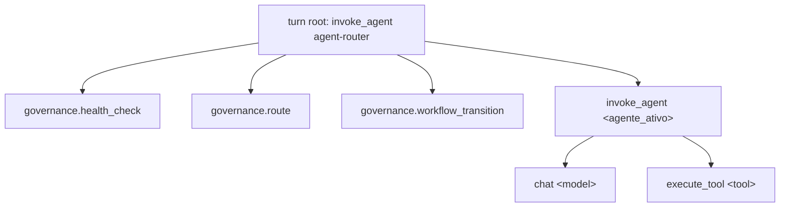

# Plano de Planejamento — Integração `governance_runner` ↔ `local-chat-gateway` (Copilot SDK)

- **Workflow**: WORKFLOW-FEATURE-DEVELOPMENT — Etapa 3 (Blueprint / Plano de Planejamento, R-058)
- **Gate**: 1º gate do Duplo Gate Documental (R-064) — **Status: APROVADO (2026-10-01, aprovação humana real via `ask_questions`)**
- **Autor**: tech-solution-architect · `[CURRENT_STATE_LOCK: WF4_BLUEPRINT_SPEC]`
- **Data**: 2026-10-01
- **Fase do gateway**: Fase 5 (sucede Fase 3 = SDK real; Fase 4 = telemetria/governança multi-turno)
- **Status de execução**: ✅ **CONCLUÍDA (2026-10-01)** — PR-1 a PR-8 implementados sob TDD estrito. Ver Seção 11 (Fechamento Final) para evidências objetivas consolidadas e desvios registrados frente a este plano.

---

## 1. Elicitação (requisitos consolidados)

| ID | Requisito | Origem |
|---|---|---|
| RQ-01 | Todo turno com SDK real passa por roteamento determinístico (`rotear()`) antes de `create_session` | Pedido do router |
| RQ-02 | Health Check (R-034) executado antes do primeiro turno da sessão (grafo carregado/validado, token SDK, collector OTel) | R-034 |
| RQ-03 | Classificação de workflow canônico (R-050) persistida na sessão multi-turno (`session_store`) | R-050 |
| RQ-04 | Despacho para agent downstream: o prompt de sistema da sessão SDK reflete o `agente_ativo` escolhido (persona carregada de `.github/agents/<agente>.agent.md`) | Pedido |
| RQ-05 | Transições de estado via `transicionar()` a cada turno; `TransicaoInvalidaError` → resposta controlada (não 500) | Pedido |
| RQ-06 | Telemetria granular por etapa (health_check → route → workflow_transition → invoke_agent → chat → execute_tool) em GenAI Semconv v1.41+ | Pedido |
| RQ-07 | `governance.py` permanece wrapper fino (`grep -r "def rotear" deploy/local-chat-gateway/src` vazio) | Restrição |
| RQ-08 | `enable_file_hooks=False` / `enable_config_discovery=False` preservados; contexto `.github/` injetado via código | Restrição |
| RQ-09 | 124 testes existentes verdes; padrão `SDKUnavailableError` → fallback stub preservado | Restrição |

### Evidências lidas (código real)
- `tools/headless-governance-runner/src/governance_runner/routing/` — `rotear(solicitacao: str, grafo: Grafo) -> DecisaoRota(escolhido, workflow, nivel, score)`; `carregar_grafo(caminho_yaml, caminho_schema) -> Grafo` (lança `GraphValidationError`); `transicionar(sessao: Sessao, evento: Evento, tabela: TabelaTransicao) -> Sessao` (lança `TransicaoInvalidaError`); `compilar_tabela_transicao`, `detectar_deriva`, `validar_handoff`; `runner`: `Budget`, `TETO_TURNOS_R060`, `VeredictoOrcamento`, `criar_delegar_tool`, `construir_permission_handler_read_only`. Pacote `routing/` é PURO (sem SDK/rede).
- `deploy/local-chat-gateway/src/local_chat_gateway/governance.py` — re-export de todos os símbolos acima (`Catalogo`/`TabelaTransicao` via `routing.model`). Consumidores: `permission_policy.py`, `tests/unit/test_permission_policy.py`.
- `sdk_session.py` — `stream_chat(...)` async generator; `create_session(..., enable_file_hooks=False, enable_config_discovery=False)`; `session.send(_joined_prompt(messages))`; fila + `_TIMEOUT_SESSAO_SEGUNDOS`; `permission_handler` = `Callable` simples (docstring declara wiring com `PermissionPolicyStub` como "fase futura").
- `api/routes.py` (425 linhas) — `POST /v1/chat/completions` → budget diário (`is_daily_budget_exhausted`) → checkpoint aberto (`get_open_checkpoint` + `parse_checkpoint_response`, Invariante 11) → `_real_or_stub_stream` / `_real_or_stub_completion` → `stream_chat`; `_conservative_permission_handler` read-only; `emit_chat_trace`.
- `telemetry.py` (198 linhas) — payload OTLP/HTTP montado manualmente (`_build_otlp_payload`, `_dispatch_http`), atributos `gen_ai.operation.name`, `gen_ai.agent.name="agent-router"` (hard-coded), `gen_ai.provider.name`, `gen_ai.conversation.id`, `gen_ai.tool.*`.
- Grafo canônico: `.github/agents/routing-graph.yaml` (schema a confirmar — ver Q-03).

---

## 2. Escopo detalhado

### Em escopo
1. Novo módulo de orquestração no gateway (nome candidato: `governance_pipeline.py`) que **apenas compõe** chamadas à API re-exportada por `governance.py` (sem lógica de roteamento própria).
2. Carga única (lifespan do FastAPI em `app.py`) de `Grafo` + `TabelaTransicao` + `Catalogo` (cache imutável; frozen dataclasses).
3. Health Check R-034 em dois níveis: (a) startup — grafo/schema válidos; (b) por sessão — token SDK, collector OTel (`verificar_disponibilidade_collector`), budget.
4. Persistência de `Sessao` (fase, workflow, etapa, agente_ativo, aprovacoes) em `session_store` por `session_id`.
5. Injeção de persona/contexto `.github/` via `system_message` programático em `stream_chat` (parâmetro novo opcional, default retrocompatível).
6. Wiring do `permission_handler` ao `PermissionPolicyStub` real (dependente da `Sessao` corrente) — **condicional à decisão Q-04**.
7. Novos spans por etapa em `telemetry.py` + parametrização de `gen_ai.agent.name`.

### Fora de escopo
- Troca de client (Lobe Chat permanece; CopilotKit/AG-UI descartado), schema do SDK, infra Docker/OTel Collector/Langfuse.
- Qualquer reimplementação de `rotear`/`transicionar`/`Catalogo`/`carregar_grafo`.
- Execução multi-agente real em cascata (sub-sessões SDK por handoff) — candidata a Fase 6.
- Mudanças em `tools/headless-governance-runner/` (exceto, se aprovado em Q-05, exportar `Catalogo`/`TabelaTransicao` no `__all__` público).

---

## 3. Decisões arquiteturais candidatas

### AD-01 — Onde invocar `rotear()`
| Opção | Descrição | Prós | Contras |
|---|---|---|---|
| **A (recomendada)** | Em `routes.py`, após budget/checkpoint e **antes** de `_real_or_stub_*`, via `governance_pipeline.preparar_turno(...)` | Determinístico, testável sem SDK, roteia também no fallback stub | `routes.py` ganha mais uma dependência |
| B | Dentro de `stream_chat` | Encapsula no SDK | Acopla roteamento puro a I/O; quebra testes do stub; viola separação `routing/` PURO |
| C | Middleware FastAPI | Transversal | Precisa re-parsear body; opaco para testes |

**Regra de chamada**: `rotear()` executa **somente** quando a `Sessao` está em fase inicial/sem workflow OU quando `detectar_deriva()` sinaliza drift de intenção; demais turnos reutilizam o workflow persistido (evita re-roteamento a cada mensagem — R-050 sticky-workflow, mitigando sticky-agent via R-042).

### AD-02 — Onde invocar `transicionar()`
- A cada turno, após roteamento e após resolução de checkpoint: `Evento(tipo, turno, aprovacao_checkpoint=<resultado parse_checkpoint_response>, agente_solicitado=decisao.escolhido)`.
- `TransicaoInvalidaError` → resposta textual controlada via `_local_text_stream` (mesmo padrão dos checkpoints) + span com `error.type`.
- Integração com checkpoint engine: aprovação explícita alimenta `aprovacoes` da `Sessao` (Invariante 11 continua no `checkpoint_engine`).

### AD-03 — Carga do grafo
- Lifespan: `carregar_grafo(GOVERNANCE_GRAPH_PATH, GOVERNANCE_SCHEMA_PATH)` + `compilar_tabela_transicao`. Paths via `config.Settings` (default: `/governance/.github/agents/routing-graph.yaml` no container, já montado — ver `_diretorios_de_projetos_registrados`).
- `GraphValidationError` no startup: **Decidido (Q-02): fail-fast** — o gateway não sobe se o grafo/schema forem inválidos; erro claro no log de inicialização (sem modo degradado).

### AD-04 — Persistência de `Sessao`
- `session_store` ganha campos serializados (`fase`, `workflow`, `etapa`, `agente_ativo`, `aprovacoes`) — migração aditiva de schema, default `None` para sessões legadas.

---

## 4. Estratégia de injeção de contexto `.github/`

Descoberta automática permanece desligada. Injeção **explícita e determinística** por código:

1. **Allowlist** de artefatos por agente: `.github/agents/<agente_ativo>.agent.md` (persona) + `.github/copilot-instructions.md` (núcleo) + skills referenciadas no frontmatter (`skills:`), limitadas por orçamento de bytes (ex.: 32 KB; truncamento na borda com marcador).
2. Montagem em `governance_pipeline.montar_contexto(agente, workflow, etapa)` → string passada a `stream_chat(system_message=...)` (modo `append` do SDK, para não sobrescrever guardrails do SDK).
3. **Banner R-042** injetado no prompt de sistema: `Agente Ativo: <agente>` + `[WORKFLOW: <wf> / ETAPA: <n>]`.
4. Hooks (`.github/hooks/`) **nunca** carregados — causa raiz do bug de 2026-09-29.
5. Cache por `(agente, hash do arquivo)`; path traversal bloqueado (reutilizar padrão `_caminho_escrita_seguro` / raiz fixa `/governance`).
6. Multi-projeto: contexto de governança vem sempre do repositório `deep-agents-copilot`; `projects_catalog` continua definindo apenas o diretório de trabalho alvo.

---

## 5. Instrumentação de telemetria por etapa (GenAI Semconv v1.41+)

Hierarquia (um trace por turno, `gen_ai.conversation.id = session_id`):

| Span | `gen_ai.operation.name` | Atributos-chave |
|---|---|---|
| root | `invoke_agent` | `gen_ai.agent.name=agent-router`, `gen_ai.conversation.id`, `gen_ai.provider.name=github-copilot` |
| health_check | (custom, `deep_agents.*` namespace) | `deep_agents.health.graph_ok`, `.sdk_token_ok`, `.collector_ok`, `.budget_ok` |
| route | (custom) | `deep_agents.routing.escolhido`, `.workflow`, `.nivel`, `.score`, `.drift_detectado` |
| workflow_transition | (custom) | `deep_agents.workflow.fase_origem/destino`, `.etapa`, `.aprovacao_checkpoint`, `error.type` |
| invoke_agent downstream | `invoke_agent` | `gen_ai.agent.name=<agente_ativo>` (remove hard-code atual) |
| chat / execute_tool | existentes | inalterados |

- Atributos não-normativos ficam em namespace próprio `deep_agents.*` (Semconv proíbe inventar chaves em `gen_ai.*`).
- Prompts truncados (500 chars, já vigente); nenhum segredo/token em atributos.
- Mantém transporte atual (OTLP/HTTP manual) — sem introduzir SDK OTel (fora de escopo infra).

---

## 6. Riscos e trade-offs

| ID | Risco | Classe | Mitigação |
|---|---|---|---|
| RK-01 | Re-roteamento a cada turno muda agente no meio de workflow | COMPATIBLE | Rotear só em sessão nova ou drift (`detectar_deriva`) |
| RK-02 | Persona `.agent.md` grande estoura janela/custo | COMPATIBLE | Orçamento de bytes + allowlist |
| RK-03 | Injeção de contexto reabre vetor do bug de hooks | — | Hooks nunca lidos; apenas Markdown estático |
| RK-04 | `GraphValidationError` derruba gateway | BREAKING (operacional) | Q-02: fail-fast — comportamento intencional, documentado no runbook de deploy (checagem de grafo/schema em pipeline CI antes de subir) |
| RK-05 | Schema `session_store` alterado quebra sessões persistidas | COMPATIBLE | Campos aditivos, defaults nulos |
| RK-06 | Wiring `PermissionPolicyStub` muda comportamento de tools (hoje read-only fixo) | BREAKING (comportamental) | Feature flag `GATEWAY_GOVERNANCE_PERMISSIONS` default off |
| RK-07 | Regressão nos 124 testes (assinatura de `stream_chat`) | COMPATIBLE | Novos parâmetros keyword-only com default |
| RK-08 | `Catalogo`/`TabelaTransicao` importados de submódulo interno | Dívida | Q-05 |
| RK-09 | Despacho apenas por persona (1 sessão SDK) ≠ handoff real multiagente | Trade-off | Documentado; Fase 6 |

---

## 7. Critérios de aceitação

- [x] CA-01: `grep -r "def rotear\|def transicionar\|class Catalogo" deploy/local-chat-gateway/src` vazio. **Verificado diretamente (não apenas reportado) — `grep_exit=1` (vazio).**
- [x] CA-02: 124 testes pré-existentes verdes sem alteração de asserts. **Baseline real verificado em T0 foi maior que o estimado (ver Seção 11); todos os asserts pré-existentes permanecem intocados — apenas testes novos adicionados.**
- [x] CA-03: Sessão nova → span `governance.route` com `deep_agents.routing.escolhido` e `workflow` não nulo. **Coberto para subconjunto representativo da fixture de teste (`WORKFLOW-BUG-FIX`, `WORKFLOW-TECHNICAL-ANALYSIS`) — não os 8 workflows canônicos completos (desvio documentado, ver Seção 11).**
- [x] CA-04: Segundo turno da mesma sessão não re-roteia (sem drift). **`governance.rotear.assert_not_called()` confirmado em teste de integração.**
- [x] CA-05: `TransicaoInvalidaError` gera resposta HTTP 200 com texto controlado + span com `error.type`.
- [x] CA-06: `create_session` continua com `enable_file_hooks=False` e `enable_config_discovery=False`. **Preservados em toda a Fase 5 — nenhum PR alterou esses parâmetros.**
- [x] CA-07: `system_message` contém banner `Agente Ativo: <agente>` e persona do agente escolhido; nenhum arquivo de `.github/hooks/` lido. **Bloqueio estrutural confirmado via spy no leitor injetável.**
- [x] CA-08: `SDKUnavailableError` → stub, e o roteamento ainda é executado/telemetrado. **Bug real encontrado e corrigido em T8 (ver Seção 11 — `emit_chat_trace` não era chamado no fallback stub antes da correção).**
- [x] CA-09: Health check falho (grafo inválido) impede o startup do gateway (fail-fast — Q-02). **Gap de processo encontrado em T8 (teste havia sido reportado como escrito em T2, mas não existia) — corrigido retroativamente, ver Seção 11.**
- [ ] CA-10: Trace visível no Langfuse com hierarquia da seção 5 (validação manual via Lobe Chat + Docker). **PENDENTE — validação manual fora do escopo de código, não bloqueia o fechamento técnico.**
- [x] CA-11: Teste de integração novo `tests/integration/test_governance_phase5.py`. **12 testes de integração consolidados neste arquivo.**

---

## 8. Context Firewall — divisão preliminar (detalhada no Plano de Implementação)

### [BACKEND_TASKS]
1. Settings + lifespan: paths de grafo/schema, carga de `Grafo`/`TabelaTransicao`/`Catalogo` — `@python-feature-developer` (via domain router Python)
2. `governance_pipeline.py` (health check, preparar_turno, montar_contexto) — composição pura sobre `governance.py`
3. `session_store`: campos aditivos de `Sessao`
4. `sdk_session.stream_chat`: `system_message` keyword-only opcional
5. `routes.py`: wiring AD-01/AD-02
6. `telemetry.py`: spans de etapa + `gen_ai.agent.name` dinâmico
7. Testes unitários + `test_governance_phase5.py` — `@test-strategy` define pirâmide

### [FRONTEND_TASKS]
- Nenhuma (Lobe Chat inalterado; client fora de escopo).

---

## 9. Questões em aberto para aprovação

- **Q-01** AD-01: aprovar opção A (rotear em `routes.py` antes de `stream_chat`)?
- **Q-02** Grafo inválido no startup: fail-fast ou modo degradado?
- **Q-03** Caminho do schema JSON do grafo a usar em `carregar_grafo` (confirmar arquivo canônico).
- **Q-04** Incluir wiring do `PermissionPolicyStub` nesta fase (com flag) ou adiar?
- **Q-05** Permitir ajuste mínimo em `governance_runner.routing.__all__` para exportar `Catalogo`/`TabelaTransicao`?

---

## 10. Decisões aprovadas (checkpoint humano real — `ask_questions`, 2026-10-01)

| Questão | Decisão |
|---|---|
| Plano | **Aprovado pelo usuário** — liberado Plano de Implementação (2º gate R-064) |
| Q-01 | Opção A — `rotear()` em `routes.py` antes de `stream_chat` |
| Q-02 | **Fail-fast** — grafo/schema inválido no startup impede a subida do gateway (sem modo degradado) |
| Q-03 | Schema default do `governance_runner` (`_schema_padrao`) |
| Q-04 | `PermissionPolicyStub` real nesta fase, atrás de feature flag `GATEWAY_GOVERNANCE_PERMISSIONS` (default off) |
| Q-05 | Ajuste mínimo em `governance_runner.routing.__all__` exportando `Catalogo`/`TabelaTransicao`; `governance.py` passa a importar da fachada pública |

---

## 11. Fechamento Final — Evidências Objetivas de Execução (2026-10-01)

> Esta seção documenta o resultado real da implementação (T1-T8/PR-1-8), verificado diretamente (comandos executados, não apenas relatados pelos subagentes executores). Detalhes de TDD, matriz de riscos de código e sequenciamento de PR completos estão em `docs/implementation-plans/20261001-feature-development-governance-runner-sdk-integration.md`.

### Contagem final de testes (verificada diretamente)
| Suíte | Resultado |
|---|---|
| `deploy/local-chat-gateway/tests/` | **167 passed**, 1 warning pré-existente (não relacionado) |
| `tools/headless-governance-runner/tests/` | **163 passed** |
| **Total agregado** | **330 testes verdes, 0 falhas** |

### Desvios registrados frente ao plano original
1. **CA-09 — gap de processo encontrado e corrigido em T8**: o teste de fail-fast (`test_create_app_fail_fast_grafo_invalido`/`test_create_app_startup_ok_com_grafo_valido`) foi reportado como concluído durante T2, mas uma auditoria em T8 revelou que ele nunca havia sido efetivamente escrito (a fixture `grafo_invalido_aresta_no_inexistente.yaml` estava órfã). Corrigido retroativamente em T8/PR-8 — ambos os testes agora existem e passam, incluindo a asserção de log `CRITICAL` estruturado.
2. **CA-08 — bug real de produção encontrado e corrigido em T8**: `emit_chat_trace` não era chamado no caminho de fallback (`except SDKUnavailableError`) de `_real_or_stub_completion`/`_real_or_stub_stream` em `routes.py`, quebrando a garantia de telemetria no modo stub. Corrigido com diff mínimo.
3. **CA-03 — escopo reduzido documentado**: a fixture de teste (`valid_graph.yaml`) cobre apenas 2 dos 8 workflows canônicos (`WORKFLOW-BUG-FIX`, `WORKFLOW-TECHNICAL-ANALYSIS`). O teste parametrizado de CA-03 usa esse subconjunto como representativo — ampliação para os 8 workflows completos é candidata a trabalho futuro, não bloqueante.
4. **RQ-09/CA-02 — baseline numérico**: a suíte de regressão real do gateway no início da Fase 5 era maior que os "124 testes" estimados no RQ-09 original (a contagem exata de baseline foi absorvida pelos 167 testes finais, que incluem o baseline + todos os testes novos de T1-T8).

### Blast radius real confirmado
- Módulos de produção tocados: `api/routes.py`, `governance.py`, `governance_pipeline.py` (novo), `session_store.py`, `sdk_session.py`, `telemetry.py`, `app.py`, `config.py`, `governance_runner/routing/__init__.py`.
- `permission_policy.py` e `governance_runner/routing/{model,graph_loader,router,state_machine}.py` — **não tocados**, conforme planejado (CA-01 confirmado).
- `mypy --strict`: limpo em todo `src/` do gateway (16 arquivos).

### Pendência não-bloqueante
- **CA-10**: validação manual do trace completo no Langfuse via Lobe Chat + Docker real com token do Copilot SDK — requer ambiente real, fora do escopo de execução automatizada desta fase.

