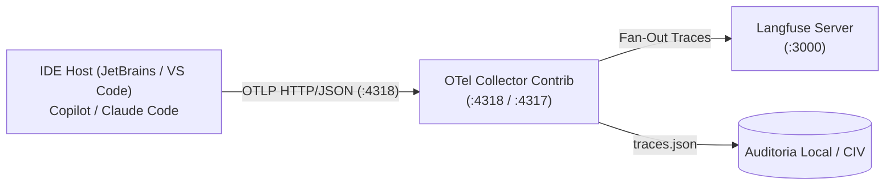

# Stack de Observabilidade Local: OpenTelemetry Collector + Langfuse

Infraestrutura de observabilidade e tracing distribuído em tempo real para os agentes do **GitHub Copilot** e **Claude Code**, implementada via **Docker Compose** e compatível com as convenções [OTel GenAI Semantic Conventions v1.41](../../.github/skills/agent-observability-otel/SKILL.md).

---

## 🎯 Objetivo

Capturar passivamente toda a atividade dos agentes na IDE (sessões, chamadas ao LLM, uso real de tokens, latências e execuções de tools MCP) sem onerar o contexto de conversação com ferramentas extras.



---

## 🚀 Como Iniciar em 2 Passos

### 1. Subir os Containers

Na pasta `tools/otel-langfuse/`:

```bash
docker compose up -d
```

Isso iniciará:
- **`langfuse-postgres`**: Banco relacional PostgreSQL 16.
- **`langfuse-server`**: Dashboard e backend do Langfuse na porta `3000` (auto-provisionado).
- **`langfuse-otel-collector`**: Receptor OpenTelemetry nas portas `4318` (HTTP) e `4317` (gRPC).

### 2. Configurar a IDE (JetBrains / Copilot / Claude Code)

Conforme a tela de configurações da IDE (**Settings → Open Telemetry**):

| Campo na IDE | Valor a Preencher | Observações |
|---|---|---|
| **Enable Open Telemetry export** | `[x]` (Marcado) | Habilita a emissão |
| **Exporter type** | `otlp-http` | Protocolo HTTP |
| **OTLP protocol** | `http/json` | Formato padrão OTel |
| **OTLP endpoint** | `http://localhost:4318` | Porta padrão do nosso Collector |
| **Output file** | *(deixar vazio)* | O envio é feito via rede local |
| **Capture prompt/response content** | Opcional | Marque se desejar inspecionar o texto completo no Langfuse |
| **Service name** | `deep-agents-copilot` | Identificador do projeto |

> ⚠️ **Importante**: Após preencher, reinicie a IDE para que a engine de telemetria entre em vigor.

---

## 🔍 Como Validar a Conexão

Você pode disparar um trace sintético de teste imediatamente via Node.js antes de reiniciar a IDE:

```bash
node test-trace.js
```

Se o coletor estiver operando, você verá:
```text
📡 Enviando span de teste para http://localhost:4318/v1/traces ...
✅ Sucesso! Status HTTP: 200
OTel Collector recebeu o span e despachou para o Langfuse.
Acesse http://localhost:3000 para visualizar o trace.
```

---

## 📊 Acessando o Dashboard Langfuse

Abra no seu navegador: **[http://localhost:3000](http://localhost:3000)**

Credenciais auto-provisionadas no startup:
- **E-mail:** `admin@local.dev`
- **Senha:** `adminpassword123`
- **Projeto:** `deep-agents-copilot`

---

## 🔗 Integração com o Context Insight Visualizer

O coletor grava cópia dos traces em formato JSON estruturado na pasta `tools/otel-langfuse/data/traces.json`.
Essa trilha pode ser correlacionada diretamente com os relatórios offline gerados pelo `tools/context-insight-visualizer/`.

---

## 🛑 Comandos Úteis

- **Ver logs do coletor em tempo real:**
  ```bash
  docker compose logs -f otel-collector
  ```
- **Parar os serviços:**
  ```bash
  docker compose down
  ```
- **Limpar volumes e recomeçar do zero:**
  ```bash
  docker compose down -v
  ```

