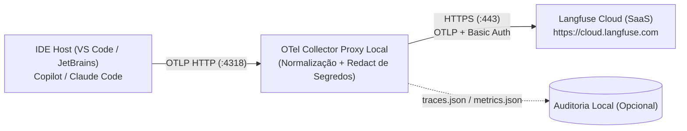

# Observabilidade de Agents: OpenTelemetry Collector Proxy + Langfuse Cloud

Infraestrutura de observabilidade e tracing distribuído em tempo real para os agentes do **GitHub Copilot** e **Claude Code**, utilizando **Langfuse Cloud** (SaaS gerenciado) em conformidade com as convenções [OTel GenAI Semantic Conventions v1.41+](../../.github/skills/agent-observability-otel/SKILL.md).

> [!WARNING]
> **Limitação Conhecida (Known Issue - IntelliJ IDEA)**:
> A exportação nativa de telemetria OTel pelo plugin do **GitHub Copilot no IntelliJ IDEA** ainda **não emite os traces esperados** para o coletor local (`http://127.0.0.1:4318`), tratando-se de uma limitação do plugin da IDE.
> 
> Em contrapartida, o pipeline de infraestrutura — composto pelo **OTel Collector Proxy Local**, autenticação OTLP e despacho para o **Langfuse Cloud** — está **comprovadamente testado e 100% operacional** via testes sintéticos (`test-trace.js` e `test_trace.py`).

---

## 🎯 Por que Langfuse Cloud? (Zero Footprint Local)

A arquitetura adota **Langfuse Cloud** (plano gratuito generoso de até **50.000 traces/mês**) em substituição ao stack Docker local:
- 🚀 **Zero CPU e RAM local**: Elimina a necessidade de contêineres pesados como PostgreSQL, ClickHouse, MinIO e Redis rodando localmente.
- 🛡️ **Foco em Governança**: Mantém a máquina de desenvolvimento leve, ágil e focada na execução dos agentes e testes.
- 🌐 **Dashboard Gerenciado e Evals**: Interface web pronta e mantida em alta disponibilidade em [cloud.langfuse.com](https://cloud.langfuse.com).

---

## 🏛️ Arquitetura de Telemetria


```mermaid
flowchart LR
    IDE["IDE Host (VS Code / JetBrains)\nCopilot / Claude Code"] -- "OTLP HTTP (:4318)" --> Collector["OTel Collector Proxy Local\n(Normalização + Redact de Segredos)"]
    Collector -- "HTTPS (:443)\nOTLP + Basic Auth" --> LangfuseCloud["Langfuse Cloud (SaaS)\nhttps://cloud.langfuse.com"]
    Collector -. "traces.json / metrics.json" .-> LocalLog[("Auditoria Local (Opcional)")]
```

Existem duas formas de conexão suportadas:
1. **Via OTel Collector Proxy Local (Recomendado)**: O coletor roda como processo leve em background, mascarando segredos locais e normalizando Semconv v1.41+ antes do envio seguro para a nuvem.
2. **Direto da IDE/MCP para Langfuse Cloud**: A IDE despacha OTLP HTTP diretamente para o endpoint SaaS com header Basic Auth, sem necessidade de coletor local intermediário.

---

## 🚀 Configuração Rápida em 3 Passos

### 1. Criar Projeto no Langfuse Cloud
1. Acesse **[cloud.langfuse.com](https://cloud.langfuse.com)** (ou `us.cloud.langfuse.com` para região US) e faça login gratuito.
2. Crie um projeto chamado, por exemplo, `deep-agents-copilot`.
3. Navegue até **Settings → API Keys** e gere um novo par de chaves:
   - **Public Key**: `pk-lf-...`
   - **Secret Key**: `sk-lf-...`
4. Crie o token Basic Auth em Base64 combinando `public_key:secret_key`:
   - **Linux/macOS / Git Bash**:
     ```bash
     echo -n "pk-lf-xxx:sk-lf-yyy" | base64
     ```
   - **PowerShell (Windows)**:
     ```powershell
     [Convert]::ToBase64String([Text.Encoding]::UTF8.GetBytes("pk-lf-xxx:sk-lf-yyy"))
     ```

### 2. Configurar o Arquivo `.env`
Copie o exemplo e insira seu token:
```bash
cp .env.example .env
```
Preencha a variável `LANGFUSE_OTLP_AUTH` com a string Base64 gerada.

### 3. Executar o Coletor Leve (Proxy OTel)
Você pode rodar apenas o coletor OTel Contrib oficial sem nenhum banco local:

**Via Docker (Apenas o coletor leve, ~45MB RAM, 0% CPU):**
- **Git Bash (Windows)**:
  ```bash
  MSYS_NO_PATHCONV=1 docker run -d \
    --name otel-proxy \
    --restart unless-stopped \
    -p 4318:4318 -p 4317:4317 \
    -e LANGFUSE_OTLP_AUTH="<seu_token_base64>" \
    -v "d:/workspace/deep-agents-copilot/tools/otel-langfuse/otel-collector-config.yaml:/etc/otelcol-contrib/config.yaml:ro" \
    otel/opentelemetry-collector-contrib:latest \
    --config=/etc/otelcol-contrib/config.yaml
  ```
- **Linux / macOS**:
  ```bash
  docker run -d \
    --name otel-proxy \
    --restart unless-stopped \
    -p 4318:4318 -p 4317:4317 \
    -e LANGFUSE_OTLP_AUTH="<seu_token_base64>" \
    -v "$(pwd)/otel-collector-config.yaml":/etc/otelcol-contrib/config.yaml:ro \
    otel/opentelemetry-collector-contrib:latest \
    --config=/etc/otelcol-contrib/config.yaml
  ```

---

## ⚙️ Configuração da IDE (IntelliJ IDEA e VS Code)

### IntelliJ IDEA (JetBrains) — *Limitação Conhecida*

> **Aviso:** A funcionalidade de exportação no plugin JetBrains do GitHub Copilot encontra-se inativa/não funcional nas versões atuais (não gera tráfego de rede OTLP no endpoint local). Os parâmetros abaixo são mantidos como referência para homologação futura:

Em **Settings → Tools → GitHub Copilot → Chat → Open Telemetry**:
| Campo na IDE | Valor | Observação |
|---|---|---|
| **Enable Open Telemetry export** | `[x]` (Habilitado) | Habilita a emissão |
| **Exporter type** | `otlp-http` | Protocolo HTTP |
| **OTLP protocol** | `http/json` | Suportado pelo coletor |
| **OTLP endpoint** | `http://127.0.0.1:4318` | Aponta para o proxy local |
| **Capture prompt/response content** | `[x]` (Habilitado) | Registra conteúdo de prompts/respostas |
| **Service name** | `deep-agents-copilot` | Nome do serviço no Langfuse |
| **Resource attributes** | *(vazio)* | O proxy injeta as credenciais |

*Requer restart da IDE para entrar em vigor.*

### VS Code
No arquivo `settings.json` do VS Code:
```json
{
  "github.copilot.chat.otel.enabled": true,
  "github.copilot.chat.otel.exporterType": "otlp-http",
  "github.copilot.chat.otel.otlpEndpoint": "http://127.0.0.1:4318",
  "github.copilot.chat.otel.protocol": "http/json",
  "github.copilot.chat.otel.serviceName": "deep-agents-copilot",
  "github.copilot.chat.otel.captureContent": true
}
```

---

## ⚠️ Armadilha Comum: Variáveis de Ambiente do Shell Sobrescrevem o `.env`

O Docker Compose resolve variáveis com a seguinte ordem de precedência: **variáveis exportadas no shell > arquivo `.env` > default do compose file**. Se você já rodou comandos de teste manual como `export LANGFUSE_OTLP_AUTH=...` (ou `LANGFUSE_PUBLIC_KEY`/`LANGFUSE_SECRET_KEY`/`LANGFUSE_HOST`) na sessão atual do terminal, esses valores **têm prioridade sobre o `.env`** mesmo depois de editar o arquivo e rodar `--force-recreate`.

**Sintoma**: `docker compose config` mostra um valor diferente do que está no `.env`, e o coletor sempre recebe `401 Unauthenticated` do Langfuse Cloud mesmo com credenciais corretas no `.env`.

**Diagnóstico**:
```bash
# Compare o valor real que o Compose vai usar com o do arquivo .env
docker compose config | grep -A1 LANGFUSE
grep LANGFUSE .env

# Se forem diferentes, o shell tem uma variavel exportada sobrescrevendo:
env | grep LANGFUSE
```

**Correção**: limpe as variáveis do shell atual e recrie o container:
```bash
unset LANGFUSE_OTLP_AUTH LANGFUSE_ENDPOINT LANGFUSE_PUBLIC_KEY LANGFUSE_SECRET_KEY LANGFUSE_HOST
docker compose --profile otel up -d --force-recreate otel-collector
```

### ⚠️ Variante do Gateway (`local-chat-gateway`): `OTEL_EXPORTER_OTLP_ENDPOINT`

Bug real de produção encontrado em 2026-10-01: a mesma armadilha de precedência shell > `.env` também afeta `OTEL_EXPORTER_OTLP_ENDPOINT` quando o `deploy/local-chat-gateway/docker-compose.yml` é usado. Se o desenvolvedor já configurou a telemetria da IDE (Seção "Configuração da IDE" acima / `docs/context/setup-telemetry-copilot.md`) com `export OTEL_EXPORTER_OTLP_ENDPOINT=http://127.0.0.1:4318` no perfil do shell, essa variável **sobrescreve silenciosamente** o valor do `.env` do gateway ao rodar `docker compose up` a partir do mesmo terminal — o container do gateway herda `127.0.0.1:4318` (loopback **dele mesmo**, onde nada escuta) em vez de `http://otel-collector:4318`, e **toda a telemetria do gateway é descartada sem nenhum erro visível** (o `telemetry.py` do gateway falha silenciosamente ao tentar conectar).

Por isso, o `docker-compose.yml` do gateway usa deliberadamente o nome **`GATEWAY_OTEL_EXPORTER_OTLP_ENDPOINT`** (exclusivo, sem colisão) para a variável de interpolação no `.env`/shell do host — o nome `OTEL_EXPORTER_OTLP_ENDPOINT` dentro do container (visto por `local_chat_gateway.config.Settings`) permanece inalterado. Se mesmo assim houver dúvida, diagnostique e corrija da mesma forma:
```bash
env | grep -i otel
unset OTEL_EXPORTER_OTLP_ENDPOINT
docker compose --profile otel up -d --force-recreate gateway
```

---

## 🧹 Filtro de Ruído: Spans Internos da IDE (`session.timing.*`)

O plugin nativo do GitHub Copilot (IDE) emite, além dos spans úteis (`chat`, `invoke_agent`, `execute_tool`), uma série de spans de **instrumentação interna de inicialização** nomeados `session.timing.*` (ex.: `session.timing.turn_setup`, `session.timing.model_resolution`, `session.timing.mcp_catalog`, `session.timing.lsp_initialization`, `session.timing.tool_cache_validation`). Esses spans:

- Não carregam `gen_ai.agent.name`, `gen_ai.tool.name` nem qualquer dado de decisão/roteamento.
- Não ajudam a identificar desvio de fluxo de agent, falha de handoff ou violação de guardrail.
- Poluem o dashboard do Langfuse ao analisar ponta-a-ponta um prompt de refatoração/migração de framework (dezenas de linhas irrelevantes por turno).

O `otel-collector-config.yaml` descarta esses spans **antes do despacho ao Langfuse** via processor `filter/drop_ide_session_timing_noise` (OTTL `IsMatch(name, "^session\\.timing\\..*")`), aplicado tanto a `traces.span` quanto `traces.spanevent` (cobre ambas as representações possíveis). Os spans relevantes para depuração de fluxo (`chat: ...`, `invoke_agent`, `execute_tool: ...`, `governance.health_check`, `governance.route`, `governance.workflow_transition`) **não são afetados**.

**Para adicionar novos padrões de ruído** (caso a IDE passe a emitir outro prefixo irrelevante), edite a lista de condições do processor:
```yaml
filter/drop_ide_session_timing_noise:
  error_mode: ignore
  traces:
    span:
      - 'IsMatch(name, "^session\\.timing\\..*")'
      - 'IsMatch(name, "^outro\\.prefixo\\..*")'   # novo padrão
```
Reinicie o coletor (`docker compose up -d --force-recreate otel-collector` ou `docker restart otel-proxy`) após qualquer alteração.

---

## 🔍 Como Validar a Conexão

Execute o script de trace sintético via Node.js:
```bash
node test-trace.js
```

Saída esperada:
```text
📡 Enviando spans de teste (invoke_agent + execute_tool MCP) para http://localhost:4318/v1/traces ...
✅ Sucesso! Status HTTP: 200
OTel Collector recebeu os spans e despachou para o Langfuse Cloud.
Acesse https://cloud.langfuse.com para visualizar o trace no dashboard.
```

Abra o dashboard no **[cloud.langfuse.com](https://cloud.langfuse.com)** e confira o trace com spans `invoke_agent` e `execute_tool` com Semconv v1.41+ higienizados.
